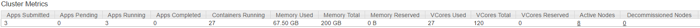
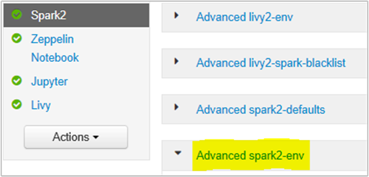
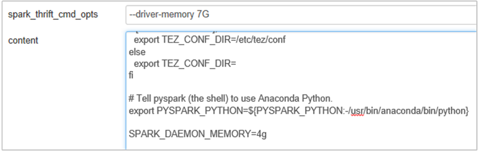

# OutOfMemoryError exceptions for Apache Spark in Azure HDInsight

This article describes troubleshooting steps and possible resolutions for issues when using Apache Spark components in Azure HDInsight clusters.

## Scenario: OutOfMemoryError exception for Apache Spark

### Issue

Your Apache Spark application failed with an OutOfMemoryError unhandled exception. You may receive an error message similar to:

```error
ERROR Executor: Exception in task 7.0 in stage 6.0 (TID 439)

java.lang.OutOfMemoryError
    at java.io.ByteArrayOutputStream.hugeCapacity(Unknown Source)
    at java.io.ByteArrayOutputStream.grow(Unknown Source)
    at java.io.ByteArrayOutputStream.ensureCapacity(Unknown Source)
    at java.io.ByteArrayOutputStream.write(Unknown Source)
    at java.io.ObjectOutputStream$BlockDataOutputStream.drain(Unknown Source)
    at java.io.ObjectOutputStream$BlockDataOutputStream.setBlockDataMode(Unknown Source)
    at java.io.ObjectOutputStream.writeObject0(Unknown Source)
    at java.io.ObjectOutputStream.writeObject(Unknown Source)
    at org.apache.spark.serializer.JavaSerializationStream.writeObject(JavaSerializer.scala:44)
    at org.apache.spark.serializer.JavaSerializerInstance.serialize(JavaSerializer.scala:101)
    at org.apache.spark.executor.Executor$TaskRunner.run(Executor.scala:239)
    at java.util.concurrent.ThreadPoolExecutor.runWorker(Unknown Source)
    at java.util.concurrent.ThreadPoolExecutor$Worker.run(Unknown Source)
    at java.lang.Thread.run(Unknown Source)
```

```error
ERROR SparkUncaughtExceptionHandler: Uncaught exception in thread Thread[Executor task launch worker-0,5,main]

java.lang.OutOfMemoryError
    at java.io.ByteArrayOutputStream.hugeCapacity(Unknown Source)
    ...
```

### Cause

The most likely cause of this exception is that not enough heap memory is allocated to the Java virtual machines (JVMs). These JVMs are launched as executors or drivers as part of the Apache Spark application.

### Resolution

1. Determine the maximum size of the data the Spark application will handle. Make an estimate of the size based on the maximum of the size of input data, the intermediate data produced by transforming the input data and the output data produced further transforming the intermediate data. If the initial estimate is not sufficient, increase the size slightly, and iterate until the memory errors subside.

1. Make sure that the HDInsight cluster to be used has enough resources in terms of memory and also cores to accommodate the Spark application. This can be determined by viewing the Cluster Metrics section of the YARN UI of the cluster for the values of **Memory Used** vs. **Memory Total** and **VCores Used** vs. **VCores Total**.

    

1. Set the following Spark configurations to appropriate values. Balance the application requirements with the available resources in the cluster. These values should not exceed 90% of the available memory and cores as viewed by YARN, and should also meet the minimum memory requirement of the Spark application:

    ```
    spark.executor.instances (Example: 8 for 8 executor count)
    spark.executor.memory (Example: 4g for 4 GB)
    spark.yarn.executor.memoryOverhead (Example: 384m for 384 MB)
    spark.executor.cores (Example: 2 for 2 cores per executor)
    spark.driver.memory (Example: 8g for 8GB)
    spark.driver.cores (Example: 4 for 4 cores)
    spark.yarn.driver.memoryOverhead (Example: 384m for 384MB)
    ```

    Total memory used by all executors =

    ```
    spark.executor.instances * (spark.executor.memory + spark.yarn.executor.memoryOverhead) 
    ```

    Total memory used by driver =

    ```
    spark.driver.memory + spark.yarn.driver.memoryOverhead
    ```

---

## Scenario: Java heap space error when trying to open Apache Spark history server

### Issue

You receive the following error when opening events in Spark History server:

```
scala.MatchError: java.lang.OutOfMemoryError: Java heap space (of class java.lang.OutOfMemoryError)
```

### Cause

This issue is often caused by a lack of resources when opening large spark-event files. The Spark heap size is set to 1 GB by default, but large Spark event files may require more than this.

If you would like to verify the size of the files that you are trying to load, you can perform the following commands:

```bash
hadoop fs -du -s -h wasb:///hdp/spark2-events/application_1503957839788_0274_1/
**576.5 M**  wasb:///hdp/spark2-events/application_1503957839788_0274_1

hadoop fs -du -s -h wasb:///hdp/spark2-events/application_1503957839788_0264_1/
**2.1 G**  wasb:///hdp/spark2-events/application_1503957839788_0264_1
```

### Resolution

You can increase the Spark History Server memory by editing the `SPARK_DAEMON_MEMORY` property in the Spark configuration and restarting all the services.

You can do this from within the Ambari browser UI by selecting the Spark2/Config/Advanced spark2-env section.



Add the following property to change the Spark History Server memory from 1g to 4g: `SPARK_DAEMON_MEMORY=4g`.



Make sure to restart all affected services from Ambari.

---

## Scenario: Livy Server fails to start on Apache Spark cluster

### Issue

Livy Server cannot be started on an Apache Spark [(Spark 2.1 on Linux (HDI 3.6)]. Attempting to restart results in the following error stack, from the Livy logs:

```log
17/07/27 17:52:50 INFO CuratorFrameworkImpl: Starting
17/07/27 17:52:50 INFO ZooKeeper: Client environment:zookeeper.version=3.4.6-29--1, built on 05/15/2017 17:55 GMT
17/07/27 17:52:50 INFO ZooKeeper: Client environment:host.name=10.0.0.66
17/07/27 17:52:50 INFO ZooKeeper: Client environment:java.version=1.8.0_131
17/07/27 17:52:50 INFO ZooKeeper: Client environment:java.vendor=Oracle Corporation
17/07/27 17:52:50 INFO ZooKeeper: Client environment:java.home=/usr/lib/jvm/java-8-openjdk-amd64/jre
17/07/27 17:52:50 INFO ZooKeeper: Client environment:java.class.path= <DELETED>
17/07/27 17:52:50 INFO ZooKeeper: Client environment:java.library.path= <DELETED>
17/07/27 17:52:50 INFO ZooKeeper: Client environment:java.io.tmpdir=/tmp
17/07/27 17:52:50 INFO ZooKeeper: Client environment:java.compiler=<NA>
17/07/27 17:52:50 INFO ZooKeeper: Client environment:os.name=Linux
17/07/27 17:52:50 INFO ZooKeeper: Client environment:os.arch=amd64
17/07/27 17:52:50 INFO ZooKeeper: Client environment:os.version=4.4.0-81-generic
17/07/27 17:52:50 INFO ZooKeeper: Client environment:user.name=livy
17/07/27 17:52:50 INFO ZooKeeper: Client environment:user.home=/home/livy
17/07/27 17:52:50 INFO ZooKeeper: Client environment:user.dir=/home/livy
17/07/27 17:52:50 INFO ZooKeeper: Initiating client connection, connectString=zk2-kcspark.cxtzifsbseee1genzixf44zzga.gx.internal.cloudapp.net:2181,zk3-kcspark.cxtzifsbseee1genzixf44zzga.gx.internal.cloudapp.net:2181,zk6-kcspark.cxtzifsbseee1genzixf44zzga.gx.internal.cloudapp.net:2181 sessionTimeout=60000 watcher=org.apache.curator.ConnectionState@25fb8912
17/07/27 17:52:50 INFO StateStore$: Using ZooKeeperStateStore for recovery.
17/07/27 17:52:50 INFO ClientCnxn: Opening socket connection to server 10.0.0.61/10.0.0.61:2181. Will not attempt to authenticate using SASL (unknown error)
17/07/27 17:52:50 INFO ClientCnxn: Socket connection established to 10.0.0.61/10.0.0.61:2181, initiating session
17/07/27 17:52:50 INFO ClientCnxn: Session establishment complete on server 10.0.0.61/10.0.0.61:2181, sessionid = 0x25d666f311d00b3, negotiated timeout = 60000
17/07/27 17:52:50 INFO ConnectionStateManager: State change: CONNECTED
17/07/27 17:52:50 WARN NativeCodeLoader: Unable to load native-hadoop library for your platform... using builtin-java classes where applicable
17/07/27 17:52:50 INFO AHSProxy: Connecting to Application History server at headnodehost/10.0.0.67:10200
Exception in thread "main" java.lang.OutOfMemoryError: unable to create new native thread
  at java.lang.Thread.start0(Native Method)
  at java.lang.Thread.start(Thread.java:717)
  at com.cloudera.livy.Utils$.startDaemonThread(Utils.scala:98)
  at com.cloudera.livy.utils.SparkYarnApp.<init>(SparkYarnApp.scala:232)
  at com.cloudera.livy.utils.SparkApp$.create(SparkApp.scala:93)
  at com.cloudera.livy.server.batch.BatchSession$$anonfun$recover$2$$anonfun$apply$4.apply(BatchSession.scala:117)
  at com.cloudera.livy.server.batch.BatchSession$$anonfun$recover$2$$anonfun$apply$4.apply(BatchSession.scala:116)
  at com.cloudera.livy.server.batch.BatchSession.<init>(BatchSession.scala:137)
  at com.cloudera.livy.server.batch.BatchSession$.recover(BatchSession.scala:108)
  at com.cloudera.livy.sessions.BatchSessionManager$$anonfun$$init$$1.apply(SessionManager.scala:47)
  at com.cloudera.livy.sessions.BatchSessionManager$$anonfun$$init$$1.apply(SessionManager.scala:47)
  at scala.collection.TraversableLike$$anonfun$map$1.apply(TraversableLike.scala:244)
  at scala.collection.TraversableLike$$anonfun$map$1.apply(TraversableLike.scala:244)
  at scala.collection.mutable.ResizableArray$class.foreach(ResizableArray.scala:59)
  at scala.collection.mutable.ArrayBuffer.foreach(ArrayBuffer.scala:47)
  at scala.collection.TraversableLike$class.map(TraversableLike.scala:244)
  at scala.collection.AbstractTraversable.map(Traversable.scala:105)
  at com.cloudera.livy.sessions.SessionManager.com$cloudera$livy$sessions$SessionManager$$recover(SessionManager.scala:150)
  at com.cloudera.livy.sessions.SessionManager$$anonfun$1.apply(SessionManager.scala:82)
  at com.cloudera.livy.sessions.SessionManager$$anonfun$1.apply(SessionManager.scala:82)
  at scala.Option.getOrElse(Option.scala:120)
  at com.cloudera.livy.sessions.SessionManager.<init>(SessionManager.scala:82)
  at com.cloudera.livy.sessions.BatchSessionManager.<init>(SessionManager.scala:42)
  at com.cloudera.livy.server.LivyServer.start(LivyServer.scala:99)
  at com.cloudera.livy.server.LivyServer$.main(LivyServer.scala:302)
  at com.cloudera.livy.server.LivyServer.main(LivyServer.scala)
  
  ## using "vmstat" found  we had enough free memory
```

### Cause

`java.lang.OutOfMemoryError: unable to create new native thread` highlights OS cannot assign more native threads to JVMs. Confirmed that this Exception is caused by the violation of per-process thread count limit.

When Livy Server terminates unexpectedly, all the connections to Spark Clusters are also terminated, which means that all the jobs and related data will be lost. In HDP 2.6 session recovery mechanism was introduced, Livy stores the session details in Zookeeper to be recovered after the Livy Server is back.

When large number of jobs are submitted via Livy, as part of High Availability for Livy Server stores these session states in ZK (on HDInsight clusters) and recover those sessions when the Livy service is restarted. On restart after unexpected termination, Livy creates one thread per session and this accumulates a certain number of to-be-recovered sessions causing too many threads being created.

### Resolution

Delete all entries using steps detailed below.

1. Get the IP address of the zookeeper Nodes using

    ```bash
    grep -R zk /etc/hadoop/conf  
    ```

1. Above command listed all the zookeepers for my cluster

    ```bash
    /etc/hadoop/conf/core-site.xml:      <value>zk1-hwxspa.lnuwp5akw5ie1j2gi2amtuuimc.dx.internal.cloudapp.net:2181,zk2-      hwxspa.lnuwp5akw5ie1j2gi2amtuuimc.dx.internal.cloudapp.net:2181,zk4-hwxspa.lnuwp5akw5ie1j2gi2amtuuimc.dx.internal.cloudapp.net:2181</value>
    ```

1. Get all the IP address of the zookeeper nodes using ping Or you can also connect to zookeeper from headnode using zk name

    ```bash
    /usr/hdp/current/zookeeper-client/bin/zkCli.sh -server zk2-hwxspa:2181
    ```

1. Once you are connected to zookeeper execute the following command to list all the sessions that are attempted to restart.

    1. Most of the cases this could be a list more than 8000 sessions ####

        ```bash
        ls /livy/v1/batch
        ```

    1. Following command is to remove all the to-be-recovered sessions. #####

        ```bash
        rmr /livy/v1/batch
        ```

1. Wait for the above command to complete and the cursor to return the prompt and then restart Livy service from Ambari, which should succeed.

> [!NOTE]
> `DELETE` the livy session once it is completed its execution. The Livy batch sessions will not be deleted automatically as soon as the spark app completes, which is by design. A Livy session is an entity created by a POST request against Livy Rest server. A `DELETE` call is needed to delete that entity. Or we should wait for the GC to kick in.

---

## Next steps

If you didn't see your problem or are unable to solve your issue, visit one of the following channels for more support:

* [Spark memory management overview](https://spark.apache.org/docs/latest/tuning.html#memory-management-overview).

* [Debugging Spark application on HDInsight clusters](https://blogs.msdn.microsoft.com/azuredatalake/2016/12/19/spark-debugging-101/).

* Get answers from Azure experts through [Azure Community Support](https://azure.microsoft.com/support/community/).

* Connect with [@AzureSupport](https://twitter.com/azuresupport) - the official Microsoft Azure account for improving customer experience. Connecting the Azure community to the right resources: answers, support, and experts.

* If you need more help, you can submit a support request from the [Azure portal](https://portal.azure.com/?#blade/Microsoft_Azure_Support/HelpAndSupportBlade/). Select **Support** from the menu bar or open the **Help + support** hub. For more detailed information, review [How to create an Azure support request](https://docs.microsoft.com/azure/azure-portal/supportability/how-to-create-azure-support-request). Access to Subscription Management and billing support is included with your Microsoft Azure subscription, and Technical Support is provided through one of the [Azure Support Plans](https://azure.microsoft.com/support/plans/).
