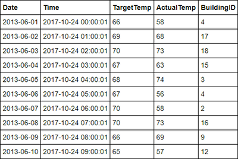

# Tutorial: Analyze Apache Spark data using Power BI in HDInsight

In this tutorial, you learn how to use Microsoft Power BI to visualize data in an Apache Spark cluster in Azure HDInsight.

In this tutorial, you learn how to:
> [!div class="checklist"]
> * Visualize Spark data using Power BI

If you don't have an Azure subscription, create a [free account](https://azure.microsoft.com/free/?WT.mc_id=A261C142F) before you begin.

## Prerequisites

* Complete the article [Tutorial: Load data and run queries on an Apache Spark cluster in Azure HDInsight](./apache-spark-load-data-run-query.md).

* [Power BI Desktop](https://powerbi.microsoft.com/en-us/desktop/).

* Optional: [Power BI trial subscription](https://app.powerbi.com/signupredirect?pbi_source=web).

## Verify the data

The [Jupyter Notebook](https://jupyter.org/) that you created in the [previous tutorial](apache-spark-load-data-run-query.md) includes code to create an `hvac` table. This table is based on the CSV file available on all HDInsight Spark clusters at `\HdiSamples\HdiSamples\SensorSampleData\hvac\hvac.csv`. Use the following procedure to verify the data.

1. From the Jupyter notebook, paste the following code, and then press **SHIFT + ENTER**. The code verifies the existence of the tables.

    ```PySpark
    %%sql
    SHOW TABLES
    ```

    The output looks like:

    

    If you closed the notebook before starting this tutorial, `hvactemptable` is cleaned up, so it's not included in the output.  Only Hive tables that are stored in the metastore (indicated by **False** under the **isTemporary** column) can be accessed from the BI tools. In this tutorial, you connect to the **hvac** table that you created.

2. Paste the following code in an empty cell, and then press **SHIFT + ENTER**. The code verifies the data in the table.

    ```PySpark
    %%sql
    SELECT * FROM hvac LIMIT 10
    ```

    The output looks like:

    

3. From the **File** menu on the notebook, select **Close and Halt**. Shut down the notebook to release the resources.

## Visualize the data

In this section, you use Power BI to create visualizations, reports, and dashboards from the Spark cluster data.

### Create a report in Power BI Desktop

The first steps in working with Spark are to connect to the cluster in Power BI Desktop, load data from the cluster, and create a basic visualization based on that data.

1. Open Power BI Desktop. Close the start-up splash screen if it opens.

2. From the **Home** tab, navigate to **Get Data** > **More..**.

    

3. Enter `Spark` in the search box, select **Azure HDInsight Spark**, and then select **Connect**.

    

4. Enter your cluster URL (in the form `mysparkcluster.azurehdinsight.net`) in the **Server** text box.

5. Under **Data connectivity mode**, select **DirectQuery**. Then select **OK**.

    You can use either data connectivity mode with Spark. If you use DirectQuery, changes are reflected in reports without refreshing the entire dataset. If you import data, you must refresh the data set to see changes. For more information on how and when to use DirectQuery, see [Using DirectQuery in Power BI](https://powerbi.microsoft.com/documentation/powerbi-desktop-directquery-about/).

6. Enter the HDInsight login account information, then select **Connect**. The default account name is *admin*.

7. Select the `hvac` table, wait to see a preview of the data, and then select **Load**.

    

    Power BI Desktop has the information it needs to connect to the Spark cluster and load data from the `hvac` table. The table and its columns are displayed in the **Fields** pane.

8. Visualize the variance between target temperature and actual temperature for each building:

    1. In the **VISUALIZATIONS** pane, select **Area Chart**.

    2. Drag the **BuildingID** field to **Axis**, and drag the **ActualTemp** and **TargetTemp** fields to **Value**.

        

        The diagram looks like:

        

        By default the visualization shows the sum for **ActualTemp** and **TargetTemp**. Select the down arrow next to **ActualTemp** and **TragetTemp** in the Visualizations pane, you can see **Sum** is selected.

    3. Select the down arrows next to **ActualTemp** and **TragetTemp** in the Visualizations pane, select **Average** to get an average of actual and target temperatures for each building.

        

        Your data visualization shall be similar to the one in the screenshot. Move your cursor over the visualization to get tool tips with relevant data.

        

9. Navigate to **File** > **Save**, enter the name `BuildingTemperature` for the file, then select **Save**.

### Publish the report to the Power BI Service (optional)

The Power BI service allows you to share reports and dashboards across your organization. In this section, you first publish the dataset and the report. Then, you pin the report to a dashboard. Dashboards are typically used to focus on a subset of data in a report. You have only one visualization in your report, but it's still useful to go through the steps.

1. Open Power BI Desktop.

1. From the **Home** tab, select **Publish**.

    

1. Select a workspace to publish your dataset and report to, then select **Select**. In the following image, the default **My Workspace** is selected.

    

1. After the publishing is succeeded, select **Open 'BuildingTemperature.pbix' in Power BI**.

    

1. In the Power BI service, select **Enter credentials**.

    

1. Select **Edit credentials**.

    

1. Enter the HDInsight login account information, and then select **Sign in**. The default account name is *admin*.

    

1. In the left pane, go to **Workspaces** > **My Workspace** > **REPORTS**, then select **BuildingTemperature**.

    

    You should also see **BuildingTemperature** listed under **DATASETS** in the left pane.

    The visual you created in Power BI Desktop is now available in the Power BI service.

1. Hover your cursor over the visualization, and then select the pin icon on the upper right corner.

    

1. Select "New dashboard", enter the name `Building temperature`, then select **Pin**.

    

1. In the report, select **Go to dashboard**.

Your visual is pinned to the dashboard - you can add other visuals to the report and pin them to the same dashboard. For more information about reports and dashboards, see [Reports in Power BI](https://powerbi.microsoft.com/documentation/powerbi-service-reports/) and [Dashboards in Power BI](https://powerbi.microsoft.com/documentation/powerbi-service-dashboards/).

## Clean up resources

After you complete the tutorial, you may want to delete the cluster. With HDInsight, your data is stored in Azure Storage, so you can safely delete a cluster when it isn't in use. You're also charged for an HDInsight cluster, even when it isn't in use. Since the charges for the cluster are many times more than the charges for storage, it makes economic sense to delete clusters when they aren't in use.

To delete a cluster, see [Delete an HDInsight cluster using your browser, PowerShell, or the Azure CLI](../hdinsight-delete-cluster.md).

## Next steps

In this tutorial, you learned how to use Microsoft Power BI to visualize data in an Apache Spark cluster in Azure HDInsight. Advance to the next article to see you can create a machine learning application.

> [!div class="nextstepaction"]
> [Create a machine learning application](./apache-spark-ipython-notebook-machine-learning.md)