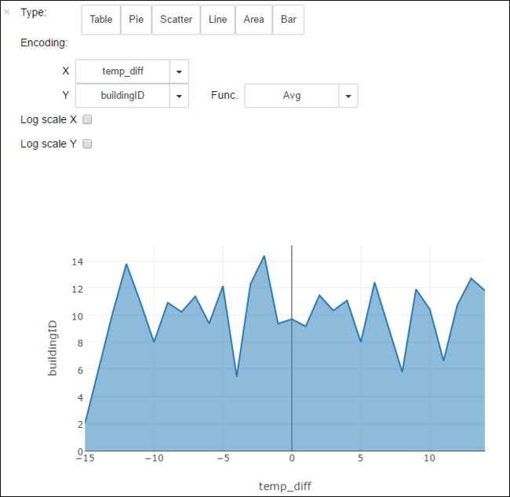

# Use HDInsight Spark cluster to analyze data in Data Lake Store

In this tutorial, you use Jupyter notebook available with HDInsight Spark clusters to run a job that reads data from a Data Lake Store account.

## Prerequisites

* Azure Data Lake Store account. Follow the instructions at [Get started with Azure Data Lake Store using the Azure portal](../../data-lake-store/data-lake-store-get-started-portal.md).

* Azure HDInsight Spark cluster with Data Lake Store as storage. Follow the instructions at [Quickstart: Set up clusters in HDInsight](../../storage/data-lake-storage/quickstart-create-connect-hdi-cluster.md).

	
## Prepare the data

> [!NOTE]
> You do not need to perform this step if you have created the HDInsight cluster with Data Lake Store as default storage. The cluster creation process adds some sample data in the Data Lake Store account that you specify while creating the cluster. Skip to the section [Use HDInsight Spark cluster with Data Lake Store](#use-an-hdinsight-spark-cluster-with-data-lake-store).
>
>

If you created an HDInsight cluster with Data Lake Store as additional storage and Azure Storage Blob as default storage, you should first copy over some sample data to the Data Lake Store account. You can use the sample data from the Azure Storage Blob associated with the HDInsight cluster. You can use the [ADLCopy tool](http://aka.ms/downloadadlcopy) to do so. Download and install the tool from the link.

1. Open a command prompt and navigate to the directory where AdlCopy is installed, typically `%HOMEPATH%\Documents\adlcopy`.

2. Run the following command to copy a specific blob from the source container to a Data Lake Store:

        AdlCopy /source https://<source_account>.blob.core.windows.net/<source_container>/<blob name> /dest swebhdfs://<dest_adls_account>.azuredatalakestore.net/<dest_folder>/ /sourcekey <storage_account_key_for_storage_container>

    Copy the **HVAC.csv** sample data file at **/HdiSamples/HdiSamples/SensorSampleData/hvac/** to the Azure Data Lake Store account. The code snippet should look like:

        AdlCopy /Source https://mydatastore.blob.core.windows.net/mysparkcluster/HdiSamples/HdiSamples/SensorSampleData/hvac/HVAC.csv /dest swebhdfs://mydatalakestore.azuredatalakestore.net/hvac/ /sourcekey uJUfvD6cEvhfLoBae2yyQf8t9/BpbWZ4XoYj4kAS5Jf40pZaMNf0q6a8yqTxktwVgRED4vPHeh/50iS9atS5LQ==

   > [!WARNING]
   > Make sure you the file and path names are in the proper case.
   >
   >
3. You are prompted to enter the credentials for the Azure subscription under which you have your Data Lake Store account. You see an output similar to the following snippet:

        Initializing Copy.
        Copy Started.
        100% data copied.
        Copy Completed. 1 file copied.

    The data file (**HVAC.csv**) will be copied under a folder **/hvac** in the Data Lake Store account.

## Use an HDInsight Spark cluster with Data Lake Store

1. From the [Azure Portal](https://portal.azure.com/), from the startboard, click the tile for your Spark cluster (if you pinned it to the startboard). You can also navigate to your cluster under **Browse All** > **HDInsight Clusters**.

2. From the Spark cluster blade, click **Quick Links**, and then from the **Cluster Dashboard** blade, click **Jupyter Notebook**. If prompted, enter the admin credentials for the cluster.

   > [!NOTE]
   > You may also reach the Jupyter Notebook for your cluster by opening the following URL in your browser. Replace **CLUSTERNAME** with the name of your cluster:
   >
   > `https://CLUSTERNAME.azurehdinsight.net/jupyter`
   >
   >

3. Create a new notebook. Click **New**, and then click **PySpark**.

    

4. Because you created a notebook using the PySpark kernel, you do not need to create any contexts explicitly. The Spark and Hive contexts will be automatically created for you when you run the first code cell. You can start by importing the types required for this scenario. To do so, paste the following code snippet in a cell and press **SHIFT + ENTER**.

		from pyspark.sql.types import *

    Every time you run a job in Jupyter, your web browser window title will show a **(Busy)** status along with the notebook title. You will also see a solid circle next to the **PySpark** text in the top-right corner. After the job is completed, this will change to a hollow circle.

     

5. Load sample data into a temporary table using the **HVAC.csv** file you copied to the Data Lake Store account. You can access the data in the Data Lake Store account using the following URL pattern.

	* If you have Data Lake Store as default storage, HVAC.csv will be at the path similar to the following URL:

			adl://<data_lake_store_name>.azuredatalakestore.net/<cluster_root>/HdiSamples/HdiSamples/SensorSampleData/hvac/HVAC.csv

		Or, you could also use a shortened format such as the following:

			adl:///HdiSamples/HdiSamples/SensorSampleData/hvac/HVAC.csv

	* If you have Data Lake Store as additional storage, HVAC.csv will be at the location where you copied it, such as:

			adl://<data_lake_store_name>.azuredatalakestore.net/<path_to_file>

     In an empty cell, paste the following code example, replace **MYDATALAKESTORE** with your Data Lake Store account name, and press **SHIFT + ENTER**. This code example registers the data into a temporary table called **hvac**.

			# Load the data. The path below assumes Data Lake Store is default storage for the Spark cluster
			hvacText = sc.textFile("adl://MYDATALAKESTORE.azuredatalakestore.net/cluster/mysparkcluster/HdiSamples/HdiSamples/SensorSampleData/hvac/HVAC.csv")

			# Create the schema
			hvacSchema = StructType([StructField("date", StringType(), False),StructField("time", StringType(), False),StructField("targettemp", IntegerType(), False),StructField("actualtemp", IntegerType(), False),StructField("buildingID", StringType(), False)])

			# Parse the data in hvacText
			hvac = hvacText.map(lambda s: s.split(",")).filter(lambda s: s[0] != "Date").map(lambda s:(str(s[0]), str(s[1]), int(s[2]), int(s[3]), str(s[6]) ))

			# Create a data frame
			hvacdf = sqlContext.createDataFrame(hvac,hvacSchema)

			# Register the data fram as a table to run queries against
			hvacdf.registerTempTable("hvac")

6. Because you are using a PySpark kernel, you can now directly run a SQL query on the temporary table **hvac** that you just created by using the `%%sql` magic. For more information about the `%%sql` magic, as well as other magics available with the PySpark kernel, see [Kernels available on Jupyter notebooks with Spark HDInsight clusters](apache-spark-jupyter-notebook-kernels.md#parameters-supported-with-the-sql-magic).

		%%sql
		SELECT buildingID, (targettemp - actualtemp) AS temp_diff, date FROM hvac WHERE date = \"6/1/13\"

7. Once the job is completed successfully, the following tabular output is displayed by default.

      

     You can also see the results in other visualizations as well. For example, an area graph for the same output would look like the following.

     

8. After you have finished running the application, you should shutdown the notebook to release the resources. To do so, from the **File** menu on the notebook, click **Close and Halt**. This will shutdown and close the notebook.

## Next steps

* [Create a standalone Scala application to run on Apache Spark cluster](apache-spark-create-standalone-application.md)
* [Use HDInsight Tools in Azure Toolkit for IntelliJ to create Spark applications for HDInsight Spark Linux cluster](apache-spark-intellij-tool-plugin.md)
* [Use HDInsight Tools in Azure Toolkit for Eclipse to create Spark applications for HDInsight Spark Linux cluster](apache-spark-eclipse-tool-plugin.md)
