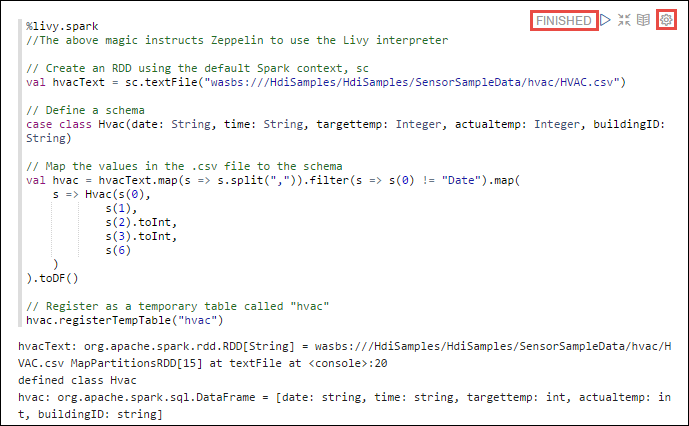
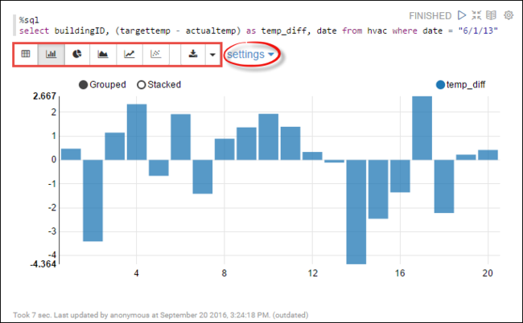
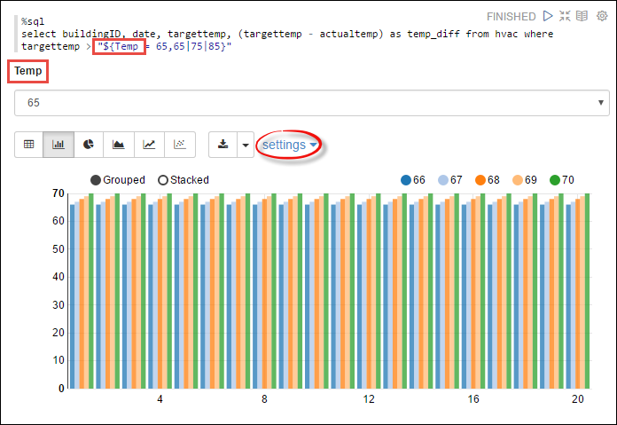
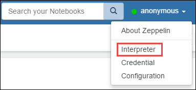
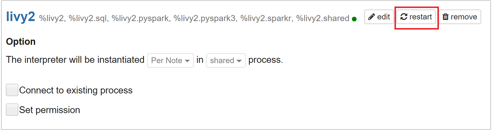
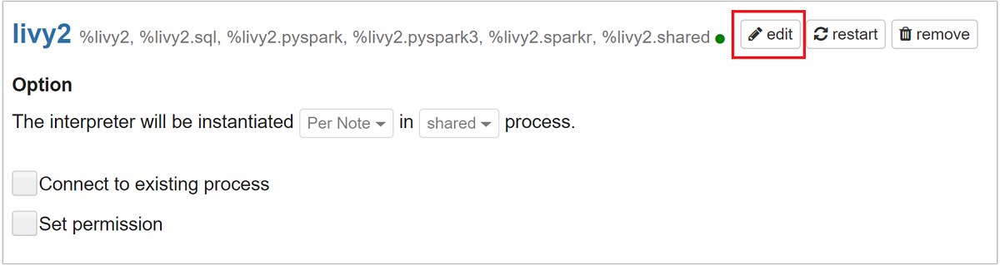
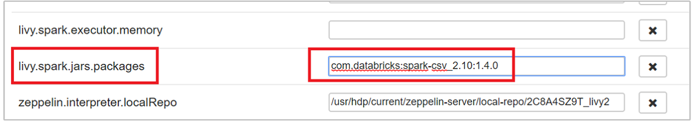
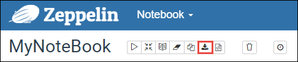

# Use Apache Zeppelin notebooks with Apache Spark cluster on Azure HDInsight

HDInsight Spark clusters include [Apache Zeppelin](https://zeppelin.apache.org/) notebooks that you can use to run [Apache Spark](https://spark.apache.org/) jobs. In this article, you learn how to use the Zeppelin notebook on an HDInsight cluster.

**Prerequisites:**

* An Azure subscription. See [Get Azure free trial](https://azure.microsoft.com/documentation/videos/get-azure-free-trial-for-testing-hadoop-in-hdinsight/).
* An Apache Spark cluster on HDInsight. For instructions, see [Create Apache Spark clusters in Azure HDInsight](apache-spark-jupyter-spark-sql.md).
* The URI scheme for your clusters primary storage. This would be `wasb://` for Azure Blob Storage, `abfs://` for Azure Data Lake Storage Gen2 or `adl://` for Azure Data Lake Storage Gen1. If secure transfer is enabled for Blob Storage or Data Lake Storage Gen2, the URI would be `wasbs://` or `abfss://`, respectively.  See also, [Require secure transfer in Azure Storage](../../storage/common/storage-require-secure-transfer.md) for more information.

## Launch an Apache Zeppelin notebook

1. From the Spark cluster **Overview**, select **Zeppelin notebook** from **Cluster dashboards**. Enter the admin credentials for the cluster.  

   > [!NOTE]  
   > You may also reach the Zeppelin Notebook for your cluster by opening the following URL in your browser. Replace **CLUSTERNAME** with the name of your cluster:
   >
   > `https://CLUSTERNAME.azurehdinsight.net/zeppelin`

2. Create a new notebook. From the header pane, navigate to **Notebook** > **Create new note**.

    

    Enter a name for the notebook, then select **Create Note**.

3. Ensure the notebook header shows a connected status. It is denoted by a green dot in the top-right corner.

    

4. Load sample data into a temporary table. When you create a Spark cluster in HDInsight, the sample data file, `hvac.csv`, is copied to the associated storage account under `\HdiSamples\SensorSampleData\hvac`.

    In the empty paragraph that is created by default in the new notebook, paste the following snippet.

    ```scala
    %livy2.spark
    //The above magic instructs Zeppelin to use the Livy Scala interpreter

    // Create an RDD using the default Spark context, sc
    val hvacText = sc.textFile("wasbs:///HdiSamples/HdiSamples/SensorSampleData/hvac/HVAC.csv")

    // Define a schema
    case class Hvac(date: String, time: String, targettemp: Integer, actualtemp: Integer, buildingID: String)
   
    // Map the values in the .csv file to the schema
    val hvac = hvacText.map(s => s.split(",")).filter(s => s(0) != "Date").map(
        s => Hvac(s(0), 
                s(1),
                s(2).toInt,
                s(3).toInt,
                s(6)
        )
    ).toDF()

    // Register as a temporary table called "hvac"
    hvac.registerTempTable("hvac")
    ```

    Press **SHIFT + ENTER** or click the **Play** button for the paragraph to run the snippet. The status on the right-corner of the paragraph should progress from READY, PENDING, RUNNING to FINISHED. The output shows up at the bottom of the same paragraph. The screenshot looks like the following:

    

    You can also provide a title to each paragraph. From the right-hand corner of the paragraph, select the **Settings** icon (sprocket), and then select **Show title**.  

    > [!NOTE]  
    > %spark2 interpreter is not supported in Zeppelin notebooks across all HDInsight versions, and %sh interpreter will not be supported from HDInsight 4.0 onwards.

5. You can now run Spark SQL statements on the `hvac` table. Paste the following query in a new paragraph. The query retrieves the building ID and the difference between the target and actual temperatures for each building on a given date. Press **SHIFT + ENTER**.

    ```sql
    %sql
    select buildingID, (targettemp - actualtemp) as temp_diff, date from hvac where date = "6/1/13" 
    ```  

    The **%sql** statement at the beginning tells the notebook to use the Livy Scala interpreter.

6. Select the **Bar Chart** icon to change the display.  **settings**, which appears after you have selected **Bar Chart**, allows you to choose **Keys**, and **Values**.  The following screenshot shows the output.

    

7. You can also run Spark SQL statements using variables in the query. The next snippet shows how to define a variable, `Temp`, in the query with the possible values you want to query with. When you first run the query, a drop-down is automatically populated with the values you specified for the variable.

    ```sql
    %sql  
    select buildingID, date, targettemp, (targettemp - actualtemp) as temp_diff from hvac where targettemp > "${Temp = 65,65|75|85}"
    ```

    Paste this snippet in a new paragraph and press **SHIFT + ENTER**. Then select **65** from the **Temp** drop-down ist. 

8. Select the **Bar Chart** icon to change the display.  Then select **settings** and make the following changes:

   * **Groups:**  Add **targettemp**.  
   * **Values:** 1. Remove **date**.  2. Add **temp_diff**.  3.  Change the aggregator from **SUM** to **AVG**.  

     The following screenshot shows the output.

     

9. Restart the Livy interpreter to exit the application. To do so, open interpreter settings by selecting the logged in user name from the top-right corner, and then select **Interpreter**.  

    

10. Scroll to **livy**, and then select **restart**.  Select **OK** at the prompt.

    

## How do I use external packages with the notebook?
You can configure the Zeppelin notebook in Apache Spark cluster on HDInsight to use external, community-contributed packages that are not included out-of-the-box in the cluster. You can search the [Maven repository](https://search.maven.org/) for the complete list of packages that are available. You can also get a list of available packages from other sources. For example, a complete list of community-contributed packages is available at [Spark Packages](https://spark-packages.org/).

In this article, you will see how to use the [spark-csv](https://search.maven.org/#artifactdetails%7Ccom.databricks%7Cspark-csv_2.10%7C1.4.0%7Cjar) package with the Jupyter notebook.

1. Open interpreter settings. From the top-right corner, select the logged in user name, then select **Interpreter**.

    

2. Scroll to **livy**, then select **edit**.

    

3. Add a new key called `livy.spark.jars.packages`, and set its value in the format `group:id:version`. So, if you want to use the [spark-csv](https://search.maven.org/#artifactdetails%7Ccom.databricks%7Cspark-csv_2.10%7C1.4.0%7Cjar) package, you must set the value of the key to `com.databricks:spark-csv_2.10:1.4.0`.

    

    Select **Save** and then restart the Livy interpreter.

4. If you want to understand how to arrive at the value of the key entered above, here's how.
   
    a. Locate the package in the Maven Repository. For this article, we used [spark-csv](https://search.maven.org/#artifactdetails%7Ccom.databricks%7Cspark-csv_2.10%7C1.4.0%7Cjar).
   
    b. From the repository, gather the values for **GroupId**, **ArtifactId**, and **Version**.
   
    
   
    c. Concatenate the three values, separated by a colon (**:**).
   
        com.databricks:spark-csv_2.10:1.4.0

## Where are the Zeppelin notebooks saved?
The Zeppelin notebooks are saved to the cluster headnodes. So, if you delete the cluster, the notebooks will be deleted as well. If you want to preserve your notebooks for later use on other clusters, you must export them after you have finished running the jobs. To export a notebook, select the **Export** icon as shown in the image below.



This saves the notebook as a JSON file in your download location.

## Livy session management
When you run the first code paragraph in your Zeppelin notebook, a new Livy session is created in your HDInsight Spark cluster. This session is shared across all Zeppelin notebooks that you subsequently create. If for some reason the Livy session is killed (cluster reboot, etc.), you will not be able to run jobs from the Zeppelin notebook.

In such a case, you must perform the following steps before you can start running jobs from a Zeppelin notebook.  

1. Restart the Livy interpreter from the Zeppelin notebook. To do so, open interpreter settings by selecting the logged in user name from the top-right corner, then select **Interpreter**.

    

2. Scroll to **livy**, then select **restart**.

    

3. Run a code cell from an existing Zeppelin notebook. This creates a new Livy session in the HDInsight cluster.

## <a name="seealso"></a>See also
* [Overview: Apache Spark on Azure HDInsight](apache-spark-overview.md)

### Scenarios
* [Apache Spark with BI: Perform interactive data analysis using Spark in HDInsight with BI tools](apache-spark-use-bi-tools.md)
* [Apache Spark with Machine Learning: Use Spark in HDInsight for analyzing building temperature using HVAC data](apache-spark-ipython-notebook-machine-learning.md)
* [Apache Spark with Machine Learning: Use Spark in HDInsight to predict food inspection results](apache-spark-machine-learning-mllib-ipython.md)
* [Website log analysis using Apache Spark in HDInsight](apache-spark-custom-library-website-log-analysis.md)

### Create and run applications
* [Create a standalone application using Scala](apache-spark-create-standalone-application.md)
* [Run jobs remotely on an Apache Spark cluster using Apache Livy](apache-spark-livy-rest-interface.md)

### Tools and extensions
* [Use HDInsight Tools Plugin for IntelliJ IDEA to create and submit Apache Spark Scala applications](apache-spark-intellij-tool-plugin.md)
* [Use HDInsight Tools Plugin for IntelliJ IDEA to debug Apache Spark applications remotely](apache-spark-intellij-tool-plugin-debug-jobs-remotely.md)
* [Kernels available for Jupyter notebook in Apache Spark cluster for HDInsight](apache-spark-jupyter-notebook-kernels.md)
* [Use external packages with Jupyter notebooks](apache-spark-jupyter-notebook-use-external-packages.md)
* [Install Jupyter on your computer and connect to an HDInsight Spark cluster](apache-spark-jupyter-notebook-install-locally.md)

### Manage resources
* [Manage resources for the Apache Spark cluster in Azure HDInsight](apache-spark-resource-manager.md)
* [Track and debug jobs running on an Apache Spark cluster in HDInsight](apache-spark-job-debugging.md)

[hdinsight-versions]: hdinsight-component-versioning.md
[hdinsight-upload-data]: hdinsight-upload-data.md
[hdinsight-storage]: hdinsight-hadoop-use-blob-storage.md

[azure-purchase-options]: https://azure.microsoft.com/pricing/purchase-options/
[azure-member-offers]: https://azure.microsoft.com/pricing/member-offers/
[azure-free-trial]: https://azure.microsoft.com/pricing/free-trial/
[azure-create-storageaccount]:../../storage/common/storage-create-storage-account.md 
