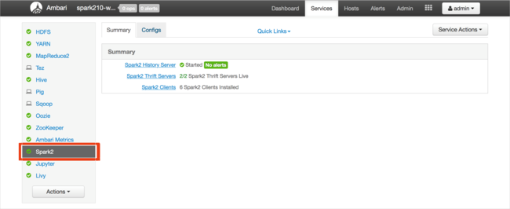
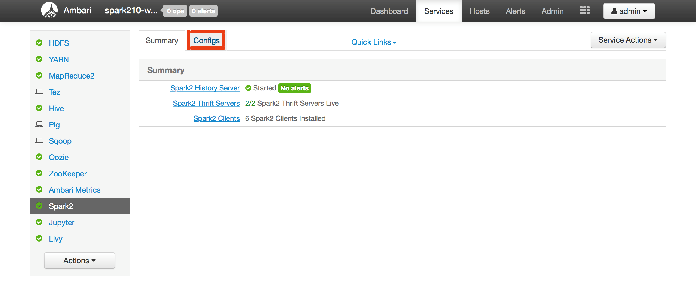
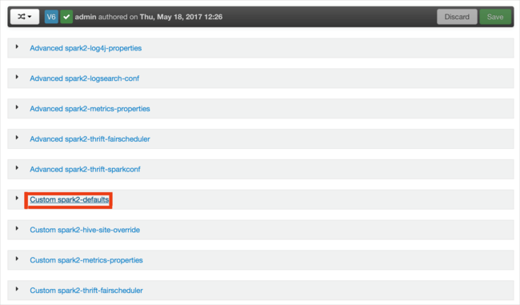
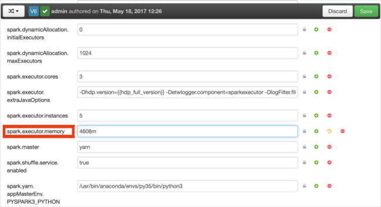
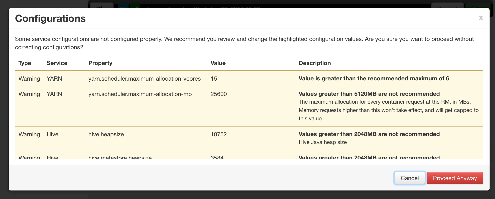
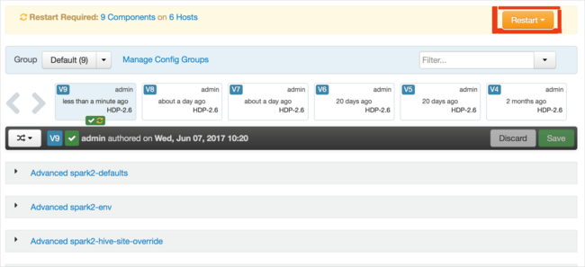
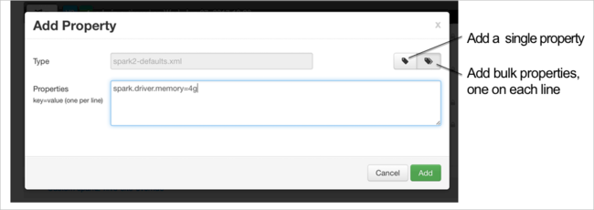

# Troubleshoot Apache Spark by using Azure HDInsight

Learn about the top issues and their resolutions when working with [Apache Spark](https://spark.apache.org/) payloads in [Apache Ambari](https://ambari.apache.org/).

## How do I configure an Apache Spark application by using Apache Ambari on clusters?

### Resolution steps

Spark configuration values can be tuned help avoid an Apache Spark application OutofMemoryError exception. The following steps show default Spark configuration values in Azure HDInsight: 

1. In the list of clusters, select **Spark2**.

    

2. Select the **Configs** tab.

    

3. In the list of configurations, select **Custom-spark2-defaults**.

    

4. Look for the value setting that you need to adjust, such as **spark.executor.memory**. In this case, the value of **4608m** is too high.

    

5. Set the value to the recommended setting. The value **2048m** is recommended for this setting.

    

6. Save the value, and then save the configuration. On the toolbar, select **Save**.

    

    You are notified if any configurations need attention. Note the items, and then select **Proceed Anyway**. 

    

    Write a note about the configuration changes, and then select **Save**.

    

7. Whenever a configuration is saved, you are prompted to restart the service. Select **Restart**.

    

    Confirm the restart.

    

    You can review the processes that are running.

    

8. You can add configurations. In the list of configurations, select **Custom-spark2-defaults**, and then select **Add Property**.

    

9. Define a new property. You can define a single property by using a dialog box for specific settings such as the data type. Or, you can define multiple properties by using one definition per line. 

    In this example, the **spark.driver.memory** property is defined with a value of **4g**.

    

10. Save the configuration, and then restart the service as described in steps 6 and 7.

These changes are cluster-wide but can be overridden when you submit the Spark job.

### Additional reading

[Apache Spark job submission on HDInsight clusters](https://web.archive.org/web/20190112152841/https://blogs.msdn.microsoft.com/azuredatalake/2017/01/06/spark-job-submission-on-hdinsight-101/)

## How do I configure an Apache Spark application by using a Jupyter notebook on clusters?

### Resolution steps

1. To determine which Spark configurations need to be set and to what values, see What causes an Apache Spark application OutofMemoryError exception.

2. In the first cell of the Jupyter notebook, after the **%%configure** directive, specify the Spark configurations in valid JSON format. Change the actual values as necessary:

    

### Additional reading

[Apache Spark job submission on HDInsight clusters](https://web.archive.org/web/20190112152841/https://blogs.msdn.microsoft.com/azuredatalake/2017/01/06/spark-job-submission-on-hdinsight-101/)


## How do I configure an Apache Spark application by using Apache Livy on clusters?

### Resolution steps

1. To determine which Spark configurations need to be set and to what values, see What causes an Apache Spark application OutofMemoryError exception. 

2. Submit the Spark application to Livy by using a REST client like cURL. Use a command similar to the following. Change the actual values as necessary:

    ```apache
    curl -k --user 'username:password' -v -H 'Content-Type: application/json' -X POST -d '{ "file":"wasb://container@storageaccountname.blob.core.windows.net/example/jars/sparkapplication.jar", "className":"com.microsoft.spark.application", "numExecutors":4, "executorMemory":"4g", "executorCores":2, "driverMemory":"8g", "driverCores":4}'  
    ```

### Additional reading

[Apache Spark job submission on HDInsight clusters](https://web.archive.org/web/20190112152841/https://blogs.msdn.microsoft.com/azuredatalake/2017/01/06/spark-job-submission-on-hdinsight-101/)

## How do I configure an Apache Spark application by using spark-submit on clusters?

### Resolution steps

1. To determine which Spark configurations need to be set and to what values, see What causes an Apache Spark application OutofMemoryError exception.

2. Launch spark-shell by using a command similar to the following. Change the actual value of the configurations as necessary: 

    ```apache
    spark-submit --master yarn-cluster --class com.microsoft.spark.application --num-executors 4 --executor-memory 4g --executor-cores 2 --driver-memory 8g --driver-cores 4 /home/user/spark/sparkapplication.jar
    ```

### Additional reading

[Apache Spark job submission on HDInsight clusters](https://web.archive.org/web/20190112152841/https://blogs.msdn.microsoft.com/azuredatalake/2017/01/06/spark-job-submission-on-hdinsight-101/)


## What causes an Apache Spark application OutofMemoryError exception?

### Detailed description

The Spark application fails, with the following types of uncaught exceptions:

```apache
ERROR Executor: Exception in task 7.0 in stage 6.0 (TID 439) 

java.lang.OutOfMemoryError 
    at java.io.ByteArrayOutputStream.hugeCapacity(Unknown Source) 
    at java.io.ByteArrayOutputStream.grow(Unknown Source) 
    at java.io.ByteArrayOutputStream.ensureCapacity(Unknown Source) 
    at java.io.ByteArrayOutputStream.write(Unknown Source) 
    at java.io.ObjectOutputStream$BlockDataOutputStream.drain(Unknown Source) 
    at java.io.ObjectOutputStream$BlockDataOutputStream.setBlockDataMode(Unknown Source) 
    at java.io.ObjectOutputStream.writeObject0(Unknown Source) 
    at java.io.ObjectOutputStream.writeObject(Unknown Source) 
    at org.apache.spark.serializer.JavaSerializationStream.writeObject(JavaSerializer.scala:44) 
    at org.apache.spark.serializer.JavaSerializerInstance.serialize(JavaSerializer.scala:101) 
    at org.apache.spark.executor.Executor$TaskRunner.run(Executor.scala:239) 
    at java.util.concurrent.ThreadPoolExecutor.runWorker(Unknown Source) 
    at java.util.concurrent.ThreadPoolExecutor$Worker.run(Unknown Source) 
    at java.lang.Thread.run(Unknown Source) 
```

```apache
ERROR SparkUncaughtExceptionHandler: Uncaught exception in thread Thread[Executor task launch worker-0,5,main] 

java.lang.OutOfMemoryError 
    at java.io.ByteArrayOutputStream.hugeCapacity(Unknown Source) 
    at java.io.ByteArrayOutputStream.grow(Unknown Source) 
    at java.io.ByteArrayOutputStream.ensureCapacity(Unknown Source) 
    at java.io.ByteArrayOutputStream.write(Unknown Source) 
    at java.io.ObjectOutputStream$BlockDataOutputStream.drain(Unknown Source) 
    at java.io.ObjectOutputStream$BlockDataOutputStream.setBlockDataMode(Unknown Source) 
    at java.io.ObjectOutputStream.writeObject0(Unknown Source) 
    at java.io.ObjectOutputStream.writeObject(Unknown Source) 
    at org.apache.spark.serializer.JavaSerializationStream.writeObject(JavaSerializer.scala:44) 
    at org.apache.spark.serializer.JavaSerializerInstance.serialize(JavaSerializer.scala:101) 
    at org.apache.spark.executor.Executor$TaskRunner.run(Executor.scala:239) 
    at java.util.concurrent.ThreadPoolExecutor.runWorker(Unknown Source) 
    at java.util.concurrent.ThreadPoolExecutor$Worker.run(Unknown Source) 
    at java.lang.Thread.run(Unknown Source) 
```

### Probable cause

The most likely cause of this exception is that not enough heap memory is allocated to the Java virtual machines (JVMs). These JVMs are launched as executors or drivers as part of the Spark application. 

### Resolution steps

1. Determine the maximum size of the data the Spark application handles. You can make a guess based on the maximum size of the input data, the intermediate data that's produced by transforming the input data, and the output data that's produced when the application is further transforming the intermediate data. This process can be an iterative if you can't make an initial formal guess. 

2. Make sure that the HDInsight cluster that you're going to use has enough resources in terms of memory and cores to accommodate the Spark application. You can determine this by viewing the cluster metrics section of the YARN UI for the values of **Memory Used** vs. **Memory Total**, and **VCores Used** vs. **VCores Total**.

3. Set the following Spark configurations to appropriate values, which should not exceed 90% of the available memory and cores. The values should be well within the memory requirements of the Spark application: 

    ```apache
    spark.executor.instances (Example: 8 for 8 executor count) 
    spark.executor.memory (Example: 4g for 4 GB) 
    spark.yarn.executor.memoryOverhead (Example: 384m for 384 MB) 
    spark.executor.cores (Example: 2 for 2 cores per executor) 
    spark.driver.memory (Example: 8g for 8GB) 
    spark.driver.cores (Example: 4 for 4 cores)   
    spark.yarn.driver.memoryOverhead (Example: 384m for 384MB) 
    ```

    To calculate the total memory used by all executors: 
    
    ```apache
    spark.executor.instances * (spark.executor.memory + spark.yarn.executor.memoryOverhead) 
    ```
   To calculate the total memory used by the driver:
    
    ```apache
    spark.driver.memory + spark.yarn.driver.memoryOverhead
    ```

### Additional reading

- [Apache Spark memory management overview](https://spark.apache.org/docs/latest/tuning.html#memory-management-overview)
- [Debug an Apache Spark application on an HDInsight cluster](https://web.archive.org/web/20190112152909/https://blogs.msdn.microsoft.com/azuredatalake/2016/12/19/spark-debugging-101/)


### See Also
[Troubleshoot by Using Azure HDInsight](../../hdinsight/hdinsight-troubleshoot-guide.md)
