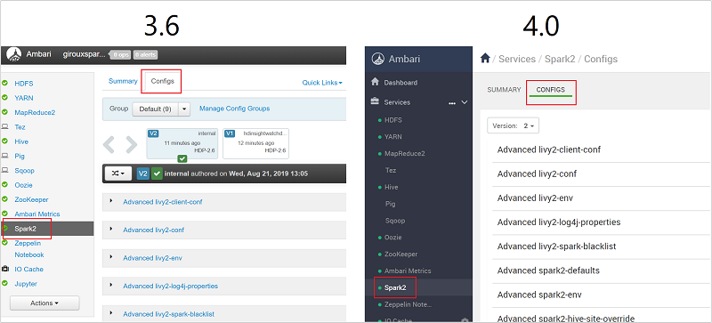
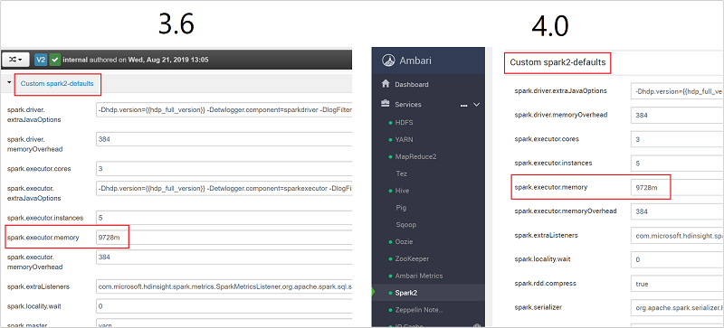
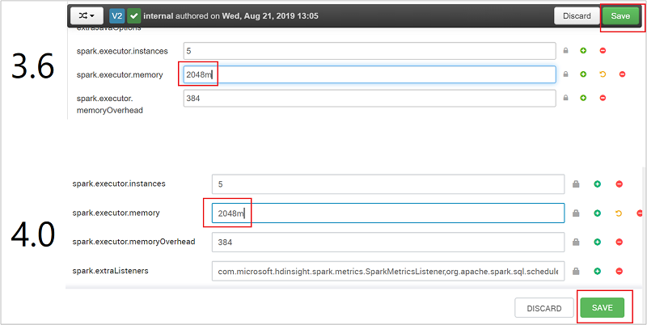
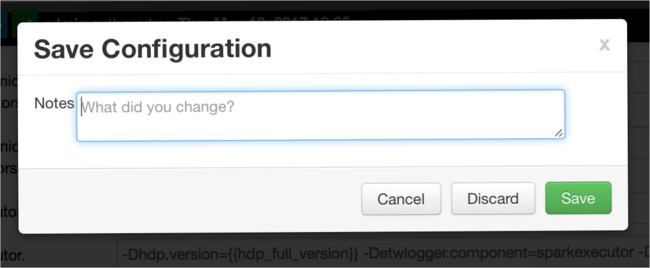
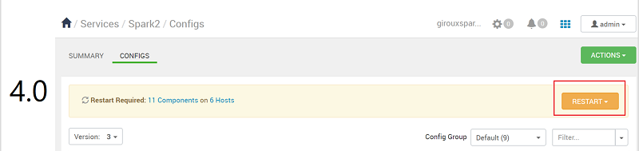
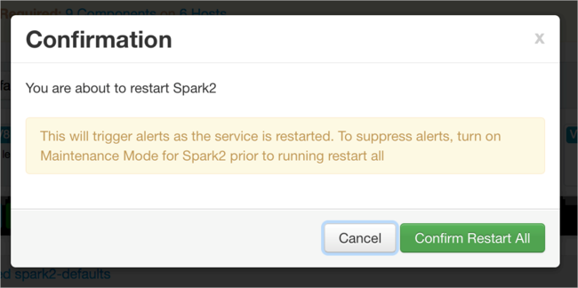
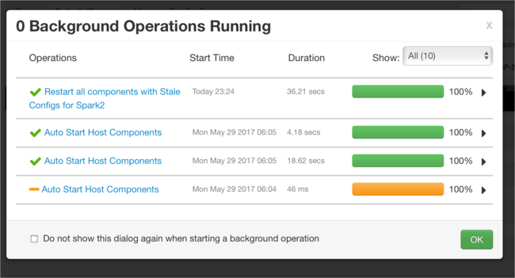
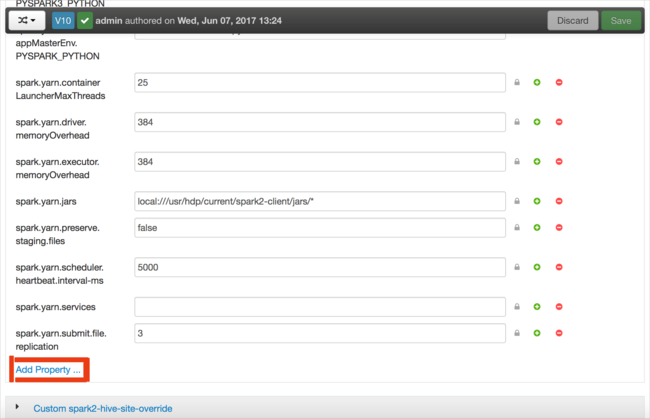

# Troubleshoot Apache Spark by using Azure HDInsight

Learn about the top issues and their resolutions when working with Apache Spark payloads in [Apache Ambari](https://ambari.apache.org/).

## How do I configure an Apache Spark application by using Apache Ambari on clusters?

Spark configuration values can be tuned help avoid an Apache Spark application `OutofMemoryError` exception. The following steps show default Spark configuration values in Azure HDInsight:

1. Log in to Ambari at `https://CLUSTERNAME.azurehdidnsight.net` with your cluster credentials. The initial screen displays an overview dashboard. There are slight cosmetic differences between HDInsight 3.6 and 4.0.

1. Navigate to **Spark2** > **Configs**.

    

1. In the list of configurations, select and expand **Custom-spark2-defaults**.

1. Look for the value setting that you need to adjust, such as **spark.executor.memory**. In this case, the value of **9728m** is too high.

    

1. Set the value to the recommended setting. The value **2048m** is recommended for this setting.

1. Save the value, and then save the configuration. Select **Save**.

    

    Write a note about the configuration changes, and then select **Save**.

    

    You are notified if any configurations need attention. Note the items, and then select **Proceed Anyway**.

    

1. Whenever a configuration is saved, you are prompted to restart the service. Select **Restart**.

    

    Confirm the restart.

    

    You can review the processes that are running.

    

1. You can add configurations. In the list of configurations, select **Custom-spark2-defaults**, and then select **Add Property**.

    

1. Define a new property. You can define a single property by using a dialog box for specific settings such as the data type. Or, you can define multiple properties by using one definition per line.

    In this example, the **spark.driver.memory** property is defined with a value of **4g**.

    

1. Save the configuration, and then restart the service as described in steps 6 and 7.

These changes are cluster-wide but can be overridden when you submit the Spark job.

## How do I configure an Apache Spark application by using a Jupyter notebook on clusters?

In the first cell of the Jupyter notebook, after the **%%configure** directive, specify the Spark configurations in valid JSON format. Change the actual values as necessary:


## How do I configure an Apache Spark application by using Apache Livy on clusters?

Submit the Spark application to Livy by using a REST client like cURL. Use a command similar to the following. Change the actual values as necessary:

```apache
curl -k --user 'username:password' -v -H 'Content-Type: application/json' -X POST -d '{ "file":"wasb://container@storageaccountname.blob.core.windows.net/example/jars/sparkapplication.jar", "className":"com.microsoft.spark.application", "numExecutors":4, "executorMemory":"4g", "executorCores":2, "driverMemory":"8g", "driverCores":4}'  
```

## How do I configure an Apache Spark application by using spark-submit on clusters?

Launch spark-shell by using a command similar to the following. Change the actual value of the configurations as necessary:

```apache
spark-submit --master yarn-cluster --class com.microsoft.spark.application --num-executors 4 --executor-memory 4g --executor-cores 2 --driver-memory 8g --driver-cores 4 /home/user/spark/sparkapplication.jar
```

### Additional reading

[Apache Spark job submission on HDInsight clusters](https://web.archive.org/web/20190112152841/https://blogs.msdn.microsoft.com/azuredatalake/2017/01/06/spark-job-submission-on-hdinsight-101/)

## Next steps

If you didn't see your problem or are unable to solve your issue, visit one of the following channels for more support:

* [Spark memory management overview](https://spark.apache.org/docs/latest/tuning.html#memory-management-overview).

* [Debugging Spark application on HDInsight clusters](https://blogs.msdn.microsoft.com/azuredatalake/2016/12/19/spark-debugging-101/).

* Get answers from Azure experts through [Azure Community Support](https://azure.microsoft.com/support/community/).

* Connect with [@AzureSupport](https://twitter.com/azuresupport) - the official Microsoft Azure account for improving customer experience. Connecting the Azure community to the right resources: answers, support, and experts.

* If you need more help, you can submit a support request from the [Azure portal](https://portal.azure.com/?#blade/Microsoft_Azure_Support/HelpAndSupportBlade/). Select **Support** from the menu bar or open the **Help + support** hub. For more detailed information, review [How to create an Azure support request](https://docs.microsoft.com/azure/azure-portal/supportability/how-to-create-azure-support-request). Access to Subscription Management and billing support is included with your Microsoft Azure subscription, and Technical Support is provided through one of the [Azure Support Plans](https://azure.microsoft.com/support/plans/).
