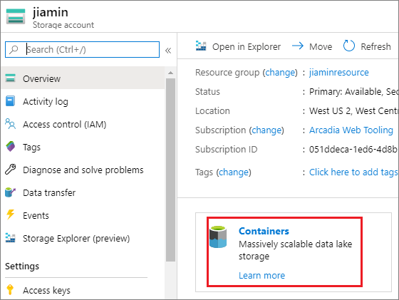
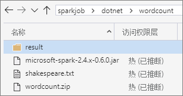
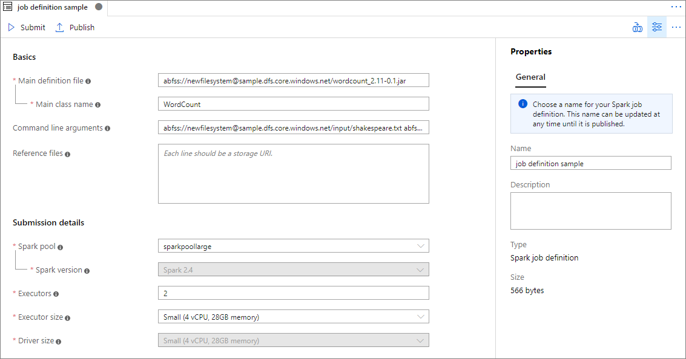
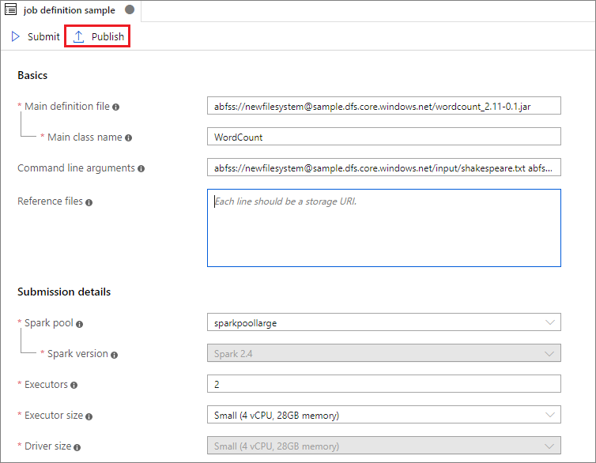
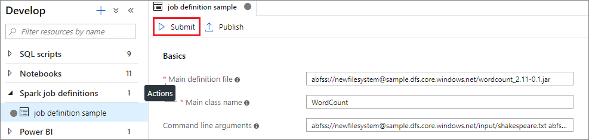
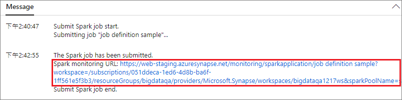
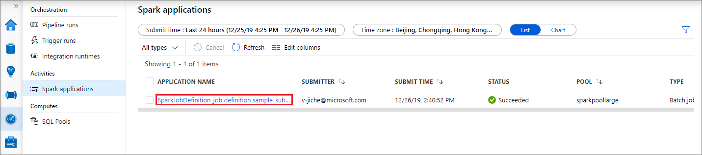
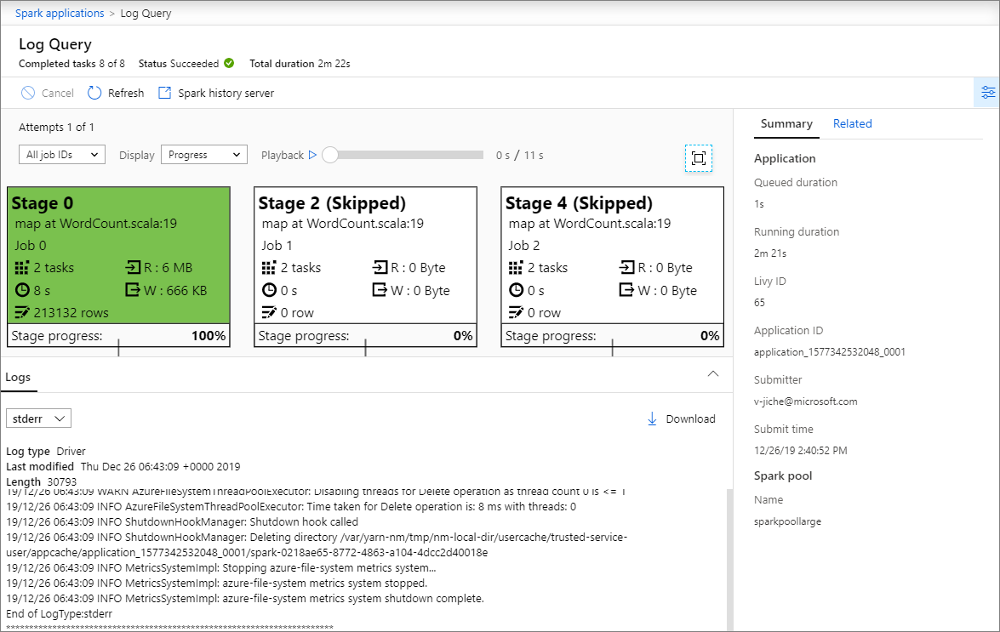
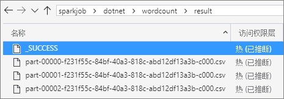

# Tutorial: Use Azure Synapse Analytics to create Spark job definitions for Synapse Spark Pools

This tutorial demonstrates how to use the Azure Synapse Analytics to create Spark job definitions, and then submit them to a Synapse Spark Pool. You can use the plug-in in a few ways:

* Develop and submit a Spark job definition on a Synapse Spark Pool.
* View job details after submission.

In this tutorial, you learn how to:
> [!div class="checklist"]
> * Develop and submit a Spark job definition on a Synapse Spark Pool.
> * View job details after submission.

## Prerequisites

* [Azure Synapse Analytics](https://web-staging.azuresynapse.net/workspaces).

* [Microsoft Azure](https://ms.portal.azure.com).
* [Azure Storage Explorer](https://azure.microsoft.com/features/storage-explorer/).

## Get started

Before submitting a Spark job definition, you need to be the Storage Blob Data Owner of the ADLS Gen2 filesystem you want to work with. If you aren't, you need to add the permission manually. 

### Scenario 1: Add permission

1. Open [Microsoft Azure](https://ms.portal.azure.com), then open Storage account.     

2. Click **Containers**, then create a **File system**. This tutorial uses `sparkjob`.

    

       

3. Open `sparkjob`, click **Access Control(IAM)**, then click **Add** and select **Add role assignment**. 

    

    

4. Click **Role assignments**, input user name, then verify user role.

    

### Scenario 2: Prepare folder structure

Before submitting a Spark job definition, another job you need to do is uploading files to ADLS Gen2 and preparing folder structure there.

1. Open Azure Storage Explorer, and Upload the relevant files to your ADLS Gen2 filesystem. For **wordcount**, we support Scala, Java, .NET, and Python. This tutorial uses the example in the figure as a demonstration, you can change project structure as you wish.

    

## Create a Spark job definition for a Synapse Spark Pool

1. Open **Azure Synapse Analytics**, and select **Develop**.

2. Select **Spark job definitions** from the left pane.

3. Click **Actions** node on the right of the "Spark job definitions".

     

4. From the **Actions** drop-down list, select **New Spark job definition**

     

5. In the New Spark job definition window, provide the following information:  

    |  Property   | Description   |  
    | ----- | ----- |  
    |Job definition name| Enter a name for your Spark job definition.  This tutorial uses `job definition sample`. This name can be updated at any time until it's published.|  
    |Main definition file| The main file used for the job. Select a JAR or PY file from your storage or choose a notebook in your workspace. Example: `abfss://sparkjob@jiamin.dfs.core.windows.net/dotnet/wordcount/microsoft-spark-2.4.x-0.6.0.jar`|
    |Main class name| The fully qualified identifier or the main class that is in the main definition file. Example: `org.apache.spark.deploy.dotnet.DotnetRunner`|
    |Reference files| Additional files used for reference in the main definition file. Example: `abfss://sparkjob@jiamin.dfs.core.windows.net/dotnet/wordcount/wordcount.zip WordCount abfss://sparkjob@jiamin.dfs.core.windows.net/dotnet/wordcount/shakespeare.txt abfss://sparkjob@jiamin.dfs.core.windows.net/dotnet/wordcount/result`|
    |Spark pool| The job will be submitted to the selected Spark pool.| 
    |Spark version| Version of Spark that the Spark pool is running.|
    |Executors| Number of executors to be allocated in the specified Spark pool for the job.|
    |Executor size| Number of cores and memory to be used for executors allocated in the specified Spark pool for the job.|  
    |Driver size| Number of cores and memory to be used for driver allocated in the specified Spark pool for the job.|

    

7. Select **Publish** to save the Spark job definition.

    

## Submit a Spark job definition on a Synapse Spark Pool

After creating a Spark job definition, you can submit it on a Synapse Spark Pool. Make sure you've gone through steps in [Get started](#get-started) before trying samples in this part.

### Scenario 1: Submit Spark job definition 

1. Open a spark job definition window by clicking it.

           

2. Click **submit** icon to submit your project to the selected Spark Pool. You can click **Spark monitoring URL** tab to see the LogQuery of the Spark application.

    

       

### Scenario 2: View Spark job running progress

1. Click **Monitor**, then select the **Spark applications** option. You can find the submitted Spark application.

    

2. Then click the Spark application, **LogQuery** window displays. You can view the job execution progress from **LogQuery**.

    

### Scenario 3: Check output file

 1. Open **Azure Storage Explorer**.

 2. After a successful run, you can go to the ADLS Gen2 storage and check outputs are generated.  

    

## Next steps

In this tutorial, This tutorial demonstrates how to use the Azure Synapse Analytics to create Spark job definitions, and then submit them to a Synapse Spark Pool. Next you can use the Azure Synapse Analytics to create Power BI datasets and manage Power BI data.          