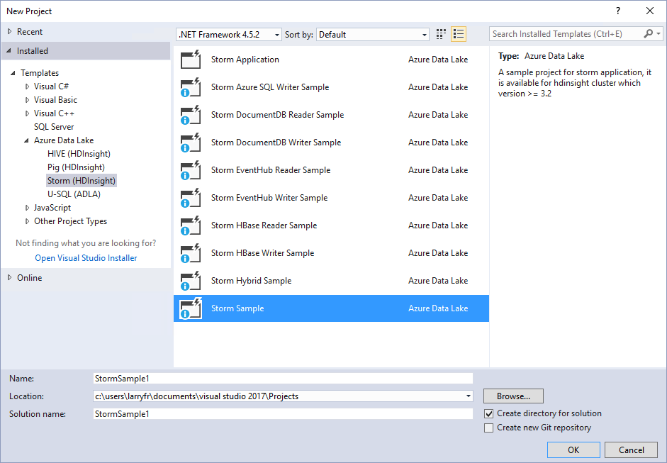

# Deploy and manage Apache Storm topologies on Azure HDInsight 

In this document, learn the basics of managing and monitoring [Apache Storm](https://storm.apache.org/) topologies running on Storm on HDInsight clusters.

## Prerequisites

* An Apache Storm cluster on HDInsight. See [Create Apache Hadoop clusters using the Azure portal](../hdinsight-hadoop-create-linux-clusters-portal.md) and select **Storm** for **Cluster type**.

* (Optional) Familiarity with SSH and SCP: For more information, see [Use SSH with HDInsight](../hdinsight-hadoop-linux-use-ssh-unix.md).

* (Optional) Visual Studio: Azure SDK 2.5.1 or newer and the Data Lake Tools for Visual Studio. For more information, see [Get started using Data Lake Tools for Visual Studio](../hadoop/apache-hadoop-visual-studio-tools-get-started.md).

    One of the following versions of Visual Studio:

  * Visual Studio 2012 with Update 4

  * Visual Studio 2013 with Update 4 or [Visual Studio 2013 Community](https://go.microsoft.com/fwlink/?LinkId=517284)
  * [Visual Studio 2015](https://www.visualstudio.com/downloads/)

  * Visual Studio 2015 (any edition)

  * Visual Studio 2017 (any edition). Data Lake Tools for Visual Studio 2017 are installed as part of the Azure Workload.

## Submit a topology: Visual Studio

The HDInsight Tools can be used to submit C# or hybrid topologies to your Storm cluster. The following steps use a sample application. For information about creating on using the HDInsight Tools, see [Develop C# topologies using the HDInsight Tools for Visual Studio](apache-storm-develop-csharp-visual-studio-topology.md).

1. If you have not already installed the latest version of the Data Lake tools for Visual Studio, see [Get started using Data Lake Tools for Visual Studio](../hadoop/apache-hadoop-visual-studio-tools-get-started.md).

    > [!NOTE]  
    > The Data Lake Tools for Visual Studio were formerly called the HDInsight Tools for Visual Studio.
    >
    > Data Lake Tools for Visual Studio are included in the __Azure Workload__ for Visual Studio 2017.

2. Open Visual Studio, select **File** > **New** > **Project**.

3. In the **New Project** dialog box, expand **Installed** > **Templates**, and then select **HDInsight**. From the list of templates, select **Storm Sample**. At the bottom of the dialog box, type a name for the application.

    

4. In **Solution Explorer**, right-click the project, and select **Submit to Storm on HDInsight**.

   > [!NOTE]  
   > If prompted, enter the login credentials for your Azure subscription. If you have more than one subscription, log in to the one that contains your Storm on HDInsight cluster.

5. Select your Storm on HDInsight cluster from the **Storm Cluster** drop-down list, and then select **Submit**. You can monitor whether the submission is successful by using the **Output** window.

## Submit a topology: SSH and the Storm command

1. Use SSH to connect to the HDInsight cluster. Replace **USERNAME** the name of your SSH login. Replace **CLUSTERNAME** with your HDInsight cluster name:

        ssh USERNAME@CLUSTERNAME-ssh.azurehdinsight.net

    For more information on using SSH to connect to your HDInsight cluster, see [Use SSH with HDInsight](../hdinsight-hadoop-linux-use-ssh-unix.md).

2. Use the following command to start an example topology:

        storm jar /usr/hdp/current/storm-client/contrib/storm-starter/storm-starter-topologies-*.jar org.apache.storm.starter.WordCountTopology WordCount

    This command starts the example WordCount topology on the cluster. This topology randomly generates sentences, and then counts the occurrence of each word in the sentences.

   > [!NOTE]  
   > When submitting topology to the cluster, you must first copy the jar file containing the cluster before using the `storm` command. To copy the file to the cluster, you can use the `scp` command. For example, `scp FILENAME.jar USERNAME@CLUSTERNAME-ssh.azurehdinsight.net:FILENAME.jar`
   >
   > The WordCount example, and other storm starter examples, are already included on your cluster at `/usr/hdp/current/storm-client/contrib/storm-starter/`.

## Submit a topology: programmatically

You can programmatically deploy a topology using the Nimbus service. [https://github.com/Azure-Samples/hdinsight-java-deploy-storm-topology](https://github.com/Azure-Samples/hdinsight-java-deploy-storm-topology) provides an example Java application that demonstrates how to deploy and start a topology through the Nimbus service.

## Monitor and manage: Visual Studio

When a topology is submitted using Visual Studio, the **Storm Topologies** view appears. Select the topology from the list to view information about the running topology.

> [!NOTE]  
> You can also view **Storm Topologies** from **Server Explorer** by expanding **Azure** > **HDInsight**, and then right-clicking a Storm on HDInsight cluster, and selecting **View Storm Topologies**.

Select the shape for the spouts or bolts to view information about these components. A new window opens for each item selected.

### Deactivate and reactivate

Deactivating a topology pauses it until it is killed or reactivated. To perform these operations, use the __Deactivate__ and __Reactivate__ buttons at the top of the __Topology Summary__.

### Rebalance

Rebalancing a topology allows the system to revise the parallelism of the topology. For example, if you have resized the cluster to add more notes, rebalancing allows a topology to see the new nodes.

To rebalance a topology, use the __Rebalance__ button at the top of the __Topology Summary__.

> [!WARNING]  
> Rebalancing a topology first deactivates the topology, then redistributes workers evenly across the cluster, then finally returns the topology to the state it was in before rebalancing occurred. So if the topology was active, it becomes active again. If it was deactivated, it remains deactivated.

### Kill a topology

Storm topologies continue running until they are stopped or the cluster is deleted. To stop a topology, use the __Kill__ button at the top of the __Topology Summary__.

## Monitor and manage: SSH and the Storm command

The `storm` utility allows you to work with running topologies from the command line. Use `storm -h` for a full list of commands.

### List topologies

Use the following command to list all running topologies:

    storm list

This command returns information similar to the following text:

    Topology_name        Status     Num_tasks  Num_workers  Uptime_secs
    -------------------------------------------------------------------
    WordCount            ACTIVE     29         2            263

### Deactivate and reactivate

Deactivating a topology pauses it until it is killed or reactivated. Use the following command to deactivate and reactivate:

    storm Deactivate TOPOLOGYNAME

    storm Activate TOPOLOGYNAME

### Kill a running topology

Storm topologies, once started, continue running until stopped. To stop a topology, use the following command:

    storm kill TOPOLOGYNAME

### Rebalance

Rebalancing a topology allows the system to revise the parallelism of the topology. For example, if you have resized the cluster to add more notes, rebalancing allows a topology to see the new nodes.

> [!WARNING]  
> Rebalancing a topology first deactivates the topology, then redistributes workers evenly across the cluster, then finally returns the topology to the state it was in before rebalancing occurred. So if the topology was active, it becomes active again. If it was deactivated, it remains deactivated.

    storm rebalance TOPOLOGYNAME

## Monitor and manage: Storm UI

The Storm UI provides a web interface for working with running topologies, and is included on your HDInsight cluster. To view the Storm UI, use a web browser to open **https://CLUSTERNAME.azurehdinsight.net/stormui**, where **CLUSTERNAME** is the name of your cluster.

> [!NOTE]  
> If asked to provide a user name and password, enter the cluster administrator (admin) and password that you used when creating the cluster.

### Main page

The main page of the Storm UI provides the following information:

* **Cluster summary**: Basic information about the Storm cluster.
* **Topology summary**: A list of running topologies. Use the links in this section to view more information about specific topologies.
* **Supervisor summary**: Information about the Storm supervisor.
* **Nimbus configuration**: Nimbus configuration for the cluster.

### Topology summary

Selecting a link from the **Topology summary** section displays the following information about the topology:

* **Topology summary**: Basic information about the topology.
* **Topology actions**: Management actions that you can perform for the topology.

  * **Activate**: Resumes processing of a deactivated topology.
  * **Deactivate**: Pauses a running topology.
  * **Rebalance**: Adjusts the parallelism of the topology. You should rebalance running topologies after you have changed the number of nodes in the cluster. This operation allows the topology to adjust parallelism to compensate for the increased or decreased number of nodes in the cluster.

    For more information, see <a href="https://storm.apache.org/documentation/Understanding-the-parallelism-of-a-Storm-topology.html" target="_blank">Understanding the parallelism of an Apache Storm topology</a>.
  * **Kill**: Terminates a Storm topology after the specified timeout.
* **Topology stats**: Statistics about the topology. To set the timeframe for the remaining entries on the page, use the links in the **Window** column.
* **Spouts**: The spouts used by the topology. Use the links in this section to view more information about specific spouts.
* **Bolts**: The bolts used by the topology. Use the links in this section to view more information about specific bolts.
* **Topology configuration**: The configuration of the selected topology.

### Spout and Bolt summary

Selecting a spout from the **Spouts** or **Bolts** sections displays the following information about the selected item:

* **Component summary**: Basic information about the spout or bolt.
* **Spout/Bolt stats**: Statistics about the spout or bolt. To set the timeframe for the remaining entries on the page, use the links in the **Window** column.
* **Input stats** (bolt only): Information about the input streams consumed by the bolt.
* **Output stats**: Information about the streams emitted by the spout or bolt.
* **Executors**: Information about the instances of the spout or bolt. Select the **Port** entry for a specific executor to view a log of diagnostic information produced for this instance.
* **Errors**: Any error information for the spout or bolt.

## Monitor and manage: REST API

The Storm UI is built on top of the REST API, so you can perform similar management and monitoring functionality by using the REST API. You can use the REST API to create custom tools for managing and monitoring Storm topologies.

For more information, see [Apache Storm UI REST API](https://storm.apache.org/releases/current/STORM-UI-REST-API.html). The following information is specific to using the REST API with Apache Storm on HDInsight.

> [!IMPORTANT]  
> The Storm REST API is not publicly available over the internet, and must be accessed using an SSH tunnel to the HDInsight cluster head node. For information on creating and using an SSH tunnel, see [Use SSH Tunneling to access Apache Ambari web UI, ResourceManager, JobHistory, NameNode, Apache Oozie, and other web UIs](../hdinsight-linux-ambari-ssh-tunnel.md).

### Base URI

The base URI for the REST API on Linux-based HDInsight clusters is available on the head node at **https:\//HEADNODEFQDN:8744/api/v1/**. The domain name of the head node is generated during cluster creation and is not static.

You can find the fully qualified domain name (FQDN) for the cluster head node in several different ways:

* **From an SSH session**: Use the command `headnode -f` from an SSH session to the cluster.
* **From Ambari Web**: Select **Services** from the top of the page, then select **Storm**. From the **Summary** tab, select **Storm UI Server**. The FQDN of the node that hosts the Storm UI and REST API is displayed at the top of the page.
* **From Ambari REST API**: Use the command `curl -u admin -G "https:\//CLUSTERNAME.azurehdinsight.net/api/v1/clusters/CLUSTERNAME/services/STORM/components/STORM_UI_SERVER"` to retrieve information about the node that the Storm UI and REST API are running on. Replace **CLUSTERNAME** with the cluster name. When prompted, enter the password for the login (admin) account. In the response, the "host_name" entry contains the FQDN of the node.

### Authentication

Requests to the REST API must use **basic authentication**, so you use the HDInsight cluster administrator name and password.

> [!NOTE]  
> Because basic authentication is sent by using clear text, you should **always** use HTTPS to secure communications with the cluster.

### Return values

Information that is returned from the REST API may only be usable from within the cluster. For example, the fully qualified domain name (FQDN) returned for [Apache ZooKeeper](https://zookeeper.apache.org/) servers is not accessible from the Internet.

## Next Steps

Learn how to [Develop Java-based topologies using Apache Maven](apache-storm-develop-java-topology.md).

For a list of more example topologies, see [Example topologies for Apache Storm on HDInsight](apache-storm-example-topology.md).
