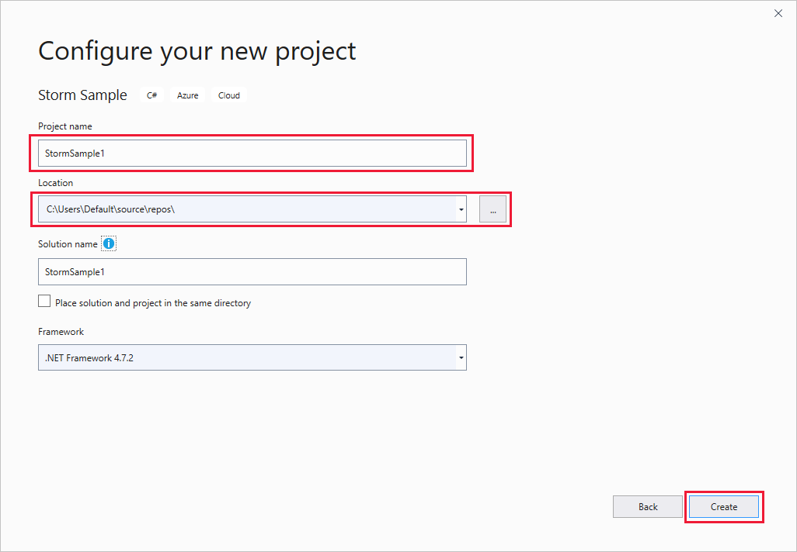
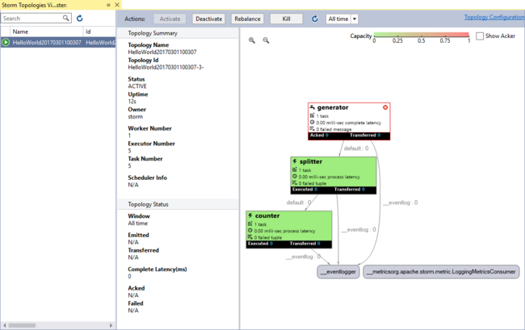
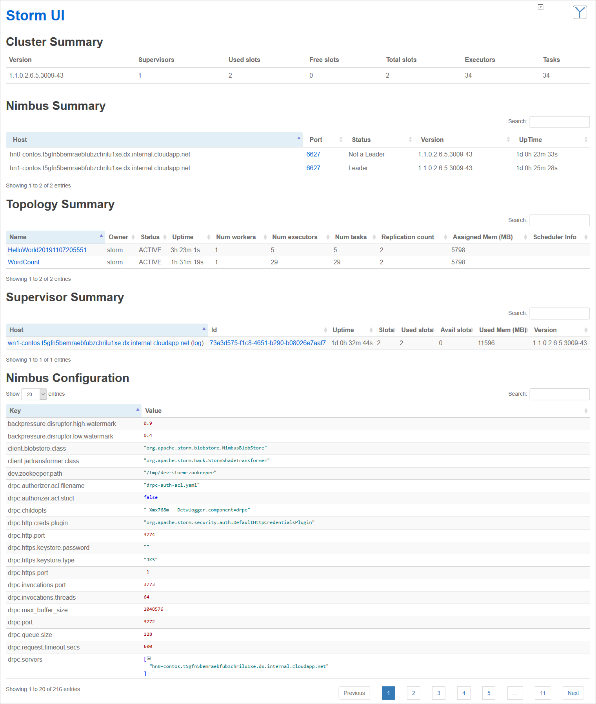
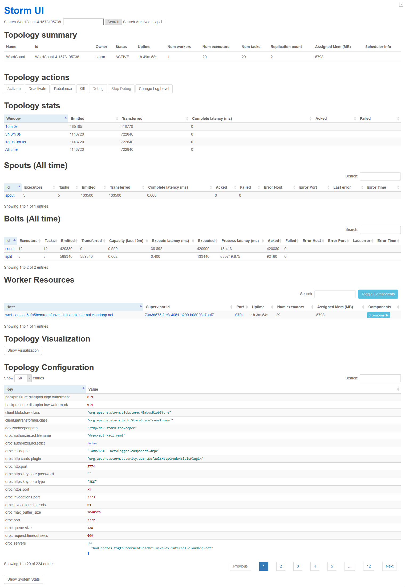
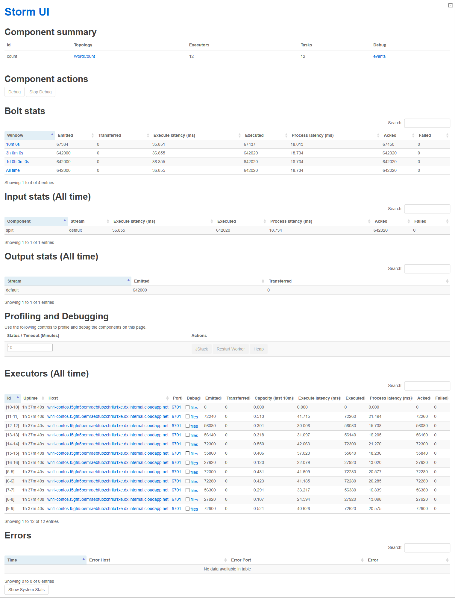

# Deploy and manage Apache Storm topologies on Azure HDInsight

In this document, learn the basics of managing and monitoring [Apache Storm](https://storm.apache.org/) topologies running on Storm on HDInsight clusters.

## Prerequisites

* An Apache Storm cluster on HDInsight. See [Create Apache Hadoop clusters using the Azure portal](../hdinsight-hadoop-create-linux-clusters-portal.md) and select **Storm** for **Cluster type**.

* (Optional) Familiarity with Secure Shell (SSH) and Secure Copy (SCP). For more information, see [Connect to HDInsight (Apache Hadoop) using SSH](../hdinsight-hadoop-linux-use-ssh-unix.md).

* (Optional) Visual Studio, Azure SDK 2.5.1 or newer, and the Data Lake Tools for Visual Studio. For more information, see [Apache Hadoop & Visual Studio Data Lake Tools](../hadoop/apache-hadoop-visual-studio-tools-get-started.md).

## Submit a topology using Visual Studio

You can use the Data Lake Tools for Visual Studio to submit C# or hybrid topologies to your Storm cluster. The following steps use a sample application. For information about topology creation using the Data Lake Tools, see [Apache Storm topologies with Visual Studio and C#](apache-storm-develop-csharp-visual-studio-topology.md).

1. If you haven't already installed the latest version of the Data Lake tools for Visual Studio, see [Use Data Lake Tools for Visual Studio](../hadoop/apache-hadoop-visual-studio-tools-get-started.md).

    > [!NOTE]  
    > The Azure Data Lake and Stream Analytics Tools were formerly called the HDInsight Tools for Visual Studio.
    >
    > Azure Data Lake and Stream Analytics Tools for Visual Studio are included in the **Azure development** workload for Visual Studio 2019.

1. Start Visual Studio.

1. In the **Start** window, select **Create a new project**.

1. In the **Create a new project** window, select the search box, and enter `Storm`. Then choose **Storm Sample** from the result list and select **Next**.

1. In the **Configure your new project** window, enter a **Project name**, and go to or create a **Location** to save the new project in. Then select **Create**.

    

1. From **Server Explorer**, right-click **Azure** and select **Connect to Microsoft Azure Subscription...** and complete the sign-in process.

1. From **Solution Explorer**, right-click the project, and choose **Submit to Storm on HDInsight**.

    > [!NOTE]  
    > If prompted, enter the login credentials for your Azure subscription. If you have more than one subscription, sign in to the one that contains your Storm on HDInsight cluster.

1. In the **Submit Topology** dialog box, under the **Storm Cluster** drop-down list, choose your Storm on HDInsight cluster, and then select **Submit**. You can monitor whether the submission is successful by viewing the **Output** pane.

## Submit a topology using SSH and the Storm command

1. Use [ssh command](../hdinsight-hadoop-linux-use-ssh-unix.md) to connect to your cluster. Edit the command below by replacing CLUSTERNAME with the name of your cluster, and then enter the command:

    ```cmd
    ssh sshuser@CLUSTERNAME-ssh.azurehdinsight.net
    ```

1. From your ssh session, use the following command to start the **WordCount** example topology:

    ```bash
    storm jar /usr/hdp/current/storm-client/contrib/storm-starter/storm-starter-topologies-*.jar org.apache.storm.starter.WordCountTopology WordCount
    ```

    This command starts the example WordCount topology on the cluster. This topology randomly generates sentences, and then counts the occurrence of each word in the sentences.

    > [!NOTE]  
    > When submitting topology to the cluster, you must first copy the .jar file containing the cluster before using the `storm` command. To copy the file to the cluster, you can use the `scp` command. For example, enter `scp FILENAME.jar USERNAME@CLUSTERNAME-ssh.azurehdinsight.net:FILENAME.jar`.
    >
    > The *WordCount* example, and other storm starter examples, are already included on your cluster at `/usr/hdp/current/storm-client/contrib/storm-starter/`.

## Submit a topology programmatically

You can programmatically deploy a topology using the Nimbus service. [https://github.com/Azure-Samples/hdinsight-java-deploy-storm-topology](https://github.com/Azure-Samples/hdinsight-java-deploy-storm-topology) provides an example Java application that demonstrates how to deploy and start a topology through the Nimbus service.

## Monitor and manage a topology in Visual Studio

When you submit a topology using Visual Studio, the **Storm Topologies View** window appears. Select the topology from the list to view information about the running topology.



> [!NOTE]  
> You can also view **Storm Topologies** from **Server Explorer**. Expand **Azure** > **HDInsight**, right-click a Storm on HDInsight cluster, and then select **View Storm Topologies**.

Select the shape for the spouts or bolts to view information about these components. A tooltip with component information appears for the item selected.

### Deactivate and reactivate a topology

Deactivating a topology pauses it until the topology is killed or reactivated. To do these operations, use the **Deactivate** and **Reactivate** buttons in the **Actions** area at the top of the **Storm Topologies View** window.

### Rebalance a topology

Rebalancing a topology allows the system to revise the parallelism of the topology. For example, if you've resized the cluster to add more notes, rebalancing allows a topology to see the new nodes.

To rebalance a topology, use the **Rebalance** button in the **Actions** area of the **Storm Topologies View** window.

> [!WARNING]  
> Rebalancing a topology deactivates the topology, redistributes workers evenly across the cluster, and then returns the topology to the state it was in before rebalancing occurred. If the topology was active, it becomes active again. If the topology was deactivated, it remains deactivated.

### Kill a running topology

Storm topologies continue running until they're stopped or the cluster is deleted. To stop a topology, use the **Kill** button in the **Actions** area.

## Monitor and manage a topology using SSH and the Storm command

The `storm` utility allows you to work with running topologies from the command line. Use `storm -h` for a full list of commands.

### List topologies

Use the following command to list all running topologies:

```shell
storm list
```

This command returns information similar to the following text:

```shell
Topology_name        Status     Num_tasks  Num_workers  Uptime_secs
-------------------------------------------------------------------
WordCount            ACTIVE     29         2            263
```

### Deactivate and reactivate a topology

Deactivating a topology pauses it until the topology is killed or reactivated. Use the following commands to deactivate or reactivate:

```shell
storm Deactivate TOPOLOGYNAME
```

```shell
storm Activate TOPOLOGYNAME
```

### Kill a running topology

Storm topologies, once started, continue running until stopped. To stop a topology, use the following command:

```shell
storm kill TOPOLOGYNAME
```

### Rebalance a topology

Rebalancing a topology allows the system to revise the parallelism of the topology. For example, if you've resized the cluster to add more notes, rebalancing allows a topology to see the new nodes.

> [!WARNING]  
> Rebalancing a topology deactivates the topology, redistributes workers evenly across the cluster, and then returns the topology to the state it was in before rebalancing occurred. If the topology was active, it becomes active again. If it was deactivated, it remains deactivated.

```shell
storm rebalance TOPOLOGYNAME
```

## Monitor and manage a topology using the Storm UI

The Storm UI provides a web interface for working with running topologies, and it's included on your HDInsight cluster. To view the Storm UI, use a web browser to open `https://CLUSTERNAME.azurehdinsight.net/stormui`, where *CLUSTERNAME* is the name of your cluster.

> [!NOTE]  
> If you're asked to provide a user name and password, enter the cluster administrator username and password that you used when creating the cluster.

### Storm UI main page

The main page of the Storm UI provides the following information:

| Section | Description |
| --- | --- |
| Cluster summary| Basic information about the Storm cluster. |
| Nimbus summary | A list of basic Nimbus information. |
| Topology summary | A list of running topologies. To view more information about a specific topology, select its link in the **Name** column. |
| Supervisor summary | Information about the Storm supervisor. To see the worker resources associated with a specific supervisor, select its link in the **Host** or **Id** column. |
| Nimbus configuration | Nimbus configuration for the cluster. |

The Storm UI main page looks similar to this web page:



#### Topology summary

Selecting a link from the **Topology summary** section displays the following information about the topology:

| Section | Description |
| --- | --- |
| Topology summary | Basic information about the topology. |
| Topology actions| Management actions that you can do for the topology. The available actions are described later in this section. |
| Topology stats | Statistics about the topology. To set the time frame for an entry in this section, select its link in the **Window** column. |
| Spouts *(time frame)* | The spouts used by the topology. To view more information about a specific spout, select its link in the **Id** column. |
| Bolts *(time frame)* | The bolts used by the topology. To view more information about a specific bolt, select its link in the **Id** column. |
| Worker resources | A list of worker resources. To view more information about a specific worker resource, select its link in the **Host** column. |
| Topology visualization | A **Show Visualization** button that displays a visualization of the topology. |
| Topology configuration | The configuration of the selected topology. |

The Storm topology summary page looks similar to this web page:



In the **Topology actions** section, you can select the following buttons to do an action:

| Button | Description |
| --- | --- |
| Activate | Resumes processing of a deactivated topology. |
| Deactivate | Pauses a running topology. |
| Rebalance | Adjusts the parallelism of the topology. You should rebalance running topologies after you've changed the number of nodes in the cluster. This operation allows the topology to adjust parallelism to compensate for the additional or reduced number of nodes in the cluster.<br/><br/>For more information, see <a href="https://storm.apache.org/documentation/Understanding-the-parallelism-of-a-Storm-topology.html" target="_blank">Understanding the parallelism of an Apache Storm topology</a>.
| Kill | Terminates a Storm topology after the specified timeout. |
| Debug | Begins a debugging session for the running topology. |
| Stop Debug | Ends the debugging session for the running topology. |
| Change Log Level | Modifies the debugging log level. |

##### Spout and bolt summary

Selecting a spout from the **Spouts** or **Bolts** sections displays the following information about the selected item:

| Section | Description |
| --- | --- |
| Component summary | Basic information about the spout or bolt. |
| Component actions | **Debug** and **Stop Debug** buttons. |
| Spout stats or bolt stats | Statistics about the spout or bolt. To set the time frame for an entry in this section, select its link in the **Window** column. |
| (Bolt-only)<br/>Input stats*(time frame)* | Information about the input streams consumed by the bolt. |
| Output stats *(time frame)* | Information about the streams emitted by the spout or bolt. |
| Profiling and debugging | Controls for profiling and debugging the components on this page. You can set the **Status / Timeout (Minutes)** value, and you can select buttons for **JStack**, **Restart Worker**, and **Heap**. |
| Executors *(time frame)* | Information about the instances of the spout or bolt. To view a log of diagnostic information produced for this instance, select the **Port** entry for a specific executor. You can also see the worker resources associated with a specific executor by selecting its link in the **Host** column. |
| Errors | Any error information for the spout or bolt. |

The Storm bolt summary page looks similar to this web page:



## Monitor and manage the topology using the REST API

The Storm UI is built on top of the REST API, so you can do similar management and monitoring tasks by using the REST API. You can use the REST API to create custom tools for managing and monitoring Storm topologies.

For more information, see [Apache Storm UI REST API](https://storm.apache.org/releases/current/STORM-UI-REST-API.html). The following information is specific to using the REST API with Apache Storm on HDInsight.

> [!IMPORTANT]  
> The Storm REST API is not publicly available over the internet. It must be accessed using an SSH tunnel to the HDInsight cluster head node. For information on creating and using an SSH tunnel, see [Use SSH tunneling to access Azure HDInsight](../hdinsight-linux-ambari-ssh-tunnel.md).

### Base URI

The base URI for the REST API on Linux-based HDInsight clusters is available at URL address `https://HEADNODEFQDN:8744/api/v1/`, where you replace *HEADNODEFQDN* with the head node. The domain name of the head node is generated during cluster creation and isn't static.

You can find the fully qualified domain name (FQDN) for the cluster head node in several ways:

| FQDN discovery method | Description |
| --- | --- |
| SSH session | Use the command `headnode -f` from an SSH session to the cluster. |
| Ambari Web | On the Ambari cluster web page (`https://CLUSTERNAME.azurehdinsight.net`), select **Services** from the top of the page, then select **Storm**. From the **Summary** tab, select **Storm UI Server**. The FQDN of the node that hosts the Storm UI and REST API is displayed at the top of the page. |
| Ambari REST API | Use the command `curl -u admin -G "https://CLUSTERNAME.azurehdinsight.net/api/v1/clusters/CLUSTERNAME/services/STORM/components/STORM_UI_SERVER"` to retrieve information about the node that the Storm UI and REST API are running on. Replace the two instances of *CLUSTERNAME* with the cluster name. When you're prompted, enter the password for the user (admin) account. In the response, the "host_name" entry of the JSON output contains the FQDN of the node. |

### Authentication

Requests to the REST API must use *basic authentication*, so you have to use the administrator name and password for the HDInsight cluster.

> [!NOTE]  
> Because basic authentication is sent by using clear text, you should *always* use HTTPS to secure communications with the cluster.

### Return values

Information that is returned from the REST API may only be usable from within the cluster. For example, the fully qualified domain name (FQDN) returned for [Apache ZooKeeper](https://zookeeper.apache.org/) servers isn't accessible from the internet.

## Next steps

Learn how to [Develop Java-based topologies using Apache Maven](apache-storm-develop-java-topology.md).

For a list of more example topologies, see [Example Apache Storm topologies in Azure HDInsight](apache-storm-example-topology.md).
