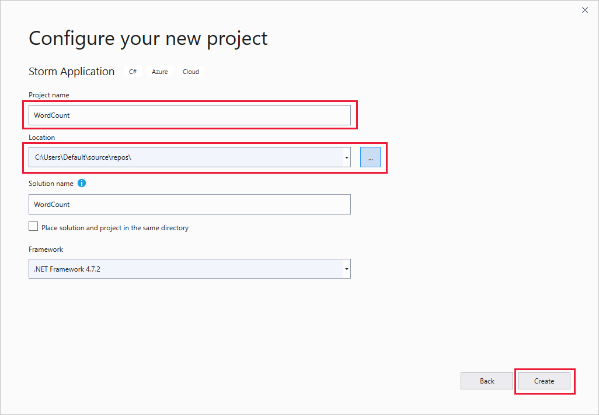
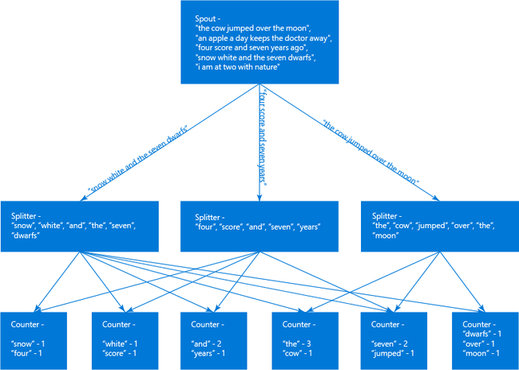
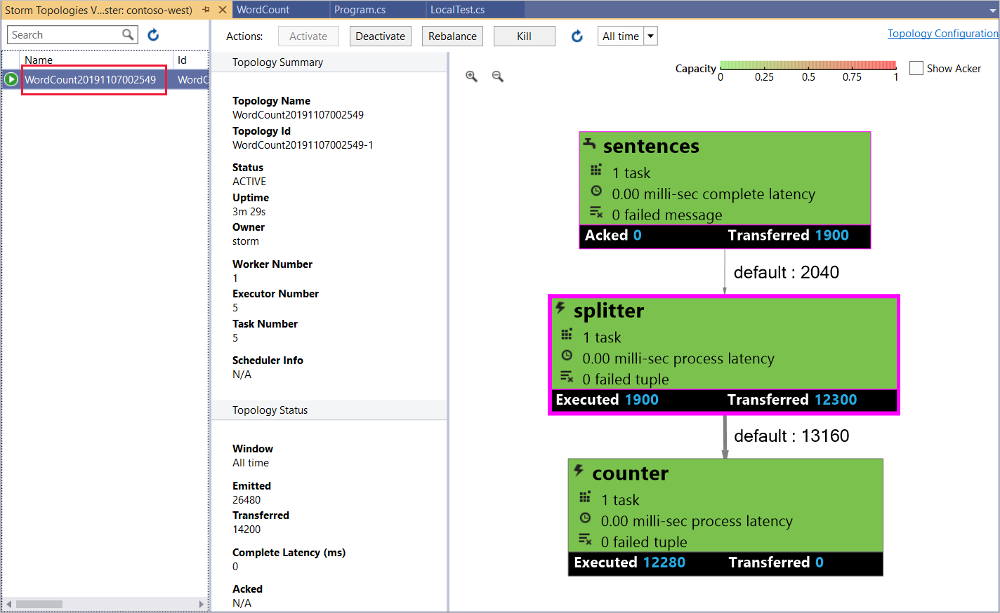
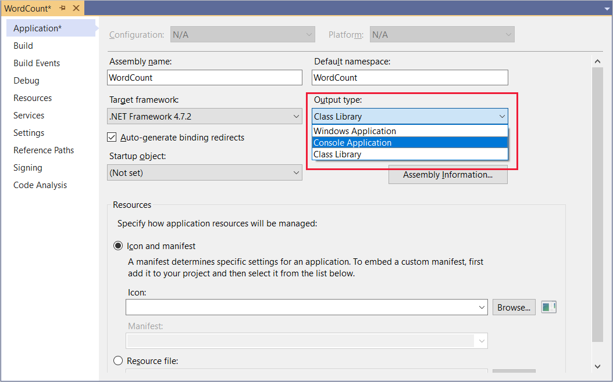

# Develop C# topologies for Apache Storm by using the Data Lake tools for Visual Studio

Learn how to create a C# Apache Storm topology by using the Azure Data Lake (Apache Hadoop) tools for Visual Studio. This document walks through the process of creating a Storm project in Visual Studio, testing it locally, and deploying it to an Apache Storm on Azure HDInsight cluster.

You also learn how to create hybrid topologies that use C# and Java components.

C# topologies use .NET 4.5, and use Mono to run on the HDInsight cluster. For information about potential incompatibilities, see [Mono compatibility](https://www.mono-project.com/docs/about-mono/compatibility/). To use a C# topology, you must update the `Microsoft.SCP.Net.SDK` NuGet package used by your project to version 0.10.0.6 or later. The version of the package must also match the major version of Storm installed on HDInsight.

| HDInsight version | Apache Storm version | SCP.NET version | Default Mono version |
|:-----------------:|:-------------:|:---------------:|:--------------------:|
| 3.4 | 0.10.0.x | 0.10.0.x | 3.2.8 |
| 3.5 | 1.0.2.x | 1.0.0.x | 4.2.1 |
| 3.6 | 1.1.0.x | 1.0.0.x | 4.2.8 |

## Prerequisite

An Apache Storm cluster on HDInsight. See [Create Apache Hadoop clusters using the Azure portal](../hdinsight-hadoop-create-linux-clusters-portal.md) and select **Storm** for **Cluster type**.

## Install Visual Studio

You can develop C# topologies with SCP.NET by using [Visual Studio](https://visualstudio.microsoft.com/downloads/). The instructions here use Visual Studio 2019, but you may also use earlier versions of Visual Studio.

## Install Data Lake tools for Visual Studio

To install Data Lake tools for Visual Studio, follow the steps in [Get started using Data Lake tools for Visual Studio](../hadoop/apache-hadoop-visual-studio-tools-get-started.md#install-data-lake-tools-for-visual-studio).

## Install Java

When you submit a Storm topology from Visual Studio, SCP.NET generates a zip file that contains the topology and dependencies. Java is used to create these zip files, because it uses a format that is more compatible with Linux-based clusters.

1. Install the Java Developer Kit (JDK) 7 or later on your development environment. You can get the Oracle JDK from [Oracle](https://openjdk.java.net/). You can also use [other Java distributions](/java/azure/jdk/).

2. Set the `JAVA_HOME` environment variable to the directory that contains Java.

3. Set the `PATH` environment variable to include the `%JAVA_HOME%\bin` directory.

You can build and run the following C# console application to verify that Java and the JDK are correctly installed:

```csharp
using System;
using System.IO;
namespace ConsoleApplication2
{
   class Program
   {
       static void Main(string[] args)
       {
           string javaHome = Environment.GetEnvironmentVariable("JAVA_HOME");
           if (!string.IsNullOrEmpty(javaHome))
           {
               string jarExe = Path.Combine(javaHome + @"\bin", "jar.exe");
               if (File.Exists(jarExe))
               {
                   Console.WriteLine("JAVA Is Installed properly");
                    return;
               }
               else
               {
                   Console.WriteLine("A valid JAVA JDK is not found. Looks like JRE is installed instead of JDK.");
               }
           }
           else
           {
             Console.WriteLine("A valid JAVA JDK is not found. JAVA_HOME environment variable is not set.");
           }
       }  
   }
}
```

## Apache Storm templates

The Data Lake tools for Visual Studio provide the following templates:

| Project type | Demonstrates |
| --- | --- |
| Storm Application |An empty Storm topology project. |
| Storm Azure SQL Writer Sample |How to write to Azure SQL Database. |
| Storm Azure Cosmos DB Reader Sample |How to read from Azure Cosmos DB. |
| Storm Azure Cosmos DB Writer Sample |How to write to Azure Cosmos DB. |
| Storm EventHub Reader Sample |How to read from Azure Event Hubs. |
| Storm EventHub Writer Sample |How to write to Azure Event Hubs. |
| Storm HBase Reader Sample |How to read from HBase on HDInsight clusters. |
| Storm HBase Writer Sample |How to write to HBase on HDInsight clusters. |
| Storm Hybrid Sample |How to use a Java component. |
| Storm Sample |A basic word count topology. |

> [!WARNING]  
> Not all templates work with Linux-based HDInsight. NuGet packages used by the templates may not be compatible with Mono. To identify potential problems, see [Mono compatibility](https://www.mono-project.com/docs/about-mono/compatibility/) and use the [.NET Portability Analyzer](../hdinsight-hadoop-migrate-dotnet-to-linux.md#automated-portability-analysis).

In the steps in this document, you use the basic Storm Application project type to create a topology.

### Apache HBase templates

The HBase reader and writer templates use the HBase REST API, not the HBase Java API, to communicate with an HBase on HDInsight cluster.

### EventHub templates

> [!IMPORTANT]  
> The Java-based EventHub spout component included with the EventHub Reader template may not work with Storm on HDInsight version 3.5 or later. An updated version of this component is available at [GitHub](https://github.com/hdinsight/hdinsight-storm-examples/tree/master/HDI3.5/lib).

For an example topology that uses this component and works with Storm on HDInsight 3.5, see [GitHub](https://github.com/Azure-Samples/hdinsight-dotnet-java-storm-eventhub).

## Create a C# topology

To create a C# topology project in Visual Studio:

1. Open Visual Studio.

1. In the **Start** window, select **Create a new project**.

1. In the **Create a new project** window, scroll to and pick **Storm Application**, then select **Next**.

1. In the **Configure your new project** window, enter a **Project name** of *WordCount*, go to or create a **Location** directory path for the project, and then select **Create**.

    

After you've created the project, you should have the following files:

* *Program.cs*: The topology definition for your project. A default topology that consists of one spout and one bolt is created by default.

* *Spout.cs*: An example spout that emits random numbers.

* *Bolt.cs*: An example bolt that keeps a count of numbers emitted by the spout.

When you create the project, NuGet downloads the latest [SCP.NET package](https://www.nuget.org/packages/Microsoft.SCP.Net.SDK/).

### Implement the spout

Next, add the code for the spout, which is used to read data in a topology from an external source. This spout randomly emits a sentence into the topology.

1. Open *Spout.cs*. The main components for a spout are:

   * `NextTuple`: Called by Storm when the spout is allowed to emit new tuples.

   * `Ack` (transactional topology only): Handles acknowledgments started by other components in the topology for tuples sent from the spout. Acknowledging a tuple lets the spout know that it was processed successfully by downstream components.

   * `Fail` (transactional topology only): Handles tuples that are fail-processing other components in the topology. Implementing a `Fail` method allows you to re-emit the tuple so that it can be processed again.

2. Replace the contents of the `Spout` class with the following text:

    ```csharp
    private Context ctx;
    private Random r = new Random();
    string[] sentences = new string[] {
        "the cow jumped over the moon",
        "an apple a day keeps the doctor away",
        "four score and seven years ago",
        "snow white and the seven dwarfs",
        "i am at two with nature"
    };

    public Spout(Context ctx)
    {
        // Set the instance context
        this.ctx = ctx;

        Context.Logger.Info("Generator constructor called");

        // Declare Output schema
        Dictionary<string, List<Type>> outputSchema = new Dictionary<string, List<Type>>();
        // The schema for the default output stream is
        // a tuple that contains a string field
        outputSchema.Add("default", new List<Type>() { typeof(string) });
        this.ctx.DeclareComponentSchema(new ComponentStreamSchema(null, outputSchema));
    }

    // Get an instance of the spout
    public static Spout Get(Context ctx, Dictionary<string, Object> parms)
    {
        return new Spout(ctx);
    }

    public void NextTuple(Dictionary<string, Object> parms)
    {
        Context.Logger.Info("NextTuple enter");
        // The sentence to be emitted
        string sentence;

        // Get a random sentence
        sentence = sentences[r.Next(0, sentences.Length - 1)];
        Context.Logger.Info("Emit: {0}", sentence);
        // Emit it
        this.ctx.Emit(new Values(sentence));

        Context.Logger.Info("NextTuple exit");
    }

    public void Ack(long seqId, Dictionary<string, Object> parms)
    {
        // Only used for transactional topologies
    }

    public void Fail(long seqId, Dictionary<string, Object> parms)
    {
        // Only used for transactional topologies
    }
    ```

### Implement the bolts

Now create two Storm bolts in this example:

1. Delete the existing *Bolt.cs* file from the project.

2. In **Solution Explorer**, right-click the project, and select **Add** > **New item**. From the list, select **Storm Bolt**, and enter *Splitter.cs* as the name. In the new file's code, change the namespace name to `WordCount`. Then repeat this process to create a second bolt named *Counter.cs*.

   * *Splitter.cs*: Implements a bolt that splits sentences into individual words, and emits a new stream of words.

   * *Counter.cs*: Implements a bolt that counts each word, and emits a new stream of words and the count for each word.

     > [!NOTE]  
     > These bolts read and write to streams, but you can also use a bolt to communicate with sources such as a database or service.

3. Open *Splitter.cs*. It has only one method by default: `Execute`. The `Execute` method is called when the bolt receives a tuple for processing. Here, you can read and process incoming tuples, and emit outbound tuples.

4. Replace the contents of the `Splitter` class with the following code:

    ```csharp
    private Context ctx;

    // Constructor
    public Splitter(Context ctx)
    {
        Context.Logger.Info("Splitter constructor called");
        this.ctx = ctx;

        // Declare Input and Output schemas
        Dictionary<string, List<Type>> inputSchema = new Dictionary<string, List<Type>>();
        // Input contains a tuple with a string field (the sentence)
        inputSchema.Add("default", new List<Type>() { typeof(string) });
        Dictionary<string, List<Type>> outputSchema = new Dictionary<string, List<Type>>();
        // Outbound contains a tuple with a string field (the word)
        outputSchema.Add("default", new List<Type>() { typeof(string) });
        this.ctx.DeclareComponentSchema(new ComponentStreamSchema(inputSchema, outputSchema));
    }

    // Get a new instance of the bolt
    public static Splitter Get(Context ctx, Dictionary<string, Object> parms)
    {
        return new Splitter(ctx);
    }

    // Called when a new tuple is available
    public void Execute(SCPTuple tuple)
    {
        Context.Logger.Info("Execute enter");

        // Get the sentence from the tuple
        string sentence = tuple.GetString(0);
        // Split at space characters
        foreach (string word in sentence.Split(' '))
        {
            Context.Logger.Info("Emit: {0}", word);
            //Emit each word
            this.ctx.Emit(new Values(word));
        }

        Context.Logger.Info("Execute exit");
    }
    ```

5. Open *Counter.cs*, and replace the class contents with the following code:

    ```csharp
    private Context ctx;

    // Dictionary for holding words and counts
    private Dictionary<string, int> counts = new Dictionary<string, int>();

    // Constructor
    public Counter(Context ctx)
    {
        Context.Logger.Info("Counter constructor called");
        // Set instance context
        this.ctx = ctx;

        // Declare Input and Output schemas
        Dictionary<string, List<Type>> inputSchema = new Dictionary<string, List<Type>>();
        // A tuple containing a string field - the word
        inputSchema.Add("default", new List<Type>() { typeof(string) });

        Dictionary<string, List<Type>> outputSchema = new Dictionary<string, List<Type>>();
        // A tuple containing a string and integer field - the word and the word count
        outputSchema.Add("default", new List<Type>() { typeof(string), typeof(int) });
        this.ctx.DeclareComponentSchema(new ComponentStreamSchema(inputSchema, outputSchema));
    }

    // Get a new instance
    public static Counter Get(Context ctx, Dictionary<string, Object> parms)
    {
        return new Counter(ctx);
    }

    // Called when a new tuple is available
    public void Execute(SCPTuple tuple)
    {
        Context.Logger.Info("Execute enter");

        // Get the word from the tuple
        string word = tuple.GetString(0);
        // Do we already have an entry for the word in the dictionary?
        // If no, create one with a count of 0
        int count = counts.ContainsKey(word) ? counts[word] : 0;
        // Increment the count
        count++;
        // Update the count in the dictionary
        counts[word] = count;

        Context.Logger.Info("Emit: {0}, count: {1}", word, count);
        // Emit the word and count information
        this.ctx.Emit(Constants.DEFAULT_STREAM_ID, new List<SCPTuple> { tuple }, new Values(word, count));
        Context.Logger.Info("Execute exit");
    }
    ```

### Define the topology

Spouts and bolts are arranged in a graph, which defines how the data flows between components. For this topology, the graph is as follows:



The spout emits sentences that are distributed to instances of the Splitter bolt. The Splitter bolt breaks the sentences into words, which are distributed to the Counter bolt.

Because the Counter instance holds the word count locally, you want to make sure that specific words flow to the same Counter bolt instance. Each instance keeps track of specific words. Since the Splitter bolt maintains no state, it really doesn't matter which instance of the splitter receives which sentence.

Open *Program.cs*. The important method is `GetTopologyBuilder`, which is used to define the topology that is submitted to Storm. Replace the contents of `GetTopologyBuilder` with the following code to implement the topology described previously:

```csharp
// Create a new topology named 'WordCount'
TopologyBuilder topologyBuilder = new TopologyBuilder(
    "WordCount" + DateTime.Now.ToString("yyyyMMddHHmmss"));

// Add the spout to the topology.
// Name the component 'sentences'
// Name the field that is emitted as 'sentence'
topologyBuilder.SetSpout(
    "sentences",
    Spout.Get,
    new Dictionary<string, List<string>>()
    {
        {Constants.DEFAULT_STREAM_ID, new List<string>(){"sentence"}}
    },
    1);
// Add the splitter bolt to the topology.
// Name the component 'splitter'
// Name the field that is emitted 'word'
// Use suffleGrouping to distribute incoming tuples
//   from the 'sentences' spout across instances
//   of the splitter
topologyBuilder.SetBolt(
    "splitter",
    Splitter.Get,
    new Dictionary<string, List<string>>()
    {
        {Constants.DEFAULT_STREAM_ID, new List<string>(){"word"}}
    },
    1).shuffleGrouping("sentences");

// Add the counter bolt to the topology.
// Name the component 'counter'
// Name the fields that are emitted 'word' and 'count'
// Use fieldsGrouping to ensure that tuples are routed
//   to counter instances based on the contents of field
//   position 0 (the word). This could also have been
//   List<string>(){"word"}.
//   This ensures that the word 'jumped', for example, will always
//   go to the same instance
topologyBuilder.SetBolt(
    "counter",
    Counter.Get,
    new Dictionary<string, List<string>>()
    {
        {Constants.DEFAULT_STREAM_ID, new List<string>(){"word", "count"}}
    },
    1).fieldsGrouping("splitter", new List<int>() { 0 });

// Add topology config
topologyBuilder.SetTopologyConfig(new Dictionary<string, string>()
{
    {"topology.kryo.register","[\"[B\"]"}
});

return topologyBuilder;
```

## Submit the topology

You're now ready to submit the topology to your HDInsight cluster.

1. Navigate to **View** > **Server Explorer**.

1. Right-click **Azure**, select **Connect to Microsoft Azure Subscription...**, and complete the sign-in process.

1. In **Solution Explorer**, right-click the project, and choose **Submit to Storm on HDInsight**.

1. In the **Submit Topology** dialog box, under the **Storm Cluster** drop-down list, choose your Storm on HDInsight cluster, and then select **Submit**. You can check whether the submission is successful by viewing the **Output** pane.

    When the topology has been successfully submitted, the **Storm Topologies View** window for the cluster should appear. Choose the **WordCount** topology from the list to view information about the running topology.

    

    > [!NOTE]  
    > You can also view **Storm Topologies** from **Server Explorer**. Expand **Azure** > **HDInsight**, right-click a Storm on HDInsight cluster, and then choose **View Storm Topologies**.

    To view information about the components in the topology, select a component in the diagram.

1. In the **Topology Summary** section, select **Kill** to stop the topology.

    > [!NOTE]  
    > Storm topologies continue to run until they are deactivated, or the cluster is deleted.

## Transactional topology

The previous topology is non-transactional. The components in the topology don't implement functionality to replaying messages. For an example of a transactional topology, create a project and select **Storm Sample** as the project type.

Transactional topologies implement the following to support replay of data:

* **Metadata caching**: The spout must store metadata about the data emitted, so that the data can be retrieved and emitted again if a failure occurs. Because the data emitted by the sample is small, the raw data for each tuple is stored in a dictionary for replay.

* **Ack**: Each bolt in the topology can call `this.ctx.Ack(tuple)` to acknowledge that it has successfully processed a tuple. When all bolts have acknowledged the tuple, the `Ack` method of the spout is invoked. The `Ack` method allows the spout to remove data that was cached for replay.

* **Fail**: Each bolt can call `this.ctx.Fail(tuple)` to indicate that processing has failed for a tuple. The failure propagates to the `Fail` method of the spout, where the tuple can be replayed by using cached metadata.

* **Sequence ID**: When emitting a tuple, a unique sequence ID can be specified. This value identifies the tuple for replay (`Ack` and `Fail`) processing. For example, the spout in the **Storm Sample** project uses the following method call when emitting data:

  `this.ctx.Emit(Constants.DEFAULT_STREAM_ID, new Values(sentence), lastSeqId);`

  This code emits a tuple that contains a sentence to the default stream, with the sequence ID value contained in `lastSeqId`. For this example, `lastSeqId` is incremented for every tuple emitted.

As demonstrated in the **Storm Sample** project, whether a component is transactional can be set at runtime, based on configuration.

## Hybrid topology with C# and Java

You can also use Data Lake tools for Visual Studio to create hybrid topologies, where some components are C# and others are Java.

For an example of a hybrid topology, create a project and select **Storm Hybrid Sample**. This sample type demonstrates the following concepts:

* **Java spout** and **C# bolt**: Defined in the `HybridTopology_javaSpout_csharpBolt` class.

  A transactional version is defined in the `HybridTopologyTx_javaSpout_csharpBolt` class.

* **C# spout** and **Java bolt**: Defined in the `HybridTopology_csharpSpout_javaBolt` class.

  A transactional version is defined in the `HybridTopologyTx_csharpSpout_javaBolt` class.

  > [!NOTE]  
  > This version also demonstrates how to use Clojure code from a text file as a Java component.

To switch the topology that is used when the project is submitted, move the `[Active(true)]` statement to the topology you want to use, before submitting it to the cluster.

> [!NOTE]  
> All the Java files that are required are provided as part of this project in the *JavaDependency* folder.

Consider the following when you're creating and submitting a hybrid topology:

* Use `JavaComponentConstructor` to create an instance of the Java class for a spout or bolt.

* Use `microsoft.scp.storm.multilang.CustomizedInteropJSONSerializer` to serialize data into or out of Java components from Java objects to JSON.

* When submitting the topology to the server, you must use the **Additional configurations** option to specify the **Java File paths**. The path specified should be the directory that has the JAR files containing your Java classes.

### Azure Event Hubs

SCP.NET version 0.9.4.203 introduces a new class and method specifically for working with the Event Hub spout (a Java spout that reads from Event Hubs). When you create a topology that uses an Event Hub spout (for example, using the **Storm EventHub Reader Sample** template), use the following APIs:

* `EventHubSpoutConfig` class: Creates an object that contains the configuration for the spout component.

* `TopologyBuilder.SetEventHubSpout` method: Adds the Event Hub spout component to the topology.

> [!NOTE]  
> You must still use the `CustomizedInteropJSONSerializer` to serialize data produced by the spout.

## Use ConfigurationManager

Don't use **ConfigurationManager** to retrieve configuration values from bolt and spout components. Doing so can cause a null pointer exception. Instead, pass the configuration for your project into the Storm topology as a key and value pair in the topology context. Each component that relies on configuration values must retrieve them from the context during initialization.

The following code demonstrates how to retrieve these values:

```csharp
public class MyComponent : ISCPBolt
{
    // To hold configuration information loaded from context
    Configuration configuration;
    ...
    public MyComponent(Context ctx, Dictionary<string, Object> parms)
    {
        // Save a copy of the context for this component instance
        this.ctx = ctx;
        // If it exists, load the configuration for the component
        if(parms.ContainsKey(Constants.USER_CONFIG))
        {
            this.configuration = parms[Constants.USER_CONFIG] 
                as System.Configuration.Configuration;
        }
        // Retrieve the value of "Foo" from configuration
        var foo = this.configuration.AppSettings.Settings["Foo"].Value;
    }
    ...
}
```

If you use a `Get` method to return an instance of your component, you must ensure that it passes both the `Context` and `Dictionary<string, Object>` parameters to the constructor. The following example is a basic `Get` method that properly passes these values:

```csharp
public static MyComponent Get(Context ctx, Dictionary<string, Object> parms)
{
    return new MyComponent(ctx, parms);
}
```

## How to update SCP.NET

Recent releases of SCP.NET support package upgrade through NuGet. When a new update is available, you receive an upgrade notification. To manually check for an upgrade, follow these steps:

1. In **Solution Explorer**, right-click the project, and select **Manage NuGet Packages**.

2. From the package manager, select **Updates**. If an update for the SCP.NET support package is available, it's listed. Select **Update** for the package, and then in the **Preview Changes** dialog box, select **OK** to install it.

> [!IMPORTANT]  
> If your project was created with an earlier version of SCP.NET that did not use NuGet, you must perform the following steps to update to a newer version:
>
> 1. In **Solution Explorer**, right-click the project, and select **Manage NuGet Packages**.
> 2. Using the **Search** field, search for, and then add, `Microsoft.SCP.Net.SDK` to the project.

## Troubleshoot common issues with topologies

### Null pointer exceptions

When you're using a C# topology with a Linux-based HDInsight cluster, bolt and spout components that use **ConfigurationManager** to read configuration settings at runtime may return null pointer exceptions.

The configuration for your project is passed into the Storm topology as a key and value pair in the topology context. It can be retrieved from the dictionary object that's passed to your components when they're initialized.

For more information, see the [Use ConfigurationManager](#use-configurationmanager) section of this document.

### System.TypeLoadException

When you're using a C# topology with a Linux-based HDInsight cluster, you may come across the following error:

`System.TypeLoadException: Failure has occurred while loading a type.`

This error occurs when you use a binary that isn't compatible with the version of .NET that Mono supports.

For Linux-based HDInsight clusters, make sure that your project uses binaries compiled for .NET 4.5.

### Test a topology locally

Although it's easy to deploy a topology to a cluster, in some cases, you may need to test a topology locally. Use the following steps to run and test the example topology in this article locally in your development environment.

> [!WARNING]  
> Local testing only works for basic, C#-only topologies. You cannot use local testing for hybrid topologies or topologies that use multiple streams.

1. In **Solution Explorer**, right-click the project, and select **Properties**. In the project properties. Then change the **Output type** to **Console Application**.

   

   > [!NOTE]
   > Remember to change the **Output type** back to **Class Library** before you deploy the topology to a cluster.

1. In **Solution Explorer**, right-click the project, and then select **Add** > **New Item**. Select **Class**, and enter *LocalTest.cs* as the class name. Finally, select **Add**.

1. Open *LocalTest.cs*, and add the following `using` statement at the top:

    ```csharp
    using Microsoft.SCP;
    ```

1. Use the following code as the contents of the `LocalTest` class:

    ```csharp
    // Drives the topology components
    public void RunTestCase()
    {
        // An empty dictionary for use when creating components
        Dictionary<string, Object> emptyDictionary = new Dictionary<string, object>();

        #region Test the spout
        {
            Console.WriteLine("Starting spout");
            // LocalContext is a local-mode context that can be used to initialize
            // components in the development environment.
            LocalContext spoutCtx = LocalContext.Get();
            // Get a new instance of the spout, using the local context
            Spout sentences = Spout.Get(spoutCtx, emptyDictionary);

            // Emit 10 tuples
            for (int i = 0; i < 10; i++)
            {
                sentences.NextTuple(emptyDictionary);
            }
            // Use LocalContext to persist the data stream to file
            spoutCtx.WriteMsgQueueToFile("sentences.txt");
            Console.WriteLine("Spout finished");
        }
        #endregion

        #region Test the splitter bolt
        {
            Console.WriteLine("Starting splitter bolt");
            // LocalContext is a local-mode context that can be used to initialize
            // components in the development environment.
            LocalContext splitterCtx = LocalContext.Get();
            // Get a new instance of the bolt
            Splitter splitter = Splitter.Get(splitterCtx, emptyDictionary);

            // Set the data stream to the data created by the spout
            splitterCtx.ReadFromFileToMsgQueue("sentences.txt");
            // Get a batch of tuples from the stream
            List<SCPTuple> batch = splitterCtx.RecvFromMsgQueue();
            // Process each tuple in the batch
            foreach (SCPTuple tuple in batch)
            {
                splitter.Execute(tuple);
            }
            // Use LocalContext to persist the data stream to file
            splitterCtx.WriteMsgQueueToFile("splitter.txt");
            Console.WriteLine("Splitter bolt finished");
        }
        #endregion

        #region Test the counter bolt
        {
            Console.WriteLine("Starting counter bolt");
            // LocalContext is a local-mode context that can be used to initialize
            // components in the development environment.
            LocalContext counterCtx = LocalContext.Get();
            // Get a new instance of the bolt
            Counter counter = Counter.Get(counterCtx, emptyDictionary);

            // Set the data stream to the data created by splitter bolt
            counterCtx.ReadFromFileToMsgQueue("splitter.txt");
            // Get a batch of tuples from the stream
            List<SCPTuple> batch = counterCtx.RecvFromMsgQueue();
            // Process each tuple in the batch
            foreach (SCPTuple tuple in batch)
            {
                counter.Execute(tuple);
            }
            // Use LocalContext to persist the data stream to file
            counterCtx.WriteMsgQueueToFile("counter.txt");
            Console.WriteLine("Counter bolt finished");
        }
        #endregion
    }
    ```

    Take a moment to read through the code comments. This code uses `LocalContext` to run the components in the development environment. It persists the data stream between components to text files on the local drive.

1. Open *Program.cs*, and add the following code to the `Main` method:

    ```csharp
    Console.WriteLine("Starting tests");
    System.Environment.SetEnvironmentVariable("microsoft.scp.logPrefix", "WordCount-LocalTest");
    // Initialize the runtime
    SCPRuntime.Initialize();

    //If we are not running under the local context, throw an error
    if (Context.pluginType != SCPPluginType.SCP_NET_LOCAL)
    {
        throw new Exception(string.Format("unexpected pluginType: {0}", Context.pluginType));
    }
    // Create test instance
    LocalTest tests = new LocalTest();
    // Run tests
    tests.RunTestCase();
    Console.WriteLine("Tests finished");
    Console.ReadKey();
    ```

1. Save the changes, and then select **F5** or choose **Debug** > **Start Debugging** to start the project. A console window should appear, and log status as the tests progress. When `Tests finished` appears, select any key to close the window.

1. Use **Windows Explorer** to locate the directory that contains your project. (For example: *C:\\Users\\\<your_user_name>\\source\\repos\\WordCount\\WordCount*.) Then in this directory, open *Bin*, and then select *Debug*. You should see the text files that were produced when the tests ran: *sentences.txt*, *counter.txt*, and *splitter.txt*. Open each text file and inspect the data.

   > [!NOTE]  
   > String data persists as an array of decimal values in these files. For example, `[[97,103,111]]` in the **splitter.txt** file represents the word *ago*.

> [!NOTE]  
> Be sure to set the **Project type** back to **Class Library** in the project properties before deploying to a Storm on HDInsight cluster.

### Log information

You can easily log information from your topology components by using `Context.Logger`. For example, the following command creates an informational log entry:

`Context.Logger.Info("Component started");`

Logged information can be viewed from the **Hadoop Service Log**, which is found in **Server Explorer**. Expand the entry for your Storm on HDInsight cluster, and then expand **Hadoop Service Log**. Finally, select the log file to view.

> [!NOTE]  
> The logs are stored in the Azure storage account that is used by your cluster. To view the logs in Visual Studio, you must sign in to the Azure subscription that owns the storage account.

### View error information

To view errors that have occurred in a running topology, use the following steps:

1. From **Server Explorer**, right-click the Storm on HDInsight cluster, and select **View Storm Topologies**.

   For the **Spout** and **Bolts**, the **Last Error** column contains information on the last error.

2. Select the **Spout ID** or **Bolt ID** for the component that has an error listed. The details page displays additional error information in the **Errors** section at the bottom of the page.

3. To obtain more information, select a **Port** from the **Executors** section of the page, to see the Storm worker log for the last few minutes.

### Errors submitting topologies

If you come across errors submitting a topology to HDInsight, you can find logs for the server-side components that handle topology submission on your HDInsight cluster. To download these logs, use the following command from a command line:

```cmd
scp sshuser@clustername-ssh.azurehdinsight.net:/var/log/hdinsight-scpwebapi/hdinsight-scpwebapi.out .
```

Replace *sshuser* with the SSH user account for the cluster. Replace *clustername* with the name of the HDInsight cluster. For more information on using `scp` and `ssh` with HDInsight, see [Use SSH with HDInsight](../hdinsight-hadoop-linux-use-ssh-unix.md).

Submissions can fail for multiple reasons:

* The JDK isn't installed or isn't in the path.
* Required Java dependencies aren't included in the submission.
* Dependencies are incompatible.
* Topology names are duplicated.

If the *hdinsight-scpwebapi.out* log file contains a `FileNotFoundException`, the exception might be caused by the following conditions:

* The JDK isn't in the path on the development environment. Verify that the JDK is installed in the development environment, and that `%JAVA_HOME%/bin` is in the path.
* You're missing a Java dependency. Make sure you're including any required .jar files as part of the submission.

## Next steps

For an example of processing data from Event Hubs, see [Process events from Azure Event Hubs with Storm on HDInsight](apache-storm-develop-csharp-event-hub-topology.md).

For an example of a C# topology that splits stream data into multiple streams, see [C# Storm example](https://github.com/Blackmist/csharp-storm-example).

To discover more information about creating C# topologies, see [GitHub](https://github.com/hdinsight/hdinsight-storm-examples/blob/master/SCPNet-GettingStarted.md).

For more ways to work with HDInsight and more Storm on HDInsight samples, see the following documents:

**Microsoft SCP.NET**

* [SCP programming guide for Apache Storm in Azure HDInsight](apache-storm-scp-programming-guide.md)

**Apache Storm on HDInsight**

* [Deploy and manage Apache Storm topologies on Azure HDInsight](apache-storm-deploy-monitor-topology-linux.md)
* [Example Apache Storm topologies in Azure HDInsight](apache-storm-example-topology.md)

**Apache Hadoop on HDInsight**

* [What is Apache Hive and HiveQL on Azure HDInsight?](../hadoop/hdinsight-use-hive.md)
* [Use MapReduce in Apache Hadoop on HDInsight](../hadoop/hdinsight-use-mapreduce.md)

**Apache HBase on HDInsight**

* [Use Apache HBase in Azure HDInsight](../hbase/apache-hbase-tutorial-get-started-linux.md)
