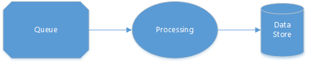
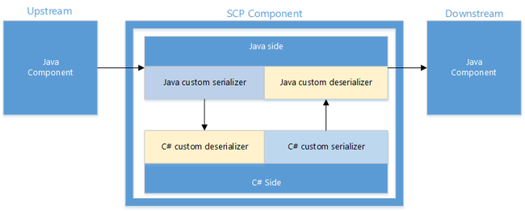

# SCP programming guide for Apache Storm in Azure HDInsight

SCP is a platform for building real time, reliable, consistent, and high-performance data processing applications. It's built on top of [Apache Storm](https://storm.incubator.apache.org/), which is a stream-processing system designed by open-source software communities. Storm is designed by Nathan Marz and was published as open source by Twitter. It leverages [Apache ZooKeeper](https://zookeeper.apache.org/), which is another Apache project to enable highly reliable distributed coordination and state management.

The SCP project has ported not only Storm on Windows but also project-added extensions and customization for the Windows ecosystem. The extensions include .NET developer experiences and libraries. The customization includes Windows-based deployment.

The extension and customization has been created in such a way that you don't need to fork the open-source software projects and can leverage derived ecosystems built on top of Storm.

## Processing model

The data in SCP is modeled as continuous streams of tuples. Typically the tuples:
1. Flow into a queue.
1. Are picked up and transformed by business logic hosted inside a Storm topology.
1. Either have their output piped as tuples to another SCP system or are committed to stores like distributed file systems and databases like SQL Server.



In Storm, an application topology defines a computation graph. Each node in a topology contains processing logic. Links between nodes indicate data flow.

Nodes that inject input data into the topology are called _spouts_. You can use them to sequence the data. The input data could come from a source like file logs, a transactional database, or a system performance counter.

Nodes that have both input and output data flows are called _bolts_. They perform the actual data filtering, selections, and aggregation.

SCP supports best efforts, at-least-once, and exactly once data processing.

In a distributed stream-processing application, various errors like a network outage, a machine failure, or an error in your code might happen during data processing. At-least-once processing ensures all data is processed at least once by automatically replaying the same data when an error happens.

At-least-once processing is simple and reliable, and it suits many applications. However, when an application requires exact counting, at-least-once processing is insufficient because the same data could be played in the application topology. In that case, exactly once processing makes sure the result is correct even when the data is replayed and processed multiple times.

SCP lets .NET developers create real-time data-process applications while using a Java Virtual Machine (JVM) with Storm. JVM and .NET communicate via TCP local sockets. Each spout/bolt is a .NET/Java process pair, where your logic runs in a .NET process as a plug-in.

To build a data processing application on top of SCP, follow these steps:

1. Design and implement the spouts to pull in data from queues.
1. Design and implement the bolts that process the input data and save it to external stores like a database.
1. Design the topology, then submit and run it.

The topology defines vertexes and the data that flows between them. SCP takes a topology specification and deploys it on a Storm cluster, where each vertex runs on one logical node. The Storm task scheduler takes care of the failover and scaling.

This article uses some simple examples to walk through how to build data processing applications with SCP.

## SCP plug-in interface

SCP plug-ins are standalone applications that can both run inside Visual Studio during development and be plugged in to the Storm pipeline after deployment in production

Writing an SCP plug-in is just the same as writing any other Windows console applications. The SCP.NET platform declares some interfaces for spout/bolt. Your plug-in code should implement these interfaces. The main purpose of this design is to let you focus on your business logic while letting the SCP.NET platform handle other things.

Your plug-in code should implement one of the followings interfaces. Which interface depends on whether the topology is transactional or nontransactional, and whether the component is a spout or a bolt.

* **ISCPSpout**
* **ISCPBolt**
* **ISCPTxSpout**
* **ISCPBatchBolt**

### ISCPPlugin

**ISCPPlugin** is the common interface for many plug-ins. Currently, it's a dummy interface.

```
public interface ISCPPlugin
{
}
```

### ISCPSpout

**ISCPSpout** is the interface for a nontransactional spout.

```
public interface ISCPSpout : ISCPPlugin
{
    void NextTuple(Dictionary<string, Object> parms);
    void Ack(long seqId, Dictionary<string, Object> parms); 
    void Fail(long seqId, Dictionary<string, Object> parms);
}
```

When **NextTuple** is called, your C# code can emit one or more tuples. If there's nothing to emit, this method should return without emitting anything.

The **NextTuple**, **Ack**, and **Fail** methods are all called in a tight loop in a single thread of a C# process. When there are no tuples to emit, you should have **NextTuple** sleep for a short amount of time (like 10 milliseconds) so as not to waste CPU availability.

The **Ack** and **Fail** methods are called only when the acknowledgment mechanism is enabled in a specification file. The *seqId* parameter identifies the tuple that is acknowledged or failed. If acknowledgment is enabled in a nontransactional topology, the following **Emit** function should be used in a spout:

```
public abstract void Emit(string streamId, List<object> values, long seqId);
```

If acknowledgment isn't supported in a nontransactional topology, **Ack** and **Fail** can be left as empty functions.

The *parms* input parameter in these functions specifies an empty dictionary and is reserved for future use.

### ISCPBolt

**ISCPBolt** is the interface for a nontransactional bolt.

```
public interface ISCPBolt : ISCPPlugin
{
void Execute(SCPTuple tuple);
}
```

When a new tuple is available, the **Execute** function is called to process it.

### ISCPTxSpout

**ISCPTxSpout** is the interface for a transactional spout.

```
public interface ISCPTxSpout : ISCPPlugin
{
    void NextTx(out long seqId, Dictionary<string, Object> parms);  
    void Ack(long seqId, Dictionary<string, Object> parms);         
    void Fail(long seqId, Dictionary<string, Object> parms);        
}
```

Just like their nontransactional counterparts, **NextTx**, **Ack**, and **Fail** are all called in a tight loop in a single thread of a C# process. When there are no tuples to emit, you should have **NextTx** sleep for a short amount of time (like 10 milliseconds) so as not to waste CPU availability.

When **NextTx** is called to start a new transaction, the output parameter *seqId* identifies the transaction. The transaction is also used in **Ack** and **Fail**. Your **NextTx** method can emit data to the Java side. The data is stored in ZooKeeper to support replay. Because the capacity of ZooKeeper is limited, your code should emit only metadata and not bulk data in a transactional spout.

Because Storm automatically replays a failed transaction, **Fail** usually shouldn't be called. But if SCP can check the metadata emitted by a transactional spout, it can call **Fail** when the metadata is invalid.

The *parms* input parameter in these functions specifies an empty dictionary and is reserved for future use.

### ISCPBatchBolt

**ISCPBatchBolt** is the interface for transactional bolt.

```
public interface ISCPBatchBolt : ISCPPlugin
{
    void Execute(SCPTuple tuple);
    void FinishBatch(Dictionary<string, Object> parms);  
}
```

The **Execute** method is called when there's new tuple arriving at the bolt. The **FinishBatch** method is called when this transaction has ended. The *parms* input parameter is reserved for future use.

For a transactional topology, **StormTxAttempt** is an important class. It has two fields: **TxId** and **AttemptId**.

The **TxId** field identifies a specific transaction. A transaction might be attempted multiple times if it fails and is replayed.

SCP.NET creates a new **ISCPBatchBolt** object to process each **StormTxAttempt** object, just like what Storm does in Java. This design's purpose is to support parallel transaction processing.

After a transaction attempt finishes, the corresponding **ISCPBatchBolt** object is destroyed and garbage collected.

## Object model

SCP.NET also provides a simple set of key objects for developers to program with. The objects are **Context**, **StateStore**, and **SCPRuntime**. They're discussed in this section.

### Context

The **Context** object provides a running environment to the application. Each **ISCPPlugin** instance of **ISCPSpout**, **ISCPBolt**, **ISCPTxSpout**, and **ISCPBatchBolt** has a corresponding **Context** instance. The functionality provided by **Context** is divided into two parts:

* The static part, which is available in the whole C# process
* The dynamic part, which is only available for the specific **Context** instance

#### Static part

```
public static ILogger Logger = null;
public static SCPPluginType pluginType;
public static Config Config { get; set; }
public static TopologyContext TopologyContext { get; set; }  
```

The **Logger** object is provided for logging purposes.

The **pluginType** object is used to indicate the plug-in type of the C# process. If the C# process is run in local test mode without Java, the plug-in type is **SCP_NET_LOCAL**.

```
public enum SCPPluginType 
{
    SCP_NET_LOCAL = 0,
    SCP_NET_SPOUT = 1,
    SCP_NET_BOLT = 2,
    SCP_NET_TX_SPOUT = 3,
    SCP_NET_BATCH_BOLT = 4  
    }
```

The **Config** property is provided to get configuration parameters from the Java side, which passes them when a C# plug-in is initialized. The **Config** parameters are divided into two parts: **stormConf** and **pluginConf**.

```
public Dictionary<string, Object> stormConf { get; set; }  
public Dictionary<string, Object> pluginConf { get; set; }  
```

The **stormConf** part is parameters defined by Storm, and the **pluginConf** part is the parameters defined by SCP. For example:

```
public class Constants
{
    … …

    // constant string for pluginConf
    public static readonly String NONTRANSACTIONAL_ENABLE_ACK = "nontransactional.ack.enabled";  

    // constant string for stormConf
    public static readonly String STORM_ZOOKEEPER_SERVERS = "storm.zookeeper.servers";
    public static readonly String STORM_ZOOKEEPER_PORT = "storm.zookeeper.port";
}
```

The **TopologyContext** type is provided to get the topology context. It's most useful for multiple parallel components. Here's an example:

```
//demo of how to get TopologyContext info
if (Context.pluginType != SCPPluginType.SCP_NET_LOCAL)
{
    Context.Logger.Info("TopologyContext info:");
    TopologyContext topologyContext = Context.TopologyContext;
    Context.Logger.Info("taskId: {0}", topologyContext.GetThisTaskId());
    taskIndex = topologyContext.GetThisTaskIndex();
    Context.Logger.Info("taskIndex: {0}", taskIndex);
    string componentId = topologyContext.GetThisComponentId();
    Context.Logger.Info("componentId: {0}", componentId);
    List<int> componentTasks = topologyContext.GetComponentTasks(componentId);  
    Context.Logger.Info("taskNum: {0}", componentTasks.Count);
}
```

#### Dynamic part

The following interfaces are pertinent to a certain **Context** instance. A **Context** instance is created by SCP.NET platform and passed to your code.

```
// Declare the output and input stream schemas

public void DeclareComponentSchema(ComponentStreamSchema schema);

// Emit tuple to default stream.
public abstract void Emit(List<object> values);

// Emit tuple to the specific stream.
public abstract void Emit(string streamId, List<object> values);  
```

For a nontransactional spout that supports acknowledgment, the following method is provided:

```
// for nontransactional spout that supports ack
public abstract void Emit(string streamId, List<object> values, long seqId);  
```

A nontransactional bolt that supports acknowledgment should explicitly call **Ack** or **Fail** with the tuple it received. And when emitting a new tuple, the bolt must also specify the anchors of the new tuple. The following methods are provided:

```
public abstract void Emit(string streamId, IEnumerable<SCPTuple> anchors, List<object> values);
public abstract void Ack(SCPTuple tuple);
public abstract void Fail(SCPTuple tuple);
```

### StateStore

The **StateStore** object provides metadata services, monotonic sequence generation, and wait-free coordination. Higher-level distributed concurrency abstractions can be built on **StateStore**. These abstractions include distributed locks, distributed queues, barriers, and transaction services.

SCP applications can use the **State** object to serialize some information in [Apache ZooKeeper](https://zookeeper.apache.org/), especially for a transactional topology. If a transactional spout crashes and restarts, **State** can retrieve the necessary information from ZooKeeper and restart the pipeline.

The **StateStore** object has these principal methods:

```
/// <summary>
/// Static method to retrieve a state store of the given path and connStr 
/// </summary>
/// <param name="storePath">StateStore path</param>
/// <param name="connStr">StateStore address</param>
/// <returns>Instance of StateStore</returns>
public static StateStore Get(string storePath, string connStr);

/// <summary>
/// Create a new state object in this state store instance
/// </summary>
/// <returns>State from StateStore</returns>
public State Create();

/// <summary>
/// Retrieve all states that were previously uncommitted, excluding all exited states 
/// </summary>
/// <returns>Uncommitted states</returns>
public IEnumerable<State> GetUnCommitted();

/// <summary>
/// Get all the states in the StateStore
/// </summary>
/// <returns>All the states</returns>
public IEnumerable<State> States();

/// <summary>
/// Get state or registry object
/// </summary>
/// <param name="info">Registry name(registry only)</param>
/// <typeparam name="T">type, registry or state</typeparam>
/// <returns>Return registry or state</returns>
public T Get<T>(string info = null);

/// <summary>
/// List all the committed states
/// </summary>
/// <returns>Registries containing the committed state </returns>
public IEnumerable<Registry> Committed();

/// <summary>
/// List all the exited states in the StateStore
/// </summary>
/// <returns>Registries containing the exited states</returns>
public IEnumerable<Registry> Aborted();

/// <summary>
/// Retrieve an existing state object from this state store instance 
/// </summary>
/// <returns>State from StateStore</returns>
/// <typeparam name="T">stateId, id of the State</typeparam>
public State GetState(long stateId)
```

The **State** object has these principal methods:

```
/// <summary>
/// Set the status of the state object to commit
/// </summary>
public void Commit(bool simpleMode = true);

/// <summary>
/// Set the status of the state object to exit
/// </summary>
public void Abort();

/// <summary>
/// Put an attribute value under the given key
/// </summary>
/// <param name="key">Key</param>
/// <param name="attribute">State attribute</param>
    public void PutAttribute<T>(string key, T attribute);

/// <summary>
/// Get the attribute value associated with the given key
/// </summary>
/// <param name="key">Key</param>
/// <returns>State attribute</returns>
    public T GetAttribute<T>(string key);
```

When **simpleMode** is set to **true**, the **Commit** method deletes the corresponding ZNode in ZooKeeper. Otherwise, it deletes the current ZNode and adds a new node in the COMMITTED\_PATH.

### SCPRuntime

SCPRuntime provides the following two methods:

```
public static void Initialize();

public static void LaunchPlugin(newSCPPlugin createDelegate);  
```

The **Initialize** method initializes the SCP runtime environment. In this method, the C# process connects to the Java side to get configuration parameters and topology context.

The **LaunchPlugin** method starts the message-processing loop. In this loop, the C# plug-in receives messages from the Java side, including tuples and control signals. It then processes the messages, perhaps by calling the interface method provided by your code. The input parameter for **LaunchPlugin** is a delegate. It can return an object that implements any of the **ISCPSpout**, **IScpBolt**, **ISCPTxSpout**, and **ISCPBatchBolt** interfaces.

```
public delegate ISCPPlugin newSCPPlugin(Context ctx, Dictionary<string, Object> parms);
```

For **ISCPBatchBolt**, you can get a **StormTxAttempt** object from *parms* and use it to judge whether the attempt is a replayed attempt. The check for a replay attempt is often done at the commit bolt. The **HelloWorldTx** example later in this article demonstrates this check.

SCP plug-ins can usually run in two modes.

#### Local test mode

In this mode, the SCP plug-ins in your C# code run inside Visual Studio during the development phase. You can use the **ILocalContext** interface in this mode. The interface provides methods to serialize the emitted tuples to local files and read them back to memory.

```
public interface ILocalContext
{
    List<SCPTuple> RecvFromMsgQueue();
    void WriteMsgQueueToFile(string filepath, bool append = false);  
    void ReadFromFileToMsgQueue(string filepath);
}
```

#### Regular Mode

In this mode, the Storm Java process runs the SCP plug-ins. Here is an example of running the SCP plug-in:

```
namespace Scp.App.HelloWorld
{
public class Generator : ISCPSpout
{
    … …
    public static Generator Get(Context ctx, Dictionary<string, Object> parms)
    {
    return new Generator(ctx);
    }
}

class HelloWorld
{
    static void Main(string[] args)
    {
    /* Setting the environment variable here can change the log file name */
    System.Environment.SetEnvironmentVariable("microsoft.scp.logPrefix", "HelloWorld");

    SCPRuntime.Initialize();
    SCPRuntime.LaunchPlugin(new newSCPPlugin(Generator.Get));
    }
}
}
```

## Topology specification language

SCP topology specification is a domain-specific language (DSL) for describing and configuring SCP topologies. It's based on [Storm’s Clojure DSL](https://storm.incubator.apache.org/documentation/Clojure-DSL.html) and is extended by SCP.

Topology specifications can be submitted directly to a Storm cluster for execution via the **runSpec** command.

SCP.NET has added the following functions to define transactional topologies:

| New function | Parameter | Description |
| --- | --- | --- |
| **tx-topolopy** | *topology-name*<br />*spout-map*<br />*bolt-map* |Defines a transactional topology with the topology name, spouts definition map, and bolts definition map. |
| **scp-tx-spout** |*exec-name*<br />*args*<br />*fields* |Defines a transactional spout. The function runs the application specified by *exec-name* using *args*.<br /><br />The *fields* parameter specifies the output fields for the spout. |
| **scp-tx-batch-bolt** |*exec-name*<br />*args*<br />*fields* |Defines a transactional batch bolt. The function runs the application specified by *exec-name* using *args.*<br /><br />The *fields* parameter specifies the output fields for the bolt. |
| **scp-tx-commit-bolt** |*exec-name*<br />*args*<br />*fields* |Defines a transactional commit bolt. The function runs the application specified by *exec-name* using *args*.<br /><br />The *fields* parameter specifies the output fields for the bolt. |
| **nontx-topology** |*topology-name*<br />*spout-map*<br />*bolt-map* |Defines a nontransactional topology with the topology name, spouts definition map, and bolts definition map. |
| **scp-spout** |*exec-name*<br />*args*<br />*fields*<br />*parameters* |Defines a nontransactional spout. The function runs the application specified by *exec-name* using *args*.<br /><br />The *fields* parameter specifies the output fields for the spout<br /><br />The *parameters* parameter is optional. Use it to specify parameters like "nontransactional.ack.enabled". |
| **scp-bolt** |*exec-name*<br />*args*<br />*fields*<br />*parameters* |Defines a nontransactional bolt. The function runs the application specified by *exec-name* using *args*.<br /><br />The *fields* parameter specifies the output fields for the bolt<br /><br />The *parameters* parameter is optional. Use it to specify parameters like "nontransactional.ack.enabled". |

SCP.NET defines the following keywords:

| Keyword | Description |
| --- | --- |
| :name |The topology name |
| :topology |The topology using the functions in the previous table and built-in functions |
| :p |The parallelism hint for each spout or bolt |
| :config |Whether to configure parameters or update the existing ones |
| :schema |The schema of the stream |

SCP.NET also defines these frequently used parameters:

| Parameter | Description |
| --- | --- |
| "plugin.name" |The .exe file name of the C# plug-in |
| "plugin.args" |The plug-in arguments |
| "output.schema" |The output schema |
| "nontransactional.ack.enabled" |Whether acknowledgment is enabled for a nontransactional topology |

The **runSpec** command is deployed together with the bits. The command usage is as follows:

```
.\bin\runSpec.cmd
usage: runSpec [spec-file target-dir [resource-dir] [-cp classpath]]
ex: runSpec examples\HelloWorld\HelloWorld.spec specs examples\HelloWorld\Target
```

The *resource-dir* parameter is optional. You need to specify it when you want to plug in a C# application. The specified directory contains the application, the dependencies, and the configurations.

The *classpath* parameter is also optional. It specifies the Java classpath if the specification file contains a Java spout or bolt.

## Miscellaneous features

### Input and output schema declarations

Your C# processes can emit tuples. To do so, the platform serializes tuples into **byte[]** objects and transfers the objects to the Java side. Storm then transfers these tuples to the targets.

In downstream components, C# processes receive tuples back from the Java side and convert them to the platform's original types. All of these operations are hidden by the platform.

To support serialization and deserialization, your code needs to declare the schema of the input and output. The schema is defined as a dictionary. A dictionary key is a stream ID. The corresponding value is the types of the columns. Components can declare multiple streams.

```
public class ComponentStreamSchema
{
    public Dictionary<string, List<Type>> InputStreamSchema { get; set; }
    public Dictionary<string, List<Type>> OutputStreamSchema { get; set; }
    public ComponentStreamSchema(Dictionary<string, List<Type>> input, Dictionary<string, List<Type>> output)
    {
        InputStreamSchema = input;
        OutputStreamSchema = output;
    }
}
```

The following function is added to a **Context** object:

```
public void DeclareComponentSchema(ComponentStreamSchema schema)
```

Developers must ensure that the emitted tuples obey the schema defined for a stream. Otherwise, the system will throw a runtime exception.

### Multistream support

SCP lets your code emit to or receive from multiple distinct streams at the same time. This support is reflected in the **Context** object as an optional stream ID parameter in the **Emit** method.

Two methods in the SCP.NET **Context** object have been added. They emit one or more tuples to specific streams. The *streamId* parameter is a string. It's value must be consistent between both C# code and a topology-definition specification.

```
/* Emit tuple to the specific stream. */
public abstract void Emit(string streamId, List<object> values);

/* for nontransactional spout only */
public abstract void Emit(string streamId, List<object> values, long seqId);
```

Emitting to a nonexistent stream causes runtime exceptions.

### Fields grouping

The built-in fields grouping in Storm doesn't work properly in SCP.NET. On the Java proxy side, the data type of all fields is actually **byte[]**. The fields grouping uses the **byte[]** object's hash code to perform the grouping. The hash code is the address of this object in memory. So the grouping will be wrong for two-byte objects that share the same content but not the same address.

SCP.NET adds a customized grouping method, and it uses the content of the **byte[]** object to do the grouping. In a specification file, the syntax looks like:

```
(bolt-spec
    {
        "spout_test" (scp-field-group :non-tx [0,1])
    }
    …
)
```

In this specification file:

* `scp-field-group` means "Customized field grouping implemented by SCP."
* `:tx` or `:non-tx` specifies whether the topology is transactional. We need this information since the starting index is different in tx vs. non-tx topologies.
* `[0,1]` means a hash set of field IDs, starting from 0.

### Hybrid topology

The native Storm code is written in Java. SCP.NET has enhanced Storm to let developers write C# code to handle their business logic. But SCP.NET also supports hybrid topologies, which contain not only C# spouts/bolts but also Java Spout/Bolts.

### Specify Java spout/bolt in a specification file

You can use **scp-spout** and **scp-bolt** in a specification file to specify Java spouts and bolts. Here is an example:

```
(spout-spec 
  (microsoft.scp.example.HybridTopology.Generator.)
  :p 1)
```

Here `microsoft.scp.example.HybridTopology.Generator` is the name of the Java spout class.

### Specify the Java classpath in a runSpec command

If you want to submit topology that contains Java spouts or bolts, you need to first compile the Java spouts or bolts to produce JAR files. Then you should specify the java classpath that contains the JAR files when submitting topology. Here is an example:

```
bin\runSpec.cmd examples\HybridTopology\HybridTopology.spec specs examples\HybridTopology\net\Target -cp examples\HybridTopology\java\target\*
```

Here, **examples\\HybridTopology\\java\\target\\** is the folder containing the Java spout/bolt JAR file.

### Serialization and deserialization between Java and C#

An SCP component includes a Java side and a C# side. To interact with native Java spouts/bolts, serializationand deserialization must occur between the Java side and the C# side, as illustrated in the following graph:



#### Serialization in the Java side and deserialization in the C# side

First you provide a default implementation for serialization in the Java side and deserialization in the C# side. The serialization method in the Java side can be specified in a specification file.

```
(scp-bolt
    {
        "plugin.name" "HybridTopology.exe"
        "plugin.args" ["displayer"]
        "output.schema" {}
        "customized.java.serializer" ["microsoft.scp.storm.multilang.CustomizedInteropJSONSerializer"]
    })
```

The deserialization method in the C# side should be specified in C# user code.

```
Dictionary<string, List<Type>> inputSchema = new Dictionary<string, List<Type>>();
inputSchema.Add("default", new List<Type>() { typeof(Person) });
this.ctx.DeclareComponentSchema(new ComponentStreamSchema(inputSchema, null));
this.ctx.DeclareCustomizedDeserializer(new CustomizedInteropJSONDeserializer());
```  

If the data type isn't too complex, this default implementation should handle most cases. Here are cases where you can plug in your own implementation:

* Your data type is too complex.
* The performance of your default implementation doesn't meet  your requirements.

The serialization interface in the Java side is defined as:

```
public interface ICustomizedInteropJavaSerializer {
    public void prepare(String[] args);
    public List<ByteBuffer> serialize(List<Object> objectList);
}
```

The deserialization interface in the C# side is defined as:

```
public interface ICustomizedInteropCSharpDeserializer
{
    List<Object> Deserialize(List<byte[]> dataList, List<Type> targetTypes);
}
```

#### Serialization in the C# side and deserialization in the Java side

The serialization method in the C# side should be specified in your C# code.

```
this.ctx.DeclareCustomizedSerializer(new CustomizedInteropJSONSerializer()); 
```

The Deserialization method in Java side should be specified in a specification file.

```
(scp-spout
   {
     "plugin.name" "HybridTopology.exe"
     "plugin.args" ["generator"]
     "output.schema" {"default" ["person"]}
     "customized.java.deserializer" ["microsoft.scp.storm.multilang.CustomizedInteropJSONDeserializer" "microsoft.scp.example.HybridTopology.Person"]
   }
)
```

Here, `"microsoft.scp.storm.multilang.CustomizedInteropJSONDeserializer"` is the name of the deserializer, and `"microsoft.scp.example.HybridTopology.Person"` is the target class the data is deserialized to.

You can also plug in you own implementation of a C# serializer and a Java deserializer. This code is the interface for the C# serializer:

```
public interface ICustomizedInteropCSharpSerializer
{
    List<byte[]> Serialize(List<object> dataList);
}
```

This code is the interface for the Java deserializer:

```
public interface ICustomizedInteropJavaDeserializer {
    public void prepare(String[] targetClassNames);
    public List<Object> Deserialize(List<ByteBuffer> dataList);
}
```

## SCP host mode

In SCP host mode, you can compile your code as a DLL and use SCPHost.exe as provided by SCP to submit a topology. A specification file looks like this code:

```
(scp-spout
  {
    "plugin.name" "SCPHost.exe"
    "plugin.args" ["HelloWorld.dll" "Scp.App.HelloWorld.Generator" "Get"]
    "output.schema" {"default" ["sentence"]}
  })
```

Here, `plugin.name` is specified as `SCPHost.exe`, which is provided by the SCP SDK. SCPHost.exe accepts three parameters in this order:

1. The DLL name, which is `"HelloWorld.dll"` in this example.
1. The class name, which is `"Scp.App.HelloWorld.Generator"` in this example.
1. The name of a public static method, which can be invoked to get an instance of **ISCPPlugin**.

In host mode, your code is compiled as DLL and is invoked by the SCP platform. Because the SCP platform can get full control of the whole processing logic, we recommend that you submit topology in SCP host mode. Doing so simplifies the development experience and also brings you more flexibility and better backward compatibility for later releases.

## SCP programming examples

### HelloWorld

The following simple HelloWorld example shows a taste of SCP.NET. It uses a nontransactional topology with a spout called **generator** and two bolts called **splitter** and **counter**. The **generator** spout randomly generates sentences and emit these sentences to **splitter**. The  **splitter** bolt splits the sentences into words and emits these words to the **counter** bolt. The **counter** bolt uses a dictionary to record the occurrence of each word.

This example has two specification files: HelloWorld.spec and HelloWorld\_EnableAck.spec. The C# code can find out whether acknowledgment is enabled by getting the **pluginConf** object from the Java side.

```
/* demo how to get pluginConf info */
if (Context.Config.pluginConf.ContainsKey(Constants.NONTRANSACTIONAL_ENABLE_ACK))
{
    enableAck = (bool)(Context.Config.pluginConf[Constants.NONTRANSACTIONAL_ENABLE_ACK]);
}
Context.Logger.Info("enableAck: {0}", enableAck);
```

If acknowledgment is enabled in the spout, a dictionary caches the tuples that haven't been acknowledged. If `Fail` is called, the failed tuple is replayed.

```
public void Fail(long seqId, Dictionary<string, Object> parms)
{
    Context.Logger.Info("Fail, seqId: {0}", seqId);
    if (cachedTuples.ContainsKey(seqId))
    {
        /* get the cached tuple */
        string sentence = cachedTuples[seqId];

        /* replay the failed tuple */
        Context.Logger.Info("Re-Emit: {0}, seqId: {1}", sentence, seqId);
        this.ctx.Emit(Constants.DEFAULT_STREAM_ID, new Values(sentence), seqId);
    }
    else
    {
        Context.Logger.Warn("Fail(), can't find cached tuple for seqId {0}!", seqId);
    }
}
```

### HelloWorldTx

The following HelloWorldTx example demonstrates how to implement transactional topology. It has one spout called **generator**, a batch bolt called **partial-count**, and a commit bolt called **count-sum**. It  also has three existing text files: DataSource0.txt, DataSource1.txt, and DataSource2.txt.

In each transaction, the **generator** spout randomly selects two files from the existing three files and emits the corresponding two file names to the **partial-count** bolt. The  **partial-count** bolt:

1. Gets a file name from the received tuple.
1. Opens the corresponding file.
1. Counts the number of words in the file.
1. Emits the word count to the **count-sum** bolt.

The **count-sum** bolt summarizes the total count.

To achieve exactly once semantics, the **count-sum** commit bolt needs to judge whether it's a replayed transaction. In this example, it has the static member variable:

```
public static long lastCommittedTxId = -1; 
```

When an **ISCPBatchBolt** instance is created, it gets the value of `txAttempt` from input parameters.

```
public static CountSum Get(Context ctx, Dictionary<string, Object> parms)
{
    /* for transactional topology, we can get txAttempt from the input parms */
    if (parms.ContainsKey(Constants.STORM_TX_ATTEMPT))
    {
        StormTxAttempt txAttempt = (StormTxAttempt)parms[Constants.STORM_TX_ATTEMPT];
        return new CountSum(ctx, txAttempt);
    }
    else
    {
        throw new Exception("null txAttempt");
    }
}
```

When `FinishBatch` is called, `lastCommittedTxId` is updated if it isn't a replayed transaction.

```
public void FinishBatch(Dictionary<string, Object> parms)
{
    /* judge whether it is a replayed transaction */
    bool replay = (this.txAttempt.TxId <= lastCommittedTxId);

    if (!replay)
    {
        /* If it is not replayed, update the totalCount and lastCommittedTxId value */
        totalCount = totalCount + this.count;
        lastCommittedTxId = this.txAttempt.TxId;
    }
    … …
}
```

### HybridTopology

This topology contains a Java spout and a C# bolt. It uses the default serialization and deserialization implementation provided by the SCP platform. See the file HybridTopology.spec in the examples\\HybridTopology folder for the specification file details. Also see SubmitTopology.bat for how to specify the Java classpath.

### SCPHostDemo

This example is the same as HelloWorld in essence. The only difference is that your code is compiled as a DLL and the topology is submitted by using SCPHost.exe. See the SCP host mode section for a more detailed explanation.

## Next steps

For examples of Apache Storm topologies created using SCP, see the following articles:

* [Develop C# topologies for Apache Storm on HDInsight using Visual Studio](apache-storm-develop-csharp-visual-studio-topology.md)
* [Process events from Azure Event Hubs with Apache Storm on HDInsight](apache-storm-develop-csharp-event-hub-topology.md)
* [Process vehicle sensor data from Event Hubs using Apache Storm on HDInsight](https://github.com/hdinsight/hdinsight-storm-examples/tree/master/IotExample)
* [Extract, Transform, and Load (ETL) from Azure Event Hubs to Apache HBase](https://github.com/hdinsight/hdinsight-storm-examples/blob/master/RealTimeETLExample)
