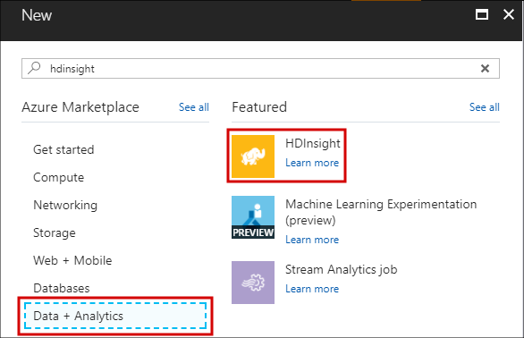
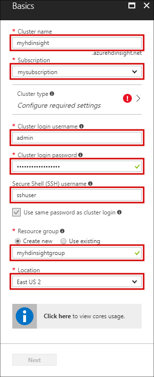
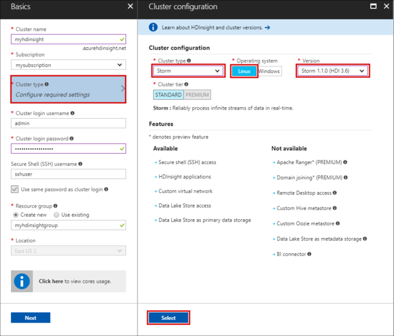
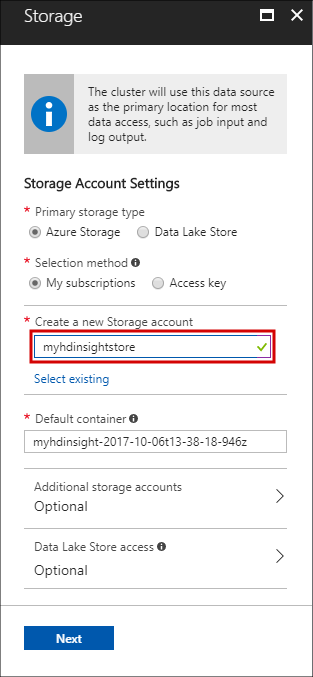
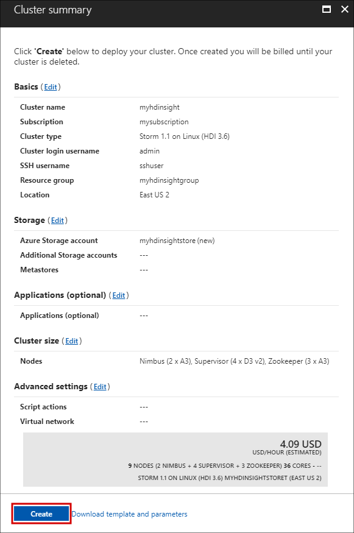
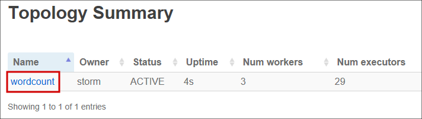

# Get started with Apache Storm on HDInsight using the storm-starter examples

Learn how to use Apache Storm in HDInsight using the storm-starter examples.

Apache Storm is a scalable, fault-tolerant, distributed, real-time computation system for processing streams of data. With Storm on Azure HDInsight, you can create a cloud-based Storm cluster that performs big data analytics in real time.

> [!IMPORTANT]
> Linux is the only operating system used on HDInsight version 3.4 or greater. For more information, see [HDInsight retirement on Windows](../hdinsight-component-versioning.md#hdinsight-windows-retirement).

## Prerequisites

[!INCLUDE [delete-cluster-warning](../../../includes/hdinsight-delete-cluster-warning.md)]

* **An Azure subscription**. See [Get Azure free trial](https://azure.microsoft.com/documentation/videos/get-azure-free-trial-for-testing-hadoop-in-hdinsight/).

* **Familiarity with SSH and SCP**. For information, see [Use SSH with HDInsight](../hdinsight-hadoop-linux-use-ssh-unix.md).

## Create a Storm cluster

Use the following steps to create a Storm on HDInsight cluster:

1. From the [Azure portal](https://portal.azure.com), select **+ Create a resource**, **Data + Analytics**, and then select **HDInsight**.

    

2. From the **Basics** section, enter the following information:

    * **Cluster Name**: The name of the HDInsight cluster.
    * **Subscription**: Select the subscription to use.
    * **Cluster login username** and **Cluster login password**: The login when accessing the cluster over HTTPS. You use these credentials to access services such as the Ambari Web UI or REST API.
    * **Secure Shell (SSH) username**: The login used when accessing the cluster over SSH. By default the password is the same as the cluster login password.
    * **Resource Group**: The resource group to create the cluster in.
    * **Location**: The Azure region to create the cluster in.

   

3. Select **Cluster type**, and then set the following values in the **Cluster configuration** section:

    * **Cluster Type**: Storm

    * **Operating system**: Linux

    * **Version**: Storm 1.1.0 (HDI 3.6)

   Finally, use the **Select** button to save settings.

    

4. After selecting the cluster type, use the __Select__ button to set the cluster type. Next, use the __Next__ button to finish basic configuration.

5. From the **Storage** section, select or create a Storage account. For the steps in this document, leave the other fields in this section at the default values. Use the __Next__ button to save storage configuration. For more information on using Data Lake Storage Gen2, see [Quickstart: Set up clusters in HDInsight](../../storage/data-lake-storage/quickstart-create-connect-hdi-cluster.md).

    

6. From the **Summary** section, review the configuration for the cluster. Use the __Edit__ links to change any settings that are incorrect. Finally, use the __Create__ button to create the cluster.

    

    > [!NOTE]
    > It can take up to 20 minutes to create the cluster.

## Run a storm-starter sample on HDInsight

1. Connect to the HDInsight cluster using SSH:

        ssh USERNAME@CLUSTERNAME-ssh.azurehdinsight.net

    > [!TIP]
    > Your SSH client may say that the authenticity of the host can't be established. If so, enter `yes` to continue.

    > [!NOTE]
    > If you used a password to secure your SSH user account, you are prompted to enter it. If you used a public key, you may need to use the `-i` parameter to specify the matching private key. For example, `ssh -i ~/.ssh/id_rsa USERNAME@CLUSTERNAME-ssh.azurehdinsight.net`.

    For information, see [Use SSH with HDInsight](../hdinsight-hadoop-linux-use-ssh-unix.md).

2. Use the following command to start an example topology:

        storm jar /usr/hdp/current/storm-client/contrib/storm-starter/storm-starter-topologies-*.jar org.apache.storm.starter.WordCountTopology wordcount

    This command starts the example WordCount topology on the cluster. This topology generates random sentences and counts how many times words occur. The friendly name of the topology is `wordcount`.

    > [!NOTE]
    > When submitting your own topologies to the cluster, you must first copy the jar file containing the cluster before using the `storm` command. Use the `scp` command to copy the file. For example, `scp FILENAME.jar USERNAME@CLUSTERNAME-ssh.azurehdinsight.net:FILENAME.jar`
    >
    > The WordCount example, and other storm-starter examples, are already included on your cluster at `/usr/hdp/current/storm-client/contrib/storm-starter/`.

If you are interested in viewing the source for the storm-starter examples, you can find the code at [https://github.com/apache/storm/tree/1.1.x-branch/examples/storm-starter](https://github.com/apache/storm/tree/1.1.x-branch/examples/storm-starter). This link is for Storm 1.1.x, which is provided with HDInsight 3.6. For other versions of Storm, use the __Branch__ button at the top of the page to select a different Storm version.

## Monitor the topology

The Storm UI provides a web interface for working with running topologies, and is included on your HDInsight cluster.

Use the following steps to monitor the topology using the Storm UI:

1. To display the Storm UI, open a web browser to `https://CLUSTERNAME.azurehdinsight.net/stormui`. Replace **CLUSTERNAME** with the name of your cluster.

    > [!NOTE]
    > If asked to provide a user name and password, enter the cluster administrator (admin) and password that you used when creating the cluster.

2. Under **Topology summary**, select the **wordcount** entry in the **Name** column. Information about the topology is displayed.

    

    This page provides the following information:

    * **Topology stats** - Basic information on the topology performance, organized into time windows.

        > [!NOTE]
        > Selecting a specific time window changes the time window for information displayed in other sections of the page.

    * **Spouts** - Basic information about spouts, including the last error returned by each spout.

    * **Bolts** - Basic information about bolts.

    * **Topology configuration** - Detailed information about the topology configuration.

    This page also provides actions that can be taken on the topology:

    * **Activate** - Resumes processing of a deactivated topology.

    * **Deactivate** - Pauses a running topology.

    * **Rebalance** - Adjusts the parallelism of the topology. You should rebalance running topologies after you have changed the number of nodes in the cluster. Rebalancing adjusts parallelism to compensate for the increased/decreased number of nodes in the cluster. For more information, see [Understanding the parallelism of a Storm topology](http://storm.apache.org/documentation/Understanding-the-parallelism-of-a-Storm-topology.html).

    * **Kill** - Terminates a Storm topology after the specified timeout.

3. From this page, select an entry from the **Spouts** or **Bolts** section. Information about the selected component is displayed.

    

    This page displays the following information:

    * **Spout/Bolt stats** - Basic information on the component performance, organized into time windows.

        > [!NOTE]
        > Selecting a specific time window changes the time window for information displayed in other sections of the page.

    * **Input stats** (bolt only) - Information on components that produce data consumed by the bolt.

    * **Output stats** - Information on data emitted by this bolt.

    * **Executors** - Information on instances of this component.

    * **Errors** - Errors produced by this component.

4. When viewing the details of a spout or bolt, select an entry from the **Port** column in the **Executors** section to view details for a specific instance of the component.

        2015-01-27 14:18:02 b.s.d.task [INFO] Emitting: split default ["with"]
        2015-01-27 14:18:02 b.s.d.task [INFO] Emitting: split default ["nature"]
        2015-01-27 14:18:02 b.s.d.executor [INFO] Processing received message source: split:21, stream: default, id: {}, [snow]
        2015-01-27 14:18:02 b.s.d.task [INFO] Emitting: count default [snow, 747293]
        2015-01-27 14:18:02 b.s.d.executor [INFO] Processing received message source: split:21, stream: default, id: {}, [white]
        2015-01-27 14:18:02 b.s.d.task [INFO] Emitting: count default [white, 747293]
        2015-01-27 14:18:02 b.s.d.executor [INFO] Processing received message source: split:21, stream: default, id: {}, [seven]
        2015-01-27 14:18:02 b.s.d.task [INFO] Emitting: count default [seven, 1493957]

    In this example, the word **seven** has occurred 1493957 times. This count is how many times the word has been encountered since this topology was started.

## Stop the topology

Return to the **Topology summary** page for the word-count topology, and then select the **Kill** button from the **Topology actions** section. When prompted, enter 10 for the seconds to wait before stopping the topology. After the timeout period, the topology no longer appears when you visit the **Storm UI** section of the dashboard.

## Delete the cluster

[!INCLUDE [delete-cluster-warning](../../../includes/hdinsight-delete-cluster-warning.md)]

If you run into an issue with creating HDInsight cluster, see [access control requirements](../hdinsight-administer-use-portal-linux.md#create-clusters).

## Next steps

In this Apache Storm tutorial, you learned the basics of working with Storm on HDInsight. Next, learn how to [Develop Java-based topologies using Maven](apache-storm-develop-java-topology.md).

If you're already familiar with developing Java-based topologies, see the [Deploy and manage Apache Storm topologies on HDInsight](apache-storm-deploy-monitor-topology-linux.md) document.

If you are a .NET developer, you can create C# or hybrid C#/Java topologies using Visual Studio. For more information, see [Develop C# topologies for Apache Storm on HDInsight using Hadoop tools for Visual Studio](apache-storm-develop-csharp-visual-studio-topology.md).

For example topologies that can be used with Storm on HDInsight, see the following examples:

* [Example topologies for Storm on HDInsight](apache-storm-example-topology.md)

[apachestorm]: https://storm.incubator.apache.org
[stormdocs]: http://storm.incubator.apache.org/documentation/Documentation.html
[stormstarter]: https://github.com/apache/storm/tree/master/examples/storm-starter
[stormjavadocs]: https://storm.incubator.apache.org/apidocs/
[hdinsight-provision]: hdinsight-hadoop-provision-linux-clusters.md
[preview-portal]: https://portal.azure.com/
