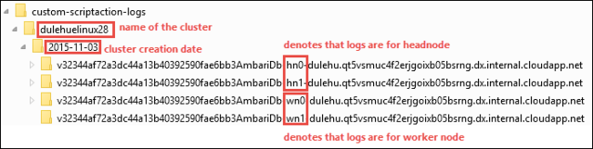

# Troubleshoot script actions in Azure HDInsight

This article describes troubleshooting steps and possible resolutions for issues when interacting with Azure HDInsight clusters.

## Viewing logs

You can use the Apache Ambari web UI to view information logged by script actions. If the script fails during cluster creation, logs are in the default cluster storage account. This section provides information on how to retrieve the logs by using both these options.

### Apache Ambari web UI

1. From a web browser, navigate to `https://CLUSTERNAME.azurehdinsight.net`, where `CLUSTERNAME` is the name of your cluster.

1. From the bar at the top of the page, select the **ops** entry. A list displays current and previous operations done on the cluster through Ambari.

    

1. Find the entries that have **run\_customscriptaction** in the **Operations** column. These entries are created when the script actions run.

    

    To view the **STDOUT** and **STDERR** output, select the **run\customscriptaction** entry and drill down through the links. This output is generated when the script runs and might have useful information.

### Default storage account

If cluster creation fails because of a script error, the logs are kept in the cluster storage account.

* The storage logs are available at `\STORAGE_ACCOUNT_NAME\DEFAULT_CONTAINER_NAME\custom-scriptaction-logs\CLUSTER_NAME\DATE`.

    

    Under this directory, the logs are organized separately for **headnode**, **worker node**, and **zookeeper node**. See the following examples:

    * **Headnode**: `<ACTIVE-HEADNODE-NAME>.cloudapp.net`

    * **Worker node**: `<ACTIVE-WORKERNODE-NAME>.cloudapp.net`

    * **Zookeeper node**: `<ACTIVE-ZOOKEEPERNODE-NAME>.cloudapp.net`

* All **stdout** and **stderr** of the corresponding host is uploaded to the storage account. There's one **output-\*.txt** and **errors-\*.txt** for each script action. The **output-*.txt** file contains information about the URI of the script that was run on the host. The following text is an example of this information:

        'Start downloading script locally: ', u'https://hdiconfigactions.blob.core.windows.net/linuxrconfigactionv01/r-installer-v01.sh'

* It's possible that you repeatedly create a script action cluster with the same name. In that case, you can distinguish the relevant logs based on the **DATE** folder name. For example, the folder structure for a cluster, **mycluster**, created on different dates appears similar to the following log entries:

    `\STORAGE_ACCOUNT_NAME\DEFAULT_CONTAINER_NAME\custom-scriptaction-logs\mycluster\2015-10-04`
    `\STORAGE_ACCOUNT_NAME\DEFAULT_CONTAINER_NAME\custom-scriptaction-logs\mycluster\2015-10-05`

* If you create a script action cluster with the same name on the same day, you can use the unique prefix to identify the relevant log files.

* If you create a cluster near 12:00 AM, midnight, it's possible that the log files span across two days. In that case, you see two different date folders for the same cluster.

* Uploading log files to the default container can take up to five minutes, especially for large clusters. So if you want to access the logs, you shouldn't immediately delete the cluster if a script action fails.

## Ambari watchdog

Don't change the password for the Ambari watchdog, hdinsightwatchdog, on your Linux-based HDInsight cluster. A password change breaks the ability to run new script actions on the HDInsight cluster.

## Can't import name BlobService

__Symptoms__. The script action fails. Text similar to the following error displays when you view the operation in Ambari:

```
Traceback (most recent call list):
  File "/var/lib/ambari-agent/cache/custom_actions/scripts/run_customscriptaction.py", line 21, in <module>
    from azure.storage.blob import BlobService
ImportError: cannot import name BlobService
```

__Cause__. This error occurs if you upgrade the Python Azure Storage client that's included with the HDInsight cluster. HDInsight expects Azure Storage client 0.20.0.

__Resolution__. To resolve this error, manually connect to each cluster node by using `ssh`. Run the following command to reinstall the correct storage client version:

```bash
sudo pip install azure-storage==0.20.0
```

For information on connecting to the cluster with SSH, see [Connect to HDInsight (Apache Hadoop) by using SSH](hdinsight-hadoop-linux-use-ssh-unix.md).

## History doesn't show the scripts used during cluster creation

If your cluster was created before March 15, 2016, you might not see an entry in script action history. Resizing the cluster causes the scripts to appear in script action history.

There are two exceptions:

* Your cluster was created before September 1, 2015. This date is when script actions were introduced. Any cluster created before this date couldn't have used script actions for cluster creation.

* You used multiple script actions during cluster creation. Or you used the same name for multiple scripts or the same name, same URI, but different parameters for multiple scripts. In these cases, you get the following error:

    ```
    No new script actions can be run on this cluster because of conflicting script names in existing scripts. Script names provided at cluster creation must be all unique. Existing scripts are run on resize.
    ```

## Next steps

If you didn't see your problem or are unable to solve your issue, visit one of the following channels for more support:

* Get answers from Azure experts through [Azure Community Support](https://azure.microsoft.com/support/community/).

* Connect with [@AzureSupport](https://twitter.com/azuresupport) - the official Microsoft Azure account for improving customer experience. Connecting the Azure community to the right resources: answers, support, and experts.

* If you need more help, you can submit a support request from the [Azure portal](https://portal.azure.com/?#blade/Microsoft_Azure_Support/HelpAndSupportBlade/). Select **Support** from the menu bar or open the **Help + support** hub. For more detailed information, review [How to create an Azure support request](https://docs.microsoft.com/azure/azure-portal/supportability/how-to-create-azure-support-request). Access to Subscription Management and billing support is included with your Microsoft Azure subscription, and Technical Support is provided through one of the [Azure Support Plans](https://azure.microsoft.com/support/plans/).