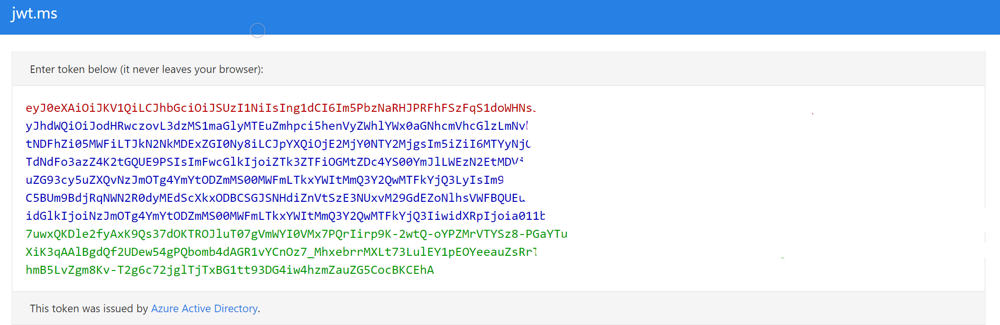

# Authentication & Authorization for the Healthcare APIs (preview)

> [!IMPORTANT]
> Azure Healthcare APIs is currently in PREVIEW. The [Supplemental Terms of Use for Microsoft Azure Previews](https://azure.microsoft.com/support/legal/preview-supplemental-terms/) include additional legal terms that apply to Azure features that are in beta, preview, or otherwise not yet released into general availability.

This article provides an overview of the authentication and authorization process for accessing the Healthcare APIs services.

## Authentication

The Healthcare APIs is a collection of secured managed services using [Azure Active Directory (Azure AD)](https://docs.microsoft.com/azure/active-directory/), a global identity provider that supports [OAuth 2.0](https://oauth.net/2/).

For the Healthcare APIs services to access Azure resources, such as storage accounts and event hubs, you must **enable the system managed identity**, and **grant proper permissions** to the managed identity. For more information, see [Azure managed identities](../active-directory/managed-identities-azure-resources/overview.md).

The Healthcare APIs do not support other identity providers. However, customers can use their own identity provider to secure applications, and enable them to interact with the Healthcare APIs by managing client applications and user data access controls.

The client applications are registered in the Azure AD and can be used to access the Healthcare APIs. User data access controls are done in the applications or services that implement business logic.

### Application roles

Authenticated users and client applications of the Healthcare APIs must be granted with proper application roles.

The FHIR service of the Healthcare APIs provides the following roles:

* **FHIR Data Reader**: Can read (and search) FHIR data.
* **FHIR Data Writer**: Can read, write, and soft delete FHIR data.
* **FHIR Data Exporter**: Can read and export ($export operator) data.
* **FHIR Data Contributor**: Can perform all data plane operations.
* **FHIR Data Converter**: Can use the converter to perform data conversion.

The DICOM service of the Healthcare APIs provides the following roles:

* **DICOM Data Owner**: Can read, write, and delete DICOM data.
* **DICOM Data Read**: Can read DICOM data.

The IoT Connector does not require application roles, but it does rely on the “Azure Event Hubs Data Receiver” to retrieve data stored in the event hub of the customer’s subscription.

## Authorization

After being granted with proper application roles, the authenticated users and client applications can access the Healthcare APIs services by obtaining a **valid access token** issued by Azure AD, and perform specific operations defined by the application roles.
 
* For the FHIR service, the access token is specific to the service or resource.
* For the DICOM service, the access token is granted to the `dicom.healthcareapis.azure.com` resource, not a specific service.
* For the IoT Connector, the access token is not required because it is not exposed to the users or client applications.

### Steps for authorization

There are two common ways to obtain an access token, outlined in detail by the Azure AD documentation: [authorization code flow](../active-directory/develop/v2-oauth2-auth-code-flow.md) and [client credentials flow](../active-directory/develop/v2-oauth2-client-creds-grant-flow.md).

For obtaining an access token for the Healthcare APIs, these are the steps using **authorization code flow**:

1. **The client sends a request to the Azure AD authorization endpoint.** Azure AD redirects the client to a sign-in page where the user authenticates using appropriate credentials (for example: username and password, or a two-factor authentication). **Upon successful authentication, an authorization code is returned to the client.** Azure AD only allows this authorization code to be returned to a registered reply URL configured in the client application registration.

2. **The client application exchanges the authorization code for an access token at the Azure AD token endpoint.** When requesting a token, the client application may have to provide a client secret (which you can add during application registration).
 
3. **The client makes a request to the Healthcare APIs**, for example, a `GET` request to search all patients in the FHIR service. When making the request, it **includes the access token in an `HTTP` request header**, for example, **`Authorization: Bearer xxx`**.

4. **The Healthcare APIs service validates that the token contains appropriate claims (properties in the token).** If it is valid, it completes the request and returns data to the client.

In the **client credentials flow**, permissions are granted directly to the application itself. When the application presents a token to a resource, the resource enforces that the application itself has authorization to perform an action since there is no user involved in the authentication. Therefore, it is different from the **authorization code flow** in the following ways:

- The user or the client does not need to log in interactively
- The authorization code is not required.
- The access token is obtained directly through application permissions.

### Access token

The access token is a signed, [Base64](https://en.wikipedia.org/wiki/Base64) encoded collection of properties (claims) that convey information about the client's identity, roles, and privileges granted to the user or client.

The Healthcare APIs typically expect a [JSON Web Token](https://en.wikipedia.org/wiki/JSON_Web_Token). It consists of three parts: 
* Header
* Payload (the claims)
* Signature, as shown in the image below. For more information, see [Azure access tokens](../active-directory/develop/active-directory-configurable-token-lifetimes.md).

You can use online tools such as [https://jwt.ms](https://jwt.ms/) or [https://jwt.io](https://jwt.io/) to view the token content. For example, you can view the claims details.

|**Claim type**          |**Value**               |**Notes**                               |
|------------------------|------------------------|----------------------------------------|
|aud                     |https://xxx.fhir.azurehealthcareapis.com|Identifies the intended recipient of the token. In `id_tokens`, the audience is your app's Application ID, assigned to your app in the Azure portal. Your app should validate this value and reject the token if the value does not match.|
|iss                     |https://sts.windows.net/{tenantid}/|Identifies the security token service (STS) that constructs and returns the token, and the Azure AD tenant in which the user was authenticated. If the token was issued by the v2.0 endpoint, the URI will end in `/v2.0`. The GUID that indicates that the user is a consumer user from a Microsoft account is `9188040d-6c67-4c5b-b112-36a304b66dad`. Your app should use the GUID portion of the claim to restrict the set of tenants that can sign in to the app, if it's applicable.|
|iat                     |(time stamp)            |"Issued At" indicates when the authentication for this token occurred.|
|nbf                     |(time stamp)            |The "nbf" (not before) claim identifies the time before which the JWT MUST NOT be accepted for processing.|
|exp                     |(time stamp)            |The "exp" (expiration time) claim identifies the expiration time on or after which the JWT MUST NOT be accepted for processing. It's important to note that a resource may reject the token before this time as well, if for example, a change in authentication is required, or a token revocation has been detected.|
|aio                     |E2ZgYxxx                |An internal claim used by Azure AD to record data for token reuse. Should be ignored.|
|appid                   |e97e1b8c-xxx            |This is the application ID of the client using the token. The application can act as itself or on behalf of a user. The application ID typically represents an application object, but it can also represent a service principal object in Azure AD.|
|appidacr                |1                       |Indicates how the client was authenticated. For a public client, the value is "0". If client ID and client secret are used, the value is "1". If a client certificate was used for authentication, the value is "2".|
|idp                     |https://sts.windows.net/{tenantid}/|Records the identity provider that authenticated the subject of the token. This value is identical to the value of the Issuer claim unless the user account is not in the same tenant as the issuer - guests, for instance. If the claim is not present, it means that the value of iss can be used instead. For personal accounts being used in an organizational context (for instance, a personal account invited to an Azure AD tenant), the idp claim may be 'live.com' or an STS URI containing the Microsoft account tenant 9188040d-6c67-4c5b-b112-36a304b66dad.|
|oid                     |For example, tenantid         |This is the immutable identifier for an object in the Microsoft identity system, in this case, a user account. This ID uniquely identifies the user across applications - two different applications signing in the same user will receive the same value in the oid claim. The Microsoft Graph will return this ID as the ID property for a given user account. Because the oid allows multiple apps to correlate users, the profile scope is required to receive this claim. Note: If a single user exists in multiple tenants, the user will contain a different object ID in each tenant - they are considered different accounts, even though the user logs into each account with the same credentials.|
|rh                       |0.ARoxxx              |An internal claim used by Azure to revalidate tokens. It should be ignored.|
|sub                      |For example, tenantid        |The principal about which the token asserts information, such as the user of an app. This value is immutable and cannot be reassigned or reused. The subject is a pairwise identifier - it is unique to a particular application ID. Therefore, if a single user signs into two different apps using two different client IDs, those apps will receive two different values for the subject claim. This may or may not be desired depending on your architecture and privacy requirements.|
|tid                      |For example, tenantid        |A GUID that represents the Azure AD tenant that the user is from. For work and school accounts, the GUID is the immutable tenant ID of the organization that the user belongs to. For personal accounts, the value is 9188040d-6c67-4c5b-b112-36a304b66dad. The profile scope is required in order to receive this claim.
|uti                      |bY5glsxxx             |An internal claim used by Azure to revalidate tokens. It should be ignored.|
|ver                      |1                     |Indicates the version of the token.|
 
**The access token is valid for one hour by default. You can obtain a new token or renew it using the refresh token before it expires.**

To obtain an access token, you can use tools such as Postman, the Rest Client extension in Visual Studio Code, PowerShell, CLI, curl, and the [Azure AD authentication libraries](../active-directory/develop/reference-v2-libraries.md).

## Next steps

In this document, you learned the authentication and authorization of the Healthcare APIs. To learn how to deploy an instance of the Healthcare APIs service, see

>[!div class="nextstepaction"]
>[Deploy Healthcare APIs (preview) workspace using Azue portal](healthcare-apis-quickstart.md)