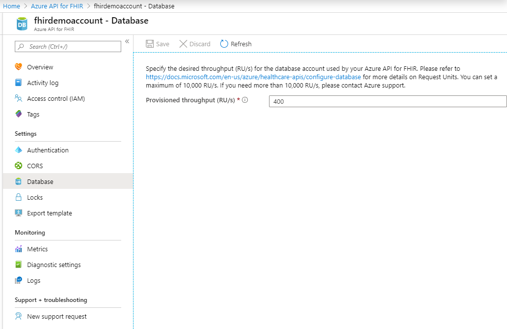

# Configure database settings 

[!INCLUDE [retirement banner](../includes/healthcare-apis-azure-api-fhir-retirement.md)]

Azure API for FHIR uses database to store its data. Performance of the underlying database depends on the number of Request Units (RU) selected during service provisioning or in database settings after the service has been provisioned.

Azure API for FHIR borrows the concept of [Request Units (RUs) in Azure Cosmos DB](../../cosmos-db/request-units.md)) when setting the performance of underlying database. 

Throughput must be provisioned to ensure that sufficient system resources are available for your database at all times. How many RUs you need for your application depends on operations you perform. Operations can range from simple read and writes to more complex queries. 

> [!NOTE]
> As different operations consume different number of RU, we return the actual number of RUs consumed in every API call in response header. This way you can profile the number of RUs consumed by your application.

## Update throughput

To change this setting in the Azure portal, navigate to your Azure API for FHIR and open the Database blade. Next, change the Provisioned throughput to the desired value depending on your performance needs. You can change the value up to a maximum of 100,000 RU/s. If you need a higher value, contact Azure support.

If the database throughput is greater than 10,000 RU/s or if the data stored in the database is more than 50 GB, your client application must be capable of handling continuation tokens. A new partition is created in the database for every throughput increase of 10,000 RU/s or if the amount of data stored is more than 50 GB. Multiple partitions create a multi-page response in which pagination is implemented by using continuation tokens.

> [!NOTE] 
> Higher value means higher Azure API for FHIR throughput and higher cost of the service.

## Next steps

In this article, you learned how to update your RUs for Azure API for FHIR. To learn about configuring customer-managed keys as a database setting:

>[!div class="nextstepaction"]
>[Configure customer-managed keys](customer-managed-key.md)

Or you can deploy a fully managed Azure API for FHIR:
 
>[!div class="nextstepaction"]
>[Deploy Azure API for FHIR](fhir-paas-portal-quickstart.md)

FHIR&#174; is a registered trademark of [HL7](https://hl7.org/fhir/) and is used with the permission of HL7.
