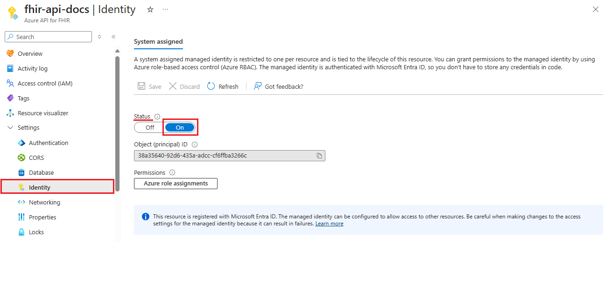
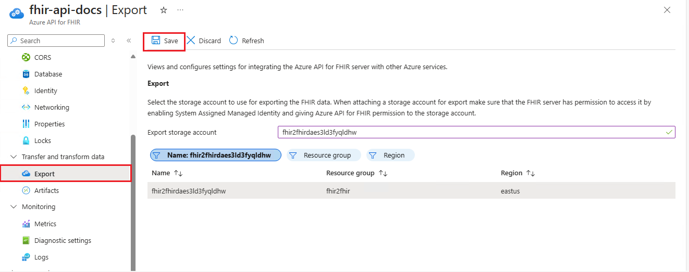

# Configure export settings in Azure API for FHIR and set up a storage account

[!INCLUDE [retirement banner](../includes/healthcare-apis-azure-api-fhir-retirement.md)]

Azure API for FHIR supports $export command that allows you to export the data out of Azure API for FHIR account to a storage account.

There are three steps involved in configuring export in Azure API for FHIR:

1. Enable Managed Identity on Azure API for FHIR.
2. Create an Azure storage account (if not done before) and assign permissions to Azure API for FHIR to the storage account.
3. Select the storage account in Azure API for FHIR as export storage account.

## Enabling Managed Identity on Azure API for FHIR

The first step in configuring Azure API for FHIR for export is to enable system wide managed identity on the service. For more information about managed identities in Azure, see [About managed identities for Azure resources](../../active-directory/managed-identities-azure-resources/overview.md).

Browse to the Azure API for FHIR and select **Identity**. Changing the status to **On** will enable managed identity in Azure API for FHIR.

In the next step, create a storage account and assign permission to our service.

## Adding permission to storage account

The next step in export data is to assign permission for Azure API for FHIR to write to the storage account.

After you've created a storage account, browse to the **Access Control (IAM)** in the storage account, and then select **Add role assignment**. 

For more information about assigning roles in the Azure portal, see [Azure built-in roles](../../role-based-access-control/role-assignments-portal.md).

It's here that you'll add the role [Storage Blob Data Contributor](../../role-based-access-control/built-in-roles.md#storage-blob-data-contributor) to our service name, and then select **Save**.

Now you’re ready to select the storage account in Azure API for FHIR as a default storage account for $export.

## Selecting the storage account for $export

The final step is to assign the Azure storage account that Azure API for FHIR will use to export the data to. To do this, go to **Integration** in Azure API for FHIR and select the storage account.

After you've completed this final step, you’re now ready to export the data using $export command.

> [!Note]
> Only storage accounts in the same subscription as that for Azure API for FHIR are allowed to be registered as the destination for $export operations.

## Next steps

In this article, you learned the steps in configuring export settings that allow you to export data out the Azure API for FHIR to a storage account. For more information about configuring database settings, access control, enabling diagnostic logging, and using custom headers to add data to audit logs, see

>[!div class="nextstepaction"]
>[Additional Settings](azure-api-for-fhir-additional-settings.md)

FHIR&#174; is a registered trademark of [HL7](https://hl7.org/fhir/) and is used with the permission of HL7.