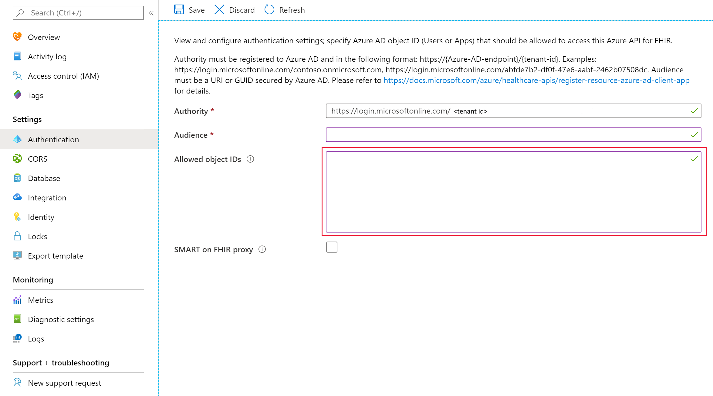

# Configure local RBAC for FHIR

[!INCLUDE [retirement banner](../includes/healthcare-apis-azure-api-fhir-retirement.md)]

This article explains how to configure the Azure API for FHIR to use a secondary Microsoft Entra tenant for data access. Use this mode only if it isn't possible for you to use the Microsoft Entra tenant associated with your subscription.

> [!NOTE]
> If your FHIR service is configured to use your primary Microsoft Entra tenant associated with your subscription, [use Azure RBAC to assign data plane roles](configure-azure-rbac.md).

## Add a new service principal or use an existing one

Local RBAC allows you to use a service principal in the secondary Microsoft Entra tenant with your FHIR server. You can  create a new service principal through the Azure portal, PowerShell or CLI commands, or use an existing service principal. The process is also known as [application registration](../register-application.md). You can review and modify the service principals through Microsoft Entra ID from the portal or using scripts.

The PowerShell and CLI scripts below, which are tested and validated in Visual Studio Code, create a new service principal (or client application), and add a client secret. The service principal ID is used for local RBAC and the application ID and client secret will be used to access the FHIR service later.

You can use the `Az` PowerShell module:

```azurepowershell-interactive
$appname="xxx"
$sp= New-AzADServicePrincipal -DisplayName $appname
$clientappid=sp.ApplicationId
$spid=$sp.Id
#Get client secret which is not visible from the portal
$clientsecret=ConvertFrom-SecureString -SecureString $sp.Secret -AsPlainText
```

or you can use Azure CLI:

```azurecli-interactive
appname=xxx
clientappid=$(az ad app create --display-name $appname --query appId --output tsv)
spid=$(az ad sp create --id $appid --query objectId --output tsv)
#Add client secret with expiration. The default is one year.
clientsecretname=mycert2
clientsecretduration=2
clientsecret=$(az ad app credential reset --id $appid --append --credential-description $clientsecretname --years $clientsecretduration --query password --output tsv)
```

## Configure local RBAC

You can configure the Azure API for FHIR to use a secondary Microsoft Entra tenant in the **Authentication** blade:



In the authority box, enter a valid secondary Microsoft Entra tenant. Once the tenant has been validated, the **Allowed object IDs** box should be activated and you can enter one or a list of Microsoft Entra service principal object IDs. These IDs can be the identity object IDs of:

* A Microsoft Entra user.
* A Microsoft Entra service principal.
* A Microsoft Entra security group.

You can read the article on how to [find identity object IDs](find-identity-object-ids.md) for more details.

After entering the required Microsoft Entra object IDs, select **Save** and wait for changes to be saved before trying to access the data plane using the assigned users, service principals, or groups. The object IDs are granted with all permissions, an equivalent of the "FHIR Data Contributor" role.

The local RBAC setting is only visible from the authentication blade; it isn't visible from the Access Control (IAM) blade.

> [!NOTE]
> Only a single tenant is supported for RBAC or local RBAC. To disable the local RBAC function, you can change it back to the valid tenant (or primary tenant) associated with your subscription, and remove all Microsoft Entra object IDs in the "Allowed object IDs" box.

## Caching behavior

The Azure API for FHIR will cache decisions for up to 5 minutes. If you grant a user access to the FHIR server by adding them to the list of allowed object IDs, or you remove them from the list, you should expect it to take up to five minutes for changes in permissions to propagate.

## Next steps

In this article, you learned how to assign FHIR data plane access using an external (secondary) Microsoft Entra tenant. Next learn about additional settings for the Azure API for FHIR:

>[!div class="nextstepaction"]
>[Configure CORS](configure-cross-origin-resource-sharing.md)

>[!div class="nextstepaction"]
>[Configure Private Link](configure-private-link.md)

FHIR&#174; is a registered trademark of [HL7](https://hl7.org/fhir/) and is used with the permission of HL7.
