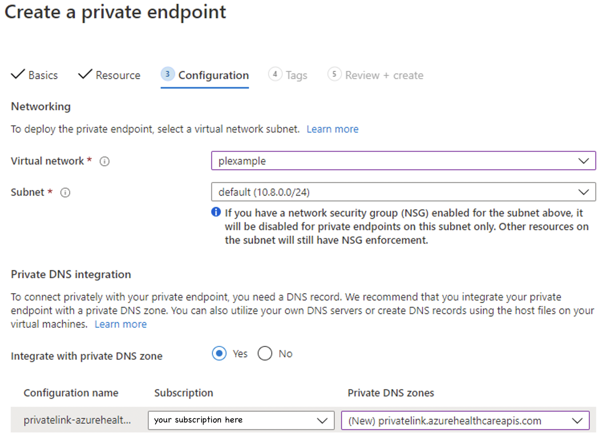
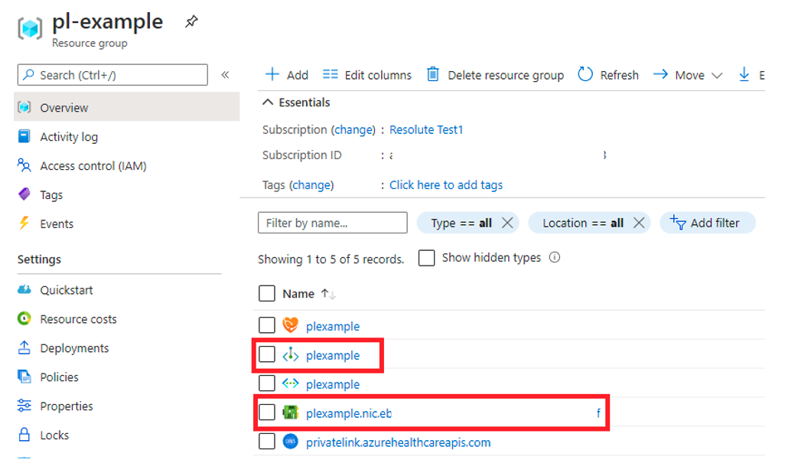

# Configure private link

[!INCLUDE [retirement banner](../includes/healthcare-apis-azure-api-fhir-retirement.md)]

Private link enables you to access Azure API for FHIR over a private endpoint, which is a network interface that connects you privately and securely using a private IP address from your virtual network. With private link, you can access our services securely from your VNet as a first party service without having to go through a public Domain Name System (DNS). This article describes how to create, test, and manage your private endpoint for Azure API for FHIR.

>[!Note]
>Neither Private Link nor Azure API for FHIR can be moved from one resource group or subscription to another once Private Link is enabled. To make a move, delete the Private Link first, then move Azure API for FHIR. Create a new Private Link once the move is complete. Assess potential security ramifications before deleting Private Link.
>
>If exporting audit logs and metrics is enabled for Azure API for FHIR, update the export setting through **Diagnostic Settings** from the portal.

## Prerequisites

Before creating a private endpoint, there are some Azure resources that you'll need to create first:

- Resource Group – The Azure resource group that will contain the virtual network and private endpoint.
- Azure API for FHIR – The FHIR resource you would like to put behind a private endpoint.
- Virtual Network – The VNet to which your client services and Private Endpoint will be connected.

For more information, see [Private Link Documentation](../../private-link/index.yml).

## Create private endpoint

To create a private endpoint, a developer with Role-based access control (RBAC) permissions on the FHIR resource can use the Azure portal, [Azure PowerShell](../../private-link/create-private-endpoint-powershell.md), or [Azure CLI](../../private-link/create-private-endpoint-cli.md). This article will guide you through the steps on using Azure portal. Using the Azure portal is recommended as it automates the creation and configuration of the Private DNS Zone. For more information, see [Private Link Quick Start Guides](../../private-link/create-private-endpoint-portal.md).

There are two ways to create a private endpoint. Auto Approval flow allows a user that has RBAC permissions on the FHIR resource to create a private endpoint without a need for approval. Manual Approval flow allows a user without permissions on the FHIR resource to request a private endpoint to be approved by owners of the FHIR resource.

> [!NOTE]
> When an approved private endpoint is created for Azure API for FHIR, public traffic to it is automatically disabled. 

### Auto approval

Ensure the region for the new private endpoint is the same as the region for your virtual network. The region for your FHIR resource can be different.


For the resource type, search and select **Microsoft.HealthcareApis/services**. For the resource, select the FHIR resource. For target subresource, select **FHIR**.


If you don't have an existing Private DNS Zone set up, select **(New)privatelink.azurehealthcareapis.com**. If you already have your Private DNS Zone configured, you can select it from the list. It must be in the format of **privatelink.azurehealthcareapis.com**.



After the deployment is complete, you can go back to **Private endpoint connections** tab of which you'll notice **Approved** as the connection state.

### Manual Approval

For manual approval, select the second option under Resource, "Connect to an Azure resource by resource ID or alias". For Target subresource, enter "fhir" as in Auto Approval.


After the deployment is complete, you can go back to "Private endpoint connections" tab, on which you can Approve, Reject, or Remove your connection.


## VNet Peering

With Private Link configured, you can access the FHIR server in the same VNet or a different VNet that is peered to the VNet for the FHIR server. Follow the steps below to configure VNet peering and Private Link DNS zone configuration.

### Configure VNet Peering

You can configure VNet peering from the portal or using PowerShell, CLI scripts, and Azure Resource Manager (ARM) template. The second VNet can be in the same or different subscriptions, and in the same or different regions. Make sure that you grant the **Network contributor** role. For more information on VNet Peering, see [Create a virtual network peering](../../virtual-network/create-peering-different-subscriptions.md).

### Add VNet link to the private link zone

In the Azure portal, select the resource group of the FHIR server. Select and open the Private DNS zone, **privatelink.azurehealthcareapis.com**. Select **Virtual network links** under the *settings* section. Select the **Add** button to add your second VNet to the private DNS zone. Enter the link name of your choice, select the subscription and the VNet you created. Optionally, you can enter the resource ID for the second VNet. Select **Enable auto registration**, which automatically adds a DNS record for your VM connected to the second VNet. When you delete a VNet link, the DNS record for the VM is also deleted.

For more information on how private link DNS zone resolves the private endpoint IP address to the fully qualified domain name (FQDN) of the resource such as the FHIR server, see [Azure Private Endpoint DNS configuration](../../private-link/private-endpoint-dns.md).

  :::image type="content" source="media/private-link/private-link-add-vnet-link.png" alt-text="Add VNet link." lightbox="media/private-link/private-link-add-vnet-link.png":::

You can add more VNet links if needed, and view all VNet links you've added from the portal.

  :::image type="content" source="media/private-link/private-link-vnet-links.png" alt-text="Private Link VNet links." lightbox="media/private-link/private-link-vnet-links.png":::
  
From the Overview blade you can view the private IP addresses of the FHIR server and the VMs connected to peered virtual networks.

  :::image type="content" source="media/private-link/private-link-dns-zone.png" alt-text="Private Link FHIR and VM Private IP Addresses." lightbox="media/private-link/private-link-dns-zone.png":::

## Manage private endpoint

### View

Private endpoints and the associated network interface controller (NIC) are visible in Azure portal from the resource group they were created in.



### Delete

Private endpoints can only be deleted from the Azure portal from the **Overview** blade or by selecting the **Remove** option under the **Networking Private endpoint connections** tab. Selecting **Remove** will delete the private endpoint and the associated NIC. If you delete all private endpoints to the FHIR resource and the public network, access is disabled and no request will make it to your FHIR server.


## Test and troubleshoot private link and VNet peering

To ensure that your FHIR server isn't receiving public traffic after disabling public network access, select the /metadata endpoint for your server from your computer. You should receive a 403 Forbidden. 

> [!NOTE]
> It can take up to 5 minutes after updating the public network access flag before public traffic is blocked.

### Create and use a VM

To ensure your private endpoint can send traffic to your server:

1. Create a virtual machine (VM) that is connected to the virtual network and subnet your private endpoint is configured on. To ensure your traffic from the VM is only using the private network, disable the outbound internet traffic using the network security group (NSG) rule.
2. RDP into the VM.
3. Access your FHIR server’s /metadata endpoint from the VM. You should receive the capability statement as a response.

### Use nslookup

You can use the **nslookup** tool to verify connectivity. If the private link is configured properly, you should see the FHIR server URL resolves to the valid private IP address, as shown below. Note that the IP address **168.63.129.16** is a virtual public IP address used in Azure. For more information, see [What is IP address 168.63.129.16](../../virtual-network/what-is-ip-address-168-63-129-16.md)

```
C:\Users\testuser>nslookup fhirserverxxx.azurehealthcareapis.com
Server:  UnKnown
Address:  168.63.129.16

Non-authoritative answer:
Name:    fhirserverxxx.privatelink.azurehealthcareapis.com
Address:  172.21.0.4
Aliases:  fhirserverxxx.azurehealthcareapis.com
```

If the private link isn't configured properly, you may see the public IP address instead and a few aliases including the Traffic Manager endpoint. This indicates that the private link DNS zone can’t resolve to the valid private IP address of the FHIR server. When VNet peering is configured, one possible reason is that the second peered VNet hasn't been added to the private link DNS zone. As a result, you'll see the HTTP error 403, "Access to xxx was denied", when trying to access the /metadata endpoint of the FHIR server.

```
C:\Users\testuser>nslookup fhirserverxxx.azurehealthcareapis.com
Server:  UnKnown
Address:  168.63.129.16

Non-authoritative answer:
Name:    xxx.cloudapp.azure.com
Address:  52.xxx.xxx.xxx
Aliases:  fhirserverxxx.azurehealthcareapis.com
          fhirserverxxx.privatelink.azurehealthcareapis.com
          xxx.trafficmanager.net
```

For more information, see [Troubleshoot Azure Private Link connectivity problems](../../private-link/troubleshoot-private-link-connectivity.md).

## Next steps

In this article, you've learned how to configure the private link and VNet peering. You also learned how to troubleshoot the private link and VNet configurations.

Based on your private link setup and for more information about registering your applications, see

* [Register a resource application](register-resource-azure-ad-client-app.md)
* [Register a confidential client application](register-confidential-azure-ad-client-app.md)
* [Register a public client application](register-public-azure-ad-client-app.md)
* [Register a service application](register-service-azure-ad-client-app.md)

FHIR&#174; is a registered trademark of [HL7](https://hl7.org/fhir/) and is used with the permission of HL7.

