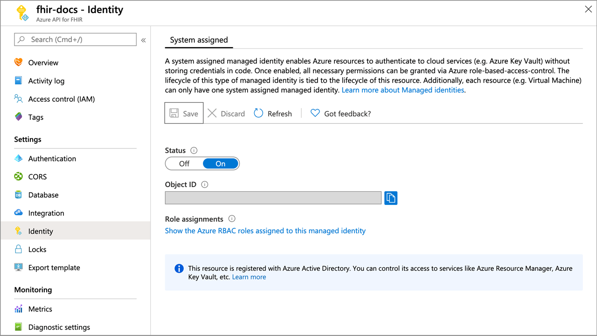

# Converting your data to FHIR for Azure API for FHIR

[!INCLUDE [retirement banner](../includes/healthcare-apis-azure-api-fhir-retirement.md)]

The `$convert-data` custom endpoint in the FHIR service is meant for data conversion from different data types to FHIR. It uses the Liquid template engine and the templates from the [FHIR Converter](https://github.com/microsoft/FHIR-Converter) project as the default templates. You can customize these conversion templates as needed. 

Currently the `$convert-data` custom endpoint supports `four` types of data conversion: 

|Origin Data Format | Destination Data Format|
| ----------- | ----------- | 
|C-CDA | FHIR |
|HL7v2 | FHIR|
|JSON | FHIR|
|FHIR STU3 | FHIR R4 |


> [!NOTE]
> `$convert-data` endpoint can be used as a component within an ETL pipeline for the conversion of raw healthcare data from legacy formats into FHIR format. However, it is not an ETL pipeline in itself. We recommend you to use an ETL engine such as Logic Apps or Azure Data Factory for a complete workflow in preparing your FHIR data to be persisted into the FHIR server. The workflow might include: data reading and ingestion, data validation, making $convert-data API calls, data pre/post-processing, data enrichment, and data de-duplication.

## Use the $convert-data endpoint

The `$convert-data` operation is integrated into the FHIR service to run as part of the service. After enabling `$convert-data` in your server, you can make API calls to the server to convert your data into FHIR:
`https://<<FHIR service base URL>>/$convert-data`

### Parameter Resource

$convert-data takes a [Parameter](http://hl7.org/fhir/parameters.html) resource in the request body as described in the table below. In the API call request body, you would include the following parameters:

| Parameter Name      | Description | Accepted values |
| ----------- | ----------- | ----------- |
| inputData      | Data to be converted. | For `Hl7v2`: string <br> For `Ccda`: XML <br> For `Json`: JSON <br> For `FHIR STU3`: JSON|
| inputDataType   | Data type of input. | ```HL7v2```, ``Ccda``, ``Json``, ``Fhir``|
| templateCollectionReference | Reference to an [OCI image ](https://github.com/opencontainers/image-spec) template collection on [Azure Container Registry (ACR)](https://azure.microsoft.com/services/container-registry/). It's the image containing Liquid templates to use for conversion. It can be a reference either to the default templates or a custom template image that is registered within the FHIR service. See below to learn about customizing the templates, hosting those on ACR, and registering to the FHIR service. | For ***default/sample*** templates: <br> **HL7v2** templates: <br>```microsofthealth/fhirconverter:default``` <br>``microsofthealth/hl7v2templates:default``<br> **C-CDA** templates: <br> ``microsofthealth/ccdatemplates:default`` <br> **JSON** templates: <br> ``microsofthealth/jsontemplates:default`` <br> **FHIR STU3** templates: <br> ``microsofthealth/stu3tor4templates:default`` <br><br> For ***custom*** templates: <br> \<RegistryServer\>/\<imageName\>@\<imageDigest\>, \<RegistryServer\>/\<imageName\>:\<imageTag\> |
| rootTemplate | The root template to use while transforming the data. | For **HL7v2**:<br> "ADT_A01", "ADT_A02", "ADT_A03", "ADT_A04", "ADT_A05", "ADT_A08", "ADT_A11",  "ADT_A13", "ADT_A14", "ADT_A15", "ADT_A16", "ADT_A25", "ADT_A26", "ADT_A27", "ADT_A28", "ADT_A29", "ADT_A31", "ADT_A47", "ADT_A60", "OML_O21", "ORU_R01", "ORM_O01", "VXU_V04", "SIU_S12", "SIU_S13", "SIU_S14", "SIU_S15", "SIU_S16", "SIU_S17", "SIU_S26", "MDM_T01", "MDM_T02"<br><br> For **C-CDA**:<br> "CCD", "ConsultationNote", "DischargeSummary", "HistoryandPhysical", "OperativeNote", "ProcedureNote", "ProgressNote", "ReferralNote", "TransferSummary" <br><br> For **JSON**: <br> "ExamplePatient", "Stu3ChargeItem" <br><br> **FHIR STU3**": <br> STU3 Resource Name e.g., "Patient", "Observation", "Organization". |

> [!NOTE]
> FHIR STU3 to R4 templates are "diff" Liquid templates that provide mappings of field differences only between STU3 resource and its equivalent resource in FHIR R4 standard.Some of the STU3 resources are renamed or removed from R4. Please refer to [Resource differences and constraints for STU3 to R4 conversion](https://github.com/microsoft/FHIR-Converter/blob/main/docs/Stu3R4-resources-differences.md). 

> [!NOTE]
> JSON templates are sample templates for use, not "default" templates that adhere to any pre-defined JSON message types. JSON doesn't have any standardized message types, unlike HL7v2 messages or C-CDA documents. Therefore, instead of default templates we provide you with some sample templates that you can use as a starting guide for your own customized templates.

> [!WARNING]
> Default templates are released under MIT License and are **not** supported by Microsoft Support.
>
> Default templates are provided only to help you get started quickly. They may get updated when we update versions of the Azure API for FHIR. Therefore, you must verify the conversion behavior and **host your own copy of templates** on an Azure Container Registry, register those to the Azure API for FHIR, and use in your API calls in order to have consistent data conversion behavior across the different versions of Azure API for FHIR.

#### Sample Request

```json
{
    "resourceType": "Parameters",
    "parameter": [
        {
            "name": "inputData",
            "valueString": "MSH|^~\\&|SIMHOSP|SFAC|RAPP|RFAC|20200508131015||ADT^A01|517|T|2.3|||AL||44|ASCII\nEVN|A01|20200508131015|||C005^Whittingham^Sylvia^^^Dr^^^DRNBR^D^^^ORGDR|\nPID|1|3735064194^^^SIMULATOR MRN^MRN|3735064194^^^SIMULATOR MRN^MRN~2021051528^^^NHSNBR^NHSNMBR||Kinmonth^Joanna^Chelsea^^Ms^^D||19870624000000|F|||89 Transaction House^Handmaiden Street^Wembley^^FV75 4GJ^GBR^HOME||020 3614 5541^PRN|||||||||C^White - Other^^^||||||||\nPD1|||FAMILY PRACTICE^^12345|\nPV1|1|I|OtherWard^MainRoom^Bed 183^Simulated Hospital^^BED^Main Building^4|28b|||C005^Whittingham^Sylvia^^^Dr^^^DRNBR^D^^^ORGDR|||CAR|||||||||16094728916771313876^^^^visitid||||||||||||||||||||||ARRIVED|||20200508131015||"
        },
        {
            "name": "inputDataType",
            "valueString": "Hl7v2"
        },
        {
            "name": "templateCollectionReference",
            "valueString": "microsofthealth/fhirconverter:default"
        },
        {
            "name": "rootTemplate",
            "valueString": "ADT_A01"
        }
    ]
}
```

#### Sample Response

```json
{
  "resourceType": "Bundle",
  "type": "transaction",
  "entry": [
    {
      "fullUrl": "urn:uuid:9d697ec3-48c3-3e17-db6a-29a1765e22c6",
      "resource": {
        "resourceType": "Patient",
        "id": "9d697ec3-48c3-3e17-db6a-29a1765e22c6",
        ...
        ...
      "request": {
        "method": "PUT",
        "url": "Location/50becdb5-ff56-56c6-40a1-6d554dca80f0"
      }
    }
  ]
}
```

## Customize templates

You can use the [FHIR Converter extension](https://marketplace.visualstudio.com/items?itemName=ms-azuretools.vscode-health-fhir-converter) for Visual Studio Code to customize the templates as per your needs. The extension provides an interactive editing experience, and makes it easy to download Microsoft-published templates and sample data. Refer to the documentation in the extension for more details.

> [!NOTE]
> FHIR Converter extension for Visual Studio Code is available for HL7v2, C-CDA and JSON Liquid templates. FHIR STU3 to R4 Liquid templates are currently not supported. 

## Host and use templates

It's recommended that you host your own copy of templates on ACR. There are four steps involved in hosting your own copy of templates and using those in the $convert-data operation:

1. Push the templates to your Azure Container Registry.
1. Enable Managed Identity on your Azure API for FHIR instance.
1. Provide access of the ACR to the Azure API for FHIR Managed Identity.
1. Register the ACR servers in the Azure API for FHIR.
1. Optionally configure ACR firewall for secure access.

### Push templates to Azure Container Registry

After creating an ACR instance, you can use the _FHIR Converter: Push Templates_ command in the [FHIR Converter extension](https://marketplace.visualstudio.com/items?itemName=ms-azuretools.vscode-health-fhir-converter) to push the customized templates to the ACR. Alternatively, you can use the [Template Management CLI tool](https://github.com/microsoft/FHIR-Converter/blob/main/docs/TemplateManagementCLI.md) for this purpose.

### Enable Managed Identity on Azure API for FHIR

Browse to your instance of Azure API for FHIR service in the Azure portal, and then select the **Identity** blade.
Change the status to **On** to enable managed identity in Azure API for FHIR.

[  ](media/convert-data/fhir-mi-enabled.png#lightbox)

### Provide access of the ACR to Azure API for FHIR

1. Browse to the **Access control (IAM)** blade.

1. Select **Add**, and then select **Add role assignment** to open the Add role assignment page.

1. Assign the [AcrPull](../../role-based-access-control/built-in-roles.md#acrpull) role. 

   [  ](../../../includes/role-based-access-control/media/add-role-assignment-page.png#lightbox) 

For more information about assigning roles in the Azure portal, see [Azure built-in roles](../../role-based-access-control/role-assignments-portal.md).

### Register the ACR servers in Azure API for FHIR

You can register the ACR server using the Azure portal, or using CLI.

#### Registering the ACR server using Azure portal

Browse to the **Artifacts** blade under **Data transformation** in your Azure API for FHIR instance. You'll see the list of currently registered ACR servers. Select **Add**, and then select your registry server from the drop-down menu. You'll need to select **Save** for the registration to take effect. It may take a few minutes to apply the change and restart your instance.

#### Registering the ACR server using CLI

You can register up to 20 ACR servers in the Azure API for FHIR.

Install Azure Health Data Services CLI from Azure PowerShell if needed:

```azurecli
az extension add -n healthcareapis
```

Register the acr servers to Azure API for FHIR following the examples below:

##### Register a single ACR server

```azurecli
az healthcareapis acr add --login-servers "fhiracr2021.azurecr.io" --resource-group fhir-test --resource-name fhirtest2021
```

##### Register multiple ACR servers

```azurecli
az healthcareapis acr add --login-servers "fhiracr2021.azurecr.io fhiracr2020.azurecr.io" --resource-group fhir-test --resource-name fhirtest2021
```

### Configure ACR firewall

Select **Networking** of the Azure storage account from the portal.

   :::image type="content" source="media/convert-data/networking-container-registry.png" alt-text=" Screen image of the container registry.":::

Select **Selected networks**. 

Under the **Firewall** section, specify the IP address in the **Address range** box. Add IP ranges to allow access from the internet or your on-premises networks. 

In the table below, you'll find the IP address for the Azure region where the Azure API for FHIR service is provisioned.

|**Azure Region**         |**Public IP Address** |
|:----------------------|:-------------------|
| Australia East       | 20.53.47.210      |
| Brazil South         | 191.238.72.227    |
| Canada Central       | 20.48.197.161     |
| Central India        | 20.192.47.66      |
| East US              | 20.62.134.242, 20.62.134.244, 20.62.134.245     |
| East US 2            | 20.62.60.115, 20.62.60.116, 20.62.60.117    |
| France Central       | 51.138.211.19     |
| Germany North        | 51.116.60.240     |
| Germany West Central | 20.52.88.224      |
| Japan East           | 20.191.167.146    |
| Japan West           | 20.189.228.225    |
| Korea Central        | 20.194.75.193     |
| North Central US     | 52.162.111.130, 20.51.0.209   |
| North Europe         | 52.146.137.179    |
| Qatar Central        | 20.21.36.225      |
| South Africa North   | 102.133.220.199   |
| South Central US     | 20.65.134.83      |
| Southeast Asia       | 20.195.67.208     |
| Sweden Central       | 51.12.28.100      |
| Switzerland North    | 51.107.247.97     |
| UK South             | 51.143.213.211    |
| UK West              | 51.140.210.86     |
| West Central US      | 13.71.199.119     |
| West Europe          | 20.61.103.243, 20.61.103.244     |
| West US 2            | 20.51.13.80, 20.51.13.84, 20.51.13.85     |
| West US 3            | 20.150.245.165    |


> [!NOTE]
> The above steps are similar to the configuration steps described in the document How to export FHIR data. For more information, see [Secure Export to Azure Storage](export-data.md#secure-export-to-azure-storage)

### Verify

Make a call to the $convert-data API specifying your template reference in the templateCollectionReference parameter.

`<RegistryServer>/<imageName>@<imageDigest>`

## Next steps

In this article, you learned about data conversion for Azure API for FHIR. For more information about related GitHub Projects for Azure API for FHIR, see

>[!div class="nextstepaction"]
>[Related GitHub Projects for Azure API for FHIR](fhir-github-projects.md)

FHIR&#174; is a registered trademark of [HL7](https://hl7.org/fhir/) and is used with the permission of HL7.

