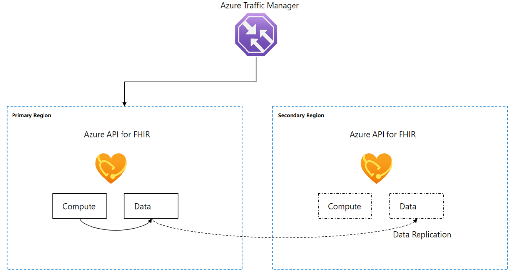
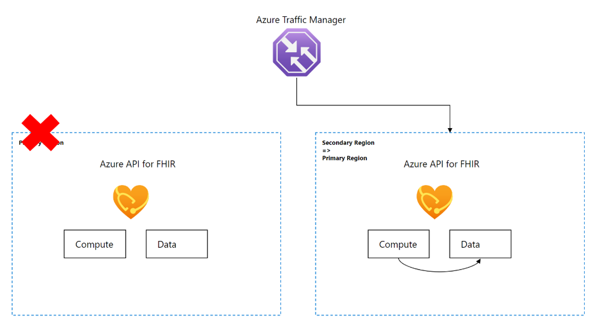
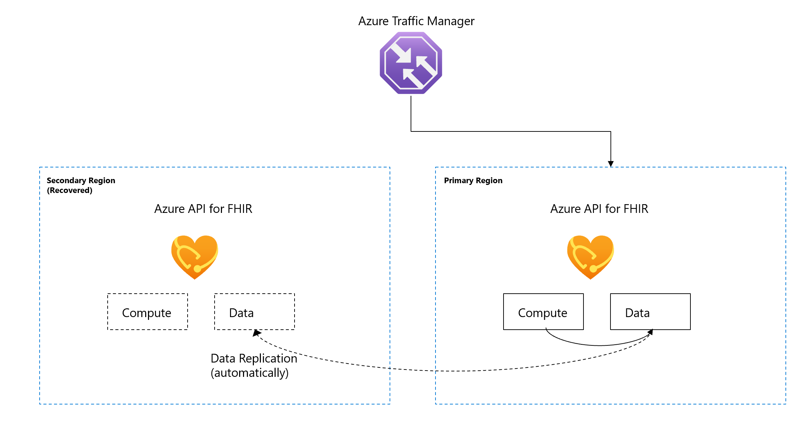
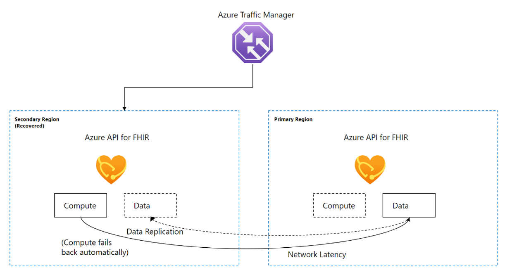
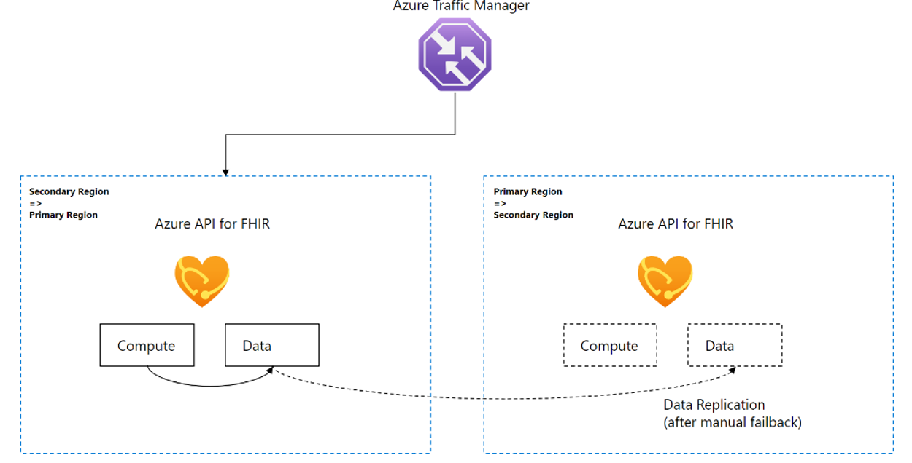

# Disaster recovery for Azure API for FHIR

Azure API for FHIR is a fully managed service, based on Fast Healthcare Interoperability Resources (FHIR®). To meet business and compliance requirements you can use the disaster recovery (DR) feature for Azure API for FHIR.

The DR feature provides a Recovery Point Objective (RPO) of 15 minutes and a Recovery Time Objective (RTO) of 60 minutes.

## How to enable DR 
  
To enable the DR feature, create a one-time support ticket. You can choose an Azure paired region or another region where the Azure API for FHIR is supported. The Microsoft support team will enable the DR feature based on the support priority.

## How the DR process works

The DR process involves the following steps: 
* Data replication
* Automatic failover
* Affected region recovery
* Manual failback

### Data replication in the secondary region

By default, Azure API for FHIR offers data protection through backup and restore. When the disaster recovery feature is enabled, data replication begins. A data replica is automatically created and synchronized in the secondary Azure region. The initial data replication can take a few minutes to a few hours, or longer, depending on the amount of data. The secondary data replica is a replication of the primary data. It's used directly to recover the service, and it helps speed up the recovery process.

It's worth noting that the throughput RU/s must have the same values in the primary and secondary regions.

### Automatic failover

During a primary region outage, the Azure API for FHIR automatically fails over to the secondary region and the same service endpoint is used. The service is expected to resume in one hour or less, and potential data loss is up to 15 minutes' worth of data. Other configuration changes may be required. For more information, see [Configuration changes in DR](#configuration-changes-in-dr).

### Affected region recovery

After the affected region recovers, it's automatically available as a secondary region and data replication restarts. You can start the data recovery process or wait until the failback step is completed.

When the compute has failed back to the recovered region and the data hasn't, there may be potential network latencies. The main reason is that the compute and the data are in two different regions. The network latencies should disappear automatically as soon as the data fails back to the recovered region through a manual trigger.

### Manual failback

The compute fails back automatically to the recovered region. The data is switched back to the recovered region manually by the Microsoft support team using the script. 

## Configuration changes in DR

Other configuration changes may be required when Private Link, Customer Managed Key (CMK), IoMT FHIR Connector (the Internet of Medical Things) and $export are used.

### Private link

You can enable the private link feature before or after the Azure API for FHIR has been provisioned. You can also provision private link before or after the DR feature has been enabled. Refer to the list below when you're ready to configure Private Link for DR.

* Configure Azure Private Link in the primary region. This step isn't required in the secondary region. For more information, see [Configure private link](/azure/healthcare-apis/fhir/configure-private-link)

* Create one Azure VNet in the primary region and another VNet in the secondary region. For information, see [Create a virtual network using the Azure portal](../../virtual-network/quick-create-portal.md).

* In the primary region, VNet creates a VNet peering to the secondary region VNet. For more information, see [Virtual network peering](../../virtual-network/virtual-network-peering-overview.md).

* Use the default settings, or you can tailor the configuration as needed. The importance is that the traffic can flow between the two virtual networks.

* When the private DNS is set up, the VNet in the secondary region needs to be manually set up as a "Virtual network links". The primary VNet should have already been added as part of the Private Link endpoint creation flow. For more information, see [Virtual network links](../../dns/private-dns-virtual-network-links.md).

* Optionally, set up one VM in the primary region VNet and one in the secondary region VNet. You can access the Azure API for FHIR from both VMs.

The private link feature should continue to work during a regional outage and after the failback has completed. For more information, see [Configure private link](/azure/healthcare-apis/fhir/configure-private-link).

> [!NOTE]
> Configuring virtual networks and VNet peering does not affect data replication.

### CMK

Your access to Azure API for FHIR will be maintained if the key vault hosting the managed key in your subscription is accessible. There's a possible temporary downtime as Key Vault can take up to 20 minutes to re-establish its connection. For more information, see [Azure Key Vault availability and redundancy](../../key-vault/general/disaster-recovery-guidance.md).  

### $export

The export job will be picked up from another region after 10 minutes without an update to the job status. Follow the guidance for Azure storage for recovering your storage account in the event of a regional outage. For more information, see [Disaster recovery and storage account failover](../../storage/common/storage-disaster-recovery-guidance.md). 

Ensure that you grant the same permissions to the system identity of the Azure API for FHIR. Also, if the storage account is configured with selected networks, see [How to export FHIR data](../fhir/export-data.md).

## How to test DR

While not required, you can test the DR feature on a non-production environment. For DR test, only the data will be included and the compute won't be included. 

Consider the following steps for DR test.

* Prepare a test environment with test data. It's recommended that you use a service instance with small amounts of data to reduce the time to replicate the data.
 
* Create a support ticket and provide your Azure subscription and the service name for the Azure API for FHIR for your test environment.

* Come up with a test plan, as you would with any DR test.
 
* The Microsoft support team enables the DR feature and confirms that the failover has taken place.

* Conduct your DR test and record the testing results, which it should include any data loss and network latency issues. 

* For failback, notify the Microsoft support team to complete the failback step.
 
* (Optional) Share any feedback with the Microsoft support team.

> [!NOTE]
> The DR test will double the cost of your test environment during the test. No extra cost will incur after the DR test is completed and the DR feature is disabled.

## Cost of disaster recovery

The disaster recovery feature incurs extra costs because data of the compute and data replica running in the environment in the secondary region. For more pricing details, refer to the [Azure API for FHIR pricing]( https://azure.microsoft.com/pricing/details/azure-api-for-fhir) web page.

> [!NOTE]
> The DR offering is subject to the [SLA for Azure API for FHIR](https://azure.microsoft.com/pricing/details/health-data-services), 1.0.

## Next steps

In this article, you've learned how DR for Azure API for FHIR works and how to enable it. To learn about Azure API for FHIR's other supported features, see

> [!div class="nextstepaction"]
> [FHIR supported features](fhir-features-supported.md)

FHIR&#174; is a registered trademark of [HL7](https://hl7.org/fhir/) and is used with the permission of HL7.
