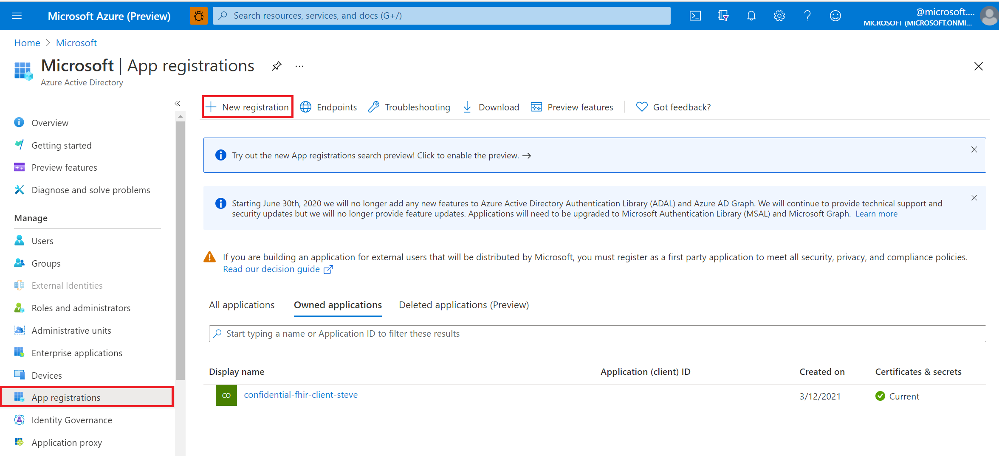

# Register a public client application in Azure Active Directory for Azure API for FHIR

[!INCLUDE [retirement banner](../includes/healthcare-apis-azure-api-fhir-retirement.md)]

In this article, you'll learn how to register a public application in Azure Active Directory (Azure AD).  

Client application registrations are Azure AD representations of applications that can authenticate and ask for API permissions on behalf of a user. Public clients are applications such as mobile applications and single page JavaScript applications that can't keep secrets confidential. The procedure is similar to [registering a confidential client](register-confidential-azure-ad-client-app.md), but since public clients can't be trusted to hold an application secret, there's no need to add one.

The quickstart provides general information about how to [register an application with the Microsoft identity platform](../../active-directory/develop/quickstart-register-app.md).

## App registrations in Azure portal

1. In the [Azure portal](https://portal.azure.com), on the left navigation panel, select **Azure Active Directory**.

2. In the **Azure Active Directory** blade, select **App registrations**:

    

3. Select **New registration**.

## Application registration overview

1. Give the application a display name.

2. Provide a reply URL. The reply URL is where authentication codes will be returned to the client application. You can add more reply URLs and edit existing ones later.

    

To configure your [desktop](../../active-directory/develop/scenario-desktop-app-registration.md), [mobile](../../active-directory/develop/scenario-mobile-app-registration.md) or [single-page](../../active-directory/develop/scenario-spa-app-registration.md) application as public application:

1. In the [Azure portal](https://portal.azure.com), in **App registrations**, select your app, and then select **Authentication**.

2. Select **Advanced settings** > **Default client type**. For **Treat application as a public client**, select **Yes**.

3. For a single-page application, select **Access tokens** and **ID tokens** to enable implicit flow.

   - If your application signs in users, select **ID tokens**.
   - If your application also needs to call a protected web API, select **Access tokens**.

## API permissions

Permissions for Azure API for FHIR are managed through RBAC. For more details, visit [Configure Azure RBAC for FHIR](configure-azure-rbac.md).

>[!NOTE]
>Use  grant_type of client_credentials when trying to otain an access token for Azure API for FHIR using tools such as Postman. For more details, visit [Testing the FHIR API on Azure API for FHIR](tutorial-web-app-test-postman.md).

## Validate FHIR server authority
If the application you registered in this article and your FHIR server are in the same Azure AD tenant, you're good to proceed to the next steps.

If you configure your client application in a different Azure AD tenant from your FHIR server, you'll need to update the **Authority**. In Azure API for FHIR, you do set the Authority under Settings --> Authentication. Set your Authority to ``https://login.microsoftonline.com/\<TENANT-ID>`.

## Next steps

In this article, you've learned how to register a public client application in Azure AD. Next, test access to your FHIR Server using Postman.
 
>[!div class="nextstepaction"]
>[Access the FHIR service using Postman](./../fhir/use-postman.md)

FHIR&#174; is a registered trademark of [HL7](https://hl7.org/fhir/) and is used with the permission of HL7.
