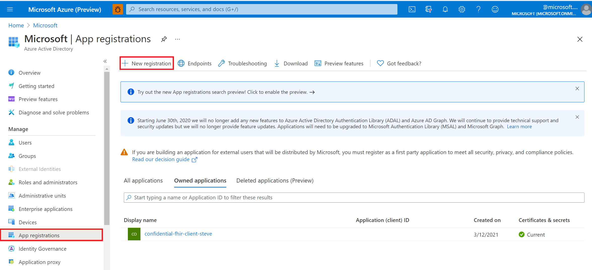
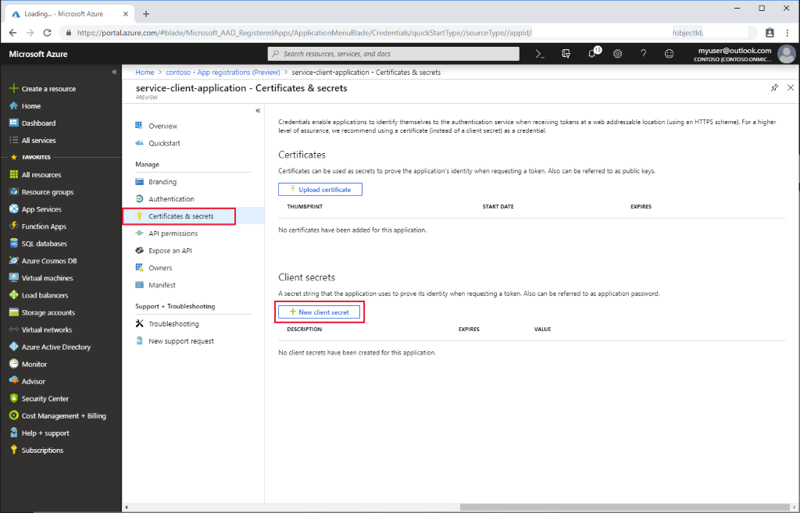

# Register a service client application in Azure Active Directory for Azure API for FHIR

[!INCLUDE [retirement banner](../includes/healthcare-apis-azure-api-fhir-retirement.md)]

In this article, you'll learn how to register a service client application in Azure Active Directory (Azure AD). Client application registrations are Azure AD representations of applications that can be used to authenticate and obtain tokens. A service client is intended to be used by an application to obtain an access token without interactive authentication of a user. It will have certain application permissions and use an application secret (password) when obtaining access tokens.

Follow these steps to create a new service client.

## App registrations in Azure portal

1. In the [Azure portal](https://portal.azure.com), navigate to **Azure Active Directory**.

2. Select **App registrations**.

    

3. Select **New registration**.

4. Give the service client a display name. Service client applications typically don't use a reply URL.

    :::image type="content" source="media/service-client-app/service-client-registration.png" alt-text="Azure portal. New Service Client App Registration.":::

5. Select **Register**.

## API permissions

Permissions for Azure API for FHIR are managed through RBAC. For more details, visit [Configure Azure RBAC for FHIR](configure-azure-rbac.md).

>[!NOTE]
>Use  grant_type of client_credentials when trying to otain an access token for Azure API for FHIR using tools such as Postman. For more details, visit [Testing the FHIR API on Azure API for FHIR](tutorial-web-app-test-postman.md).

## Application secret

The service client needs a secret (password) to obtain a token.

1. Select **Certificates & secrets**.
2. Select **New client secret**.

    

3. Provide a description and duration of the secret (either one year, two years or never).

4. Once the secret has been generated, it will only be displayed once in the portal. Make a note of it and store in a secure location.

## Next steps

In this article, you've learned how to register a service client application in Azure AD. Next, test access to your FHIR server using Postman.
 
>[!div class="nextstepaction"]
>[Access the FHIR service using Postman](./../fhir/use-postman.md)

FHIR&#174; is a registered trademark of [HL7](https://hl7.org/fhir/) and is used with the permission of HL7.
