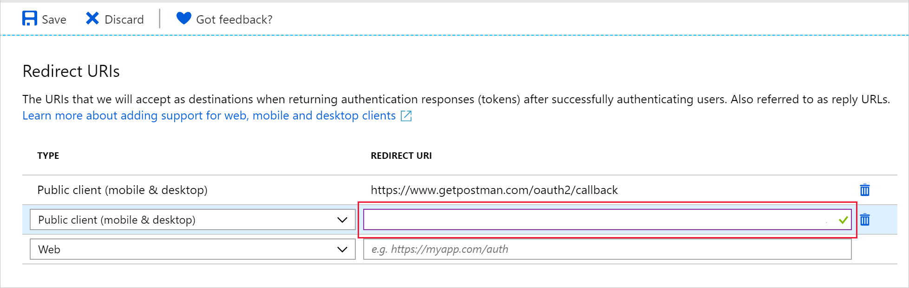

# SMART on FHIR overview

[!INCLUDE [retirement banner](../includes/healthcare-apis-azure-api-fhir-retirement.md)]

Substitutable Medical Applications and Reusable Technologies ([SMART on FHIR](https://docs.smarthealthit.org/)) is a healthcare standard through which applications can access clinical information through a data store. It adds a security layer based on open standards including OAuth2 and OpenID Connect, to FHIR interfaces to enable integration with EHR systems. Using SMART on FHIR provides at least three important benefits:
- Applications have a known method for obtaining authentication/authorization to a FHIR repository.
- Users accessing a FHIR repository with SMART on FHIR are restricted to resources associated with the user, rather than having access to all data in the repository.
- Users have the ability to grant applications access to a further limited set of their data by using SMART clinical scopes.

Below tutorials describe steps to enable SMART on FHIR applications with FHIR Service.

## Prerequisites

- An instance of the FHIR service
- .NET SDK 6.0
- [Enable cross-origin resource sharing (CORS)](configure-cross-origin-resource-sharing.md)
- [Register public client application in Microsoft Entra ID](/azure/healthcare-apis/azure-api-for-fhir/register-public-azure-ad-client-app)
     - After registering the application, make note of the applicationId for client application.
- Ensure you have access to Azure Subscription of FHIR service, to create resources and add role assignments.

## SMART on FHIR using Samples OSS (SMART on FHIR(Enhanced))

### Step 1: Set up FHIR SMART user role 
Follow the steps listed under section [Manage Users: Assign Users to Role](../../role-based-access-control/role-assignments-portal.md). Any user added to role - "FHIR SMART User" will be able to access the FHIR Service if their requests comply with the SMART on FHIR implementation Guide, such as request having access token, which includes a fhirUser claim and a clinical scopes claim.  The access granted to the users in this role will then be limited by the resources associated to their fhirUser compartment and the restrictions in the clinical scopes.

### Step 2: FHIR server integration with samples 
[Follow the steps](https://aka.ms/azure-health-data-services-smart-on-fhir-sample) under Azure Health Data and AI Samples OSS. This will enable integration of FHIR server with other Azure Services (such as APIM, Azure functions and more).

> [!NOTE]
> Samples are open-source code, and you should review the information and licensing terms on GitHub before using it. They are not part of the Azure Health Data Service and are not supported by Microsoft Support. These samples can be used to demonstrate how Azure Health Data Services and other open-source tools can be used together to demonstrate ONC (g)(10) compliance, using Microsoft Entra ID as the identity provider workflow. 


## SMART on FHIR proxy
<details>
                <summary> Click to expand! </summary>

> [!NOTE]
> This is another option to SMART on FHIR (Enhanced) mentioned above. SMART on FHIR Proxy option only enables EHR launch sequence.
### Step 1: Set admin consent for your client application

To use SMART on FHIR, you must first authenticate and authorize the app. The first time you use SMART on FHIR, you also must get administrative consent to let the app access your FHIR resources.

If you don't have an ownership role in the app, contact the app owner and ask them to grant admin consent for you in the app. 

If you do have administrative privileges, complete the following steps to grant admin consent to yourself directly. (You also can grant admin consent to yourself later when you're prompted in the app.) You can complete the same steps to add other users as owners, so they can view and edit this app registration.

To add yourself or another user as owner of an app:

1. In the Azure portal, go to Microsoft Entra ID.
2. In the left menu, select **App Registration**.
3. Search for the app registration you created, and then select it.
4. In the left menu, under **Manage**, select **Owners**.
5. Select **Add owners**, and then add yourself or the user you want to have admin consent.
6. Select **Save**

### Step 2: Enable the SMART on FHIR proxy

SMART on FHIR requires that `Audience` has an identifier URI equal to the URI of the FHIR service. The standard configuration of the Azure API for FHIR uses an `Audience` value of `https://azurehealthcareapis.com`. However, you can also set a value matching the specific URL of your FHIR service (for example `https://MYFHIRAPI.azurehealthcareapis.com`). This is required when working with the SMART on FHIR proxy.

To enable the SMART on FHIR proxy in the **Authentication** settings for your Azure API for FHIR instance, select the **SMART on FHIR proxy** check box:


The SMART on FHIR proxy acts as an intermediary between the SMART on FHIR app and Microsoft Entra ID. The authentication reply (the authentication code) must go to the SMART on FHIR proxy instead of the app itself. The proxy then forwards the reply to the app. 

Because of this two-step relay of the authentication code, you need to set the reply URL (callback) for your Microsoft Entra client application to a URL that is a combination of the reply URL for the SMART on FHIR proxy and the reply URL for the SMART on FHIR app. The combined reply URL takes this form:

```http
https://MYFHIRAPI.azurehealthcareapis.com/AadSmartOnFhirProxy/callback/aHR0cHM6Ly9sb2NhbGhvc3Q6NTAwMS9zYW1wbGVhcHAvaW5kZXguaHRtbA
```

In that reply, `aHR0cHM6Ly9sb2NhbGhvc3Q6NTAwMS9zYW1wbGVhcHAvaW5kZXguaHRtbA` is a URL-safe, base64-encoded version of the reply URL for the SMART on FHIR app. For the SMART on FHIR app launcher, when the app is running locally, the reply URL is `https://localhost:5001/sampleapp/index.html`. 

You can generate the combined reply URL by using a script like this:

```PowerShell
$replyUrl = "https://localhost:5001/sampleapp/index.html"
$fhirServerUrl = "https://MYFHIRAPI.azurewebsites.net"
$bytes = [System.Text.Encoding]::UTF8.GetBytes($ReplyUrl)
$encodedText = [Convert]::ToBase64String($bytes)
$encodedText = $encodedText.TrimEnd('=');
$encodedText = $encodedText.Replace('/','_');
$encodedText = $encodedText.Replace('+','-');

$newReplyUrl = $FhirServerUrl.TrimEnd('/') + "/AadSmartOnFhirProxy/callback/" + $encodedText
```

Add the reply URL to the public client application that you created earlier for Microsoft Entra ID:



### Step 3: Get a test patient

To test the Azure API for FHIR and the SMART on FHIR proxy, you'll need to have at least one patient in the database. If you've not interacted with the API yet, and you don't have data in the database, see [Access the FHIR service using Postman](./../fhir/use-postman.md) to load a patient. Make a note of the ID of a specific patient.

### Step 4: Download the SMART on FHIR app launcher

The open-source [FHIR Server for Azure repository](https://github.com/Microsoft/fhir-server) includes a simple SMART on FHIR app launcher and a sample SMART on FHIR app. In this tutorial, use this SMART on FHIR launcher locally to test the setup.

You can clone the GitHub repository and go to the application by using these commands:

```PowerShell
git clone https://github.com/Microsoft/fhir-server
cd fhir-server/samples/apps/SmartLauncher
```

The application needs a few configuration settings, which you can set in `appsettings.json`:

```json
{
    "FhirServerUrl": "https://MYFHIRAPI.azurehealthcareapis.com",
    "ClientId": "APP-ID",
    "DefaultSmartAppUrl": "/sampleapp/launch.html"
}
```

We recommend that you use the `dotnet user-secrets` feature:

```PowerShell
dotnet user-secrets set FhirServerUrl https://MYFHIRAPI.azurehealthcareapis.com
dotnet user-secrets set ClientId <APP-ID>
```

Use this command to run the application:

```PowerShell
dotnet run
```

### Step 5: Test the SMART on FHIR proxy

After you start the SMART on FHIR app launcher, you can point your browser to `https://localhost:5001`, where you should see the following screen:


When you enter **Patient**, **Encounter**, or **Practitioner** information, you'll notice that the **Launch context** is updated. When you're using the Azure API for FHIR, the launch context is simply a JSON document that contains information about patient, practitioner, and more. This launch context is base64 encoded and passed to the SMART on FHIR app as the `launch` query parameter. According to the SMART on FHIR specification, this variable is opaque to the SMART on FHIR app and passed on to the identity provider. 

The SMART on FHIR proxy uses this information to populate fields in the token response. The SMART on FHIR app *can* use these fields to control which patient it requests data for and how it renders the application on the screen. The SMART on FHIR proxy supports the following fields:

* `patient`
* `encounter`
* `practitioner`
* `need_patient_banner`
* `smart_style_url`

These fields are meant to provide guidance to the app, but they don't convey any security information. A SMART on FHIR application can ignore them.

Notice that the SMART on FHIR app launcher updates the **Launch URL** information at the bottom of the page. Select **Launch** to start the sample app.
</details>
     
## Migrate from SMART on FHIR Proxy to SMART on FHIR (Enhanced)
[!INCLUDE [Migrate from SMART on FHIR Proxy to Enhanced](../includes/smart-on-fhir-proxy-migration.md)]

## Next steps

Now that you've learned about enabling SMART on FHIR functionality, see the search samples page for details about how to search using search parameters, modifiers, and other FHIR search methods.

>[!div class="nextstepaction"]
>[FHIR search examples](search-samples.md)
     
FHIR&#174; is a registered trademark of [HL7](https://hl7.org/fhir/) and is used with the permission of HL7.
