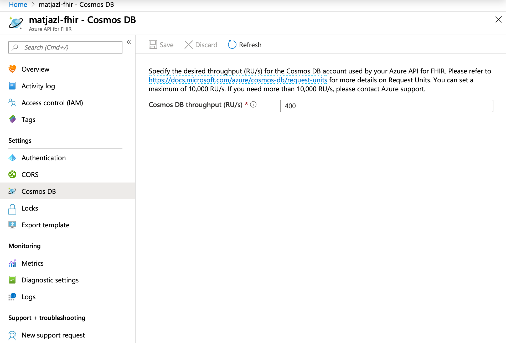

# Configure Cosmos DB settings 

Azure API for FHIR uses Cosmos DB as its underlying database to store FHIR data. When you provision new Azure API for FHIR service you have an option to specify number of RU (Requests Units) for Cosmos DB, that the service will use.

To learn more about what Cosmos DB RUs, please read [Request Units in Azure Cosmos DB](https://docs.microsoft.com/en-us/azure/cosmos-db/request-units)

To change this setting later after you provision the service, you can navigate to Cosmos DB in Azure API for FHIR portal and change the setting from initial value to desired value depending on your performance needs. You can change the value to up to 10,000*. If you need a higher value, contact Azure support.

***Note:** Higher value means higher Cosmos DB throughput and higher cost of the service.

