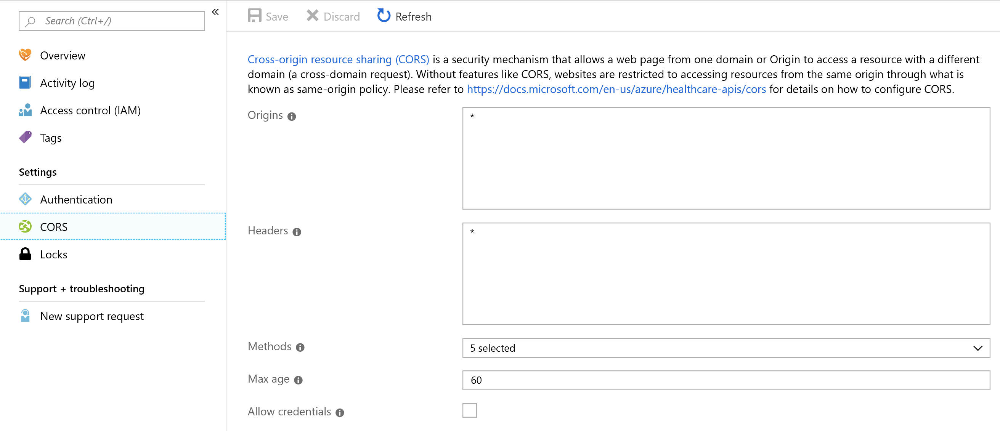

# Configure cross-origin resource sharing in the Azure API for FHIR

Azure API for Fast Healthcare Interoperability Resources (FHIR) supports [cross-origin resource sharing (CORS)](https://wikipedia.org/wiki/Cross-Origin_Resource_Sharing). CORS allows you to configure settings so that applications from one domain (origin) can access resources from a different domain, known as a cross-domain request.

CORS is often used in a single-page app that must call a RESTful API to a different domain.

To configure a CORS setting in the Azure API for FHIR, specify the following settings:

- **Origins (Access-Control-Allow-Origin)**. A list of domains allowed to make cross-origin requests to the Azure API for FHIR. Each domain (origin) must be entered in a separate line. You can enter an asterisk (*) to allow calls from any domain, but we don't recommend it because it's a security risk.

- **Headers (Access-Control-Allow-Headers)**. A list of headers that the origin request will contain. To allow all headers, enter an asterisk (*).

- **Methods (Access-Control-Allow-Methods)**. The allowed methods (PUT, GET, POST, and so on) in an API call. Choose **Select all** for all methods.

- **Max age (Access-Control-Max-Age)**. The value in seconds to cache preflight request results for Access-Control-Allow-Headers and Access-Control-Allow-Methods.

- **Allow credentials (Access-Control-Allow-Credentials)**. CORS requests normally don’t include cookies to prevent [cross-site request forgery (CSRF)](https://en.wikipedia.org/wiki/Cross-site_request_forgery) attacks. If you select this setting, the request can be made to include credentials, such as cookies. You can't configure this setting if you already set Origins with an asterisk (*).

>[!NOTE]
>You can't specify different settings for different domain origins. All settings (**Headers**, **Methods**, **Max age**, and **Allow credentials**) apply to all origins specified in the Origins setting.