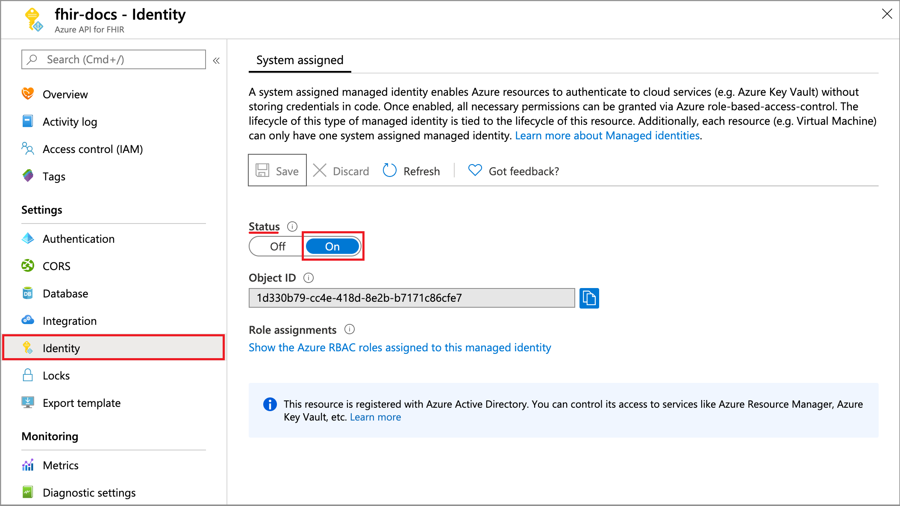

# Configure export settings and set up a storage account

FHIR service supports $export command that allows you to export the data out of FHIR service account to a storage account.

There are three steps involved in configuring export in FHIR service:

1. Enable Managed Identity on FHIR service Service.
2. Creating a Azure storage account (if not done before) and assigning permission to FHIR service to the storage account.
3. Selecting the storage account in FHIR service as export storage account.

## Enabling Managed Identity on FHIR service

The first step in configuring FHIR service for export is to enable system wide managed identity on the service. For more information about managed identities in Azure, see [About managed identities for Azure resources](../../active-directory/managed-identities-azure-resources/overview.md).

To do so, go to the FHIR service service and select **Identity**. Changing the status to **On** will enable managed identity in FHIR service Service.

Now, you can move to the next step by creating a storage account and assign permission to our service.

## Adding permission to storage account

The next step in export data is to assign permission for FHIR service service to write to the storage account.

After you've created a storage account, go to the **Access Control (IAM)** in the storage account, and then select **Add role assignment**. 

For more information about assigning roles in the Azure portal, see [Azure built-in roles](../../role-based-access-control/role-assignments-portal.md).

It is here that you'll add the role [Storage Blob Data Contributor](../../role-based-access-control/built-in-roles.md#storage-blob-data-contributor) to our service name, and then select **Save**.

Now you are ready to select the storage account in FHIR service as a default storage account for $export.

## Selecting the storage account for $export

The final step is to assign the Azure storage account that FHIR service will use to export the data to. To do this, go to **Integration** in FHIR service service and select the storage account.

After you've completed this final step, you are now ready to export the data using $export command.

> [!Note]
> Only storage accounts in the same subscription as that for FHIR service are allowed to be registered as the destination for $export operations.