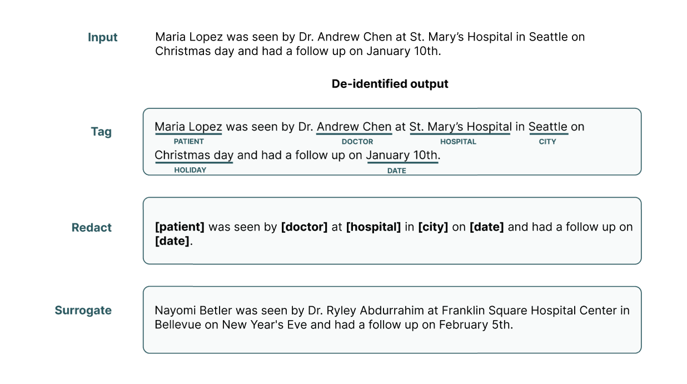
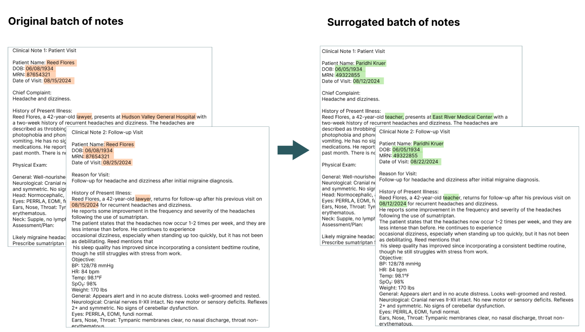
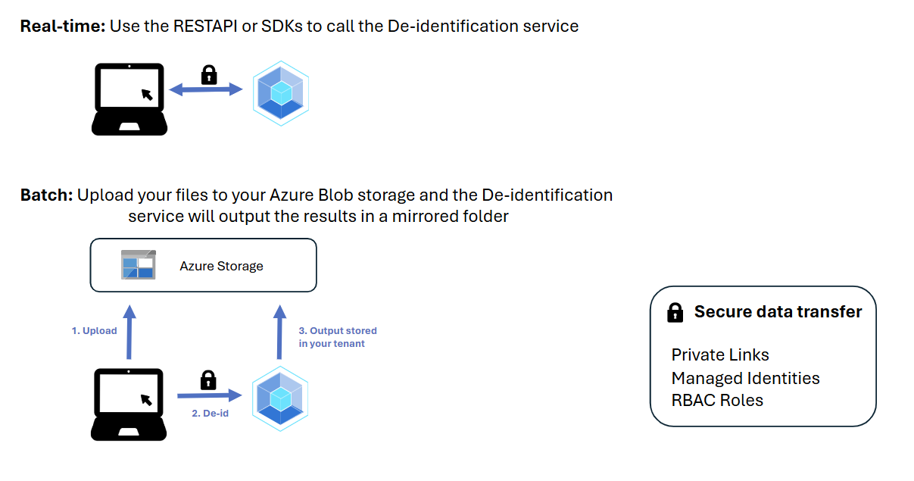

# What is the de-identification service?

The de-identification service in Azure Health Data Services enables healthcare organizations to de-identify clinical data so that the resulting data retains its clinical relevance and distribution while also adhering to the Health Insurance Portability and Accountability Act of 1996 (HIPAA) Privacy Rule. The service uses state-of-the-art machine learning models to automatically extract, redact, or surrogate 27 entities - including the HIPAA 18 Protected Health Information (PHI) identifiers – from unstructured text such as clinical notes, transcripts, messages, or clinical trial studies.

## How do you benefit from de-identifying your data? 

| As a                 | AHDS De-identification enables you to                                                               |
|-------------------------|----------------------------------------------------------------------------------------------------------|
| Data Scientist          | Use de-identified data to train robust machine learning models, build conversational agents, and conduct longitudinal studies. |
| Data Analyst            | Monitor trends, build dashboards, and analyze outcomes without compromising privacy.                     |
| Data Engineer           | Build and test dev environments using realistic, non-identifiable data for safer deployment.             |
| Customer Service Agent  | Summarize support conversations and extract insights while maintaining patient confidentiality.           |
| Executive Leader (C-Suite) | Reduce risks of data exposure, enable secure data sharing, drive AI adoption responsibly, and ensure regulatory compliance. |

## Why is this service the right fit for your use case? 

The de-identification service unlocks the power of your data by automating three operations: 

- **TAG** identifies and Tags PHI in your clinical text, specifying the entity types (i.e. Patient Name, Doctor Name, Age, etc.) 
- **REDACT** replaces the identified PHI in your clinical text with the entity types
- **SURROGATE** replaces the identified PHI in your clinical text with realistic pseudonyms (names of people, organizations, hospitals) and randomizes number based PHI (dates and alphanumeric entities such as ID Numbers and more)

> [!TIP]
> **Surrogation**, or synthetic replacement, is a best practice for PHI protection. The service can replace PHI elements with plausible replacement values, resulting in data that is most representative of the source data. Surrogation strengthens privacy protections as any false-negative PHI values are hidden within a document.

### **Consistent replacement to preserve patient timelines**
Consistent surrogation results enable organizations to retain relationships occurring in the underlying dataset, which is critical for research, analytics, and machine learning. By submitting data in the same batch, our service allows for consistent replacement across entities and preserves the relative temporal relationships between events.

## De-identify clinical data securely and efficiently

The de-identification service offers many benefits, including:

- **Expanded PHI coverage:**
The service expands beyond the 18 HIPAA Identifiers to provide stronger privacy protections and more fine-grained distinctions between entity types. It distinguishes between Doctor and Patient, and covers [27 PHI entities the service de-identifies](/rest/api/health-dataplane/deidentify-text/deidentify-text?view=rest-health-dataplane-2024-11-15&tabs=HTTP#phicategory).

- **PHI compliance**: The de-identification service is designed for protected health information (PHI). The service uses machine learning to identify PHI entities, including HIPAA’s 18 identifiers, using the “TAG” operation. The redaction and surrogation operations replace these identified PHI values with a tag of the entity type or a surrogate, or pseudonym. The service adheres to compliance requirements such as HIPAA.

- **Security**: The de-identification service is a stateless service. Customer data stays within the customer’s tenant.

- **Role-based Access Control (RBAC)**: Azure role-based access control (RBAC) enables you to manage how your organization's data is processed, stored, and accessed. You determine who has access to de-identify datasets based on roles you define for your environment.

## Easy API Integration Into Your Workflow

Integrating Azure’s de-identification service into your environment is fast, flexible, and secure — built from the ground up to support health and life sciences workflows with minimal effort.

- **API-First Design:** Whether you need real-time de-identification or asynchronous batch processing from Azure Blob Storage, our REST API and SDKs provide easy integration points to fit your system.

- **Quick Setup:** Deploy the service in minutes using Azure portal, ARM templates, Bicep, or CLI. You can be up and running quickly without complex configuration.

- **Secure Access:** Enable private endpoints using Azure Private Link to keep data traffic off the public internet.

- **Fully Managed Identity Support:** Use managed identities for secure, credential-free access to Azure Blob Storage.

- **Compliance-Ready:** The service operates within your Azure tenant and adheres with HIPAA.

## Synchronous or asynchronous endpoints

The de-identification service offers two ways to interact with the REST API or Client library (Azure SDK).

- Directly submit raw unstructured text for analysis. The API output is returned in your application.
- Submit a job to asynchronously endpoint process files in bulk from Azure Blob Storage using tag, redact, or surrogation with consistency within a job.

## Input requirements and service limits

The de-identification service is designed to receive unstructured text. To de-identify data stored in the FHIR&reg; service, see [Export de-identified data](/azure/healthcare-apis/fhir/deidentified-export).

The following service limits are applicable:
- Requests can't exceed 50 KB.
- Jobs can process no more than 10,000 documents.
- Each document processed by a job can't exceed 2 MB.

## Pricing

The de-identification service pricing is dependent on the amount of data de-identified by our service. 
You are charged per MB, for any of the three operations we offer, whether you are using the asynchronous or synchronous endpoint. 

The cost per MB de-identified is displayed in the row "Unstructured De-identification" in the table "Transformation Operations" in the [Azure Pricing Page](https://azure.microsoft.com/pricing/details/health-data-services/?msockid=2982a916bc2461731022bd6cbdbd6053#pricing)
 
You also have a monthly allotment of 50 MB that enables you to try the product for free.

The [Azure Pricing Calculator](https://azure.microsoft.com/pricing/calculator/) helps you estimate the cost based on your use case. 

When you choose to store documents in Azure Blob Storage, you are charged based on Azure Storage pricing. 

## Responsible use of AI

An AI system includes the technology, the people who use it, the people affected by it, and the environment where you deploy it. Read the transparency note for the de-identification service to learn about responsible AI use and deployment in your systems.

## Next steps

> [!div class="nextstepaction"]
> [Quickstart: Deploy the de-identification service](quickstart.md)

- [Integration and responsible use](/legal/cognitive-services/language-service/guidance-integration-responsible-use?context=%2Fazure%2Fai-services%2Flanguage-service%2Fcontext%2Fcontext)
- [Data, privacy, and security](/legal/cognitive-services/language-service/data-privacy?context=%2Fazure%2Fai-services%2Flanguage-service%2Fcontext%2Fcontext)
