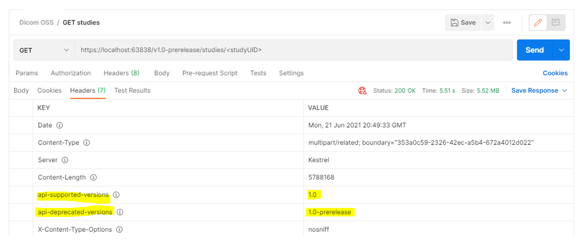

# API versioning for DICOM service

This reference guide provides you with an overview of the API version policies for the DICOM&reg; service. 

## Specifying version of REST API in requests

The version of the REST API must be explicitly specified in the request URL as in the following example:

`<service_url>/v<version>/studies`

Routes without a version aren't supported.

## Supported versions

Currently the supported versions are:

* v1.0-prerelease
* v1
* v2

The OpenAPI Doc for the supported versions can be found at the following url:

`<service_url>/v<version>/api.yaml`

## DICOM Conformance Statement
All versions of the DICOM APIs conform to the DICOMweb™ Standard specifications, but different versions might expose different APIs.  See the specific version of the conformance statement for details:

* [DICOM Conformance Statement v1](dicom-services-conformance-statement.md)
* [DICOM Conformance Statement v2](dicom-services-conformance-statement-v2.md)


## Prerelease versions

An API version with the label "prerelease" indicates that the version isn't ready for production, and it should only be used in testing environments. These endpoints might experience breaking changes without notice.

## How versions are incremented

We currently only increment the major version whenever there's a breaking change, which is considered to be not backwards compatible. 

Here are some examples of breaking changes (Major version is incremented):

* Renaming or removing endpoints.
* Removing parameters or adding mandatory parameters.
* Changing status code.
* Deleting a property in a response, or altering a response type at all. It's okay to add properties to the response.
* Changing the type of a property.
* Behavior when an API changes such as changes in business logic used to do foo, but it now does bar.

Nonbreaking changes (Version isn't incremented):

* Addition of properties that are nullable or have a default value.
* Addition of properties to a response model.
* Changing the order of properties.

## Header in response

ReportApiVersions is turned on, which means the system returns the headers api-supported-versions and api-deprecated-versions when appropriate.

* api-supported-versions lists which versions are supported for the requested API. It's only returned when calling an endpoint annotated with `ApiVersion("<someVersion>")`.

* api-deprecated-versions lists which versions have been deprecated for the requested API. It's only returned when calling an endpoint annotated with `ApiVersion("<someVersion>", Deprecated = true)`.

Example:

```
[ApiVersion("1")]
[ApiVersion("1.0-prerelease", Deprecated = true)]
```

[  ](media/api-supported-deprecated-versions.png#lightbox)

[!INCLUDE [DICOM trademark statement](../includes/healthcare-apis-dicom-trademark.md)]
