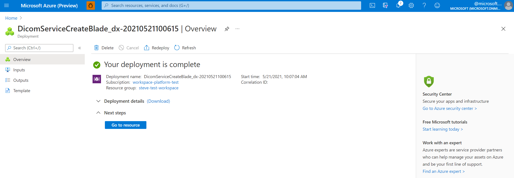

# Deploy the DICOM service with Data Lake Storage (Preview)

In this quickstart, you learn how to deploy the DICOM&reg; service with Data Lake Storage by using the Azure portal.

After deployment is finished, you can use the Azure portal to go to the newly created DICOM service to see the details, including your service URL. The service URL to access your DICOM service is ```https://<workspacename-dicomservicename>.dicom.azurehealthcareapis.com```. Make sure to specify the version as part of the URL when you make requests. For more information, see [API versioning for the DICOM service](api-versioning-dicom-service.md).

## Prerequisites

- **Deploy an Azure Health Data Services workspace**.  For more information, see [Deploy a workspace in the Azure portal](../healthcare-apis-quickstart.md).
- **Create a storage account with a hierarchical namespace**.  For more information, see [Create a storage account to use with Azure Data Lake Storage Gen2](/articles/storage/blobs/create-data-lake-storage-account.md).
- **Create a new blob container in the storage account**.  This container will be used by the DICOM service to store DICOM files.  For more information, see [Manage blob containers using the Azure portal](/articles/storage/blobs/blob-containers-portal.md)
- **A user-assigned managed identity**. This identit must be assigned the role of Storage Blob Data Contributor for the storage account.  For more information see, [Manage user-assigned managed identities](https://learn.microsoft.com/entra/identity/managed-identities-azure-resources/how-manage-user-assigned-managed-identities)


## Deploy the DICOM service with Data Lake Storage

1. On the **Resource group** page of the Azure portal, select the name of your **Azure Health Data Services workspace**.

   :::image type="content" source="media/deploy-data-lake/resource-group.png" alt-text="Screenshot that shows a Health Data Services Workspace in the resource group view in the Azure portal." lightbox="media/deploy-data-lake/resource-group.png":::

1. Select **Deploy DICOM service**.

   :::image type="content" source="media/deploy-data-lake/workspace-deploy-dicom.png" alt-text="Screenshot that shows a Health Data Services Workspace in the resource group view in the Azure portal." lightbox="media/deploy-data-lake/workspace-deploy-dicom.png":::

1. Select **Add DICOM service**.

   [ ](media/add-dicom-service.png#lightbox)

1. Enter a name for the DICOM service.

1. Select 

    :::image type="content" source="media/system-assigned-managed-identity.png" alt-text="Screenshot that shows the system-assigned managed identity toggle on the Identity page." lightbox="media/system-assigned-managed-identity.png":::

1. (Optional) Select **Next: Tags**.

    Tags are name/value pairs used for categorizing resources. For more information about tags, see [Use tags to organize your Azure resources and management hierarchy](../../azure-resource-manager/management/tag-resources.md).

1. When you notice the green validation check mark, select **Create** to deploy the DICOM service.

1. After the deployment process is finished, select **Go to resource**.

   [ ](media/go-to-resource.png#lightbox)

   The result of the newly deployed DICOM service is shown here.

   [ ](media/results-deployed-dicom-service.png#lightbox)

## Next steps

* [Assign roles for the DICOM service](../configure-azure-rbac.md#assign-roles-for-the-dicom-service)
* [Use DICOMweb Standard APIs with DICOM services](dicomweb-standard-apis-with-dicom-services.md)

[!INCLUDE [DICOM trademark statement](../includes/healthcare-apis-dicom-trademark.md)]