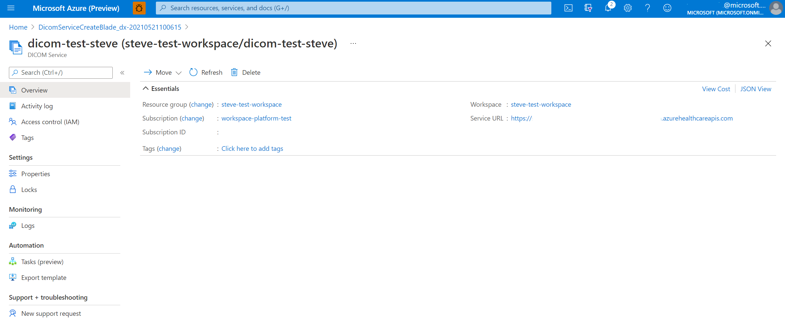

# Deploy the DICOM service

In this quickstart, you'll learn how to deploy DICOM&reg; service using the Azure portal.

Once deployment is complete, you can use the Azure portal to navigate to the newly created DICOM service to see the details including your service URL. The service URL to access your DICOM service  will be: ```https://<workspacename-dicomservicename>.dicom.azurehealthcareapis.com```. Make sure to specify the version as part of the url when making requests. More information can be found in the [API Versioning for DICOM service documentation](api-versioning-dicom-service.md).

## Prerequisites

To deploy the DICOM service, you need a workspace created in the Azure portal. For more information, see [Deploy a workspace in the Azure portal](../healthcare-apis-quickstart.md).

## Deploying DICOM service

1. On the **Resource group** page of the Azure portal, select the name of your **Azure Health Data Services workspace**.

   [  ](media/select-workspace-resource-group.png#lightbox)

2. Select **Deploy DICOM service**.

   [  ](media/workspace-deploy-dicom-services.png#lightbox)


3. Select **Add DICOM service**.

   [  ](media/add-dicom-service.png#lightbox)


4. Enter a name for DICOM service, and then select **Review + create**. 

    [  ](media/enter-dicom-service-name.png#lightbox)


   (**Optional**) Select **Next: Tags >**.

    Tags are name/value pairs used for categorizing resources. For information about tags, see [Use tags to organize your Azure resources and management hierarchy](../../azure-resource-manager/management/tag-resources.md).

5. When you notice the green validation check mark, select **Create** to deploy DICOM service.

6. When the deployment process completes, select **Go to resource**.  

   [  ](media/go-to-resource.png#lightbox)

   The result of the newly deployed DICOM service is shown below.

   [  ](media/results-deployed-dicom-service.png#lightbox)


## Next steps

[Assign roles for the DICOM service](../configure-azure-rbac.md#assign-roles-for-the-dicom-service)

[Use DICOMweb Standard APIs with DICOM services](dicomweb-standard-apis-with-dicom-services.md)

[!INCLUDE [DICOM trademark statement](../includes/healthcare-apis-dicom-trademark.md)]