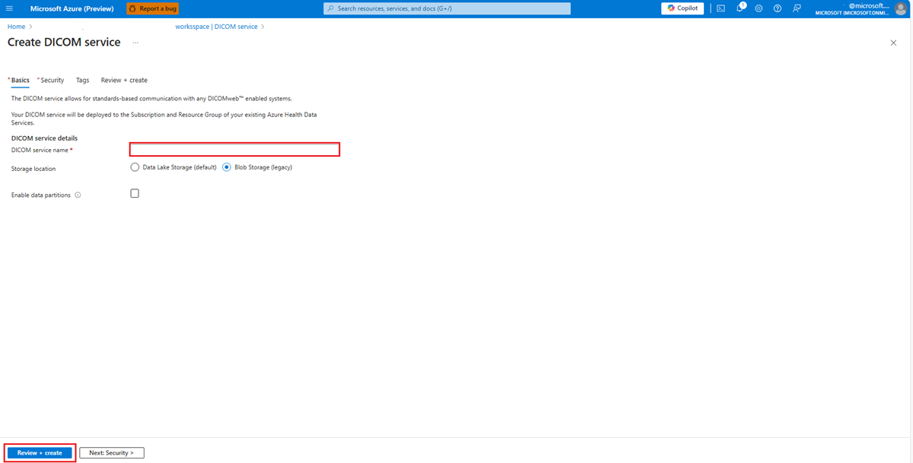

# Deploy the DICOM service with Blob storage by using the Azure portal

In this quickstart, you learn how to deploy the DICOM&reg; service by using the Azure portal.

After deployment completes, you can use the Azure portal to see the details about the DICOM service, including the service URL. The service URL to access your DICOM service is ```https://<workspacename-dicomservicename>.dicom.azurehealthcareapis.com```. Make sure to specify the API version as part of the URL when you make requests. For more information, see [API versioning for the DICOM service](api-versioning-dicom-service.md).

> [!NOTE]
> The DICOM service with Azure Data Lake Storage is generally available. This capability provides greater flexibility and control over your imaging data. Learn more: [Deploy the DICOM service with Azure Data Lake Storage](deploy-dicom-services-in-azure-data-lake.md)

## Prerequisites

To deploy the DICOM service, you need a workspace created in the Azure portal. For more information, see [Deploy a workspace in the Azure portal](../healthcare-apis-quickstart.md).

## Deploy the DICOM service

1. On the **Resource group** page of the Azure portal, select the name of your **Azure Health Data Services workspace**.

:::image type="content" source="media/select-workspace-resource-group.png" alt-text="Screenshot showing selecting a workspace resource group." lightbox="media/select-workspace-resource-group.png":::


2. Select **Deploy DICOM service**.

:::image type="content" source="media/workspace-deploy-dicom-services.png" alt-text="Screenshot showing deployment of the DICOM service." lightbox="media/workspace-deploy-dicom-services.png":::


3. Select **Add DICOM service**.

:::image type="content" source="media/add-dicom-service.png" alt-text="Screenshot showing how to add the DICOM service." lightbox="media/add-dicom-service.png":::


4. Enter a name for the DICOM service.  
- Select Blob Storage (legacy) for the storage location.  
- (Optional) Select **Enable data partitions** when you deploy a new DICOM service. After data partitioning is turned on, it can't be turned off. In addition, data partitions can't be turned on for any DICOM service that is already deployed.For more information, see : [Enable data partitioning](data-partitions.md)

- After the data partitions setting is turned on, the capability modifies the API surface of the DICOM server and makes any previous data accessible under the `Microsoft.Default` partition and then select **Review + create**




5. (Optional) Select **Next: Tags**.

    Tags are name/value pairs used for categorizing resources. For more information about tags, see [Use tags to organize your Azure resources and management hierarchy](../../azure-resource-manager/management/tag-resources.md).

6. When you notice the green validation check mark, select **Create** to deploy the DICOM service.

7. After the deployment process is finished, select **Go to resource**.

:::image type="content" source="media/go-to-resource.png" alt-text="Screenshot showing Go to resource." lightbox="media/go-to-resource.png":::

   The result of the newly deployed DICOM service is shown here.

:::image type="content" source="media/results-deployed-dicom-service.png" alt-text="Screenshot showing the DICOM finished deployment." lightbox="media/results-deployed-dicom-service.png":::

## Next steps

* [Assign roles for the DICOM service](../configure-azure-rbac.md#assign-roles-for-the-dicom-service)
* [Use DICOMweb Standard APIs with DICOM services](dicomweb-standard-apis-with-dicom-services.md)

[!INCLUDE [DICOM trademark statement](../includes/healthcare-apis-dicom-trademark.md)]
