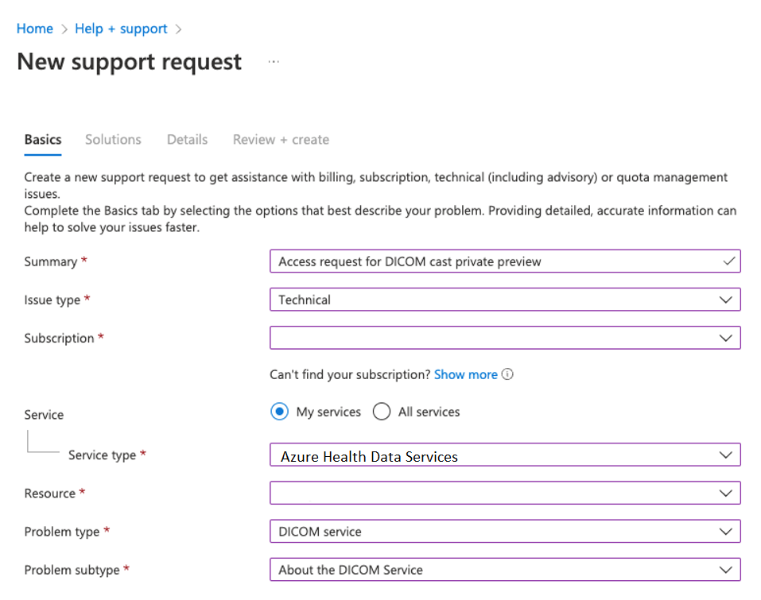
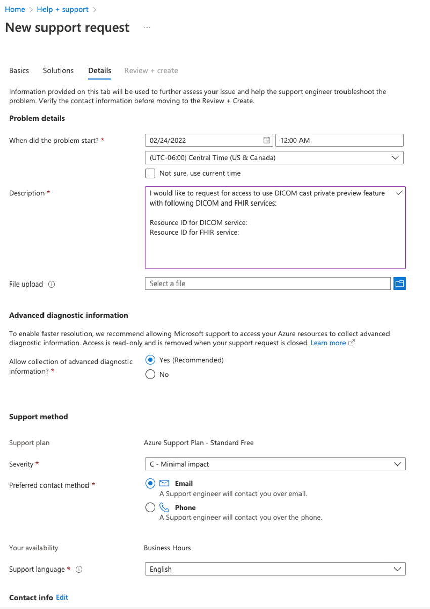

# DICOMcast access request

This article describes how to request DICOMcast access.

## Create Azure support ticket

To enable DICOMcast for your Azure subscription, please request access for DICOMcast by opening an [Azure support ticket](https://azure.microsoft.com/support/create-ticket/). 

> [!IMPORTANT]
> Ensure that you include the **resource IDs** of your DICOM service and FHIR service when you submit a support ticket.

### Basics tab

1. In the **Summary** field, enter  "Access request for DICOMcast".
 
   

1. Select the **Issue type** drop-down list, and then select **Technical**.
1. Select the **Subscription** drop-down list, and then select your Azure subscription.
1. Select the **Service type** drop-down list, and then select **Azure Health Data Services**.
1. Select the **Resource** drop-down list, and then select your resource.
1. Select the **Problem** drop-down list, and then select **DICOM service**.
1. Select the **Problem subtype** drop-down list, and then select **About the DICOM service**.
1. Select **Next Solutions**.
1. From the **Solutions** tab, select **Next Details**.

### Details tab

1. Under the **Problem details** section, select today's date to submit your support request. You may keep the default time as 12:00AM.

   

1. In the **Description** box, ensure to include the Resource IDs of your FHIR service and DICOM service.

   > [!NOTE]
   > To obtain your DICOM service and FHIR service resource IDs, select your DICOM service instance in the Azure portal, and select the **Properties** blade that's listed under **Settings**.

1. File upload isn't required, so you may omit this option.
1. Under the **Support method** section, select the **Severity** and the **Preferred contact method** options.
1. Select **Next: Review + Create >>**.
1. In the **Review + create** tab, select **Create** to submit your Azure support ticket. 

## Next steps

This article described the steps for creating an Azure support ticket to request DICOMcast access. For more information about using the DICOM service, see

>[!div class="nextstepaction"]
>[Deploy DICOM service to Azure](deploy-dicom-services-in-azure.md)

For more information about DICOMcast, see

>[!div class="nextstepaction"]
>[DICOMcast overview](dicom-cast-overview.md)

FHIR&#174; is a registered trademark of [HL7](https://hl7.org/fhir/) and is used with the permission of HL7.
