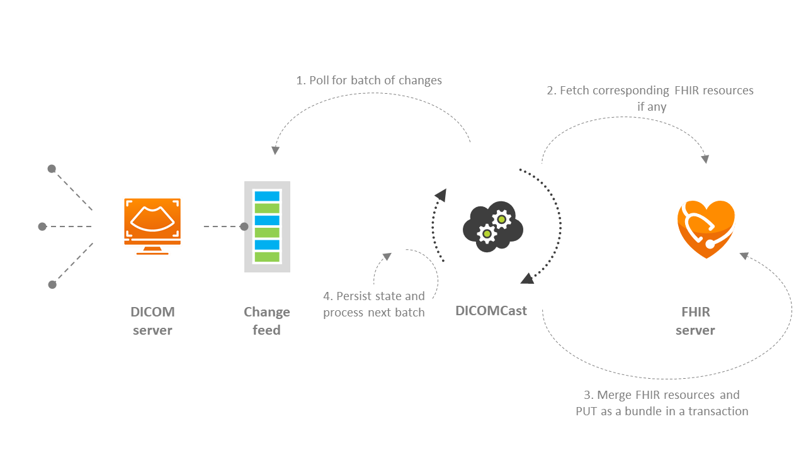

# DICOMcast overview

DICOMcast offers customers the ability to synchronize the data from a DICOM service to a [FHIR service](../../healthcare-apis/fhir/overview.md), which allows healthcare organizations to integrate clinical and imaging data. DICOMcast expands the use cases for health data by supporting both a streamlined view of longitudinal patient data and the ability to effectively create cohorts for medical studies, analytics, and machine learning.

## Architecture

1. **Poll for batch of changes**: DICOMcast polls for any changes via the [Change Feed](dicom-change-feed-overview.md), which captures any changes that occur in your Medical Imaging Server for DICOM.
1. **Fetch corresponding FHIR resources, if any**: If any DICOM service changes and correspond to FHIR resources, DICOMcast will fetch the related FHIR resources. DICOMcast synchronizes DICOM tags to the FHIR resource types *Patient* and *ImagingStudy*.
1. **Merge FHIR resources and 'PUT' as a bundle in a transaction**: The FHIR resources corresponding to the DICOMcast captured changes will be merged. The FHIR resources will be 'PUT' as a bundle in a transaction into your FHIR service.
1. **Persist state and process next batch**: DICOMcast will then persist the current state to prepare for next batch of changes.

The current implementation of DICOMcast:

- Supports a single-threaded process that reads from the DICOM change feed and writes to a FHIR service.
- Is hosted by Azure Container Instance in our sample template, but can be run elsewhere.
- Synchronizes DICOM tags to *Patient* and *ImagingStudy*  FHIR resource types*.
- Is configurated to ignore invalid tags when syncing data from the change feed to FHIR resource types.
    - If `EnforceValidationOfTagValues` is enabled, then the change feed entry won't be written to the FHIR service unless every tag that's mapped is valid. For more information, see the [Mappings](#mappings) section below.
    - If `EnforceValidationOfTagValues` is disabled (default), and if a value is invalid, but it's not required to be mapped, then that particular tag won't be mapped. The rest of the change feed entry will be mapped to FHIR resources. If a required tag is invalid, then the change feed entry won't be written to the FHIR service. For more information about the required tags, see [Patient](#patient) and [Imaging Study](#imagingstudy)
- Logs errors to Azure Table Storage.
    - Errors occur when processing change feed entries that are persisted in Azure Table storage that are in different tables.
        - `InvalidDicomTagExceptionTable`: Stores information about tags with invalid values. Entries here don't necessarily mean that the entire change feed entry wasn't stored in FHIR service, but that the particular value had a validation issue.
        - `DicomFailToStoreExceptionTable`: Stores information about change feed entries that weren't stored to FHIR service due to an issue with the change feed entry (such as invalid required tag). All entries in this table weren't stored to FHIR service.
        - `FhirFailToStoreExceptionTable`: Stores information about change feed entries that weren't stored to FHIR service due to an issue with the FHIR service (such as conflicting resource already exists). All entries in this table weren't stored to FHIR service.
        - `TransientRetryExceptionTable`: Stores information about change feed entries that faced a transient error (such as FHIR service too busy) and are being retried. Entries in this table note how many times they've been retried, but it doesn't necessarily mean that they eventually failed or succeeded to store to FHIR service.
        - `TransientFailureExceptionTable`: Stores information about change feed entries that had a transient error, and went through the retry policy and still failed to store to FHIR service. All entries in this table failed to store to FHIR service.

## Mappings

The current implementation of DICOMcast has the following mappings:

### Patient

| Property | Tag ID | Tag Name | Required Tag?| Note |
| :------- | :----- | :------- | :----- | :----- |
| Patient.identifier.where(system = '') | (0010,0020) | PatientID | Yes | For now, the system will be empty string. We'll add support later for allowing the system to be specified. |
| Patient.name.where(use = 'usual') | (0010,0010) | PatientName | No | PatientName will be split into components and added as HumanName to the Patient resource. |
| Patient.gender | (0010,0040) | PatientSex | No | |
| Patient.birthDate | (0010,0030) | PatientBirthDate | No | PatientBirthDate only contains the date. This implementation assumes that the FHIR and DICOM services have data from the same time zone. |

### Endpoint

| Property | Tag ID | Tag Name | Note |
| :------- | :----- | :------- | :--- |
| Endpoint.status ||| The value 'active' will be used when creating the endpoint. |
| Endpoint.connectionType ||| The system 'http://terminology.hl7.org/CodeSystem/endpoint-connection-type' and value 'dicom-wado-rs' will be used when creating the endpoint. |
| Endpoint.address ||| The root URL to the DICOMWeb service will be used when creating the endpoint. The rule is described in 'http://hl7.org/fhir/imagingstudy.html#endpoint'. |

### ImagingStudy

| Property | Tag ID | Tag Name | Required | Note |
| :------- | :----- | :------- | :--- | :--- |
| ImagingStudy.identifier.where(system = 'urn:dicom:uid') | (0020,000D) | StudyInstanceUID | Yes | The value will have prefix of `urn:oid:`. |
| ImagingStudy.status | | | No | The value 'available' will be used when creating ImagingStudy. |
| ImagingStudy.modality | (0008,0060) | Modality | No | |
| ImagingStudy.subject | | | No | It will be linked to the [Patient](#mappings). |
| ImagingStudy.started | (0008,0020), (0008,0030), (0008,0201) | StudyDate, StudyTime, TimezoneOffsetFromUTC | No | Refer to the section for details about how the [timestamp](#timestamp) is constructed. |
| ImagingStudy.endpoint | | | | It will be linked to the [Endpoint](#endpoint). |
| ImagingStudy.note | (0008,1030) | StudyDescription | No | |
| ImagingStudy.series.uid | (0020,000E) | SeriesInstanceUID | Yes | |
| ImagingStudy.series.number | (0020,0011) | SeriesNumber | No | |
| ImagingStudy.series.modality | (0008,0060) | Modality | Yes | |
| ImagingStudy.series.description | (0008,103E) | SeriesDescription | No | |
| ImagingStudy.series.started | (0008,0021), (0008,0031), (0008,0201) | SeriesDate, SeriesTime, TimezoneOffsetFromUTC | No | Refer to the section for details about how the [timestamp](#timestamp) is constructed. |
| ImagingStudy.series.instance.uid | (0008,0018) | SOPInstanceUID | Yes | |
| ImagingStudy.series.instance.sopClass | (0008,0016) | SOPClassUID | Yes | |
| ImagingStudy.series.instance.number | (0020,0013) | InstanceNumber | No| |
| ImagingStudy.identifier.where(type.coding.system='http://terminology.hl7.org/CodeSystem/v2-0203' and type.coding.code='ACSN')) | (0008,0050) | Accession Number | No | Refer to http://hl7.org/fhir/imagingstudy.html#notes. |

### Timestamp

DICOM has different date time VR types. Some tags (like Study and Series) have the date, time, and UTC offset stored separately. This means that the date might be partial. This code attempts to translate this into a partial date syntax allowed by the FHIR service.

## Summary

In this concept, we reviewed the architecture and mappings of DICOMcast. This feature is available on demand. To enable DICOMcast for your Azure subscription, please request access for DICOMcast by opening an [Azure support ticket](https://azure.microsoft.com/support/create-ticket/). For more information about requesting access to DICOMcast, see [DICOMcast request access](dicom-cast-access-request.md). 

> [!IMPORTANT]
> Ensure that you include the **resource IDs** of your DICOM service and FHIR service when you submit a support ticket. 

 
## Next steps

To get started using the DICOM service, see

>[!div class="nextstepaction"]
>[Deploy DICOM service to Azure](deploy-dicom-services-in-azure.md)

>[!div class="nextstepaction"]
>[Using DICOMweb&trade;Standard APIs with DICOM service](dicomweb-standard-apis-with-dicom-services.md)

FHIR&#174; is a registered trademark of [HL7](https://hl7.org/fhir/) and is used with the permission of HL7.