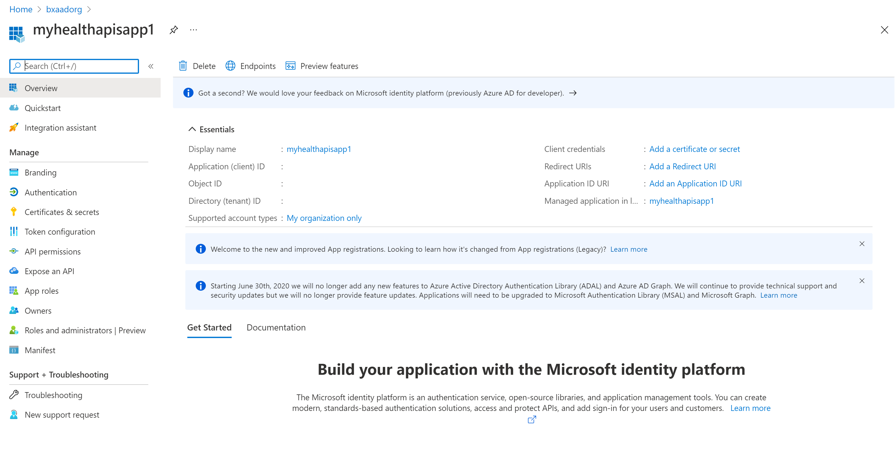
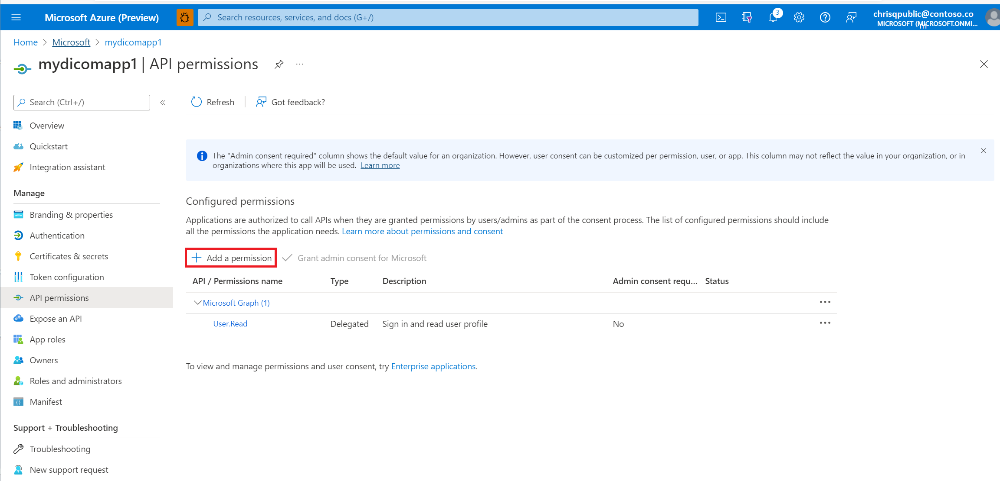
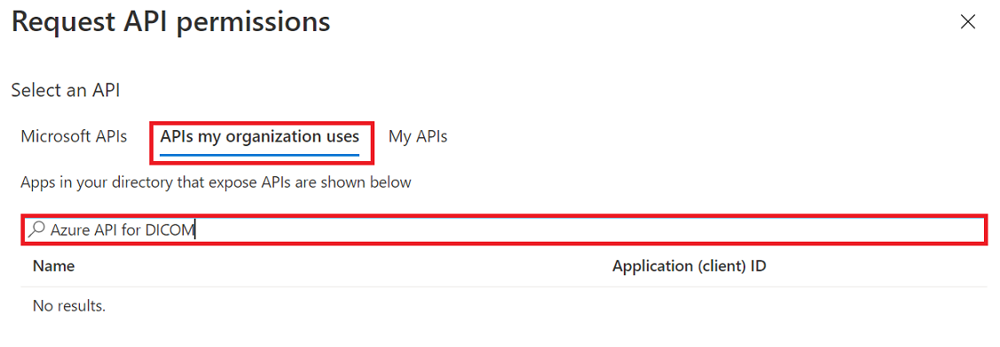
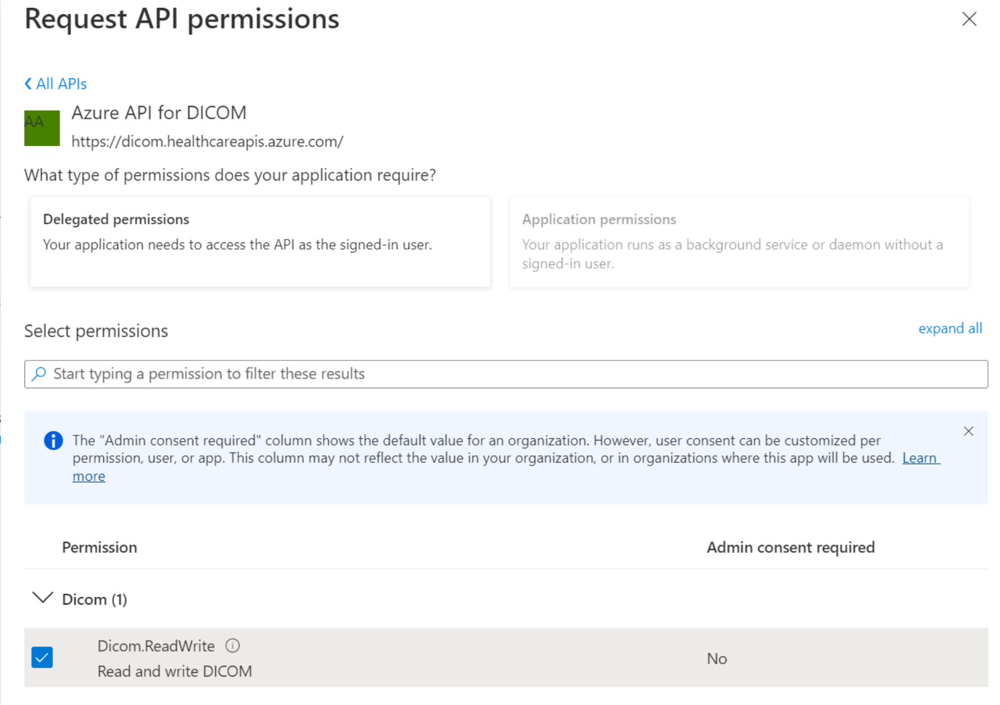

# Register a client application for the DICOM service

In this article, you learn how to register a client application for the DICOM&reg; service. You can find more information on [Register an application with the Microsoft identity platform](../../active-directory/develop/quickstart-register-app.md).

## Register a new application

1. In the [Azure portal](https://portal.azure.com), select **Microsoft Entra ID**.
1. Select **App registrations**.

   

1. Select **New registration**.
1. For **Supported account types**, select **Accounts in this organizational directory only**. Leave the other options as is.

   

1. Select **Register**.

## Application ID (client ID)

After you register a new application, you can find the **Application (client) ID** and **Directory (tenant) ID** from the **Overview** menu option. Make a note of the values for use later.

## Authentication setting: Confidential vs. public

Select **Authentication** to review the settings. The default value for **Allow public client flows** is **No**.

If you keep this default value, the application registration is a **confidential client application** and a certificate or secret is required.

If you change the default value to **Yes** for the **Allow public client flows** option in the **Advanced** setting, the application registration is a **public client application** and a certificate or secret isn't required. The **Yes** value is useful when you want to use the client application in your mobile app or a JavaScript app where you don't want to store any secrets.

For tools that require a redirect URL, select **Add a platform** to configure the platform.

> [!NOTE]
> For Postman, select **Mobile and desktop applications**. Enter `https://www.getpostman.com/oauth2/callback` in the **Custom redirect URIs** section. Select **Configure** to save the setting.

## Certificates & secrets

Select **Certificates & secrets** and select **New client secret**.

Add and then copy the secret value.

Optionally, you can upload a certificate (public key) and use the Certificate ID, a GUID value associated with the certificate. For testing purposes, you can create a self-signed certificate using tools such as the PowerShell command line, `New-SelfSignedCertificate`, and then export the certificate from the certificate store.

## API permissions

The following steps are required for the DICOM service. In addition, user access permissions or role assignments for Azure Health Data Services are managed through role-based access control (RBAC). For more information, see [Configure Azure RBAC for Azure Health Data Services](./../configure-azure-rbac.md).

1. Select the **API permissions** pane.

   

1. Select **Add a permission**.

   Add a permission to the DICOM service by searching for **Azure API for DICOM** under **APIs my organization uses**.

   

   The search result for Azure API for DICOM only returns if you've already deployed the DICOM service in the workspace.

   If you're referencing a different resource application, select your DICOM API resource application registration that you created previously under **APIs my organization uses**.

1. Select scopes (permissions) that the confidential client application asks for on behalf of a user. Select **Dicom.ReadWrite**, and then select **Add permissions**.

   

Your application registration is now finished.

[!INCLUDE [DICOM trademark statement](../includes/healthcare-apis-dicom-trademark.md)]

