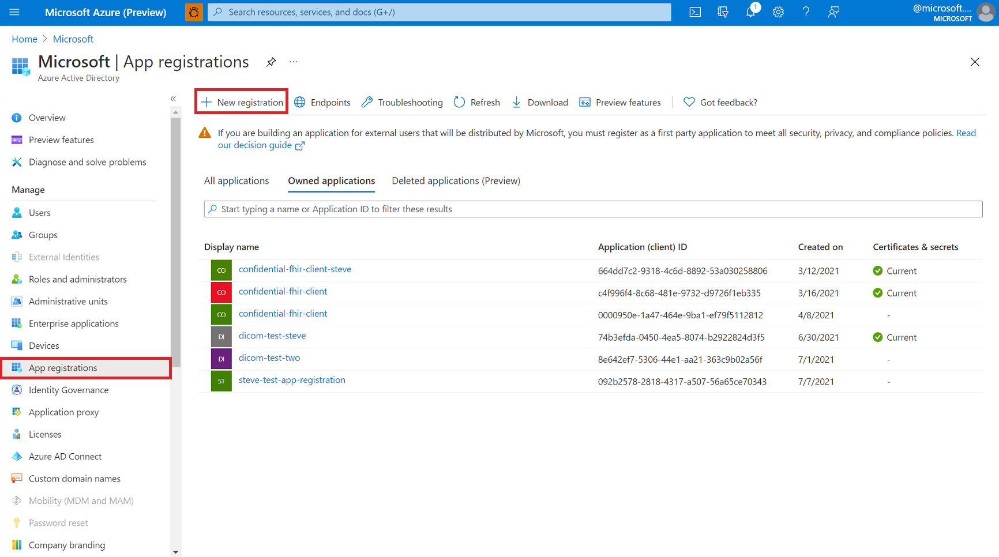
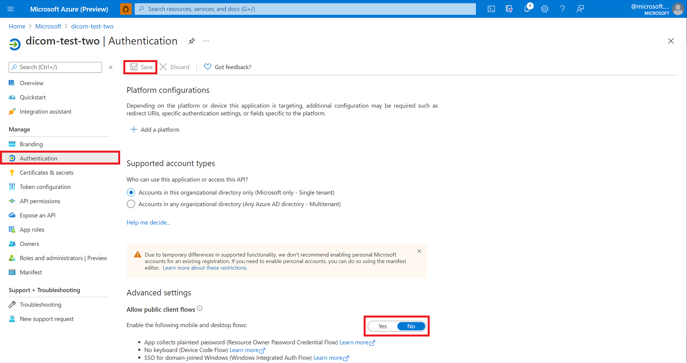
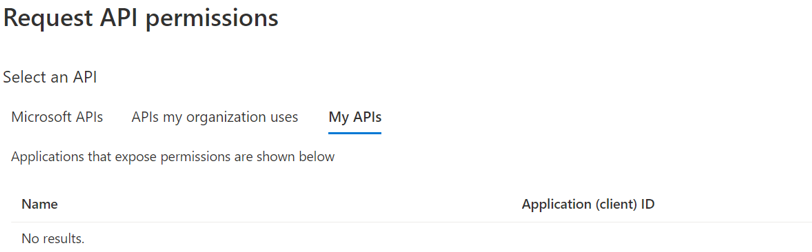
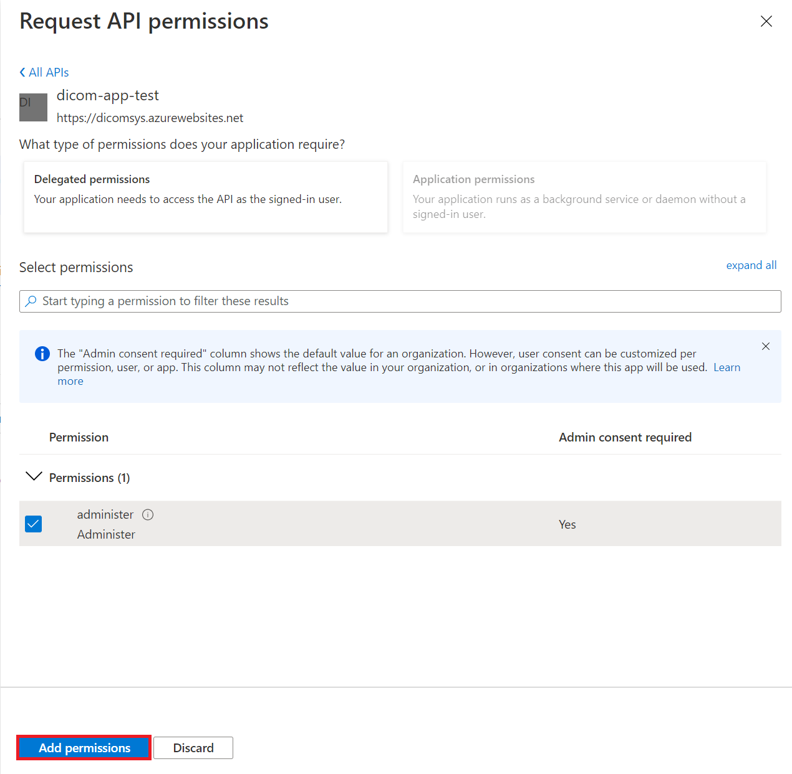

# Register a public client application

> [!IMPORTANT]
> Azure Healthcare APIs is currently in PREVIEW. The [Supplemental Terms of Use for Microsoft Azure Previews](https://azure.microsoft.com/support/legal/preview-supplemental-terms/) include additional legal terms that apply to Azure features that are in beta, preview, or otherwise not yet released into general availability.

In this article, you'll learn how to register a public application in the Azure Active Directory (Azure AD).

Client application registrations are Azure AD representations of applications that can authenticate and ask for API permissions on behalf of a user. Public clients are applications such as mobile applications and single page JavaScript applications that can't keep secrets confidential. The procedure is similar to [registering a confidential client application](dicom-register-confidential-client-application.md), but since public clients can't be trusted to hold an application secret, there's no need to add one.

This quickstart guide provides general information about how to register an [application with the Microsoft identity platform](.././../active-directory/develop/quickstart-register-app.md).

## Application registrations in the Azure portal

1. In the [Azure portal](https://portal.azure.com), select **Azure Active Directory**.
2. In the **Azure Active Directory** blade, select **App registrations**.
3. Select **New registration**.

   

## Application registration overview

1. Provide the DICOM service application with a user-facing display name.

   

2. For **Supported account types**, select who can use the application or access the API.
3. (**Optional**) Provide a **Redirect URI**. These details can be changed later, but if you know the reply URL of your application, enter it.
4. Select **Register**.

## Configuring an application as a public application

To configure your [desktop](.././../active-directory/develop/scenario-desktop-app-registration.md), [mobile](.././../active-directory/develop/scenario-mobile-app-registration.md) or [single-page](.././../active-directory/develop/scenario-mobile-app-registration.md) application as a public application, refer to the steps below.

1. In the [Azure portal](https://portal.azure.com), select the **App registrations** blade, and then select the **Authentication** blade.

   

2. In the **Advanced settings**, select **Yes**.

   For a single-page application, select **Access tokens** and **ID tokens** to enable implicit flow.
   * If your application signs in users, select **ID tokens**.
   * If your application also needs to call a protected web API, select **Access tokens**.

3. Select **Save**.

## API permissions

Similarly to the [confidential client application](dicom-register-confidential-client-application.md), you'll need to select which API permissions this application must request on behalf of users.

If you are using the DICOM service, you'll  add a permission to the Azure API for DICOM by searching for Azure Healthcare APIs under APIs my organization uses. You'll only be able to find this if you have already registered the Microsoft.HealthcareAPIs resource provider.

Select the permissions that you would like the DICOM service application to request.

## Next steps

In this article, you've learned how to register a public client application in the Azure Active Directory.  

>[!div class="nextstepaction"]
>[Overview of the DICOM service](dicom-services-overview.md)

