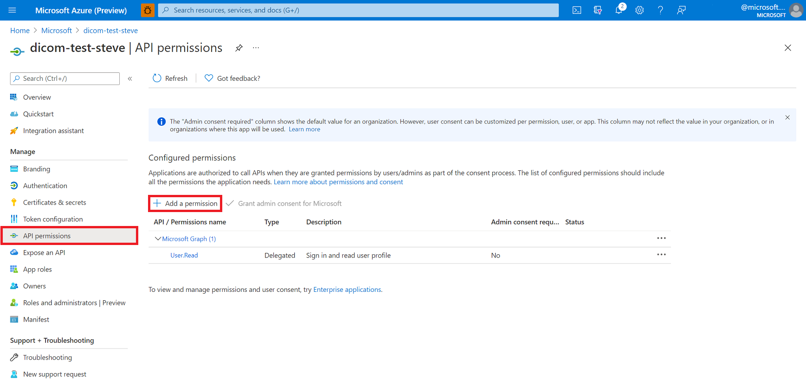
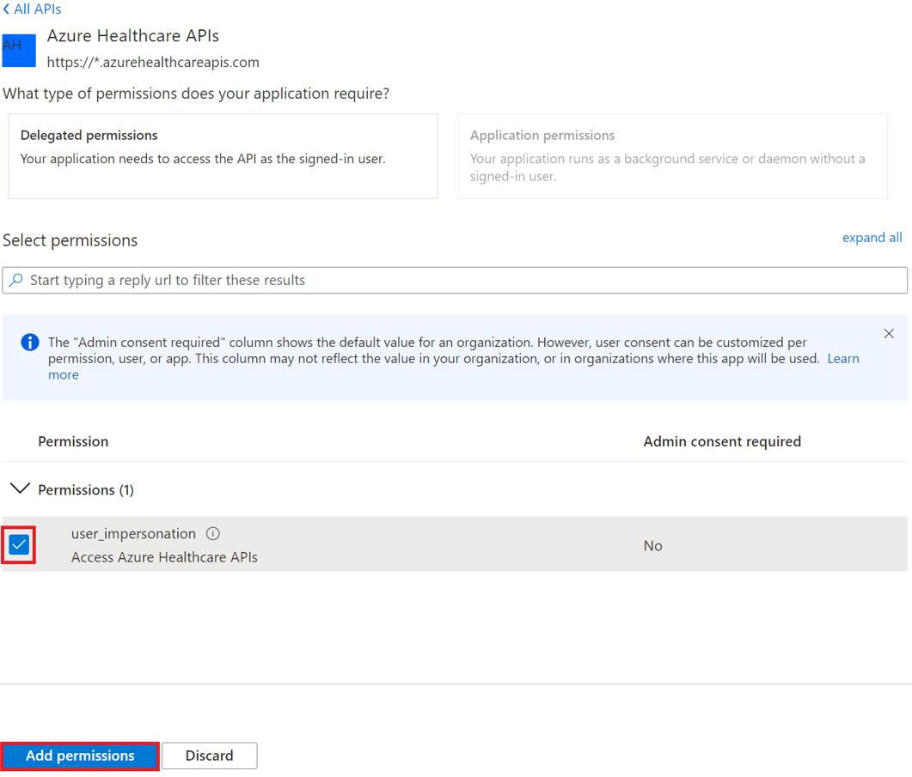
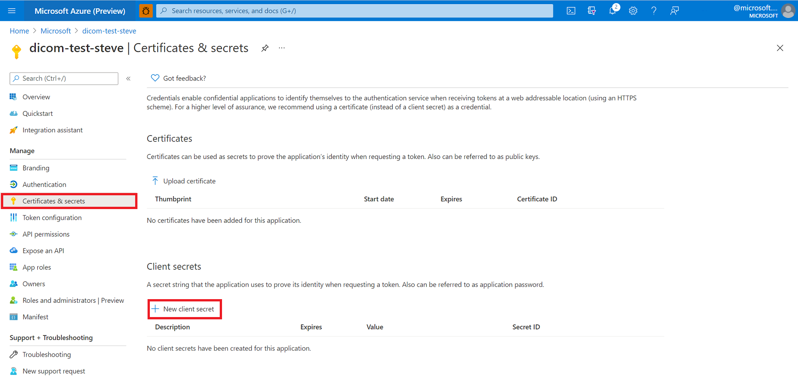
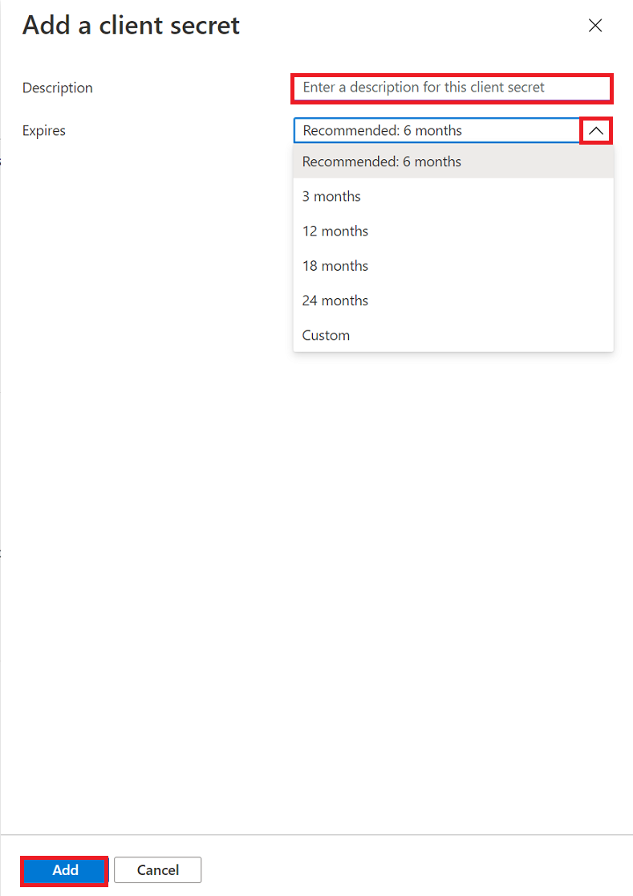
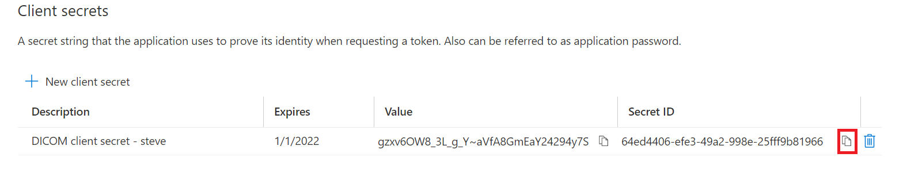

# Register a service client application

> [!IMPORTANT]
> Azure Healthcare APIs is currently in PREVIEW. The [Supplemental Terms of Use for Microsoft Azure Previews](https://azure.microsoft.com/support/legal/preview-supplemental-terms/) include additional legal terms that apply to Azure features that are in beta, preview, or otherwise not yet released into general availability.

In this article, you'll learn how to register a service client application in Azure Active Directory (Azure AD).

## Application registrations in the Azure portal

Client application registrations are Azure AD representations of applications that can be used to authenticate and obtain tokens. A service client is intended to be used by an application to obtain an access token without interactive authentication of a user. It will have certain application permissions and use an application secret (password) when obtaining access tokens.

Refer to the steps below to create a new service client.

1. In the [Azure portal](https://portal.azure.com), select **Azure Active Directory**.
2. In the **Azure Active Directory** blade, select **App registrations**.
3. Select **New registration**.

   

4. Provide the DICOM service application with a user-facing display name. Service client applications typically do not use a reply URL.

   

5. Select **Register**.

## API permissions

Now that you've registered your DICOM service application, you'll need to select which API permissions this application must request on behalf of users.

1. Select the **API permissions** blade.

   

2. Select **Add a permission**.

   If you are using the DICOM, you'll add a permission to the Azure API for DICOM by searching for **Azure Healthcare APIs** under **APIs my organization uses**. You'll only be able to find this if you have already registered the `Microsoft.HealthcareAPIs` resource provider.

   

   

3. Select scopes (permissions) that the confidential client application will ask for on behalf of a user.

   

4. Grant consent to the application. If you don't have the permissions required, check with your ADD administrator.

## Application secret

The service client needs a secret (password) to obtain a token.

1. Select **Certificates & secrets**, and then select **New client secret**.

   

2. Enter a **Description** for the client secret. Select the **Expires** drop-down menu to choose an expiration time frame, and then click **Add**.

   

3. After the client secret string is created, copy its **Value** and **ID**, and store them in a secure location of your choice.

   

4. Select Add.

> [!NOTE]
> The client secret string is visible only once in the Azure portal. When you navigate away from the Certificates & secrets web page and then return back to it, the Value string becomes masked. It's important to make a copy your client secret string immediately after it is generated. If you don't have a backup copy of your client secret, you must repeat the above steps to regenerate it.

## Next steps

In this article, you've learned how to register a service client application in Azure AD. 

>[!div class="nextstepaction"]
>[Overview of the DICOM service](dicom-services-overview.md)

