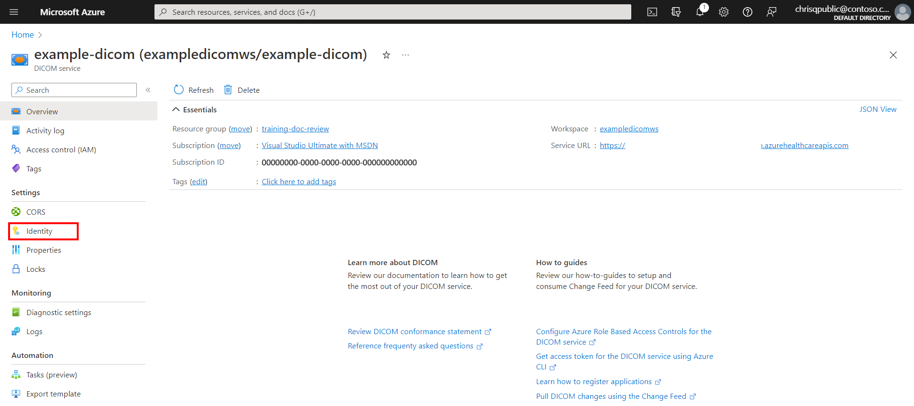
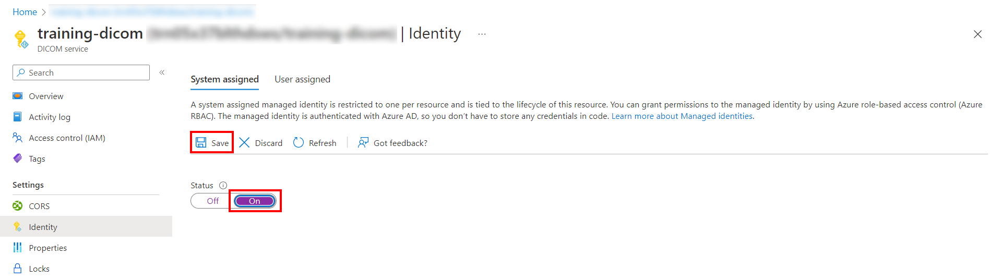
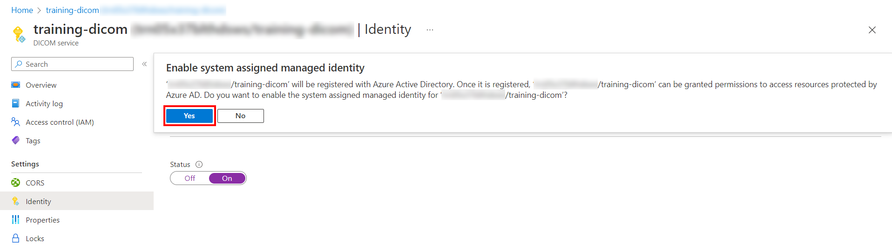
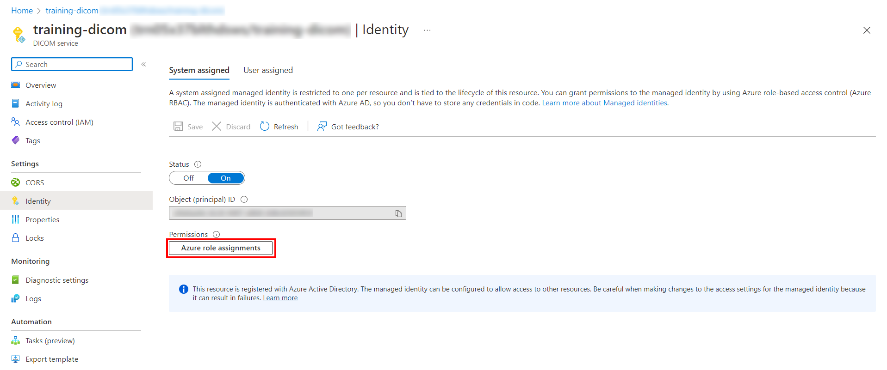
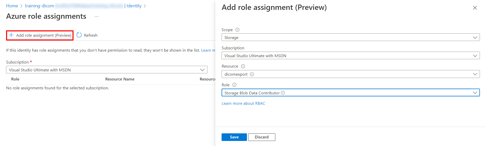

# Export DICOM Files

The DICOM service supports the bulk export of data to an [Azure Blob Storage account](https://azure.microsoft.com/en-us/services/storage/blobs/).  DICOM data that is exported to a storage account will be exported as a `.dcm` file in a folder structure that organizes instances by `StudyInstanceID` and `SeriesInstanceID`.  

There are three steps to exporting data from the DICOM service: 

- Enable a system assigned managed identity for the DICOM service.
- Configure a new or existing storage account and give permission to the system managed identity.
- Use the export API to create a new export job to export the data.

## Enable managed identity for the DICOM service

The first step to export data from the DICOM service is to enable a system managed identity.  This managed identity is used to authenticate the DICOM service and give permission to the storage account used as the destination for export.  For more information about managed identities in Azure, see [About managed identities for Azure resources](../../active-directory/managed-identities-azure-resources/overview.md).

1. In the Azure portal, browse to the DICOM service that you want to export from and select **Identity**.

[](media/dicom-export-identity.png#lightbox)

2. Set the **Status** option to **On**, and then click **Save**. 

[](media/dicom-export-enable-system-identity.png#lightbox)

3. Select **Yes** in the confirmation diaglog that appears.  

[](media/dicom-export-confirm-enable.png#lightbox)

It will take a few minutes to create the system managed identity.  When the system identity has been enabled, an **Object (principal) ID** will be displayed.

## Give storage account permissions to the system managed identity

The system managed identity will need **Storage Blob Data Contributor** permission to write data to the destination storage account.  

1. Under **Permissions** select **Azure role assignments**.

[](media/dicom-export-azure-role-assignments.png#lightbox)

2. Select **Add role assignment**.  On the **Add role assignment** panel, make the following selections: 
    * Under **Scope**, select **Storage**.
    * Under  **Resource**, select the destination storage account for the export operation.
    * Under **Role**, select **Storage Blob Data Contributor**. 

 [](media/dicom-export-add-role-assignment.png#lightbox)

3. Click **Save** to add the permission to the system managed identity.

## Call the export API

The export API exposes one `POST` endpoint for exporting data. 

```
POST <dicom-service-url>/<version>/export
```

Given a *source*, the set of data to be exported, and a *destination*, the location to which data will be exported, the endpoint returns a reference to the newly-started long-running export operation. The duration of this operation depends on the volume of data to be exported.

## Request

The request body consists of the export source and destination.

```json
{
    "source": {
        "type": "identifiers",
        "settings": {
            "values": [
                "..."
            ]
        }
    },
    "destination": {
        "type": "azureblob",
        "settings": {
            "setting3": "<value>"
        }
    }
}
```

### Source Settings

The only setting is the list of identifiers to export.

| Property | Required | Default | Description |
| :------- | :------- | :------ | :---------- |
| `Values` | Yes      |         | A list of one or more DICOM studies, series, and/or SOP instances identifiers in the format of `"<StudyInstanceUID>[/<SeriesInstanceUID>[/<SOPInstanceUID>]]"`. |

### Destination Settings

The connection to the Azure Blob storage account can be specified with either a `ConnectionString` and `BlobContainerName` or a `BlobContainerUri`. One of these settings is required.

| Property             | Required | Default | Description |
| :------------------- | :------- | :------ | :---------- |
| `BlobContainerName`  | No       | `""`    | The name of a blob container. Only required when `ConnectionString` is specified. |
| `BlobContainerUri`   | No       | `""`    | The complete URI for the blob container. |
| `ConnectionString`   | No       | `""`    | The [Azure Storage connection string](../../storage/common/storage-configure-connection-string.md) that must minimally include information for blob storage. |
| `UseManagedIdentity` | Yes      | `false` | An required flag indicating whether managed identity should be used to authenticate to the blob container. |

### Example

The below example requests the export of the following DICOM resources to the blob container named `export` in the storage account named `dicomexport`:
- All instances within the study whose `StudyInstanceUID` is `1.2.3`.
- All instances within the series whose `StudyInstanceUID` is `12.3` and `SeriesInstanceUID` is `4.5.678`.
- The instance whose `StudyInstanceUID` is `123.456`, `SeriesInstanceUID` is `7.8`, and `SOPInstanceUID` is `9.1011.12`.

```http
POST /export HTTP/1.1
Accept: */*
Content-Type: application/json
{
    "sources": {
        "type": "identifiers",
        "settings": {
            "values": [
                "1.2.3",
                "12.3/4.5.678",
                "123.456/7.8/9.1011.12"
            ]
        }
    },
    "destination": {
        "type": "azureblob",
        "settings": {
            "blobContainerUri": "https://dicomexport.blob.core.windows.net/export",
            "UseManagedIdentity": true
        }
    }
}
```

## Response

Upon successfully starting an export operation, the export API returns a `202` status code. The body of the response contains a reference to the operation, while the value of the `Location` header is the URL for the export operation's status (the same as `href` in the body).

Inside of the destination container, the DCM files can be found with the following path format: `<operation id>/results/<study>/<series>/<sop instance>.dcm`

```http
HTTP/1.1 202 Accepted
Content-Type: application/json
{
    "id": "df1ff476b83a4a3eaf11b1eac2e5ac56",
    "href": "<dicom-service-url>/<version>/operations/df1ff476b83a4a3eaf11b1eac2e5ac56"
}
```

### Operation Status
The above `href` URL can be polled for the current status of the export operation until completion. A terminal state is signified by a `200` status instead of `202`.

```http
HTTP/1.1 200 OK
Content-Type: application/json
{
    "operationId": "df1ff476b83a4a3eaf11b1eac2e5ac56",
    "type": "export",
    "createdTime": "2022-09-08T16:40:36.2627618Z",
    "lastUpdatedTime": "2022-09-08T16:41:01.2776644Z",
    "status": "completed",
    "results": {
        "errorHref": "<container uri>/4853cda8c05c44e497d2bc071f8e92c4/errors.log",
        "exported": 1000,
        "skipped": 3
    }
}
```

## Errors

If there are any errors when exporting a DICOM file (that was determined not to be a problem with the client), then the file is skipped and its corresponding error is logged. This error log is also exported alongside the DICOM files and can be reviewed by the caller. The error log can be found at `<export blob container uri>/<operation ID>/errors.log`.

### Format

Each line of the error log is a JSON object with the following properties. Note that a given error identifier may appear multiple times in the log as each update to the log is processed *at least once*.

| Property     | Description |
| ------------ | ----------- |
| `Timestamp`  | The date and time when the error occurred. |
| `Identifier` | The identifier for the DICOM study, series, or SOP instance in the format of `"<study instance UID>[/<series instance UID>[/<SOP instance UID>]]"`. |
| `Error`      | The detailed error message. |

## Next steps

>[!div class="nextstepaction"]
>[Overview of the DICOM service](dicom-services-overview.md)
