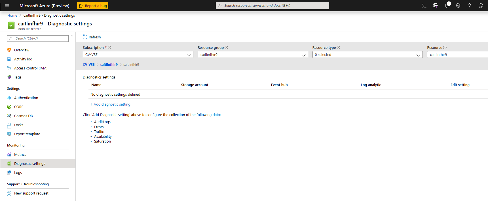

# Enable Diagnostic Logging in Azure API for FHIR®

In this article, you will learn how to enable diagnostic logging in Azure API for FHIR® and be able to review some sample queries for these logs. Access to diagnostic logs is essential for any healthcare service where compliance with regulatory requirements (such as HIPAA) is a must. The feature in Azure API for FHIR® that enables diagnostic logs is the [**Diagnostic settings**](https://docs.microsoft.com/azure/azure-monitor/platform/diagnostic-settings) in the Azure portal. 

## Enable audit logs
1. To enable diagnostic logging in Azure API for FHIR®, select your Azure API for FHIR® service in the Azure portal 
2. Navigate to **Diagnostic settings** 
 

3. Select **+ Add diagnostic setting**

4. Enter a name for the setting

5. Select the method you want to use to access your diagnostic logs:

    1. **Archive to a storage account** for auditing or manual inspection. The storage account you want to use needs to be already created.
    2. **Stream to event hub** for ingestion by a third-party service or custom analytic solution. You will need to create an event hub namespace and event hub policy before you can configure this step.
    3. **Stream to the Log Analytics** workspace in Azure Monitor. You will need to create your Logs Analytics Workspace before you can select this option.

6. Select **AuditLogs** and any metrics you want to capture

7. Click Save

> [!Note] 
> It might take up to 15 minutes for the first Logs to show in Log Analytics.  
 
For more information on how to work with diagnostic logs, please refer to the [Azure Resource Log documentation](https://docs.microsoft.com/azure/azure-monitor/platform/resource-logs-overview)

## Audit log details
At this time, the Azure API for FHIR® service returns the following fields in the audit log: 

|Field Name  |Type  |Notes  |
|---------|---------|---------|
|CallerIdentity|Dynamic|A generic property bag containing identity information
|CallerIdentityIssuer|String|Issuer 
|CallerIdentityObjectId|String|Object_Id 
|CallerIPAddress|String|The caller’s IP address 
|CorrelationId|String| Correlation ID
|FhirResourceType|String|The resource type for which the operation was executed
|LogCategory|String|The log category (we are currently returning ‘AuditLogs’ LogCategory)
|Location|String|The location of the server that processed the request (e.g., South Central US)
|OperationDuration|Int|The time it took to complete this request in seconds
|OperationName|String| Describes the type of operation (e.g. update, search-type)
|RequestUri|String|The request URI 
|ResultType|String|The available values currently are **Started**, **Succeeded**, or **Failed**
|StatusCode|Int|The HTTP status code. (e.g., 200) 
|TimeGenerated|DateTime|Date and time of the event|
|Properties|String| Describes the properties of the fhirResourceType
|SourceSystem|String| Source System (always Azure in this case)
|TenantId|String|Tenant ID
|Type|String|Type of log (always MicrosoftHealthcareApisAuditLog in this case)
|_ResourceId|String|Details about the resource

## Sample queries

Here are a few basic Application Insights queries you can use to explore your log data.

Run this query to see the **100 most recent** logs:

```Application Insights
MicrosoftHealthcareApisAuditLogs
| limit 100
```

Run this query to group operations by **FHIR Resource Type**:

```Application Insights
MicrosoftHealthcareApisAuditLogs 
| summarize count() by FhirResourceType
```

Run this query to get all the **failed results**

```Application Insights
MicrosoftHealthcareApisAuditLogs 
| where ResultType == "Failed" 
```

## Conclusion 
Having access to diagnostic logs is essential for monitoring a service and providing compliance reports. Azure API for FHIR® allows you to do these actions through diagnostic logs. 
 
FHIR® is the registered trademark of HL7 and is used with the permission of HL7.

## Next steps
In this article, you learned how to enable Audit Logs for Azure API for FHIR®. Next, learn about other additional settings you can configure in the Azure API for FHIR
 
>[!div class="nextstepaction"]
>[Additional Settings](azure-api-for-fhir-additional-settings.md)