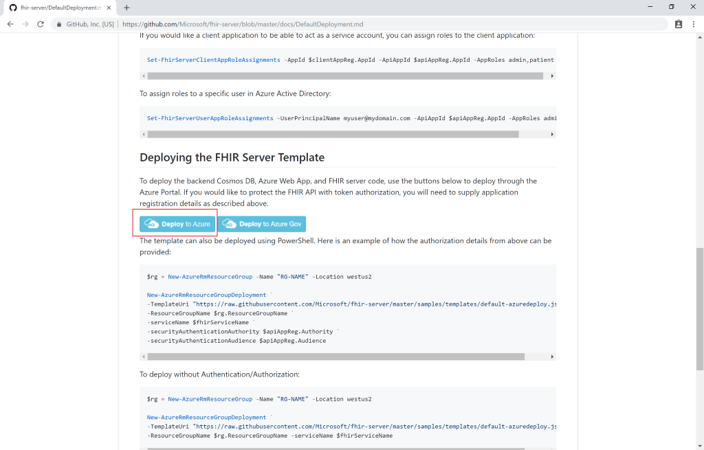
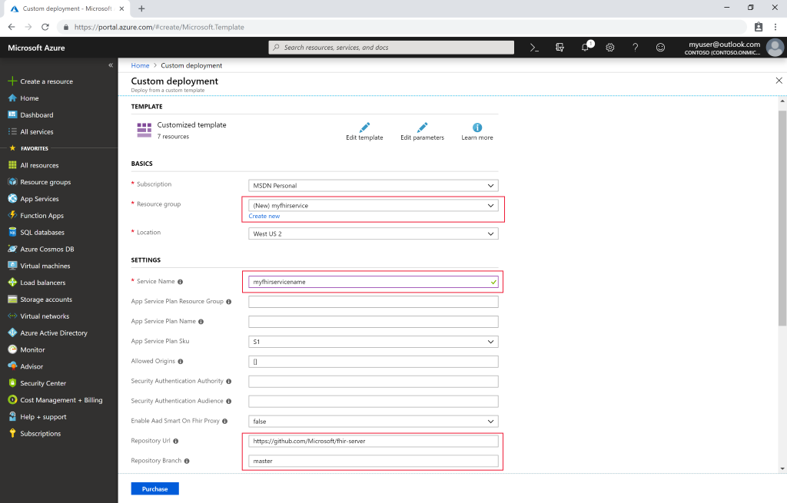

# Quickstart: Deploy Open Source FHIR server using Azure portal

In this quickstart, you'll learn how to deploy an Open Source FHIR Server in Azure using the Azure portal. We will use easy deployment links in the [Open Source repository](https://github.com/Microsoft/fhir-server)

If you don't have an Azure subscription, create a [free account](https://azure.microsoft.com/free/?WT.mc_id=A261C142F) before you begin.

## GitHub Open Source repository

Navigate to the [GitHub deployment page](https://github.com/Microsoft/fhir-server/blob/master/docs/DefaultDeployment.md) and locate the "Deploy to Azure" buttons:

Click the deployment button and the Azure portal opens.

## Fill in deployment parameters

Choose to create a new resource group and give it a name. Only other required parameter is a name for the service.

Notice that the deployment will pull the source code directly from the open-source repository on GitHub. If you have forked the repository, you can point to your own for and a specific branch.

After filling in the details, you can start the deployment.

## Validate FHIR Server is running

Once the deployment is complete, you can point your browser to `https://SERVICENAME.azurewebsites.net/metadata` to obtain a capability statement. It will take a minute or so for the server to respond the first time.

## Clean up resources

When no longer needed, you can delete the resource group and all related resources. To do so, select the resource group containing the provisioned resources, select **Delete resource group**, then confirm the name of the resource group to delete.

## Next steps

In this tutorial, you've deployed the Microsoft Open Source FHIR Server for Azure into your subscription. To learn how to access the FHIR API using Postman, proceed to the Postman tutorial.
 
>[!div class="nextstepaction"]
>[Access FHIR API using Postman](access-fhir-postman-tutorial.md)