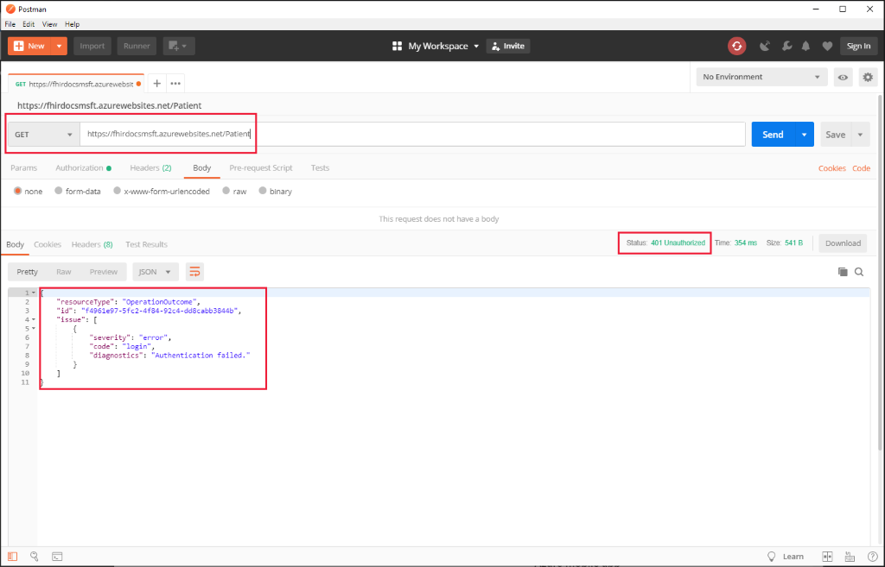
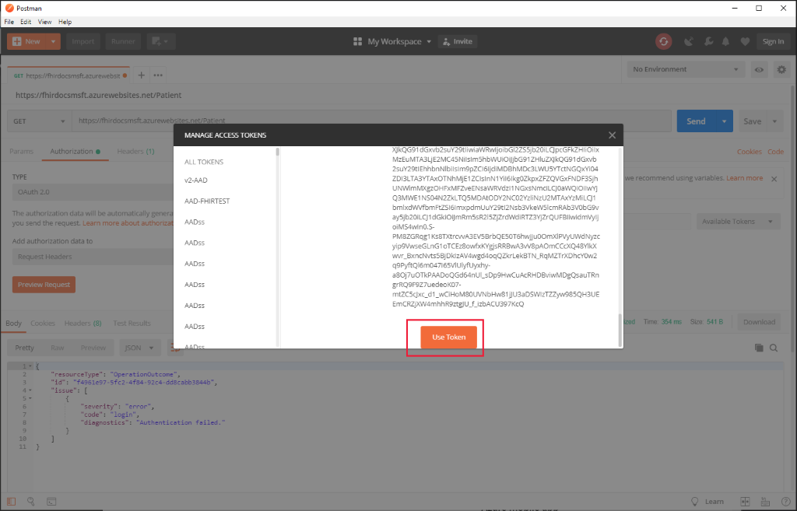

# Access Azure API for FHIR with Postman

A client application can access the Azure API for FHIR through a [REST API](https://www.hl7.org/fhir/http.html). To send requests, view responses, and debug your application as it is being built, use an API testing tool of your choice. In this tutorial, we'll walk you through the steps of accessing the FHIR server using [Postman](https://www.getpostman.com/). 

## Prerequisites

- A FHIR endpoint in Azure. 

To deploy the Azure API for FHIR (a managed service), you can use the [Azure portal](fhir-paas-portal-quickstart.md), [PowerShell](fhir-paas-powershell-quickstart.md), or [Azure CLI](fhir-paas-cli-quickstart.md).

- A registered [confidential client application](register-confidential-azure-ad-client-app.md) to access the FHIR service.
- You have granted permissions to the confidential client application, for example, "FHIR Data Contributor", to access the FHIR service. For more information, see [Configure Azure RBAC for FHIR](./configure-azure-rbac.md).
- Postman installed. 
    
For more information about Postman, see [Get Started with Postman](https://www.getpostman.com).

## FHIR server and authentication details

To use Postman, the following authentication parameters are required:

- Your FHIR server URL, for example, `https://MYACCOUNT.azurehealthcareapis.com`

- The identity provider `Authority` for your FHIR server, for example, `https://login.microsoftonline.com/{TENANT-ID}`

- The configured `audience` that is usually the URL of the FHIR server, for example, `https://<FHIR-SERVER-NAME>.azurehealthcareapis.com` or `https://azurehealthcareapis.com`.

- The `client_id` or application ID of the [confidential client application](register-confidential-azure-ad-client-app.md) used for accessing the FHIR service.

- The `client_secret` or application secret of the confidential client application.

Finally, you should check that `https://www.getpostman.com/oauth2/callback` is a registered reply URL for your client application.

## Connect to FHIR server

Open Postman, and then select **GET** to make a request to `https://fhir-server-url/metadata`.


The metadata URL for Azure API for FHIR is `https://MYACCOUNT.azurehealthcareapis.com/metadata`. 

In this example, the FHIR server URL is `https://fhirdocsmsft.azurewebsites.net`, and the capability statement of the server is available at `https://fhirdocsmsft.azurewebsites.net/metadata`. This endpoint is accessible without authentication.

If you attempt to access restricted resources, an "Authentication failed" response occurs.



## Obtaining an access token

Click **Get New Access Token**.

To obtain a valid access token, select **Authorization** and select **OAuth 2.0** from the **TYPE** drop-down menu.


Select **Get New Access Token**.


In the **Get New Access Token** dialog box, enter the following details:

| Field                 | Example Value                                                                                                   | Comment                    |
|-----------------------|-----------------------------------------------------------------------------------------------------------------|----------------------------|
| Token Name            | MYTOKEN                                                                                                         | A name you choose          |
| Grant Type            | Authorization Code                                                                                              |                            |
| Callback URL          | `https://www.getpostman.com/oauth2/callback`                                                                    |                            |
| Auth URL              | `https://login.microsoftonline.com/{TENANT-ID}/oauth2/authorize?resource=<audience>` | `audience` is `https://MYACCOUNT.azurehealthcareapis.com` for Azure API for FHIR |
| Access Token URL      | `https://login.microsoftonline.com/{TENANT ID}/oauth2/token`                                                    |                            |
| Client ID             | `XXXXXXXX-XXX-XXXX-XXXX-XXXXXXXXXXXX`                                                                           | Application ID             |
| Client Secret         | `XXXXXXXX`                                                                                                      | Secret client key          |
| Scope | `<Leave Blank>` | Scope is not used; therefore, it can be left blank.  
| State                 | `1234`     | [State](https://learning.postman.com/docs/sending-requests/authorization/) is an opaque value to prevent cross-site request forgery. It is optional and can take an arbitrary value such as '1234'.                           |
| Client Authentication | Send client credentials in body                                                                                 |                 

Click **Request Token** to be guided through the Azure Active Directory Authentication flow, and a token will be returned to Postman. If an authentication failure occurs, refer to the Postman Console for more details. **Note**: On the ribbon, click **View**, and then select **Show Postman Console**. The keyboard shortcut to the Postman Console is **Alt-Ctrl+C**.

Scroll down to view the returned token screen, and then click **Use Token**.



Refer to the **Access Token** field to view the newly populated token. If you click **Send** to repeat the `Patient` resource search, a **Status** `200 OK` gets returned. A returned status `200 OK` indicates a successful HTTP request.


In the *Patient search* example, there are no patients in the database; such as, the search result is empty.

You can inspect the access token using a tool like [jwt.ms](https://jwt.ms). An example of the content is shown below.

```json
{
  "aud": "https://MYACCOUNT.azurehealthcareapis.com",
  "iss": "https://sts.windows.net/{TENANT-ID}/",
  "iat": 1545343803,
  "nbf": 1545343803,
  "exp": 1545347703,
  "acr": "1",
  "aio": "AUQAu/8JXXXXXXXXXdQxcxn1eis459j70Kf9DwcUjlKY3I2G/9aOnSbw==",
  "amr": [
    "pwd"
  ],
  "appid": "xxxxxxxx-xxxx-xxxx-xxxx-xxxxxxxxxxxx",
  "oid": "xxxxxxxx-xxxx-xxxx-xxxx-xxxxxxxxxxxx",
  "appidacr": "1",

  ...// Truncated
}
```

In troubleshooting situations, validating that you have the correct audience (`aud` claim) is a good place to start. If your token is from the correct issuer (`iss` claim) and has the correct audience (`aud` claim), but you are still unable to access the FHIR API, it is likely that the user or service principal (`oid` claim) doesn't have access to the FHIR data plane. We recommend you use [Azure role-based access control (Azure RBAC)](configure-azure-rbac.md) to assign data plane roles to users. If you're using an external, secondary Azure Active directory tenant for your data plane, you'll need to [Configure local RBAC for FHIR](configure-local-rbac.md) assignments.

It's also possible to get a token for the [Azure API for FHIR using the Azure CLI](get-healthcare-apis-access-token-cli.md). If you're using a token obtained with the Azure CLI, you should use Authorization type *Bearer Token*. Paste the token in directly.

## Inserting a patient

With a valid access token, you can now insert a new patient. In Postman, change the method by selecting **Post**, and then add the following JSON document in the body of the request.

[!code-json][(../samples/sample-patient.json)]

Select **Send** to determine that the patient is successfully created.


If you repeat the patient search, you should now see the patient record:


## Next steps

In this tutorial, you've accessed the Azure API for FHIR using Postman. For more information about the Azure API for FHIR features, see
 
>[!div class="nextstepaction"]
>[Supported features](fhir-features-supported.md)
