# Use Microsoft Entra External ID to grant access to the FHIR service

Healthcare organizations can use [Microsoft Entra External ID](https://learn.microsoft.com/en-us/entra/external-id/external-identities-overview) with the FHIR&reg; service in Azure Health Data Services to grant access to their applications and users. 

## Create an Entra External ID tenant for the FHIR service

Creating an Entra External ID tenant for the FHIR service sets up a secure infrastructure for managing user identities in your healthcare applications. 

If you already created an Entra External ID tenant, you can skip to 
[Deploy the FHIR service with Entra External ID](#deploy-the-fhir-service-with-entra-external-id-as-the-identity-provider).

#### Deploy an Entra External ID tenant by using an ARM template

Use PowerShell or Azure CLI to deploy the [ARM template](https://raw.githubusercontent.com/Azure-Samples/azure-health-data-and-ai-samples/main/samples/fhir-aad-entra-external/entra-external-arm-template.json) programmatically to an Azure subscription. For more information about syntax, properties, and usage of the template, see [Deploy an instance of Entra External ID](/azure/templates/microsoft.azureactivedirectory/ciamdirectories?pivots=deployment-language-arm-template). 

Run the code in Azure Cloud Shell or in PowerShell locally in Visual Studio Code to deploy the FHIR service to the Entra External ID tenant.

#### [PowerShell](#tab/powershell)

1. Use `Connect-AzAccount` to sign in to Azure. After you sign in, use `Get-AzContext` to verify the subscription and tenant you want to use. Change the subscription and tenant if needed.

1. Create a new resource group (or use an existing one) by skipping the "create resource group" step, or commenting out the line starting with `New-AzResourceGroup`.

```PowerShell
### variables
$tenantid="your tenant id"
$subscriptionid="your subscription id"
$resourceGroupName="your resource group name"
$location="your desired location"
$directoryName="your entra external id tenant name(don't include .onmicrosoft.com)"

### login to azure
Connect-AzAccount -Tenant $tenantid -SubscriptionId $subscriptionid 

# create the resource group
New-AzResourceGroup -Name $resourceGroupName -Location $location

# deploy the resource
New-AzResourceGroupDeployment -ResourceGroupName $resourceGroupName -TemplateUri https://raw.githubusercontent.com/Azure-Samples/azure-health-data-and-ai-samples/samples/fhir-aad-entra-external/entra-external-arm-template.json -directoryName $directoryName
```
---

#### [Azure CLI](#tab/command-line)

1. Use `Connect-AzAccount` to sign in to Azure. After you sign in, use `az account show --output table` to verify the subscription and tenant you want to use. Change the subscription and tenant if needed.

1. Create a new resource group (or use an existing one) by skipping the "create resource group" step or commenting out the line starting with `az group create`.

```bash
# variables
tenantid="your tenant id"
subscriptionid="your subscription id"
resourceGroupName="your resource group name"
region="your desired region"
directoryName="your directory name"

# login to azure
az login
az account show --output table
az account set --subscription $subscriptionid

# create resource group
az group create --name $resourceGroupName --location $region

# deploy the resource
az deployment group create --resource-group $resourceGroupName --template-uri https://raw.githubusercontent.com/Azure-Samples/azure-health-data-and-ai-samples/samples/fhir-aad-entra-external/entra-external-arm-template.json  --parameters directoryName=$directoryName
```

#### Add a test user to the Microsoft Entra External ID tenant

>[!Note] 
>You will be asked to set up MFA when logging in for the first time.

You need a test user in your Microsoft Entra External ID tenant to associate with a specific patient resource in the FHIR service and to verify that the authentication flow works as expected.


1. Sign in to the [Microsoft Entra admin center](https://entra.microsoft.com). 

1. If you have access to multiple tenants, use the **Settings** icon  in the top menu to switch to your external tenant from the **Directories + subscriptions** menu.

1. In the **Users** section of the Microsoft Entra admin center, select **+ New user**, then choose **Create new user**.

   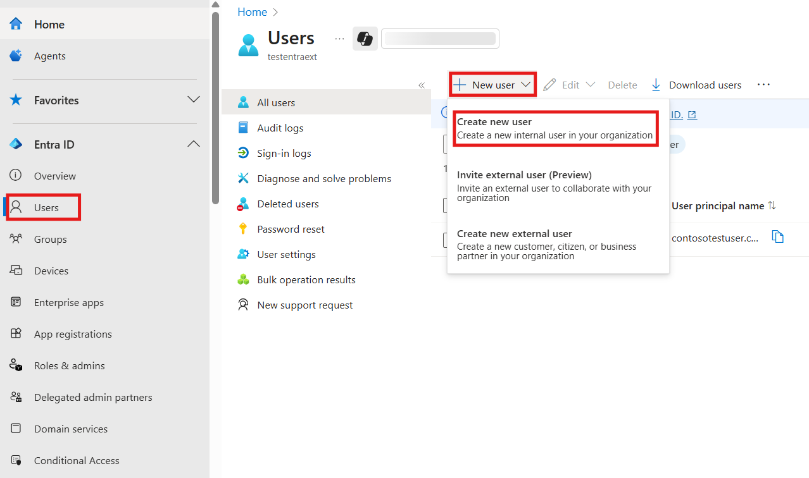

1. On the **Basics** page, enter the **User principal name** and **Display name**, then select **Review + create**.

   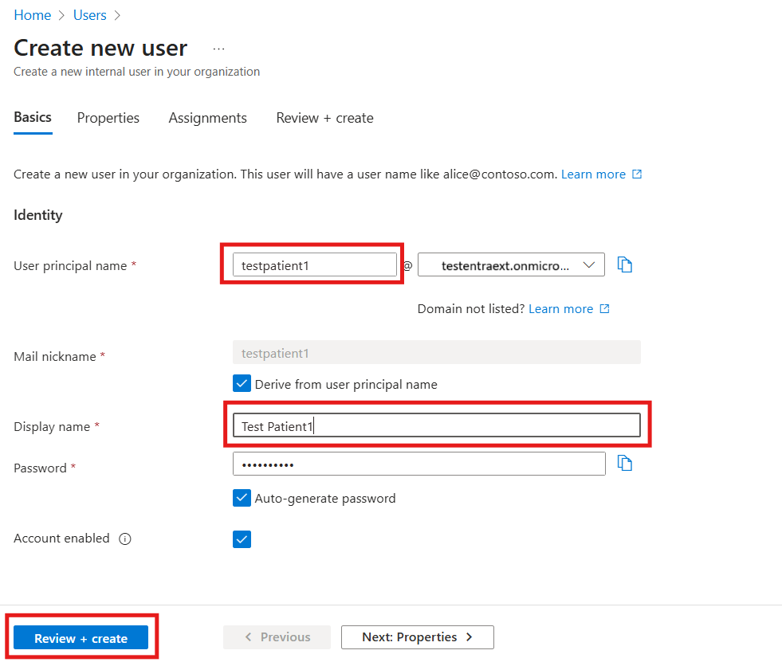

1. Review the information you entered to validate the input, then select **Create** to create the user.

#### Link an Entra External ID user with the `fhirUser` custom user attribute

The `fhirUser` custom user attribute is used to link a user in Microsoft Entra External ID with a corresponding patient resource in the FHIR service. In this example, a user named **Test Patient1** is created in the Entra External ID tenant. In a later step, a [patient](https://www.hl7.org/fhir/patient.html) resource is created in the FHIR service. The **Test Patient1** user is associated with the patient resource by setting the `fhirUser` attribute to the patient's FHIR resource identifier.For more information about custom attributes in Microsoft Entra External ID, see  
[User flow custom attributes in Entra External ID.](https://learn.microsoft.com/en-us/entra/external-id/customers/how-to-define-custom-attributes#create-custom-user-attributes).

1. Search for **External Identities** 

1. Navigate to **Custom user attributes**, 

1. Choose **+ Add.**

1. In the **Add custom attribute** pane:

   - In the **Name** field, Enter **fhirUser** (case-sensitive)

   - From the **Data Type** dropdown list, select **String**.
   
   - In the **Description** field, enter a description for the custom attribute. For example, "The fully qualified FHIR resource Id associated with the user. (e.g. Patient Resource)"
   
   - Choose **Create**.
   
   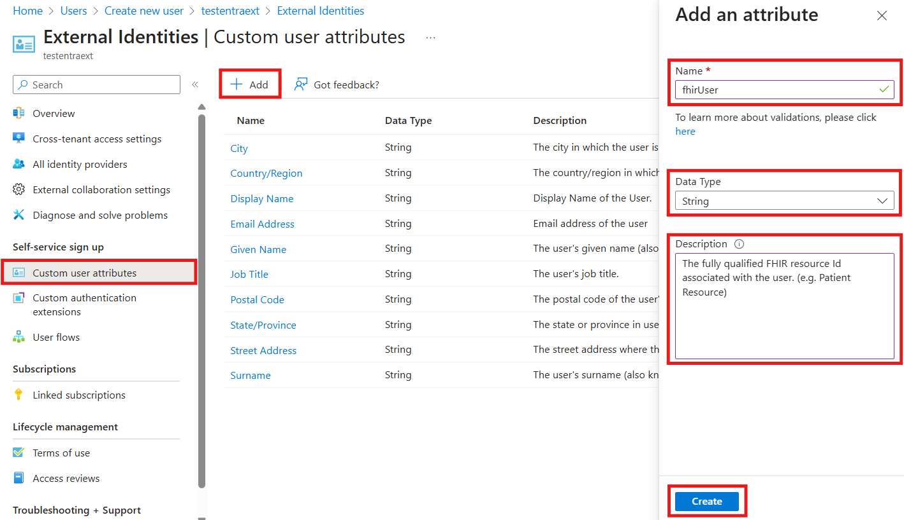


#### Create a new user flow in Microsoft Entra External ID

User flows define the sequence of steps users must follow to sign in. In this example, a user flow is defined so that when a user signs in and the access token provided includes the `fhirUser` claim. For more information, see [Create user flows and custom policies in Microsoft Entra External ID](https://learn.microsoft.com/en-us/entra/external-id/customers/how-to-user-flow-sign-up-sign-in-customers#create-and-customize-a-user-flow).

1. On the **External Identities** page in the left pane, choose **User flows**.

1. Choose **+ New user flow.**

   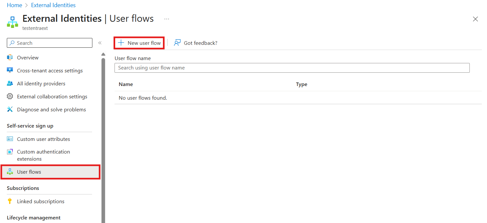

1. Give the user flow a name unique to the Microsoft Entra External ID tenant. The name doesn't have to be globally unique. In this example, the name of the user flow is **USER_FLOW_1**. Make note of the name.

1. Under **Identity providers**, keep **Email with password** selected (default).

   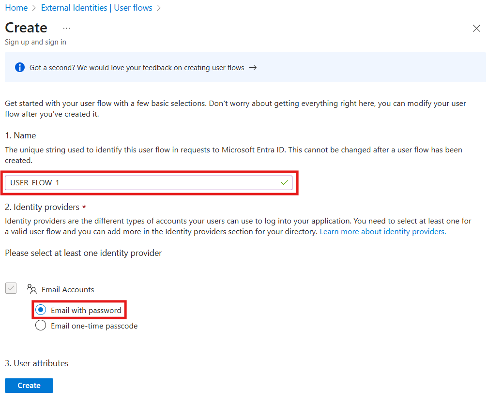

1. On the Create a user flow page Select **Show more** to view additional attributes. 

1. Under **Collect attribute**, 

1. Select the **fhirUser** claim.

1. Choose Ok.

1. Choose Create.
   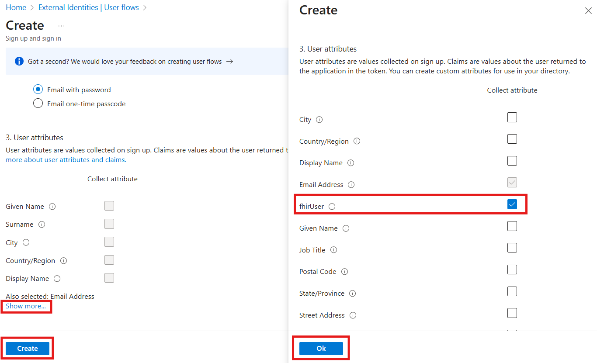


#### Create an Entra External Resource Application

The Microsoft Entra External ID resource application handles authentication requests from your healthcare application to Microsoft Entra External ID.

1. In the **Microsoft Entra admin** center, navigate to **Applications** > **App registrations**.

1. Choose **+ New registration**.

   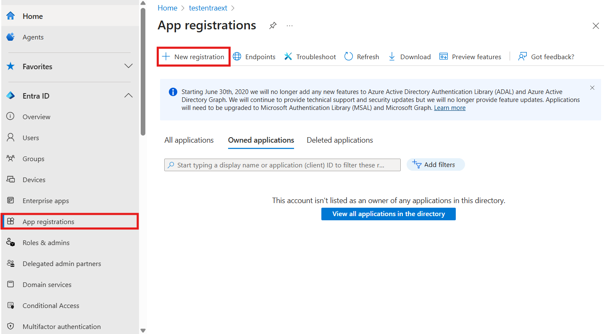

1. In the **Register an application** pane:

   - Enter a display name. This example uses **FHIR Service.**

   - In the **Redirect URI (recommended)** drop-down list, select **Public client/native (mobile & desktop).** Populate the value with the callback URI. This callback URI is for testing purposes.

  - Choose **Register**. Wait for the application registration to complete. The browser automatically navigates to the application Overview page.

    

#### Configure API permissions for the app
1. On the **App registrations page** in the left pane, choose **Manifest**.

1. Scroll until you find the `oauth2PermissionScopes` array in `Microsoft Graph App Manifest (New)` tab. Replace the array with one or more values in the [`oauth2Permissions.json`](https://raw.githubusercontent.com/Azure-Samples/azure-health-data-and-ai-samples/main/samples/fhir-aad-b2c/oauth2Permissions.json) file. Copy the entire array or individual permissions.

   If you add a permission to the list, any user in the **Microsoft Entra External ID** tenant can obtain an access token with that API permission. 
   If a permission level isn't appropriate for all users, **do not** include it in the permission array.

1. After the **oauth2PermissionScopes** array is populated

1. In the same manifest, set the `acceptMappedClaims` property to `true`. This enables the app to receive custom claims, like `fhirUser` in the token.

1. choose **Save**.

   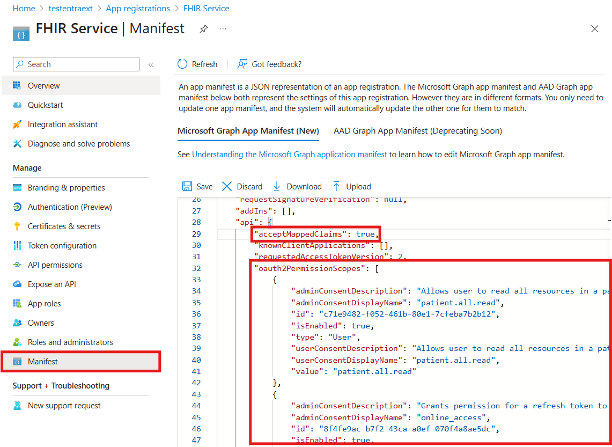

#### Expose the web API and assign an application ID URI

1. On the **App registrations** page in the left pane, choose **Expose an API**.

1. Choose **Add**.

1. By default, the **Application ID** URI field is populated with the application (client) ID. Change the value if desired.

1. Choose **Save**.

   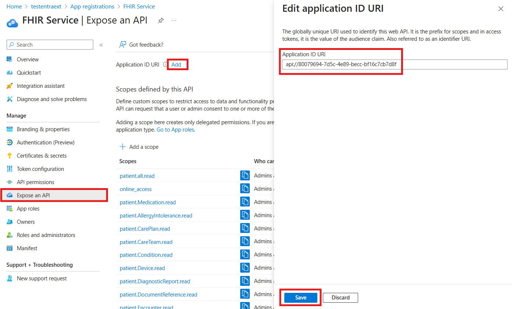

1. On the **App registrations** page in the left pane, choose **API permissions**.

1. Choose **+ Add a permission**.

   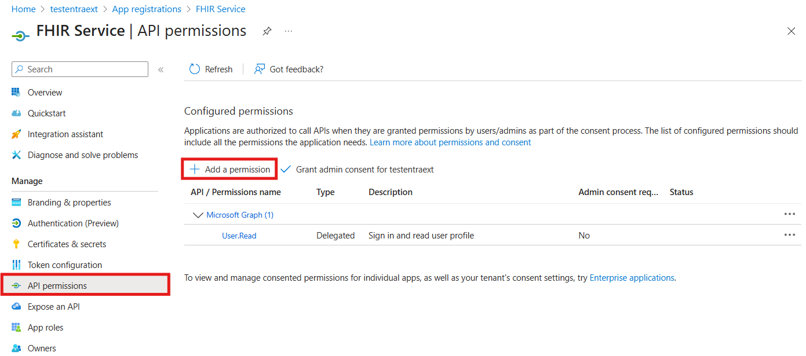


1. On the **Request API permissions** pane, select **APIs my organization** uses.

1. Select the resource application from the list.

   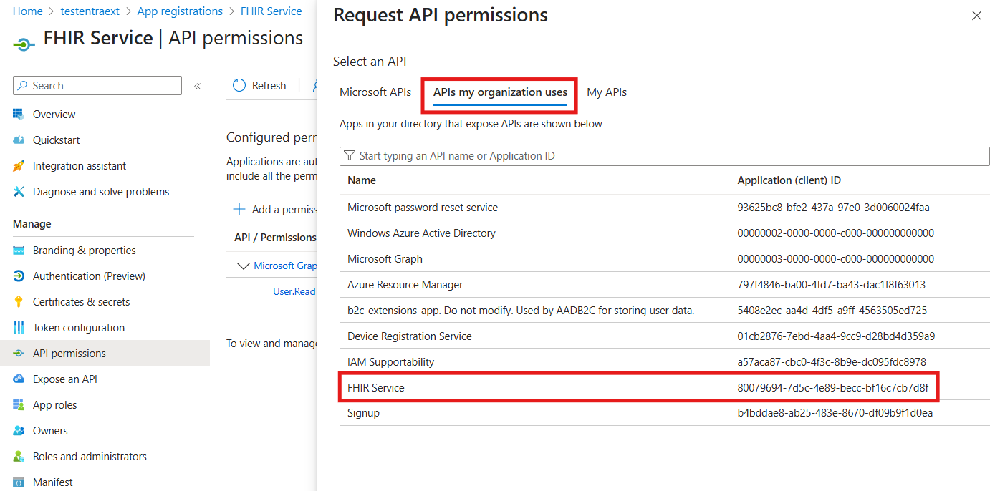


1. On the **Request API permissions** pane in the **Patient** section, select at least one permission. In this example, the permission `patient.all.read` is selected, which means a user that requests an access token with the scope `patient.all.read` has Read privileges (patient.all.**read**) for all FHIR resources (patient.**all**.read) in the Patient compartment (**patient**.all.read) For more information, see [Patient compartment](https://build.fhir.org/compartmentdefinition-patient.html).

1. Choose **Add permissions**.

   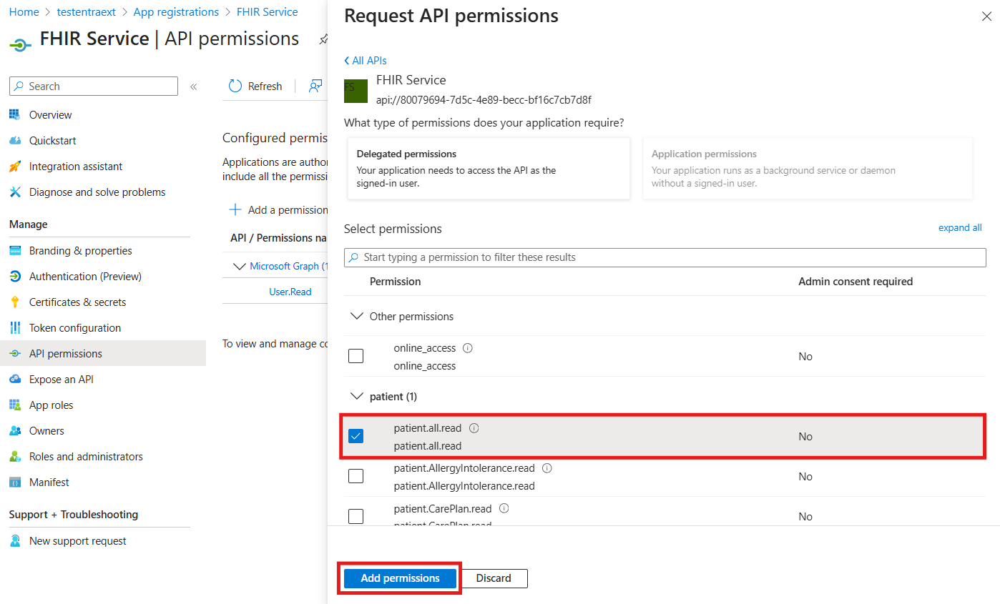

1. On the **API permissions** page in the **Configured permissions** section, choose **Grant admin consent**.


   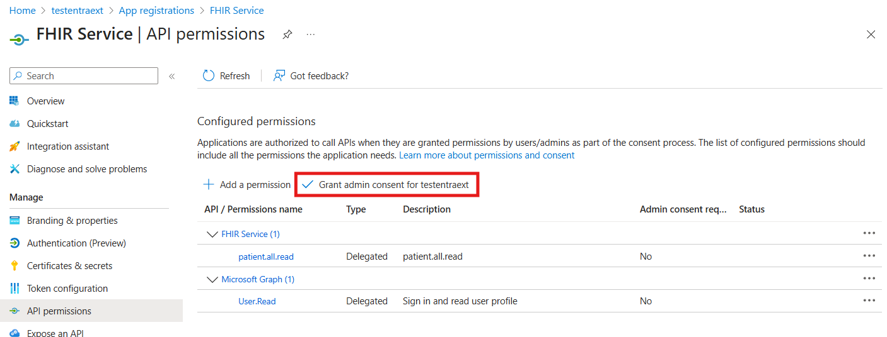

#### Configure Single sign-on (Preview) for the app

1. On the **Enterprise apps** page in the left pane, choose **All applications**.

1. Select your registered application from the list.

   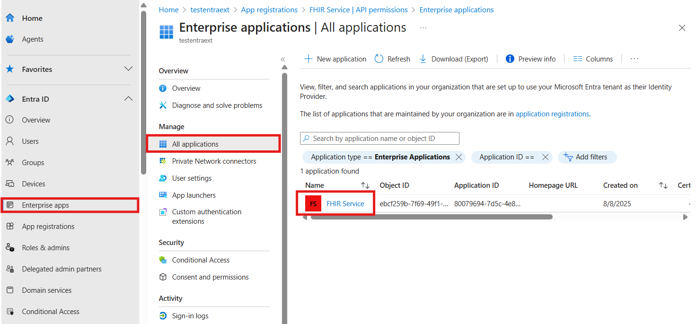

1. In your application’s pane, under **Manage**, select **Single sign-on (Preview)**.

1. Select **Edit** to configure the single sign-on settings.

   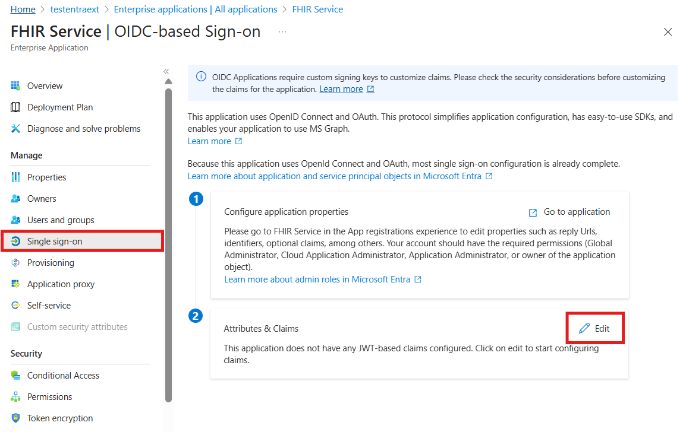

1. Under **Attributes & Claims**, select **+ Add new claim**.

   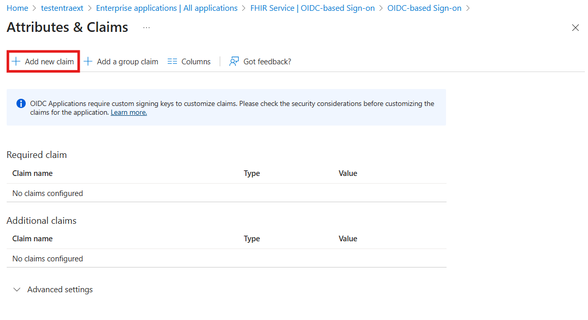

1. Configure the new claim:

   - **Name**: `fhirUser`

   - **Source**: Select **Directory schema extension**

   - **Source attribute**: Select **b2c-extensions-app**

   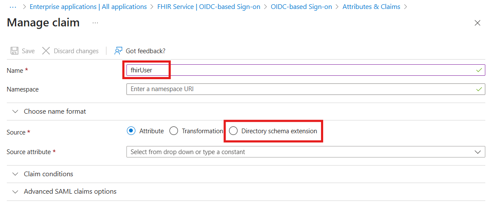

1. Click **Select**. This opens the **Add Extension Attributes** window.

   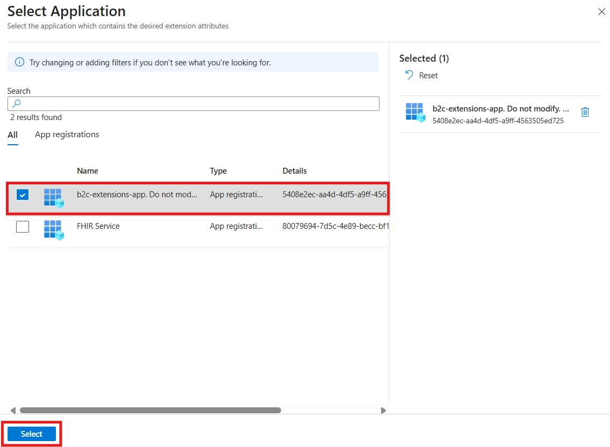

1. In the list, select the **user.fhirUser** attribute.

1. Click **Add** to include the attribute in the claim.

   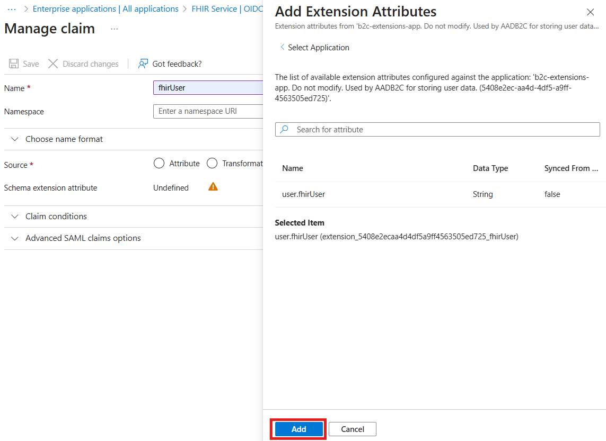

1. select **save**

   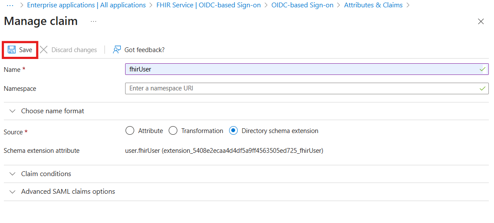

## Deploy the FHIR service with Entra External ID as the identity provider

Deploying the FHIR service with Entra External ID as the identity provider allows the FHIR service to authenticate users based on their Entra External ID credentials, ensuring that only authorized users can access sensitive patient information

#### Obtain the Entra External ID authority and client ID 

Use the **authority** and **client ID** (or application ID) parameters to configure the FHIR service to use an Entra External ID tenant as an identity provider.

1. Create the authority string by using the name of the Entra External ID tenant and the name of the user flow.

   ```http
   https://<YOUR_EXTERNAL_ID_TENANT_NAME>.ciamlogin.com/<YOUR_EXTERNAL_ID_TENANT_ID>/v2.0
   ```

1. Test the authority string by making a request to the `.well-known/openid-configuration` endpoint. Enter the string into a browser to confirm it navigates to the OpenId Configuration JSON file. If the OpenId Configuration JSON fails to load, make sure the Entra External ID tenant name and Entra External ID tenant id are correct.
  
   ```http
   https://<YOUR_EXTERNAL_ID_TENANT_NAME>.ciamlogin.com/<YOUR_EXTERNAL_ID_TENANT_ID>/v2.0/.well-known/openid-configuration
   ```

1. Retrieve the client ID from the resource application overview page.

   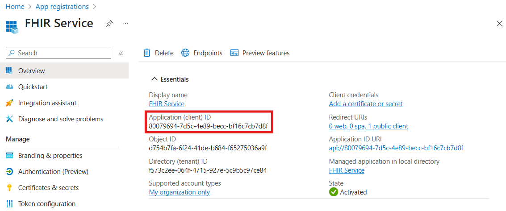

#### Deploy the FHIR service by using ARM Template

Use an [ARM template](https://raw.githubusercontent.com/Azure-Samples/azure-health-data-and-ai-samples/main/samples/fhir-aad-b2c/fhir-service-arm-template.json) to simplify deploying the FHIR service. Use PowerShell or Azure CLI to deploy the ARM template to an Azure subscription..

Run the code in **Azure Cloud Shell** or in **PowerShell locally using Visual Studio Code** to deploy the FHIR service with Microsoft Entra External ID as the identity provider.

### [PowerShell](#tab/powershell)

1. Use `Connect-AzAccount` to sign in to Azure. Use `Get-AzContext` to verify the subscription and tenant you want to use. Change the subscription and tenant if needed.

1. Create a new resource group (or use an existing one) by skipping the "create resource group" step, or commenting out the line starting with `New-AzResourceGroup`.

```PowerShell
### variables
$tenantid="your tenant id"
$subscriptionid="your subscription id"
$resourcegroupname="your resource group name"
$region="your desired region"
$workspacename="your workspace name"
$fhirServiceName="your fhir service name"
$smartAuthorityUrl="your authority (from previous step)"
$smartClientId="your client id (from previous step)"

### Login to Azure
Connect-AzAccount

#Connect-AzAccount SubscriptionId $subscriptionid
Set-AzContext -Subscription $subscriptionid
Connect-AzAccount -Tenant $tenantid -SubscriptionId $subscriptionid
# Get-AzContext  

### create resource group
New-AzResourceGroup -Name $resourcegroupname -Location $region

### deploy the resource
New-AzResourceGroupDeployment -ResourceGroupName $resourcegroupname -TemplateUri https://raw.githubusercontent.com/Azure-Samples/azure-health-data-and-ai-samples/main/samples/fhir-aad-b2c/fhir-service-arm-template.json -tenantid $tenantid -region $region -workspaceName $workspacename -fhirServiceName $fhirservicename -smartAuthorityUrl $smartAuthorityUrl -smartClientId $smartClientId
```

#### [Azure CLI](#tab/command-line)

1. Use `az login` to sign in to Azure. Use `az account show --output table` to verify the subscription and tenant you want to use. Change the subscription and tenant if needed.

1. Create a new resource group (or use an existing one) by skipping the "create resource group" step, or commenting out the line starting with `az group create`.

```bash
### variables
tenantid=your tenant id
subscriptionid=your subscription id
resourcegroupname=your resource group name
region=your desired region
workspacename=your workspace name
fhirServiceName=your fhir service name
smartAuthorityUrl=your authority (from previous step)
smartClientId=your client id (from previous step)

### login to azure
az login
az account show --output table
az account set --subscription $subscriptionid

### create resource group
az group create --name $resourcegroupname --location $region

### deploy the resource
az deployment group create --resource-group $resourcegroupname --template-uri https://raw.githubusercontent.com/Azure-Samples/azure-health-data-and-ai-samples/main/samples/fhir-aad-b2c/fhir-service-arm-template.json --parameters tenantid=$tenantid region=$region workspaceName=$workspacename fhirServiceName=$fhirservicename smartAuthorityUrl=$smartAuthorityUrl storageAccountConfirm=$smartClientId
```

##  Validate Microsoft Entra External ID Users are able to access FHIR Resources

The validation process involves creating a patient resource in the FHIR service, linking the patient resource to the Microsoft Entra External ID user, and configuring REST Client to get an access token for External ID users. After the validation process is complete, you can fetch the patient resource by using the External ID test user.

#### Use REST Client to get an access token

For steps to obtain the proper access to the FHIR service, see [Access the FHIR service using REST Client](using-rest-client).

When you follow the steps in the [Get the FHIR patient data](using-rest-client#get-fhir-patient-data) section, the request returns an empty response because the FHIR service is new and doesn't have any patient resources.

#### Create a patient resource in the FHIR service

It's important to note that users in the Microsoft Entra External ID tenant aren't able to read any resources until the user (such as a patient or practitioner) is linked to a FHIR resource. A user with the `FhirDataWriter` or `FhirDataContributor` role in the Microsoft Entra ID where the FHIR service is tenanted must perform this step.

1. Create a patient with a specific identifier by changing the method to `PUT` and executing a request to `{{fhirurl}}/Patient/1` with this body:

  ```json
  {
      "resourceType": "Patient",
      "id": "1",
      "name": [
          {
              "family": "Patient1",
              "given": [
                  "Test"
              ]
          }
      ]
  } 
  ```

2. Verify the patient is created by changing the method back to `GET` and verifying that a request to `{{fhirurl}}/Patient` returns the newly created patient.


#### Link the patient resource to Microsoft Entra External ID User. 

Create an explicit link between the test user in the **Microsoft Entra External ID** tenant and the resource in the FHIR service. Use **extension attributes** in Microsoft Graph to define this link. For more information, see [Create custom user attributes in Entra External ID](https://learn.microsoft.com/en-us/entra/external-id/customers/how-to-define-custom-attributes#create-custom-user-attributes).

1. Go to the Entra External ID tenant. On the left pane, choose **App registrations**.

1. Select **All applications**.

1. Select the application with the prefix **b2c-extensions-app**. 

   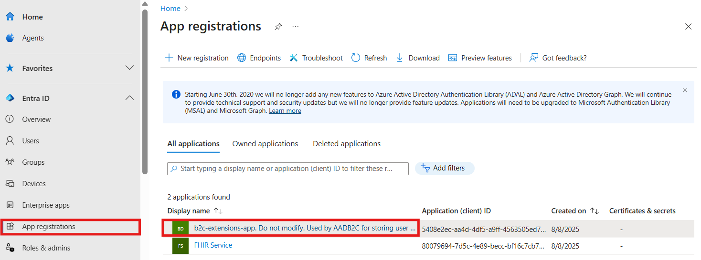

1. Note the Application (client) ID value.

   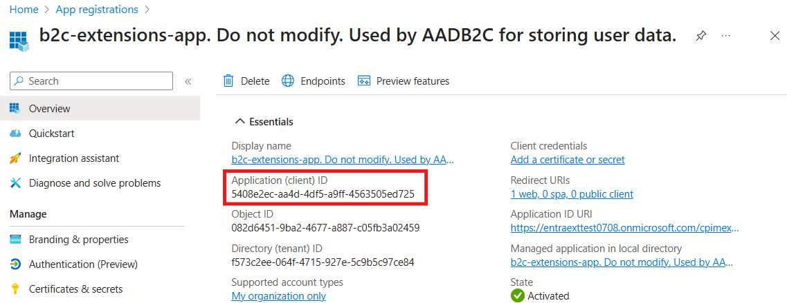

1. Navigate back to the Entra External ID tenant home page, on the left pane select **Users**.

1. Under **Users > All users**, select **Test Patient1**.

   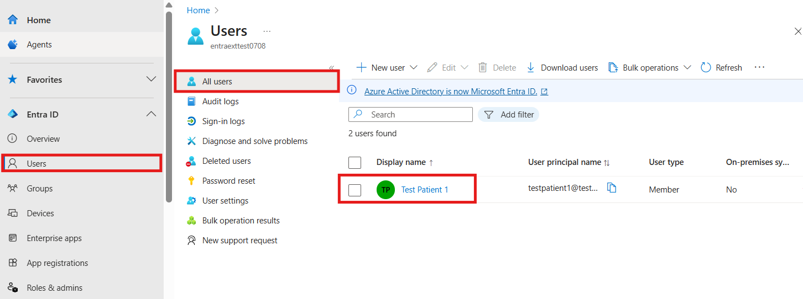

1. Note the **Object ID**.

   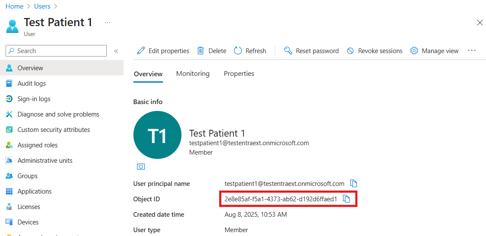

1. Open [Microsoft Graph Explorer](https://developer.microsoft.com/graph/graph-explorer) Sign in with a user assigned to the Global Administrator role for the Microsoft Entra External ID tenant. (It's a good idea to create a new admin user in the Microsoft Entra tenant to manage users.)

   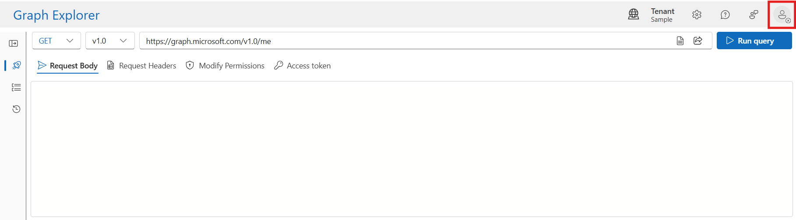

1. Select the avatar for the user, and then choose **Consent to permissions**.

   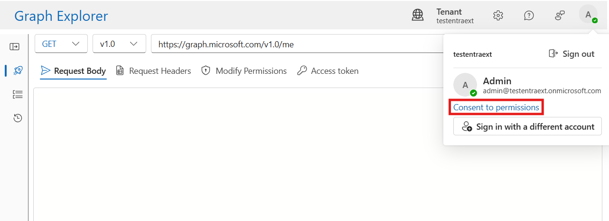

1. Scroll to **User**. Consent to `User.ReadWrite.All`. This permission allows you to update the **Test Patient1** user with the `fhirUser` claim value.

   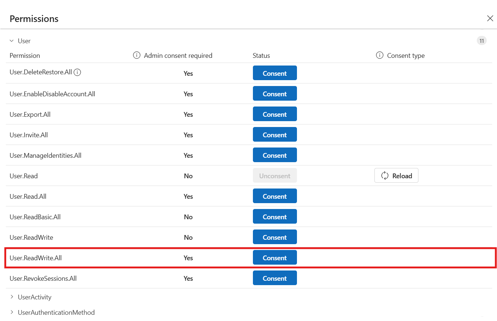

1. After the consent process completes, update the user. You need the b2c-extensions-app application (client) ID and the user Object ID.

   - Change the method to `PATCH`.
      
   - Change the URL to [https://graph.microsoft.com/v1.0/users/{USER_OBJECT_ID}](#link-the-patient-resource-to-microsoft-entra-external-id-user).
   
   - Create the `PATCH` body. A `PATCH` body is a single key-value-pair, where the key format is `extension_{B2C_EXTENSION_APP_ID_NO_HYPHENS}_fhirUser` and the value is the fully qualified FHIR resource ID for the patient `https://{YOUR_FHIR_SERVICE}.azurehealthcareapis.com/Patient/1"`.

   For more information, see [Manage extension attributes through Microsoft Graph](https://learn.microsoft.com/en-us/entra/external-id/customers/how-to-define-custom-attributes#create-custom-user-attributes).

1. After the request is formatted, choose **Run query**. Wait for a successful response that confirms the user in the Entra External Id tenant is linked to the patient resource in the FHIR service.

   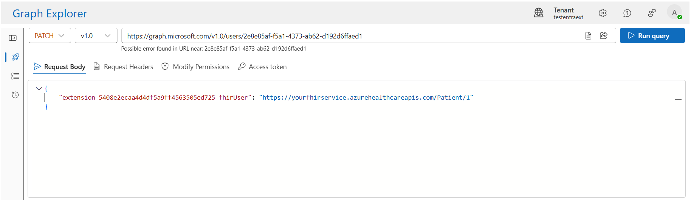

#### Configuration to obtain an access token for Entra External ID users

Obtain an access token to test the authentication flow.

>[!Note] 
>The `grant_type` of `authorization_code` is used to obtain an access token.
>There are tools available online offering intuitive interfaces for API testing and development.

1. Launch the API testing application.

1. Select the **Authorization** tab in the tool.

1. In the **Type** dropdown list, select **OAuth 2.0**.

1. Enter the following values.

   - **Callback URL**. This value is configured when the Entra External ID resource application is created.

   - **Auth URL**. This value can be created using the name of the Entra External ID tenant and the Entra External ID tenant id.

      ```http
      https://{YOUR_EXTERNAL_ID_TENANT_NAME}.ciamlogin.com/{YOUR_EXTERNAL_ID_TENANT_ID}/oauth2/v2.0/authorize
      ```

   - **Access Token URL**. This value can be created using the name of the Entra External ID tenant and the Entra External ID tenant id.

      ```http
      https://{YOUR_EXTERNAL_ID_TENANT_NAME}.ciamlogin.com/{YOUR_EXTERNAL_ID_TENANT_ID}/oauth2/v2.0/token
      ```
   - **Client ID**: This value is the application (client) ID of the  Entra External resource application.

      ```
      {YOUR_APPLICATION_ID}
      ```

   - **Scope**. This value is defined in the Entra External ID resource application in the **Expose an API** section. The scope granted permission is `patient.all.read`. The scope request must be a fully qualified URL, for example, `https://testentraexternal.onmicrosoft.com/fhir/patient.all.read`. 
     
   - Copy the fully qualified scope from the **Expose an API** section of the Entra External resource application.
   Example:

      ```
      {YOUR_APPLICATION_ID_URI}/patient.all.read
      ```

#### Fetch the patient resource by using the Microsoft Entra External ID user

   Verify that Microsoft Entra External ID users can access FHIR resources.

1. When the authorization configuration is set up to launch the Microsoft Entra External ID user flow, choose **Get New Access Token** to get an access token.

1. Use the **Test Patient** credentials to sign in.

1. Copy the access token and use it in fetching the Patient data.

Follow the steps in the [Get the FHIR patient data](using-rest-client.md#get-fhir-patient-data) guide to fetch the patient resource:

1. Set the HTTP method to `GET`, enter the fully qualified FHIR service URL, and append the path `/Patient`.

1. Use the fetched token in the authorization header.

1. Choose **Send Request**.

1. Verify that the response contains the single patient resource.

## Next steps

[Configure multiple identity providers](configure-identity-providers.md)
 
[Troubleshoot identity provider configuration](https://learn.microsoft.com/en-us/azure/healthcare-apis/fhir/troubleshoot-identity-provider-configuration)

[!INCLUDE [FHIR trademark statement](../includes/healthcare-apis-fhir-trademark.md)]
       
