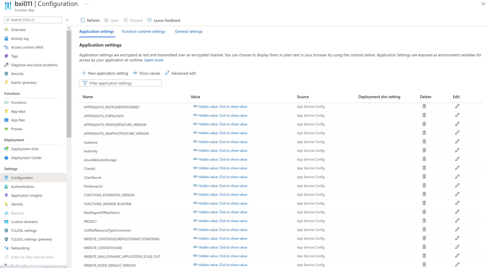
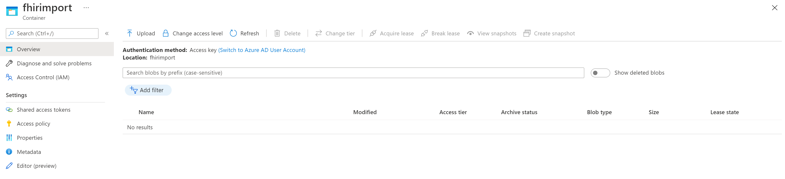
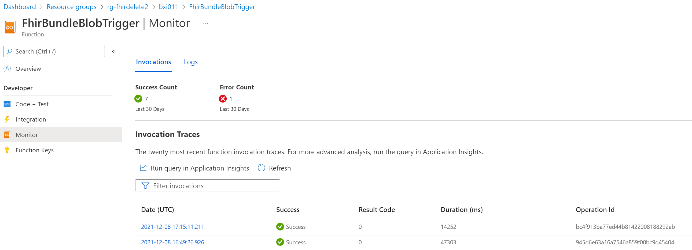

# Bulk importing data to the FHIR service in Healthcare APIs

> [!IMPORTANT]
> Azure Healthcare APIs is currently in PREVIEW. The [Supplemental Terms of Use for Microsoft Azure Previews](https://azure.microsoft.com/support/legal/preview-supplemental-terms/) include additional legal terms that apply to Azure features that are in beta, preview, or otherwise not yet released into general availability.

In this article, you'll learn how to bulk import data into the FHIR service in Healthcare APIs. The tools described in this article are freely available at GitHub and can be modified to meet your business needs. Technical support for the tools is available through GitHub and the open-source community.

While tools such as [Postman](../use-postman.md), [cURL](../using-curl.md), and [REST Client](../using-rest-client.md) to ingest data to the FHIR service, they're not typically used to bulk load FHIR data.

>[!Note]
>The [bulk import](https://github.com/microsoft/fhir-server/blob/main/docs/BulkImport.md) feature is currently available in the open source FHIR server. It's not available in Healthcare APIs yet.

## Azure Function FHIR Importer

The [FHIR Importer](https://github.com/microsoft/healthcare-apis-samples/tree/main/src/FhirImporter) is an Azure Function or microservice, written in C#, that imports FHIR bundles in JSON or NDJSON formats as soon as they're uploaded to an Azure storage container.

- Behind the scenes, the Azure Storage trigger starts the Azure Function when a new document is detected and the document is the input to the function.
- It processes multiple documents in parallel and provides a basic retry logic using [HTTP call retries](/dotnet/architecture/microservices/implement-resilient-applications/implement-http-call-retries-exponential-backoff-polly) when the FHIR service is too busy to handle the requests.

The FHIR Importer works for the FHIR service in Healthcare APIs and Azure API for FHIR.

>[!Note]
>The retry logic of Importer does not handle errors after retries have been attempted. It is highly recommended that you revise the retry logic for production use. Also, informational and error logs may be added or removed.

To use the tool, follow the prerequisite steps below:

1. [Deploy a FHIR service](fhir-portal-quickstart.md) or use an existing service instance.
1. [Register a confidential client application](../register-application-cli-rest.md) with a client secret.
1. [Grant permissions](../configure-azure-rbac-using-scripts.md) to the client application.
1. [Deploy FHIR Importer](https://github.com/microsoft/healthcare-apis-samples/tree/main/src/FhirImporter) using the CLI scripts and the Azure Resource Manager template (ARM template). The Azure Function runtime is set to 2.0 by default, but it can be changed to 3.0 from the Azure portal.
1. Review and modify the application settings for the Azure Function. For example, change `MaxDegreeOfParallelism` from 16 to a smaller number, and set `UUIDtoResourceTypeConversion` to **false** to ingest data without the conversion from a "urn : uuid" string to a corresponding FHIR resource type.

   

1. Upload the FHIR data to the storage container that the FHIR Importer is monitoring. By default, the storage account is named as the importer function name plus `sa`. For example, `importer1sa` and the container is named `fhirimport`. The `fhirrejected` container is for storing files that cannot be processed due to errors. You can use the portal, Azure [AzCopy](../../storage/common/storage-use-azcopy-v10.md) or other upload tools.

   

1. Test the FHIR Importer with a few documents first before bulk importing. Use App Insights to monitor and troubleshoot the Importer Azure Function. Check the logs and files in the `fhirrejected` storage container.

   

## Other FHIR Data Loading Tools

There are other similar tools that can be used to bulk load FHIR data.

- [FHIR Data Loader or FHIRDL](https://github.com/microsoft/healthcare-apis-samples/blob/main/docs/HowToLoadData.md) - This is a console application that loads and converts FHIR data in Azure Storage. Also, it sends simulated device data to IoT in one of the menu options. You can run the tool interactively, or you can run it using a command line with some code modification.

- [FHIR Bulk Loader & Export](https://github.com/microsoft/fhir-loader) - This loading tool not only imports bulk FHIR data, but it also provides auditing, error logging, and patient centric data export.

## Next steps

In this article, you've learned about the tools and the steps for bulk-importing data into the FHIR service. For more information about converting data to FHIR, exporting settings to set up a storage account, and moving data to Azure Synapse, see

>[!div class="nextstepaction"]
>[Converting your data to FHIR](convert-data.md)

>[!div class="nextstepaction"]
>[Configure export settings and set up a storage account](configure-export-data.md)

>[!div class="nextstepaction"]
>[Moving data from Azure API for FHIR to Azure Synapse Analytics](move-to-synapse.md)