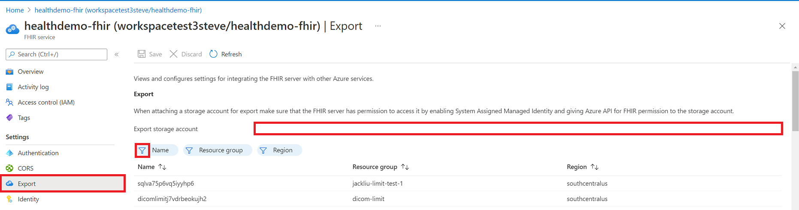

# Configure export settings and set up a storage account

The FHIR service supports the `$export` operation [specified by HL7](https://hl7.org/fhir/uv/bulkdata/export/index.html) for exporting FHIR data from a FHIR server. In the FHIR service implementation, calling the `$export` endpoint causes the FHIR service to export data into a pre-configured Azure storage account.

Ensure you are granted with application role -  'FHIR Data exporter role' prior to configuring export. To understand more on application roles, see [Authentication and Authorization for FHIR service](https://learn.microsoft.com/azure/healthcare-apis/authentication-authorization).

Below are three steps in setting up the `$export` operation for the FHIR service-

- Enable a managed identity for the FHIR service.
- Configure a new or existing Azure Data Lake Storage Gen2 (ADLS Gen2) account and give permission for the FHIR service to access the account.
- Set the ADLS Gen2 account as the export destination for the FHIR service.

## Enable managed identity for the FHIR service

The first step in configuring your environment for FHIR data export is to enable a system-wide managed identity for the FHIR service. This managed identity is used to authenticate the FHIR service to allow access to the ADLS Gen2 account during an `$export` operation. For more information about managed identities in Azure, see [About managed identities for Azure resources](../../active-directory/managed-identities-azure-resources/overview.md).

In this step, browse to your FHIR service in the Azure portal and select the **Identity** blade. Set the **Status** option to **On**, and then click **Save**. When the **Yes** and **No** buttons display, select **Yes** to enable the managed identity for the FHIR service. Once the system identity has been enabled, you'll see an **Object (principal) ID** value for your FHIR service. 

[](media/export-data/fhir-mi-enabled.png#lightbox)

## Give permission in the storage account for FHIR service access

1. Go to your [ADLS Gen2](../../storage/blobs/data-lake-storage-introduction.md) account in the Azure portal. If you don't already have an ADSL Gen2 account deployed, follow [these instructions](../../storage/common/storage-account-create.md) for creating an Azure storage account and upgrading to ADLS Gen2. Make sure to enable the hierarchical namespace option in the **Advanced** tab to create an ADLS Gen2 account.

2. In your ADLS Gen2 account, select **Access control (IAM)**.

3. Select **Add > Add role assignment**. If the **Add role assignment** option is grayed out, ask your Azure administrator for help with this step.

   :::image type="content" source="../../../includes/role-based-access-control/media/add-role-assignment-menu-generic.png" alt-text="Screenshot that shows Access control (IAM) page with Add role assignment menu open.":::

4. On the **Role** tab, select the [Storage Blob Data Contributor](../../role-based-access-control/built-in-roles.md#storage-blob-data-contributor) role.

   [](../../../includes/role-based-access-control/media/add-role-assignment-page.png#lightbox)

5. On the **Members** tab, select **Managed identity**, and then click **Select members**.

6. Select your Azure subscription.

7. Select **System-assigned managed identity**, and then select the managed identity that you enabled earlier for your FHIR service.

8. On the **Review + assign** tab, click **Review + assign** to assign the **Storage Blob Data Contributor** role to your FHIR service.

For more information about assigning roles in the Azure portal, see [Azure built-in roles](../../role-based-access-control/role-assignments-portal.md).

Now you're ready to configure the FHIR service by setting the ADLS Gen2 account as the default storage account for export.

## Specify the storage account for FHIR service export

The final step is to specify the ADLS Gen2 account that the FHIR service will use when exporting data.

> [!NOTE]
> In the storage account, if you haven't assigned the **Storage Blob Data Contributor** role to the FHIR service, the `$export` operation will fail.

1. Go to your FHIR service settings.

2. Select the **Export** blade.

3. Select the name of the storage account from the list. If you need to search for your storage account, use the **Name**, **Resource group**, or **Region** filters. 

[](media/export-data/fhir-export-storage.png#lightbox)

After you've completed this final configuration step, you're ready to export data from the FHIR service. See [How to export FHIR data](./export-data.md) for details on performing `$export` operations with the FHIR service.

> [!Note]
> Only storage accounts in the same subscription as the FHIR service are allowed to be registered as the destination for `$export` operations.

## Securing the FHIR service `$export` operation

For securely exporting from the FHIR service to an ADLS Gen2 account, there are two main options:

* Allowing the FHIR service to access the storage account as a Microsoft Trusted Service.

* Allowing specific IP addresses associated with the FHIR service to access the storage account. 
This option permits two different configurations depending on whether or not the storage account is in the same Azure region as the FHIR service.

### Allowing FHIR service as a Microsoft Trusted Service

Go to your ADLS Gen2 account in the Azure portal and select the **Networking** blade. Select **Enabled from selected virtual networks and IP addresses** under the **Firewalls and virtual networks** tab.

  :::image type="content" source="media/export-data/storage-networking-1.png" alt-text="Screenshot of Azure Storage Networking Settings." lightbox="media/export-data/storage-networking-1.png":::
  
Select **Microsoft.HealthcareApis/workspaces** from the **Resource type** dropdown list and then select your workspace from the **Instance name** dropdown list.

Under the **Exceptions** section, select the box **Allow Azure services on the trusted services list to access this storage account**. Make sure to click **Save** to retain the settings. 

:::image type="content" source="media/export-data/exceptions.png" alt-text="Allow trusted Microsoft services to access this storage account.":::

Next, run the following PowerShell command to install the `Az.Storage` PowerShell module in your local environment. This will allow you to configure your Azure storage account(s) using PowerShell.

```PowerShell
Install-Module Az.Storage -Repository PsGallery -AllowClobber -Force 
``` 

Now, use the PowerShell command below to set the selected FHIR service instance as a trusted resource for the storage account. Make sure that all listed parameters are defined in your PowerShell environment. 

Note that you'll need to run the `Add-AzStorageAccountNetworkRule` command as an administrator in your local environment. For more information, see [Configure Azure Storage firewalls and virtual networks](../../storage/common/storage-network-security.md).

```PowerShell
$subscription="xxx"
$tenantId = "xxx"
$resourceGroupName = "xxx"
$storageaccountName = "xxx"
$workspacename="xxx"
$fhirname="xxx"
$resourceId = "/subscriptions/$subscription/resourceGroups/$resourceGroupName/providers/Microsoft.HealthcareApis/workspaces/$workspacename/fhirservices/$fhirname"

Add-AzStorageAccountNetworkRule -ResourceGroupName $resourceGroupName -Name $storageaccountName -TenantId $tenantId -ResourceId $resourceId
```

After running this command, in the **Firewall** section under **Resource instances** you will see **2 selected** in the **Instance name** dropdown list. These are the names of the workspace instance and FHIR service instance that you just registered as Microsoft Trusted Resources.

  :::image type="content" source="media/export-data/storage-networking-2.png" alt-text="Screenshot of Azure Storage Networking Settings with resource type and instance names." lightbox="media/export-data/storage-networking-2.png":::

You're now ready to securely export FHIR data to the storage account. Note that the storage account is on selected networks and isn't publicly accessible. To securely access the files, you can enable [private endpoints](../../storage/common/storage-private-endpoints.md) for the storage account.

### Allowing specific IP addresses from other Azure regions to access the Azure storage account

In the Azure portal, go to the ADLS Gen2 account and select the **Networking** blade. 
   
Select **Enabled from selected virtual networks and IP addresses**. Under the Firewall section, specify the IP address in the **Address range** box. Add IP ranges to allow access from the internet or your on-premises networks. You can find the IP address in the table below for the Azure region where the FHIR service is provisioned.

|**Azure Region**         |**Public IP Address** |
|:----------------------|:-------------------|
| Australia East       | 20.53.44.80       |
| Canada Central       | 20.48.192.84      |
| Central US           | 52.182.208.31     |
| East US              | 20.62.128.148     |
| East US 2            | 20.49.102.228     |
| East US 2 EUAP       | 20.39.26.254      |
| Germany North        | 51.116.51.33      |
| Germany West Central | 51.116.146.216    |
| Japan East           | 20.191.160.26     |
| Korea Central        | 20.41.69.51       |
| North Central US     | 20.49.114.188     |
| North Europe         | 52.146.131.52     |
| South Africa North   | 102.133.220.197   |
| South Central US     | 13.73.254.220     |
| Southeast Asia       | 23.98.108.42      |
| Switzerland North    | 51.107.60.95      |
| UK South             | 51.104.30.170     |
| UK West              | 51.137.164.94     |
| West Central US      | 52.150.156.44     |
| West Europe          | 20.61.98.66       |
| West US 2            | 40.64.135.77      |

> [!NOTE]
> The above steps are similar to the configuration steps described in the document **Converting your data to FHIR**. For more information, see [Configure the ACR firewall](./convert-data.md#step-6-optional-configure-the-azure-container-registry-firewall-for-secure-access).

### Allowing specific IP addresses to access the Azure storage account in the same region

The configuration process for IP addresses in the same region is just like above except a specific IP address range in Classless Inter-Domain Routing (CIDR) format is used instead (i.e., 100.64.0.0/10). The reason why the IP address range (100.64.0.0 – 100.127.255.255) must be specified is because an IP address for the FHIR service will be allocated each time an `$export` request is made.

> [!Note] 
> It is possible that a private IP address within the range of 10.0.2.0/24 may be used, but there is no guarantee that the `$export` operation will succeed in such a case. You can retry if the `$export` request fails, but until an IP address within the range of 100.64.0.0/10 is used, the request will not succeed. This network behavior for IP address ranges is by design. The alternative is to configure the storage account in a different region.

## Next steps

In this article, you learned about the three steps in configuring your environment to allow export of data from your FHIR service to an Azure storage account. For more information about Bulk Export capabilities in the FHIR service, see 

>[!div class="nextstepaction"]
>[How to export FHIR data](export-data.md)

FHIR&#174; is a registered trademark of [HL7](https://hl7.org/fhir/) and is used with the permission of HL7.
