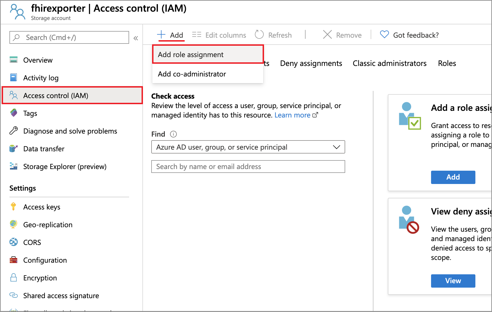

# Configure export setting and set up the storage account

Azure API for FHIR supports $export command that allows you to export the data out of Azure API for FHIR account to a storage account.

There are three steps involved in configuring export in Azure API for FHIR:

1. Enable Managed Identity on Azure API for FHIR Service.
2. Creating a Azure storage account (if not done before) and assigning permission to Azure API for FHIR to the storage account.
3. Selecting the storage account in Azure API for FHIR as export storage account.

## Enabling Managed Identity on Azure API for FHIR

The first step in configuring Azure API for FHIR for export is to enable system wide managed identity on the service. For more information about managed identities in Azure, see [About managed identities for Azure resources](../../active-directory/managed-identities-azure-resources/overview.md).

To do so, go to the Azure API for FHIR service and select **Identity**. Changing the status to **On** will enable managed identity in Azure API for FHIR Service.

Now, you can move to the next step by creating a storage account and assign permission to our service.

## Adding permission to storage account

The next step in export is to assign permission for Azure API for FHIR service to write to the storage account.

After you've created a storage account, go to **Access Control (IAM)** in the storage account and select **Add Role Assignment**.

It is here that you'll add the role **Storage Blob Data Contributor** to our service name, and the select **Save**.

Now you are ready to select the storage account in Azure API for FHIR as a default storage account for $export.

## Selecting the storage account for $export

The final step is to assign the Azure storage account that Azure API for FHIR will use to export the data to. To do this, go to **Integration** in Azure API for FHIR service and select the storage account.

After you've completed this final step, you are now ready to export the data using $export command.

> [!Note]
> Only storage accounts in the same subscription as that for Azure API for FHIR are allowed to be registered as the destination for $export operations.

>[!div class="nextstepaction"]
>[Additional Settings](azure-api-for-fhir-additional-settings.md)
