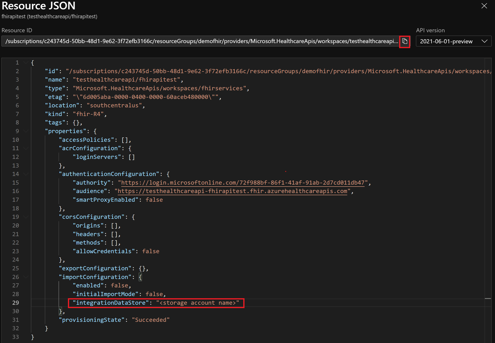

# Configure bulk import settings (Preview)

The FHIR service supports $import operation that allows you to import data into FHIR service account from a storage account.

The three steps below are used in configuring import settings in the FHIR service:

- Enable managed identity for the FHIR service.
- Create an Azure storage account or use an existing storage account, and then grant permissions to the FHIR service to access it.
- Set the import configuration in the FHIR service.

## Enable managed identity on the FHIR service

The first step in configuring the FHIR service for import is to enable system wide managed identity on the service, which will be used to grant the service to access the storage account. For more information about managed identities in Azure, see [About managed identities for Azure resources](../../active-directory/managed-identities-azure-resources/overview.md).

In this step, browse to your FHIR service in the Azure portal, and select the **Identity** blade. Select the **Status** option to **On** , and then select **Save**. The **Yes** and **No** buttons will display. Select **Yes** to enable the managed identity for FHIR service. After the system identity has been enabled, you'll see a system assigned GUID value. 

[  ](media/export-data/fhir-mi-enabled.png#lightbox)


## Assign permissions to the FHIR service to access the storage account

Browse to the **Access Control (IAM)** in the storage account, and then select **Add role assignment**. If the add role assignment option is grayed out, you'll need to ask your Azure Administrator to assign you permission to perform this task.

For more information about assigning roles in the Azure portal, see [Azure built-in roles](../../role-based-access-control/role-assignments-portal.md).

Add the role [Storage Blob Data Contributor](../../role-based-access-control/built-in-roles.md#storage-blob-data-contributor) to the FHIR service, and then select **Save**.

[ ](media/bulk-import/add-role-assignment-page.png#lightbox)

Now you're ready to select the storage account in the FHIR service as a default storage account for import.

## Set import configuration of the FHIR service

The final step is to set the import configuration of the FHIR service, which contains specify storage account, enable import and enable initial import mode.

> [!NOTE]
> If you haven't assigned storage access permissions to the FHIR service, the import operations ($import) will fail.

To specify the Azure Storage account, you need to use [Rest API](https://docs.microsoft.com/rest/api/healthcareapis/services/create-or-update) to update the FHIR service.

To get the request URL and body, browse to the Azure portal of your FHIR service. Select **Overview**, and then **JSON View**.

[  ](media/bulk-import/fhir-json-view.png#lightbox)

Copy the URL as request URL and do following changes of the JSON as body:
- Set enabled in importConfiguration to **true**
- add or change the integrationDataStore with target storage account name 
- Set initialImportMode in importConfiguration to **true**
- Drop off provisioningState.

[  ](media/bulk-import/importer-url-and-body.png#lightbox)

After you've completed this final step, you're ready to import data using $import.

## Troubleshooting

Below are some error codes you may encounter:

### 200 OK, but there's an error with the URL in the response

**Behavior:** Import operation succeeds and returns ```200 OK```. However, `error.url` are present in the response body. Files present at the `error.url` location contains JSON fragments like in the example below:

```json
{
    "resourceType": "OperationOutcome",
    "issue": [
        {
            "severity": "error",
            "details": {
                "text": "Given conditional reference '{0}' does not resolve to a resource."
            },
            "diagnostics": "Failed to process resource at line: {1}"
        }
    ]
}
```

**Cause:** NDJSON files contain resources with conditional references, which are currently not supported by $import.

**Solution:** Replace the conditional references to normal references in the NDJSON files.

### 400 Bad Request

**Behavior:** Import operation failed and ```400 Bad Request``` is returned. Response body has this content:

```json
{
    "resourceType": "OperationOutcome",
    "id": "13876ec9-3170-4525-87ec-9e165052d70d",
    "issue": [
        {
            "severity": "error",
            "code": "processing",
            "diagnostics": "import operation failed for reason: No such host is known. (example.blob.core.windows.net:443)"
        }
    ]
}
```

**Solution:** Verify the link to the Azure storage is correct. Check the network and firewall settings to make sure that the FHIR server is able to access the storage. If your service is in a VNet, ensure that the storage is in the same VNet or in a VNet that has peering with the FHIR service VNet.

### 403 Forbidden

**Behavior:** Import operation failed and ```403 Forbidden``` is returned. The response body has the following content:

```json
{
    "resourceType": "OperationOutcome",
    "id": "bd545acc-af5d-42d5-82c3-280459125033",
    "issue": [
        {
            "severity": "error",
            "code": "processing",
            "diagnostics": "import operation failed for reason: Server failed to authenticate the request. Make sure the value of Authorization header is formed correctly including the signature."
        }
    ]
}
```

**Cause:** We use managed identity for source storage auth. This error may be caused by a missing or wrong role assignment.

**Solution:** Assign _Storage Blob Data Contributor_ role to the FHIR server following [the RBAC guide.](https://docs.microsoft.com/en-us/azure/role-based-access-control/role-assignments-portal?tabs=current)

### 500 Internal Server Error

**Behavior:** Import operation failed and ```500 Internal Server Error``` is returned. Response body has this content:

```json
{
    "resourceType": "OperationOutcome",
    "id": "0d0f007d-9e8e-444e-89ed-7458377d7889",
    "issue": [
        {
            "severity": "error",
            "code": "processing",
            "diagnostics": "import operation failed for reason: The database '****' has reached its size quota. Partition or delete data, drop indexes, or consult the documentation for possible resolutions."
        }
    ]
}
```

**Cause:** You've reached the storage limit of the FHIR service.

**Solution:** Reduce the size of your data or consider Azure API for FHIR, which has a higher storage limit.

## Next steps

In this article, you've learned the FHIR service supports $import operation and how it allows you to import data into FHIR service account from a storage account. You also learned about the three steps used in configuring import settings in the FHIR service. For more information about converting data to FHIR, exporting settings to set up a storage account, and moving data to Azure Synapse, see

>[!div class="nextstepaction"]
>[Converting your data to FHIR](convert-data.md)

>[!div class="nextstepaction"]
>[Configure export settings and set up a storage account](configure-export-data.md)

>[!div class="nextstepaction"]
>[Copy data from FHIR service to Azure Synapse Analytics](copy-to-synapse.md)
