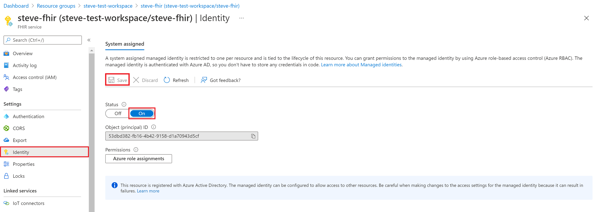
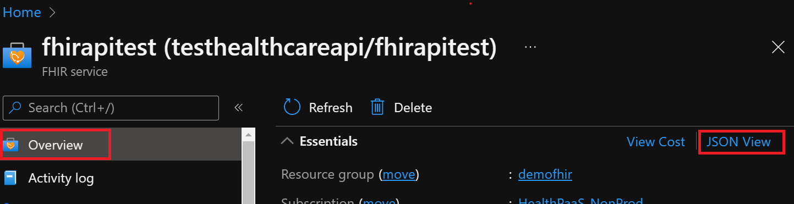
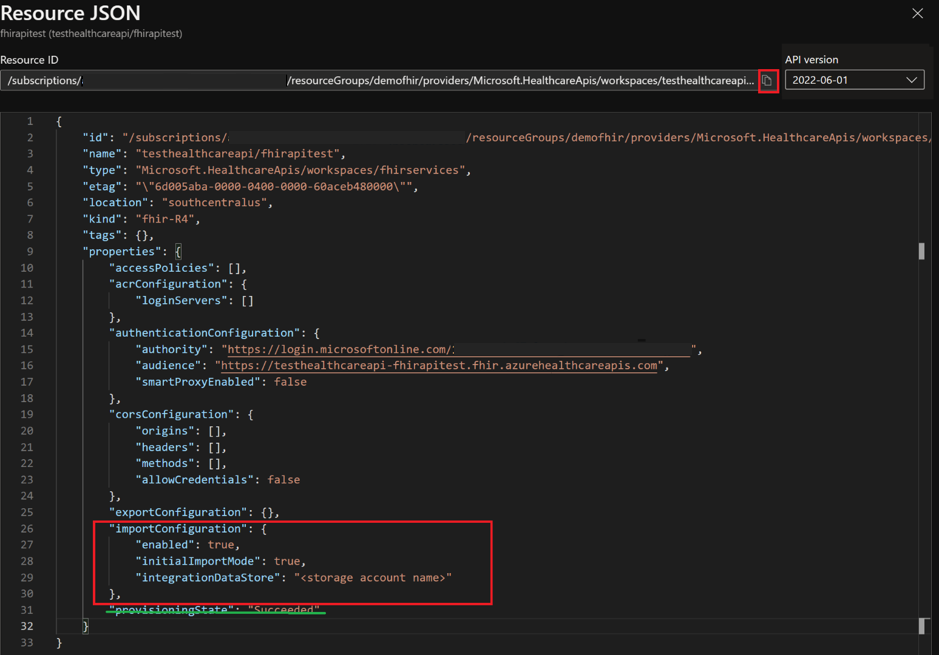
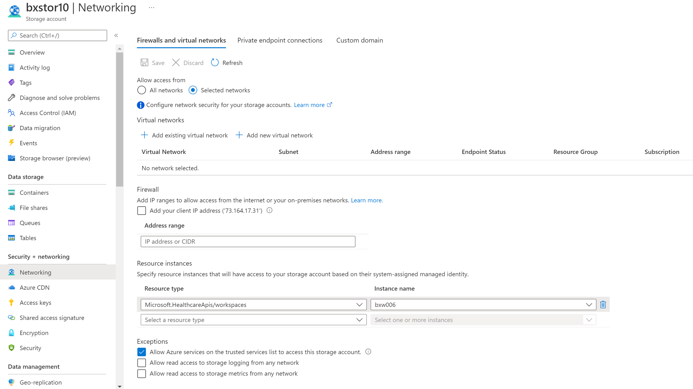
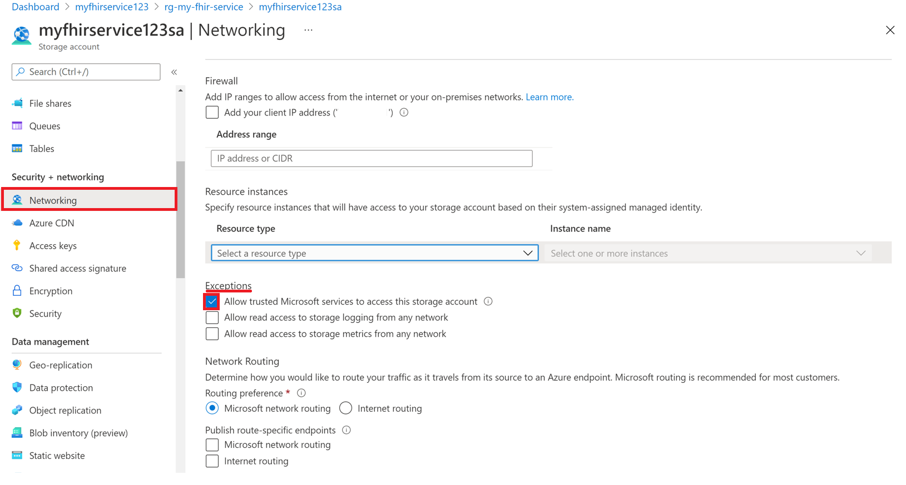
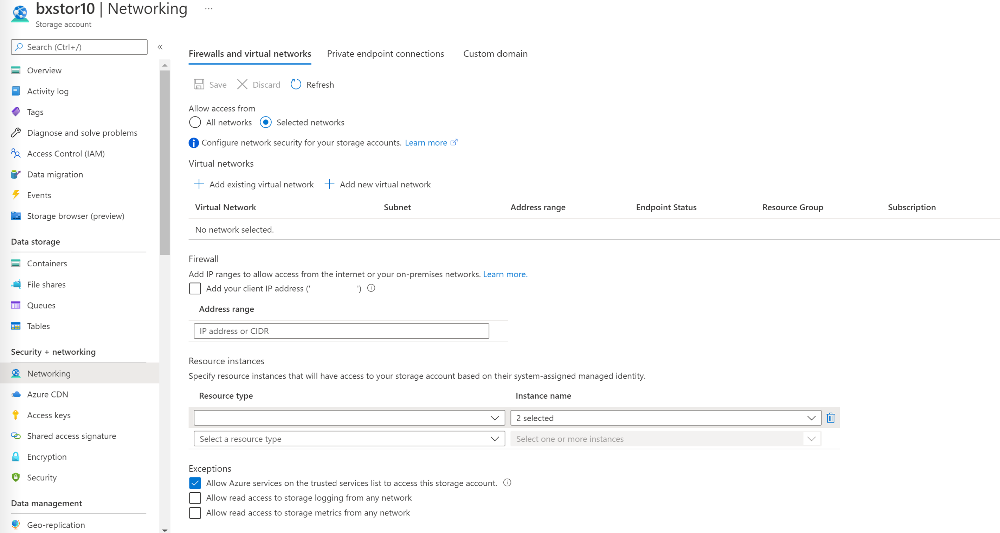

# Configure bulk-import settings
In this document we go over the steps to configure settings on the FHIR service for $import operation. To learn about import capabilties FHIR service offers, see [$import operation](import-data.md).

To configure settings you will need to - 
 1. Enable managed identity on the FHIR service.
 1. Create an Azure storage account or use an existing storage account, and then grant permissions to the FHIR service to access it.
 1. Set the import configuration in the FHIR service.

## Step 1: Enable managed identity on the FHIR service

The first step is to enable system wide managed identity on the service. This will be used to grant FHIR service access to the storage account. 
For more information about managed identities in Azure, see [About managed identities for Azure resources](../../active-directory/managed-identities-azure-resources/overview.md).

Follow the steps to enable managed identity on FHIR service
1. Browse to your FHIR service in the Azure portal.
2. Select the **Identity** blade. 
3. Select the **Status** option to **On** , and then select **Save**.
4. Select **Yes** to enable the managed identity for FHIR service. 

After the system identity has been enabled, you'll see a system assigned GUID value.

[](media/export-data/fhir-mi-enabled.png#lightbox)


## Step 2: Assign permissions to the FHIR service to access the storage account

Follow the steps below to assign permissions to access the storage account
1. Browse to the **Access Control (IAM)** in the storage account.
2. Select **Add role assignment**. During this step, if the add role assignment option is grayed out, you need to ask your Azure Administrator to assign you permission to perform this step.
For more information about assigning roles in the Azure portal, see [Azure built-in roles](../../role-based-access-control/role-assignments-portal.md).
3. Add the role [Storage Blob Data Contributor](../../role-based-access-control/built-in-roles.md#storage-blob-data-contributor) to the FHIR service.
4. Select **Save**.

[](media/bulk-import/add-role-assignment-page.png#lightbox)

Now you're ready to select the storage account for import.

## Step 3: Set import configuration of the FHIR service

> [!NOTE]
> If you haven't assigned storage access permissions to the FHIR service, the import operations ($import) will fail.

For this step you need to get request URL and JSON body. Follow the directions below
1. Browse to the Azure portal of your FHIR service.
2. Select **Overview**.
3. Select **JSON View**.
4. Select the API version to **2022-06-01** or later version. 

To specify the Azure Storage account in JSON view, you need to use [REST API](/rest/api/healthcareapis/services/create-or-update) to update the FHIR service.
[](media/bulk-import/fhir-json-view.png#lightbox)

Below steps walk through setting configurations for initial and incremental import mode. Choose the right import mode for your use case. 

### Step 3a: Set import configuration for Initial import mode.
Do following changes to JSON:
1. Set enabled in importConfiguration to **true**.
2. Update the integrationDataStore with target storage account name.
3. Set initialImportMode in importConfiguration to **true**.
4. Drop off provisioningState.

[](media/bulk-import/import-url-and-body.png#lightbox)

After you've completed this final step, you're ready to perform **Initial mode** import using $import.

### Step 3b: Set import configuration for Incremental import mode.

Do following changes to JSON:
1. Set enabled in importConfiguration to **true**.
2. Update the integrationDataStore with target storage account name.
3. Set initialImportMode in importConfiguration to **false**.
4. Drop off provisioningState.

After you've completed this final step, you're ready to perform **Incremental mode** import using $import.


Note that you can also use the **Deploy to Azure** button to open custom Resource Manager template that updates the configuration for $import.

 [](https://portal.azure.com/#create/Microsoft.Template/uri/https%3A%2F%2Fraw.githubusercontent.com%2FAzure%2Fazure-quickstart-templates%2Fmaster%2Fquickstarts%2Fmicrosoft.healthcareapis%2Ffhir-import%2Fazuredeploy.json)

## Securing the FHIR service $import operation
For you to securely import FHIR data into the FHIR service from an ADLS Gen2 account, there are two options:

* Option 1: Enabling FHIR service as a Microsoft Trusted Service.
* Option 2: Allowing specific IP addresses associated with the FHIR service to access the storage account. 
This option permits two different configurations depending on whether or not the storage account is in the same Azure region as the FHIR service.

### Option 1: Enabling FHIR service as a Microsoft Trusted Service.

Go to your ADLS Gen2 account in the Azure portal and select the **Networking** blade. Select **Enabled from selected virtual networks and IP addresses** under the **Firewalls and virtual networks** tab.

[](media/export-data/storage-networking-1.png#lightbox)
  
Select **Microsoft.HealthcareApis/workspaces** from the **Resource type** dropdown list and then select your workspace from the **Instance name** dropdown list.

Under the **Exceptions** section, select the box **Allow Azure services on the trusted services list to access this storage account**. Make sure to click **Save** to retain the settings. 

[](media/export-data/exceptions.png#lightbox)
  
Next, run the following PowerShell command to install the `Az.Storage` PowerShell module in your local environment. This will allow you to configure your Azure storage account(s) using PowerShell.

```PowerShell
Install-Module Az.Storage -Repository PsGallery -AllowClobber -Force 
``` 

Now, use the PowerShell command below to set the selected FHIR service instance as a trusted resource for the storage account. Make sure that all listed parameters are defined in your PowerShell environment. 

Note that you need to run the `Add-AzStorageAccountNetworkRule` command as an administrator in your local environment. For more information, see [Configure Azure Storage firewalls and virtual networks](../../storage/common/storage-network-security.md).

```PowerShell
$subscription="xxx"
$tenantId = "xxx"
$resourceGroupName = "xxx"
$storageaccountName = "xxx"
$workspacename="xxx"
$fhirname="xxx"
$resourceId = "/subscriptions/$subscription/resourceGroups/$resourceGroupName/providers/Microsoft.HealthcareApis/workspaces/$workspacename/fhirservices/$fhirname"

Add-AzStorageAccountNetworkRule -ResourceGroupName $resourceGroupName -Name $storageaccountName -TenantId $tenantId -ResourceId $resourceId
```

After you've executed above command, in the **Firewall** section under **Resource instances** you'll see **2 selected** in the **Instance name** dropdown list. These are the names of the workspace instance and FHIR service instance that you registered as Microsoft Trusted Resources.

[](media/export-data/storage-networking-2.png#lightbox)
  
You're now ready to securely import FHIR data from the storage account. The storage account is on selected networks and isn't publicly accessible. To securely access the files, you can enable [private endpoints](../../storage/common/storage-private-endpoints.md) for the storage account.

### Option 2:
[!INCLUDE [Specific IP ranges for storage account](../includes/common-ip-address-storage-account.md)]

## Next steps

In this article, you've learned how the FHIR service supports $import operation and it allows you to import data into FHIR service from a storage account. You also learned about the three steps used in configuring import settings in the FHIR service. For more information about converting data to FHIR, exporting settings to set up a storage account, and moving data to Azure Synapse, see

>[!div class="nextstepaction"]
>[Use $import](import-data.md)

FHIR&#174; is a registered trademark of [HL7](https://hl7.org/fhir/) and is used with the permission of HL7.
