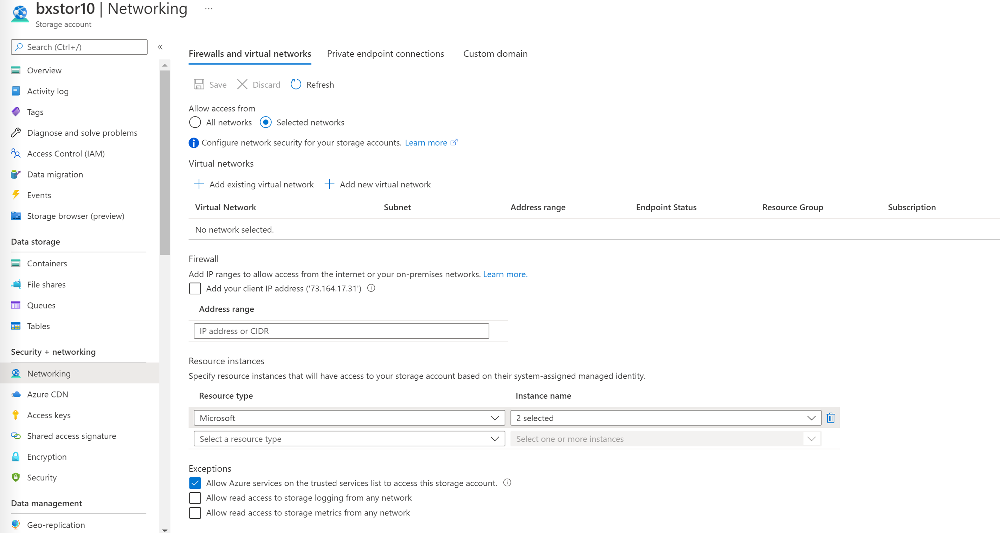

# Configure FHIR import settings

This article walks you through the steps to configure settings on the FHIR service for `import` operations. To configure settings, you need to:

1. Enable a managed identity on the FHIR service.
1. Create an Azure storage account or use an existing storage account, and then grant permissions to the FHIR service to access it.
1. Set the import configuration of the FHIR service.
1. Use one of the options to securely import FHIR data into the FHIR service from an Azure Data Lake Storage Gen2 account.

## Step 1: Enable a managed identity on the FHIR service

The first step is to enable a system-wide managed identity on the service. This identity is used to grant FHIR service access to the storage account. For more information about managed identities in Azure, see [About managed identities for Azure resources](../../active-directory/managed-identities-azure-resources/overview.md).

To enable a managed identity on the FHIR service:

1. In the Azure portal, browse to your FHIR service.
2. On the left menu, select **Identity**.
3. Set the **Status** option to **On**, and then select **Save**.
4. Select **Yes**.

After you enable the managed identity, a system-assigned GUID value appears.

[](media/export-data/fhir-mi-enabled.png#lightbox)

## Step 2: Assign permissions to the FHIR service

Use the following steps to assign permissions to access the storage account:

1. In the storage account, browse to **Access Control (IAM)**.
2. Select **Add role assignment**. If the option for adding a role assignment is unavailable, ask your Azure administrator to assign you permission to perform this step.

   For more information about assigning roles in the Azure portal, see [Azure built-in roles](../../role-based-access-control/role-assignments-portal.yml).
3. Add the [Storage Blob Data Contributor](../../role-based-access-control/built-in-roles.md#storage-blob-data-contributor) role to the FHIR service.
4. Select **Save**.

[](media/bulk-import/add-role-assignment-page.png#lightbox)

Now you're ready to select the storage account for import.

## Step 3: Set the import configuration of the FHIR service

> [!NOTE]
> If you haven't assigned storage access permissions to the FHIR service, the `import` operation will fail.

For this step, you need to get the request URL and JSON body:

1. In the Azure portal, browse to your FHIR service.
2. Select **Overview**.
3. Select **JSON View**.
4. Select the API version as **2022-06-01** or later.

To specify the Azure storage account in JSON view, you need to use the [REST API](/rest/api/healthcareapis/services/create-or-update) to update the FHIR service.

[](media/bulk-import/fhir-json-view.png#lightbox)

The following steps walk you through setting configurations for initial and incremental import modes. Choose the right import mode for your use case.

### Set the import configuration for initial import mode

Make the following changes to JSON:

1. In `importConfiguration`, set `enabled` to `true`.
2. Update `integrationDataStore` with the target storage account name.
3. In `importConfiguration`, set `initialImportMode` to `true`.
4. Delete the `provisioningState` line.

[](media/bulk-import/import-url-and-body.png#lightbox)

You're now ready to perform initial-mode import by using `import`.

### Set the import configuration for incremental import mode

Make the following changes to JSON:

1. In `importConfiguration`, set `enabled` to `true`.
2. Update `integrationDataStore` with the target storage account name.
3. In `importConfiguration`, set `initialImportMode` to `false`.
4. Delete the `provisioningState` line.

You're now ready to perform incremental-mode import by using `import`.

You can also use the **Deploy to Azure** button to open a custom Azure Resource Manager template that updates the configuration for `import`.

[](https://portal.azure.com/#create/Microsoft.Template/uri/https%3A%2F%2Fraw.githubusercontent.com%2FAzure%2Fazure-quickstart-templates%2Fmaster%2Fquickstarts%2Fmicrosoft.healthcareapis%2Ffhir-import%2Fazuredeploy.json)

## Step 4: Secure the FHIR service's import operation

To securely import FHIR data into the FHIR service from an Azure Data Lake Storage Gen2 account, you have three options:

* Enable the FHIR service as a trusted Microsoft service.
* Allow specific IP addresses associated with the FHIR service to access the storage account from other Azure regions.
* Allow specific IP addresses associated with the FHIR service to access the storage account in the same region as the FHIR service.

### Enable the FHIR service as a trusted Microsoft service

1. In the Azure portal, go to your Data Lake Storage Gen2 account in the Azure portal.

1. On the left menu, select **Networking**.

1. On the **Firewalls and virtual networks** tab, select **Enabled from selected virtual networks and IP addresses**.

   [](media/export-data/storage-networking-1.png#lightbox)
  
1. In the **Resource type** dropdown list, select **Microsoft.HealthcareApis/workspaces**. In the **Instance name** dropdown list, select your workspace.

1. In the **Exceptions** section, select the **Allow trusted Microsoft services to access this storage account** checkbox.

   [](media/export-data/exceptions.png#lightbox)
  
1. Select **Save** to retain the settings.

1. Run the following PowerShell command to install the `Az.Storage` PowerShell module in your local environment. You can use this module to configure your Azure storage accounts by using PowerShell.

   ```PowerShell
   Install-Module Az.Storage -Repository PsGallery -AllowClobber -Force 
   ```

1. Use the following PowerShell command to set the selected FHIR service instance as a trusted resource for the storage account. Make sure that all listed parameters are defined in your PowerShell environment.

   You need to run the `Add-AzStorageAccountNetworkRule` command as an administrator in your local environment. For more information, see [Configure Azure Storage firewalls and virtual networks](../../storage/common/storage-network-security.md).

   ```PowerShell
   $subscription="xxx"
   $tenantId = "xxx"
   $resourceGroupName = "xxx"
   $storageaccountName = "xxx"
   $workspacename="xxx"
   $fhirname="xxx"
   $resourceId = "/subscriptions/$subscription/resourceGroups/$resourceGroupName/providers/Microsoft.HealthcareApis/workspaces/$workspacename/fhirservices/$fhirname"

   Add-AzStorageAccountNetworkRule -ResourceGroupName $resourceGroupName -Name $storageaccountName -TenantId $tenantId -ResourceId $resourceId
   ```

1. Confirm that under **Resource instances**, **2 selected** appears in the **Instance name** dropdown list. The two selected instances are the name of the workspace instance and the name of the FHIR service instance that you registered as trusted Microsoft resources.

   [](media/export-data/storage-networking-2.png#lightbox)
  
You're now ready to securely import FHIR data from the storage account. The storage account is on selected networks and isn't publicly accessible. To securely access the files, you can use [private endpoints](../../storage/common/storage-private-endpoints.md) for the storage account.

[!INCLUDE [Specific IP ranges for storage account](../includes/common-ip-address-storage-account.md)]

## Next steps

In this article, you learned how the FHIR service supports the `import` operation and how you can import data into the FHIR service from a storage account. You also learned about the steps for configuring import settings in the FHIR service. For more information about converting data to FHIR, exporting settings to set up a storage account, and moving data to Azure Synapse Analytics, see:

>[!div class="nextstepaction"]
>[Import FHIR data](import-data.md)

FHIR&#174; is a registered trademark of [HL7](https://hl7.org/fhir/) and is used with the permission of HL7.
