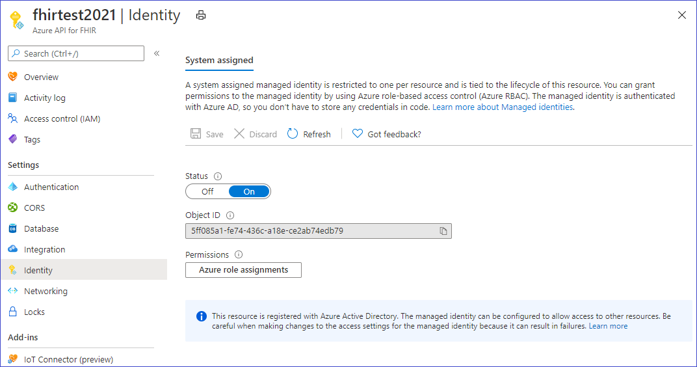
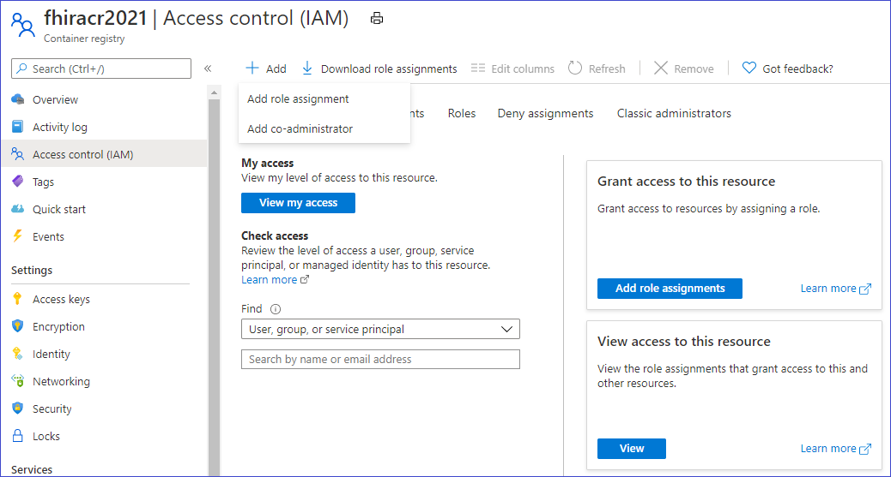

# How to convert data to FHIR (Preview)

> [!IMPORTANT]
> This capability is in public preview, is provided without a service level agreement, 
> and is not recommended for production workloads. Certain features might not be supported 
> or might have constrained capabilities. For more information, see 
> [Supplemental Terms of Use for Microsoft Azure Previews](https://azure.microsoft.com/support/legal/preview-supplemental-terms/).

The $convert-data custom endpoint in the Azure API for FHIR is meant for data conversion from different formats to FHIR. It uses the Liquid template engine and the templates from the [FHIR Converter](https://github.com/microsoft/FHIR-Converter) project as the default templates. You can customize these conversion templates as needed. Currently it supports HL7v2 to FHIR conversion.

## Use the $convert-data endpoint

`https://<<FHIR service base URL>>/$convert-data`

$convert-data takes a [Parameter](http://hl7.org/fhir/parameters.html) resource in the request body as described below:

**Parameter Resource:**

| Parameter Name      | Description | Accepted values |
| ----------- | ----------- | ----------- |
| inputData      | Data to be converted. | A valid value of JSON String datatype|
| inputDataType   | Data type of input. | ```HL7v2``` |
| templateCollectionReference | Reference to a template collection. It can be a reference either to the **Default templates**, or a custom template image that is registered with Azure API for FHIR. See below to learn about customizing the templates, hosting those on ACR, and registering to the Azure API for FHIR.  | ```microsofthealth/fhirconverter:default```, \<RegistryServer\>/\<imageName\>@\<imageDigest\> |
| rootTemplate | The root template to use while transforming the data. | ```ADT_A01```, ```OML_O21```, ```ORU_R01```, ```VXU_V04``` |  

> [!WARNING]
> Default templates help you get started quickly. However, these may get updated when we upgrade the Azure API for FHIR. In order to have consistent data conversion behavior across different versions of Azure API for FHIR, you must host your own copy of templates on an Azure Container Registry, register those to the Azure API for FHIR, and use in your API calls as described later.

**Sample request:**

```json
{
    "resourceType": "Parameters",
    "parameter": [
        {
            "name": "inputData",
            "valueString": "MSH|^~\\&|SIMHOSP|SFAC|RAPP|RFAC|20200508131015||ADT^A01|517|T|2.3|||AL||44|ASCII\nEVN|A01|20200508131015|||C005^Whittingham^Sylvia^^^Dr^^^DRNBR^PRSNL^^^ORGDR|\nPID|1|3735064194^^^SIMULATOR MRN^MRN|3735064194^^^SIMULATOR MRN^MRN~2021051528^^^NHSNBR^NHSNMBR||Kinmonth^Joanna^Chelsea^^Ms^^CURRENT||19870624000000|F|||89 Transaction House^Handmaiden Street^Wembley^^FV75 4GJ^GBR^HOME||020 3614 5541^HOME|||||||||C^White - Other^^^||||||||\nPD1|||FAMILY PRACTICE^^12345|\nPV1|1|I|OtherWard^MainRoom^Bed 183^Simulated Hospital^^BED^Main Building^4|28b|||C005^Whittingham^Sylvia^^^Dr^^^DRNBR^PRSNL^^^ORGDR|||CAR|||||||||16094728916771313876^^^^visitid||||||||||||||||||||||ARRIVED|||20200508131015||"
        },
        {
            "name": "inputDataType",
            "valueString": "Hl7v2"
        },
        {
            "name": "templateCollectionReference",
            "valueString": "microsofthealth/fhirconverter:default"
        },
        {
            "name": "rootTemplate",
            "valueString": "ADT_A01"
        }
    ]
}
```

**Sample response:**

```json
{
  "resourceType": "Bundle",
  "type": "transaction",
  "entry": [
    {
      "fullUrl": "urn:uuid:9d697ec3-48c3-3e17-db6a-29a1765e22c6",
      "resource": {
        "resourceType": "Patient",
        "id": "9d697ec3-48c3-3e17-db6a-29a1765e22c6",
        ...
        ...
      "request": {
        "method": "PUT",
        "url": "Location/50becdb5-ff56-56c6-40a1-6d554dca80f0"
      }
    }
  ]
}
```

## Customize templates

You can use the [FHIR Converter extension](https://marketplace.visualstudio.com/items?itemName=ms-azuretools.vscode-health-fhir-converter) for Visual Studio Code to customize the templates as per your needs. The extension provides an interactive editing experience, and makes it easy to download Microsoft-published templates and sample data. See the documentation in the extension for details.

## Host and use templates

It is strongly recommended that you host your own copy of templates on ACR. There are four steps involved in hosting your own copy of templates and using those in the $convert-data operation:

1. Push the templates to your Azure Container Registry.
1. Enable Managed Identity on your Azure API for FHIR instance.
1. Provide access of the ACR to the Azure API for FHIR Managed Identity.
1. Register the ACR servers in the Azure API for FHIR.

### Push templates to Azure Container Registry

After creating an ACR instance, you can use the _FHIR Converter: Push Templates_ command in the [FHIR Converter extension](https://marketplace.visualstudio.com/items?itemName=ms-azuretools.vscode-health-fhir-converter) to push the customized templates to the ACR. Alternatively, you can use the [Template Management CLI tool](https://github.com/microsoft/FHIR-Converter/blob/main/docs/TemplateManagementCLI.md) for this purpose.

### Enable Managed Identity on Azure API for FHIR

Browse to your instance of Azure API for FHIR service in the Azure portal and select the **Identity** blade.
Change the status to **On** to enable managed identity in Azure API for FHIR.



### Provide access of the ACR to Azure API for FHIR

Navigate to Access Control (IAM) blade in your ACR instance and select _Add Role Assignments_.



Grant AcrPull role to your Azure API for FHIR service instance.


### Register the ACR servers in Azure API for FHIR

You can register the ACR server using the Azure portal, or using CLI.

#### Registering the ACR server using Azure portal
Navigate to the _Artifacts_ blade under _Data transformation_ in your Azure API for FHIR instance. You will see the list of currently registered ACR servers. Click on _Add_ and select your registry server from the dropdown. You will need to click on _Save_ for the registration to take effect. It may take a few minutes to apply the change and restart your instance.

#### Registering the ACR server using CLI
You can register up to twenty ACR servers in the Azure API for FHIR.

Install the healthcareapis CLI from Azure PowerShell if needed:

```powershell
az extension add -n healthcareapis
```

Register the acr servers to Azure API for FHIR following the examples below:

##### Register a single ACR server

```powershell
az healthcareapis acr add --login-servers "fhiracr2021.azurecr.io" --resource-group fhir-test --resource-name fhirtest2021
```

##### Register multiple ACR servers

```powershell
az healthcareapis acr add --login-servers "fhiracr2021.azurecr.io fhiracr2020.azurecr.io" --resource-group fhir-test --resource-name fhirtest2021
```

### Verify

Make a call to the $convert-data API specifying your template reference in the templateCollectionReference parameter.

`<RegistryServer>/<imageName>@<imageDigest>`
