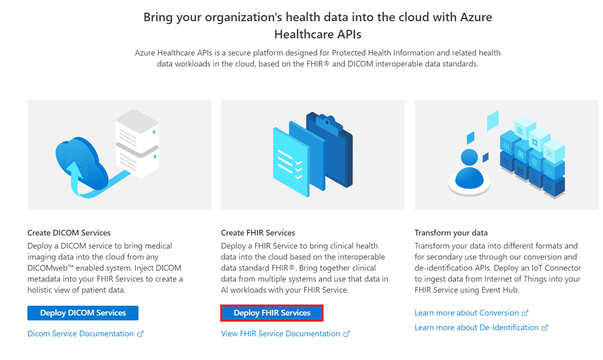
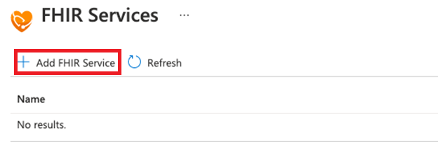
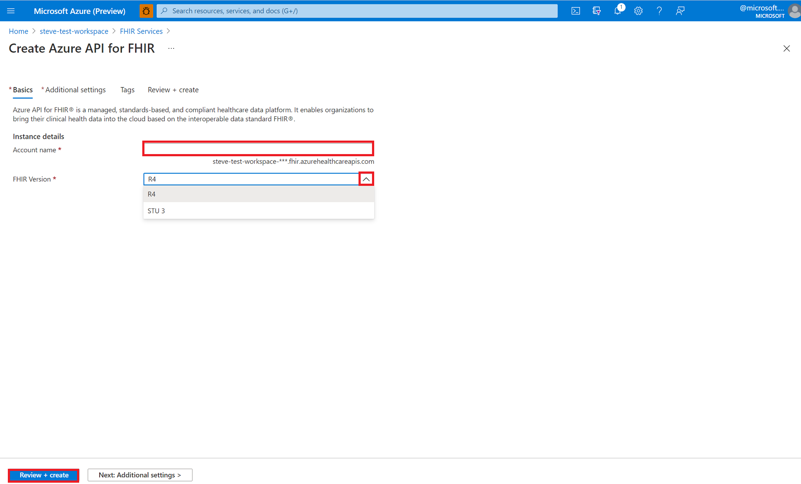
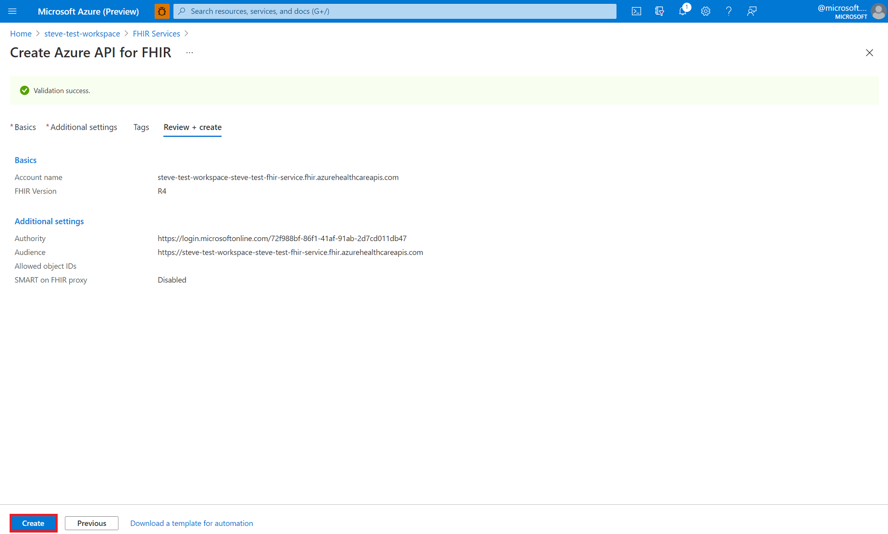
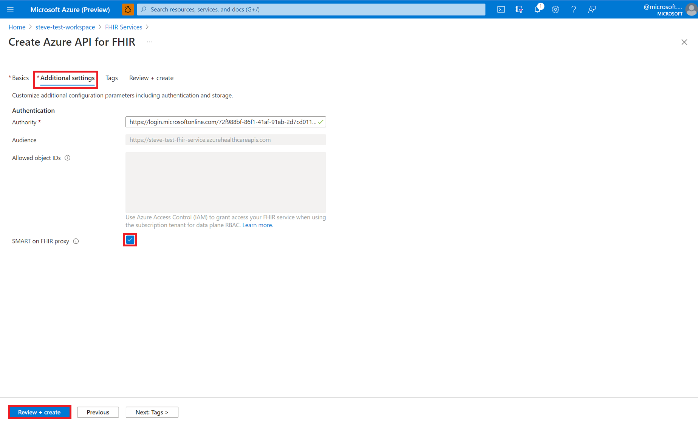

# Deploy a FHIR service within Azure Health Data Services - using portal

In this article, you'll learn how to deploy FHIR service within Azure Health Data Services (hereby called the FHIR service) using the Azure portal.

## Prerequisite

Before getting started, you should have already deployed Azure Health Data Services. For more information about deploying Azure Health Data Services, see [Deploy workspace in the Azure portal](../healthcare-apis-quickstart.md).

## Create a new FHIR service

From the workspace, select **Deploy FHIR service**.

Select **+ Add FHIR Service**.

Enter an **Account name** for your FHIR service. Select the **FHIR version** (**STU3** or **R4**), and then select **Review + create**.

Before you select **Create**, review the properties of the **Basics** and **Additional settings** of your FHIR service. If you need to go,  back and make changes, select **Previous**. Confirm that the **Validation success** message is displayed. 

## Additional settings (optional)

You can also select the **Additional settings** tab to view the authentication settings. The default configuration for Azure API for FHIR is to **use Azure RBAC for assigning data plane roles**. When it's configured in this mode, the "Authority" for FHIR service will be set to the Microsoft Entra tenant of the subscription.

Notice that the box for entering **Allowed object IDs** is grayed out. This is because we use Azure RBAC for configuring role assignments in this case.

If you wish to configure the FHIR service to use an external or secondary Microsoft Entra tenant, you can change the Authority and enter object IDs for user and groups that should be allowed access to the server.

## Fetch FHIR API capability statement

To validate that the new FHIR API account is provisioned, fetch a capability statement by browsing to `https://<WORKSPACE NAME>-<ACCOUNT-NAME>.fhir.azurehealthcareapis.com/metadata`.

## Next steps

In this article, you learned how to deploy FHIR service within Azure Health Data Services using the Azure portal. For more information about accessing FHIR service using Postman, see

>[!div class="nextstepaction"]
>[Access FHIR service using Postman](../fhir/use-postman.md)

FHIR&#174; is a registered trademark of [HL7](https://hl7.org/fhir/) and is used with the permission of HL7.
