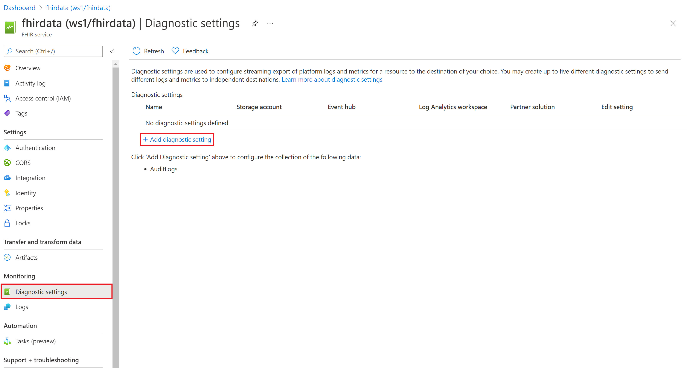
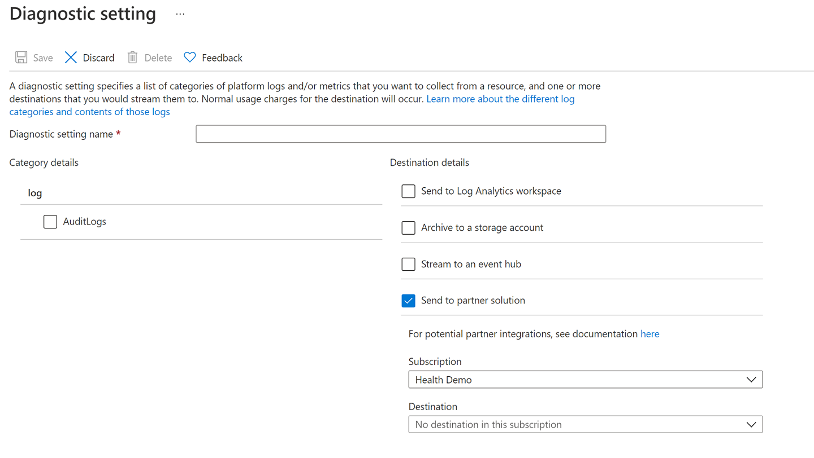

# View and enable diagnostic settings in the FHIR service

Access to diagnostic logs is essential for any healthcare service. Compliance with regulatory requirements like Health Insurance Portability and Accountability Act (HIPAA) is a must. In this article, you'll learn how to choose settings for diagnostic logs in the FHIR service within Azure Health Data Services. You'll also review some sample queries for these logs.

## Steps to enable diagnostic logs

1. Select your FHIR service in the Azure portal.

2. Under **Monitoring**, select **Diagnostic settings**.

3. Select **+ Add diagnostic settings**.

   

4. Enter the **Diagnostic setting name**.
 
   

5. Select the method that you want to use to access your logs:

   - **Send to Log Analytics workspace** is for sending logs and metrics to a Log Analytics workspace in Azure Monitor. You need to create your Log Analytics workspace before you can select this option.
   
   - **Archive to a storage account** is for auditing or manual inspection. The storage account that you want to use needs to be already created. The retention option only applies to a storage account. Retention policy ranges from 1 to 365 days. If you don't want to apply any retention policy and retain data forever, set the retention (days) to 0.

   - **Stream to an event hub** is for ingestion by a third-party service or custom analytic solution. You need to create an event hub namespace and event hub policy before you can configure this option.
   
   - **Send to partner solution** should be selected if you've enabled a partner solution that Azure supports. For more information, see [Extend Azure with solutions from partners](../../partner-solutions/overview.md).

6. Select **AuditLogs**.

7. Select **Save**.

> [!NOTE]
> It might take up to 15 minutes for the first logs to appear in the Log Analytics workspace, if you selected that method. If the FHIR service is moved from one resource group or subscription to another, update the settings after the move is complete.

## Diagnostic log details

At this time, the FHIR service returns the following fields in a diagnostic log:

|Field name|Type|Notes|
|----------|----|-----|
|`CallerIdentity` |Dynamic|A generic property bag that contains identity information.|
|`CallerIdentityIssuer` | String| The issuer.|
|`CallerIdentityObjectId` | String| The object ID.|
|`CallerIPAddress` | String| The caller's IP address.|
|`CorrelationId` | String| The correlation ID.|
|`FhirResourceType` | String| The resource type for which the operation was executed.|
|`LogCategory` | String| The log category. (In this article, we're returning `AuditLogs`.)|
|`Location` | String| The location of the server that processed the request. For example: `South Central US`.|
|`OperationDuration` | Int| The time it took to complete this request, in seconds.|
|`OperationName` | String| The type of operation. For example: `update` or `search-type`.|
|`RequestUri` | String| The request URI.|
|`ResultType` | String| The status of the log. Available values are `Started`, `Succeeded`, or `Failed`.|
|`StatusCode` | Int| The HTTP status code. For example: `200`.|
|`TimeGenerated` | DateTime| The date and time of the event.|
|`Properties` | String| The properties of `FhirResourceType`.|
|`SourceSystem` | String| The source system, which is always `Azure` in this case.|
|`TenantId` | String | The tenant ID.|
|`Type` | String| The type of log, which is always `MicrosoftHealthcareApisAuditLog` in this case.|
|`_ResourceId` | String| Details about the resource.|		
		
## Sample queries

You can use these basic Log Analytics queries to explore your log data:

- Run the following query to view the *100 most recent* logs:

  `
  MicrosoftHealthcareApisAuditLogs
  | limit 100`

- Run the following query to group operations by *FHIR resource type*:

  `
  MicrosoftHealthcareApisAuditLogs 
  | summarize count() by FhirResourceType`

- Run the following query to get all the *failed results*:

  `
  MicrosoftHealthcareApisAuditLogs 
  | where ResultType == "Failed"`	

## Conclusion

Having access to diagnostic logs is essential for monitoring a service and providing compliance reports. In this article, you learned how to enable these logs for the FHIR service. 

> [!NOTE]
> Metrics will be added when the Azure Health Data Services service is generally available.

## Next steps

To learn about setting custom headers on diagnostic logs ,visit 

>[!div class="nextstepaction"]
>[Setting custom headers for logs](use-custom-headers-diagnosticlog.md)	

(FHIR&#174;) is a registered trademark of [HL7](https://hl7.org/fhir/) and is used with the permission of HL7.
